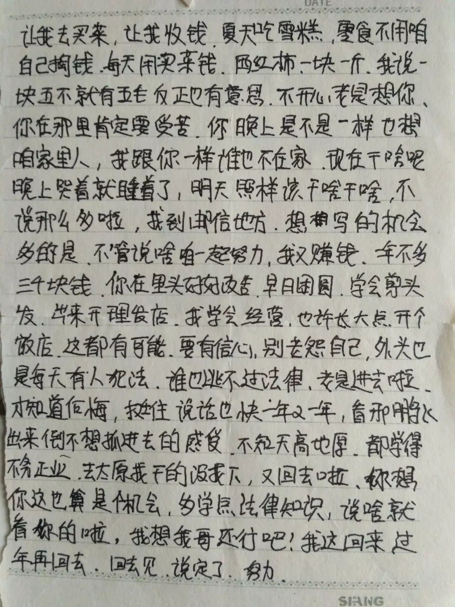
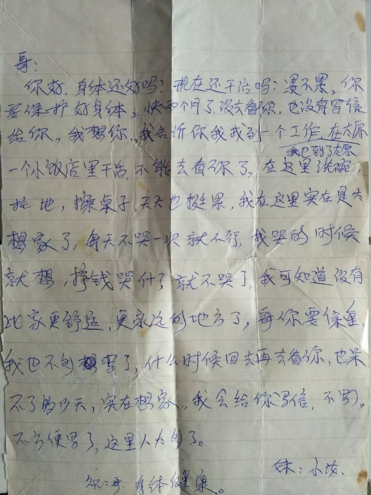

# 从前慢

昨天提到和监狱通信。

并不是所有的监狱都可以正常通信，各地管理办法不一样，也有很多地方不允许通信。

有的监狱连书都不让寄，这点真真令人发指。

除非关他个终生监禁，不然人终究要出来，看点书比干什么不强呢？

监狱有各种工坊，有的地方印试卷，印高考、公务员等试卷的地方，很长时间连父母都不允许接见。

在大部分狱警看来，大部分犯人反社会、没人性、重复犯罪等等，但是这种管理办法是不是需要反思呢？

关于曲线送信，我看到的有夹带在衣服里的；托人捎纸条的；把要说的话写在衣服内侧，甚至内裤上，花钱请律师或管教送进送出的。被监禁的人以及家属对信件都特别的期待，每封信都会翻来覆去看好多遍。

（简简单单歪歪斜斜的几句话，两边的收信人都哭的不能自持）

一位哈尔滨网友平均每天给男朋友写五千多字，每次送进去的都是三到五个本子，男朋友也狂能写。

（男朋友写给他的，一整箱一整箱的情愫和思念）

这次回来我翻找当年贾华平写给我的信，毕业以后我把它们收好放在了家里。非常遗憾，久不住人，纸张连同一些书都没了踪影。心痛之余，唯念无常。

印象中，他的信兼有文笔和豪气，有几次我忍不住拿出来给同学分享。那种顽强和自信实在看不出出自一个正在坐监的小年轻。

然后我去看他保存的家人朋友写给他的信，翻检的时候，随便翻出一封念两句，他就赶紧拿开。十多年前的事了，现在看都不能自禁。厚厚的一包，有他父母、姐姐、妹妹以及其他亲朋好友写给他的。
对于我，最有触动的还是他妹妹写给他的。他十九岁进去，妹妹十四岁，信也就是那几年写的。小姑娘早早辍学，边打工边抽时间给哥哥写信。

父亲的信：

