# 占领恶魔岛

  
​阿尔卡特兹岛是美国加州旧金山湾内的一座小岛，距离旧金山渔人码头不到2英里。英文名Alcatraz Island，意思是鹈鹕岛，面积为0.0763平方公里，四面峭壁深水，联外交通不易，因而被美国政府选为监狱建地。阿尔卡特兹1907年成为军事监狱，由囚犯建造了大部分的建筑物。一战时菲利普·格罗瑟（Philip Grosser）因拒绝服兵役而被判有罪，他把自己的铁窗经历整理出书，取名《山姆大叔的恶魔岛》（Uncle Sam's Devil's Island），由此，之后这座鹈鹕之岛也被称为恶魔岛。1933年军队撤出了恶魔岛，1934年恶魔岛成为联邦监狱，近30年时间内，那里关押过近100名臭名昭著的重刑犯，包括芝加哥“教父”阿尔·卡彭(Al Capone)、天赋异禀对鸟类极有研究的杀人犯“鸟人”史特劳德(Robert Stroud)和冷血的“机关枪”杀手凯利(George Kelly)等。由于只用来囚禁重刑犯，岛上的336间囚室从未住满过，平均囚禁人数为260人，也从未处决过任何囚犯。

  

在监狱使用的29年间，监狱官方声称没有任何一名囚犯成功越狱。一共有36名囚犯尝试了14次越狱。其中2人曾两次试图越狱，23人被缉拿，6人在越狱过程中被击毙，2人溺亡，5人被列为失踪（溺亡）。最严重的一次越狱发生在1946年5月2日，6人试图越狱挑起“阿尔卡特兹械斗”。1962年6月11日，法兰克·摩利斯、约翰·安格廉以及格拉伦斯·安格廉执行了堪称史上最复杂也是最知名的越狱计划。

1963年，联邦政府鉴于监狱运营成本太高而放弃了该岛。后来一度无人居住。

1964年3月8日，恶魔岛第一次被美洲土著活动家占领。这次抗议活动由苏族活动家贝尔瓦·科蒂尔（Belva Cottier）提议，约35人参加，持续了4个小时，《旧金山纪事报》和《旧金山考官报》等报道了抗议活动。印第安人根据美国和苏族之间的《拉拉米堡条约》（1868年）的规定声称拥有该岛；他们说，该条约承诺将所有退役、废弃或不再使用的联邦土地归还给这些土地的原主人。当时，各族印第安人都以“最早发现权”的名义声称拥有阿尔卡特拉兹岛，因为土著部落早在欧洲人来到北美几千年前就发现了这个地方。抗议者表示愿按当年政府付给印第安人的价格支付款项给联邦政府。按每亩47美分计算，整个阿尔卡特兹的价格为9.4美元，12英亩可用土地的价格为5.64美元。科蒂尔还表示，联邦政府将被允许继续使用岛上的海岸警卫队灯塔。

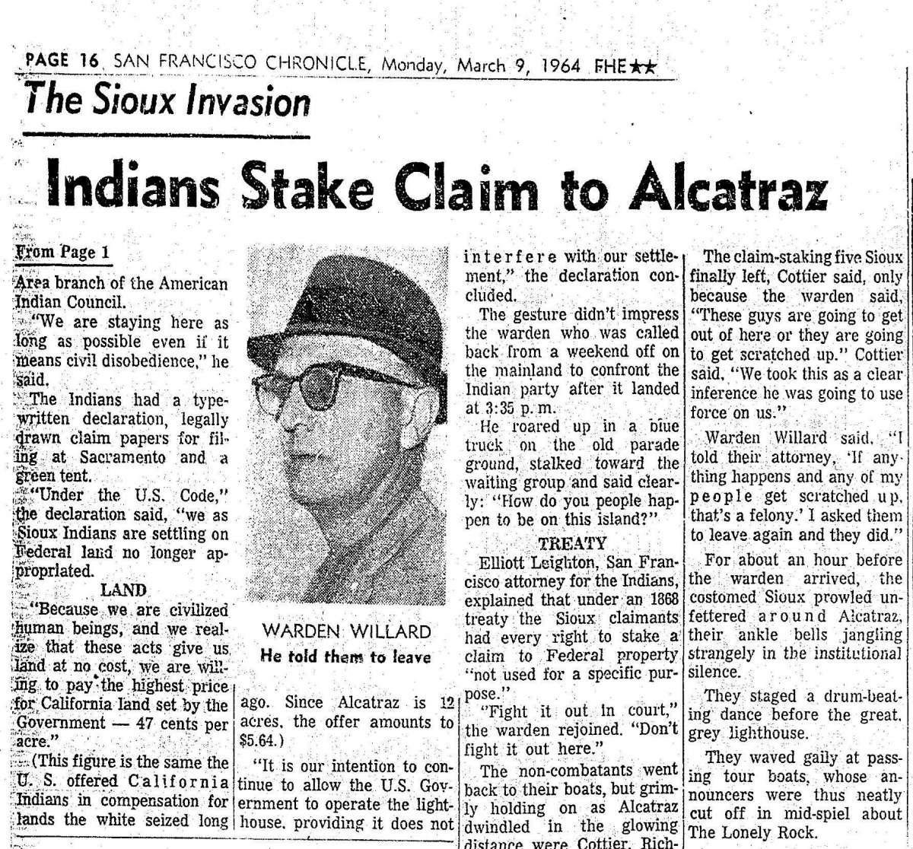  

  

  

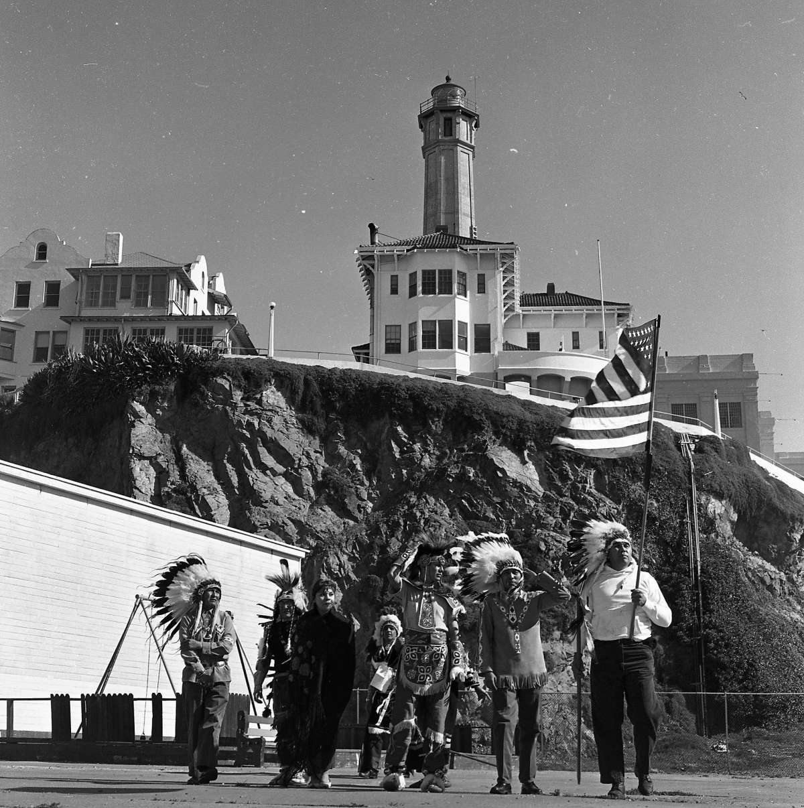  

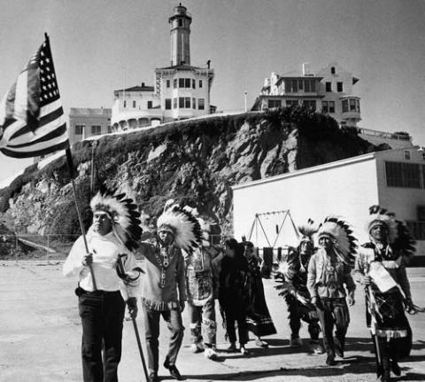  

  

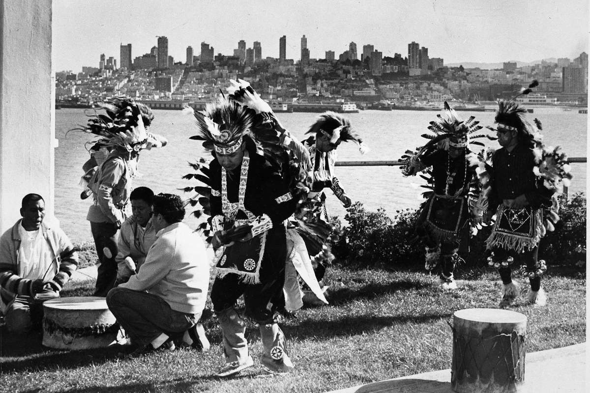  

1969年10月10日，旧金山印第安事务处失火烧毁，这一事件使得当地印第安人开始寻找新的空间。1969年11月20日，以理查德·奥克斯（Richard Oakes）为首的一群称为印第安统一部落的印第安人占领了阿尔卡特兹岛，他们大多是来自旧金山的大学生，抗议联邦有关美洲印第安人的政策。其中一些人是浅进城市的印二代，他们是印第安人事务局（BIA）印第安人终止政策的一部分，该政策是一系列旨在将印第安人同化为美国主流社会的法律和政策，特别是鼓励印第安人离开印第安人保留地，迁入城市。

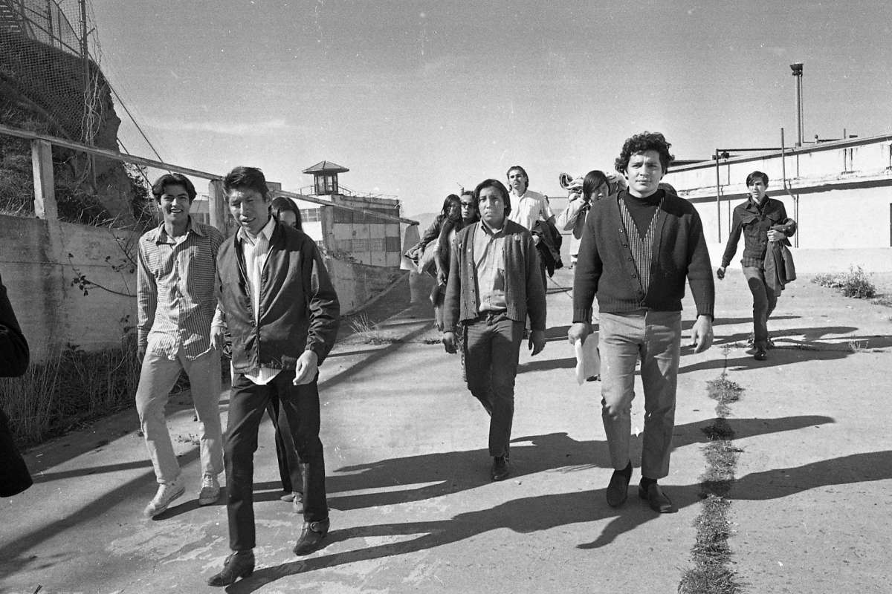  

  

  
占领行动领袖理查德·奥克斯

理查德·奥克斯是莫霍克印第安人，1942年生，18岁时去到旧金山，在旧金山州立大学学习，求学期间，他与人类学教授比厄医学博士合作，创建了美国第一个印第安人研究系。他制定了最初的课程，并鼓励其他美洲原住民进入旧金山州立大学学习。整个60年代他都积极奔走，为美洲土著争取权利，包括控制自己土地的权利。

  

  

  

  

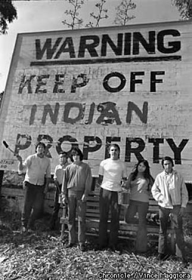  

  

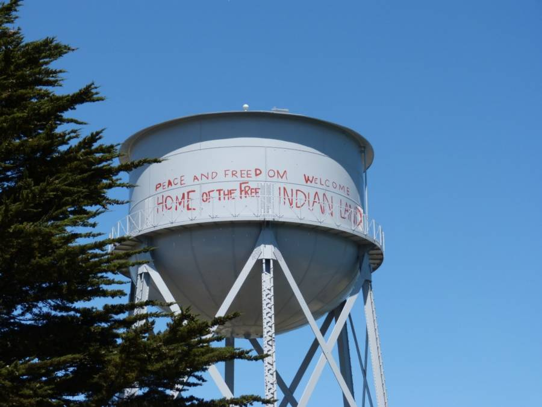  

占领者在岛上住下来后立即开始组织了起来，他们成立了一个民选委员会，所有决定都是经所有成员共同决定，安排每个人各司其职，安全、卫生、日托、学校、住房、烹饪、洗衣......，建立了一个小小的乌托邦。他们还建立了自己的电台。举行感恩节盛大party。鼎盛时期，岛上有400人居住。
其间，马龙白兰度、简·方达等明星去岛上为他们站台，有明星给他们捐赠了发电机、船等设施。

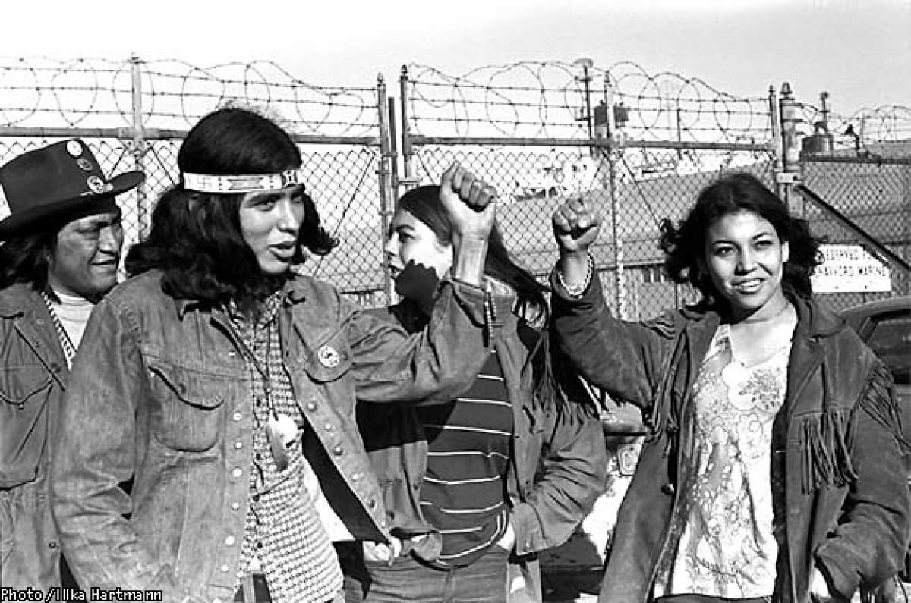  
简方达在阿尔卡特兹住了一晚

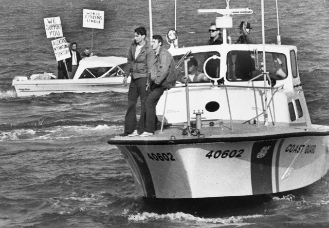  
占领者在岛上逗留了19个月，他们要求政府对岛上的设施进行改造，并为印度教育中心、生态中心和文化中心建造新的建筑。占领行动吸引了来自全国各地的其他印第安人，包括来自明尼阿波利斯的美洲印第安运动的激进分子。印第安土著要求美国政府对从他们部落拿走的土地的行为进行赔偿。

  

  

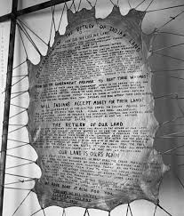  

  

  

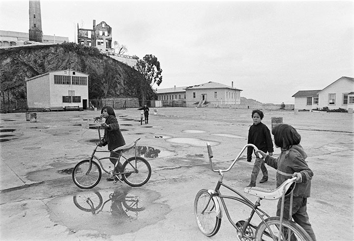  

  

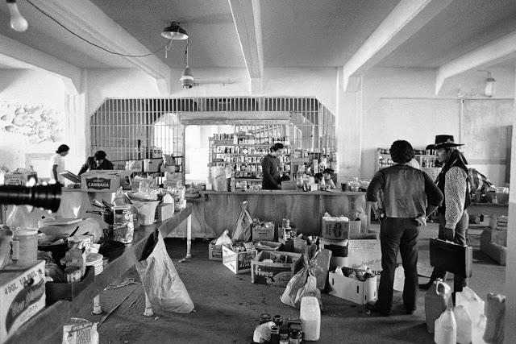  

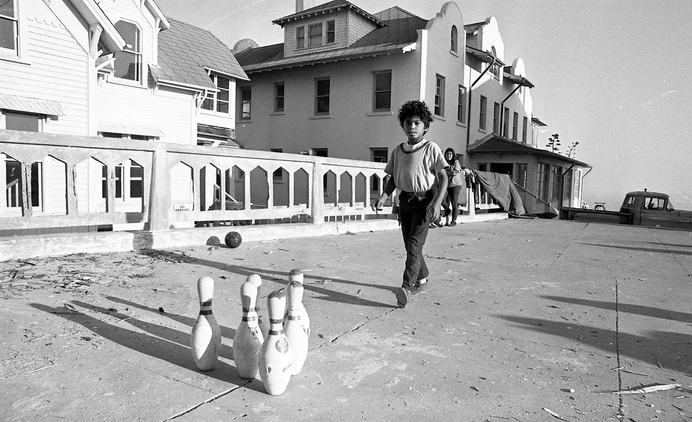  

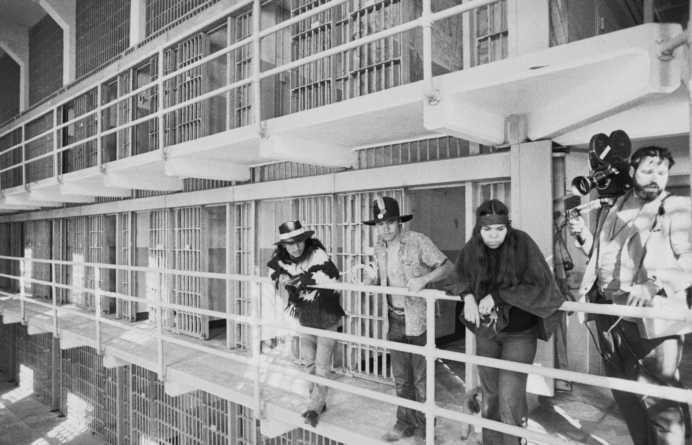  

  

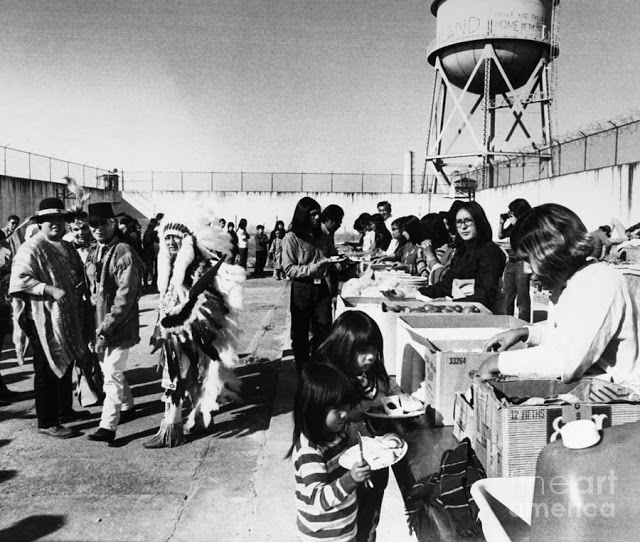  

  

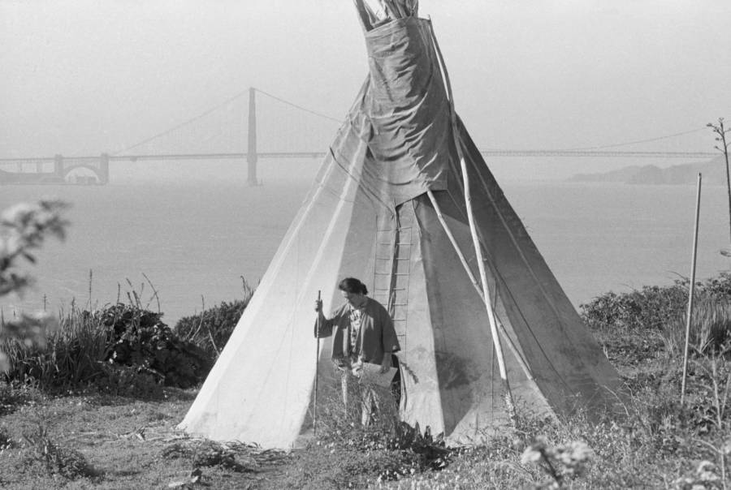  

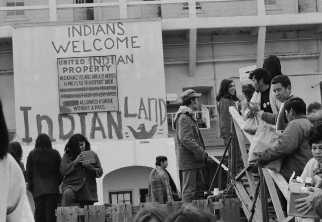  

  

  

  

联邦政府最初坚持要求印第安人离开该岛，在岛周围设置了路障，后来同意了印第安人提出的正式谈判的要求。印第安方面想要拿到阿尔卡特兹的所有权，建立一所印第安大学，一个文化中心和一个博物馆。政府表示无法满足他们的要求，督促他们离开阿尔卡特兹。

到1970年初，印第安组织内部开始陷入混乱，一些人反对理查德·奥克斯，1970年1月，印第安学生开始返回学校，取而代之的是来自城市和保留地的印第安人，他们没有参与最初的占领。此外，一些非印第安人也开始到岛上居住，包括旧金山嬉皮士和瘾君子。对组织的致命一击发生在1970年1月5日，当时奥克斯13岁的继女伊冯从三层楼的楼梯间摔下身亡。伊冯死后，奥克斯离开了岛上，两个互相竞争的团体争夺岛上的领导权。

与此同时，政府关闭了岛上的电力输送，并拆除了向占领者提供淡水的水驳。水上驳船被移走三天后，岛上发生了火灾。几座建筑被烧毁。包括灯塔看守所、典狱长之家、军官俱乐部、娱乐厅和海岸警卫队宿舍。政府指责印第安人，印第安人指责政府派人秘密纵火嫁祸印第安人。

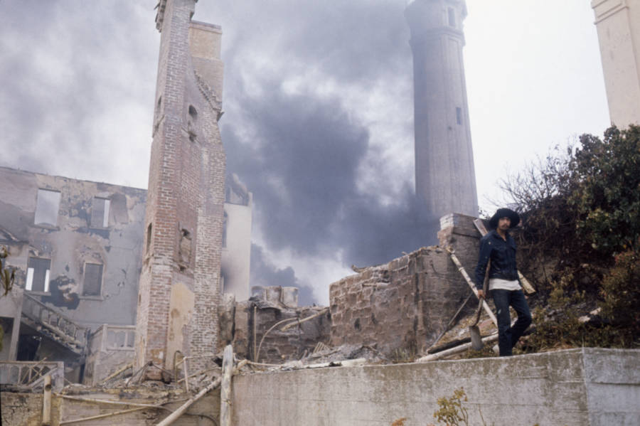  
1971年，占领者的状况日益恶化。据称，为了筹集资金购买食品，他们开始从建筑物上剥离铜线和铜管，并将其作为废金属出售。其中三名占领者被捕、受审，并因出售约600磅铜而被判有罪。1971年初，同情占领者的媒体也开始转而反对他们，并发表岛上的负面报道，还有一宗袭击案件被起诉。很快，他们几乎失去了所有支持。
1971年6月10日，全副武装的联邦法警、FBI特工和特种部队警察蜂拥而来，带走了5名妇女、4名儿童和6名手无寸铁的印第安男子。持续十九个月零九天的占领活动就此结束。

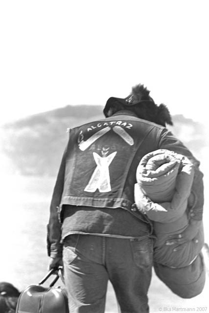  

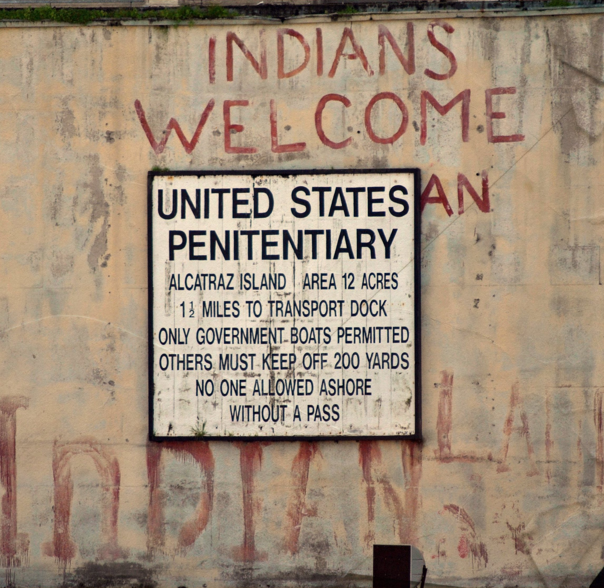  

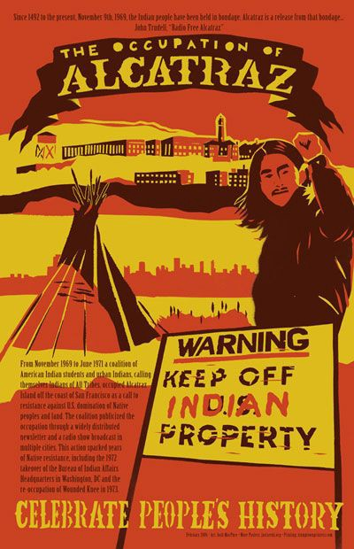  

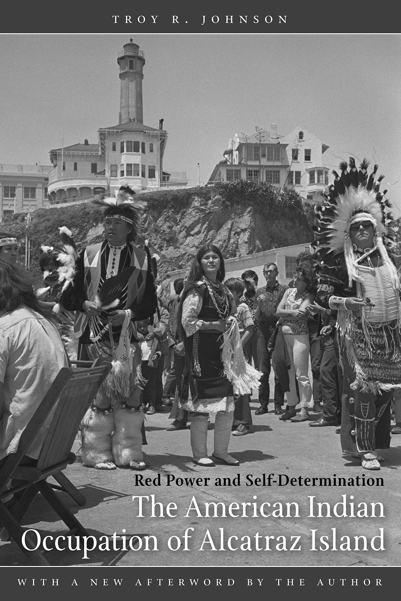  

在占领活动期间，尼克松总统废止了《印第安人终止政策》，建立了一个新的自我认定政策。归还了蓝湖和48000英亩土地给陶斯印第安人。

占领阿尔卡特兹后来一直被印第安人视为印第安自我觉醒的意义重大的事件。

1971年阿尔卡特兹被纳入金门国家公园。

离开阿尔卡特兹后，奥克斯继续抗争，他帮助Pit River部落夺回了被太平洋电器公司侵占的近300万英亩土地。奥克斯还计划创建一所“移动大学”。1972年他不幸被一名白人至上主义者射杀。

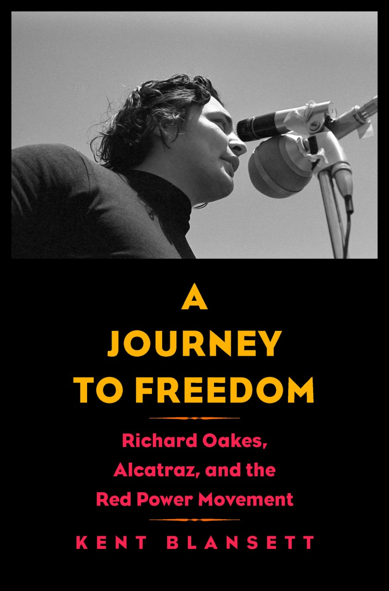  
理查德·奥克斯传记

  
2017年5月22日谷歌日历涂鸦（google doodles）纪念理查德·奥克斯75岁生日

1973年3月27日第45届奥斯卡颁奖典礼上，马龙·白兰度凭借《教父》荣获当年奥斯卡最佳男主角，但是马龙·白兰度没有现身，他请参加过占领阿尔卡特兹的印第安女士萨申·小羽毛替她上台，小羽毛拒绝了主持人递过来的奥斯卡小金人。称马龙·白兰度愤怒于电影界把印第安人塑造成了野蛮残暴的形象，除非等这些现象有所改善，他才会对奥斯卡奖表示尊重。

  
之后，印第安人每年都会在阿尔卡特兹举行两次关于土著人民权利的盛装庆祝活动，其中一次是在感恩节，国家公园管理局积极配合，并欢迎所有游客参加他们的日出仪式。

2011年一个名为“我们仍然在这里”多媒体常设展厅在阿尔卡特拉斯开放，对为期19个月的占领活动进行反思。并设立了印第安文化中心。展厅陈列了许多由旧金山州立大学和加利福尼亚州立大学的学生搜集的当年的照片、视频以及声音资料。以及展览馆的馆长对当年的占领者以及奥克斯子女的采访资料。

2014年，中国艺术家艾未未在阿尔卡特兹举办了一个名为“大型”的展览，探讨人权和言论自由的问题。2016年，尼尔森·赛尔斯（Nelson Saiers）在一个为期6个月的装置中使用了球衣、数学和监狱俚语作为核心元素，呼吁人们关注长期被监禁者。
