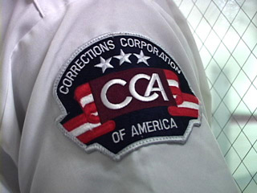
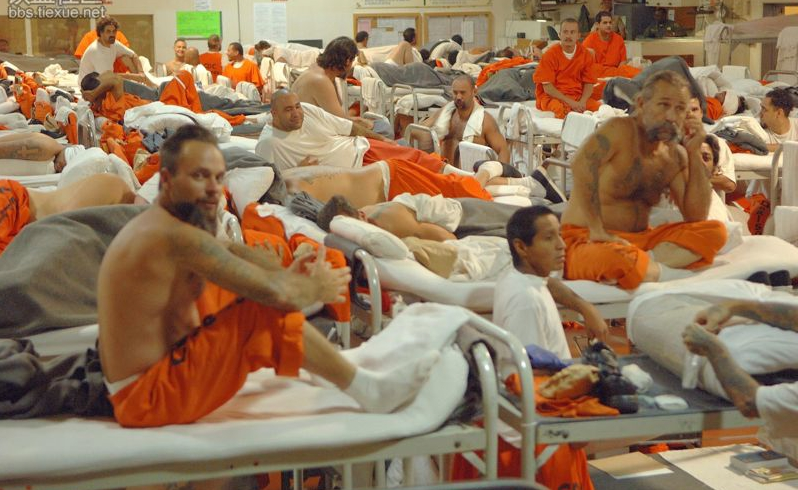
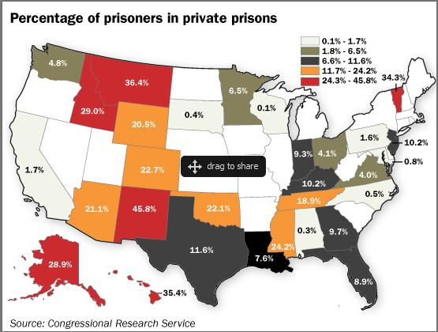
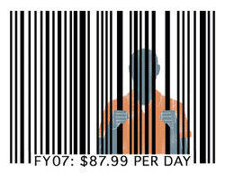

# 私营监狱

## 一、私营监狱的早期历史

最早的私营监狱始于中世纪的英国。在美国，私营机构参与监狱的历史可以追溯到17世纪。当时，美洲殖民地成为英格兰流放重罪犯的地方，许多商人靠运送这些罪犯来换取政府的优惠待遇和向政府推销自己的产品。1648年，圣文森特•德•保罗协会创办了第一家永久性的流浪儿童之家。1666年，一家名叫雷蒙德•斯特普福德的私营公司，同意在马里兰州修建一座监狱，以此换取10000磅烟草和被命名为该监狱终生管理人的优惠待遇。1790年建立的美国感化院，就是根据私营的贵格会团体的宗教哲学和改革努力而诞生的。美国刑罚改革家约翰•奥古斯特通过自己的努力，向罪行轻微的犯罪人提供担保和监督，促进了缓刑制度的建立。在现代少年法庭的建立过程中，芝加哥妇女俱乐部起了重要的作用。随着工业化的发展，大量的罪犯被出租给私营公司从事劳动。在19世纪后期和20世纪初期，在私营经济成分参与监狱活动的过程中，形成了一些监狱工业运行模式，包括出租制、计件制等。例如，1844年，路易斯安那州将其监狱出租给一家私营公司，由其管理5年。1866年，密西西比州授权将州监狱出租给一家私营公司，由其管理15年。同一时期，得克萨斯州的亨茨维尔监狱也被出租给一家私营公司。即使后来不将整个监狱出租的情况下，也往往将罪犯出租给私营公司从事有偿劳动。1905年，罗斯福总统禁止在联邦项目中使用罪犯劳动力。1929年，美国国会通过霍斯—库珀法，允许各州禁止其他州的大量监狱产品进入本州。因此，到20世纪20年代后期时，私营公司参与监狱经济活动的做法受到了法律的禁止。

其他国家监狱发展历史中，私营机构参与监狱活动的情况，也经历了与美国类似的过程。例如，在英国，英格兰的监狱改革家约翰•霍华德通过在英格兰及欧洲的监狱和看守所旅行考察，对于英国及欧洲的监狱改革产生了很大的影响。1854年创立了少年犯教养院，1857年创立了少儿习艺学校，这些矫正机构都是由私营机构发起、创办和管理的。在澳大利亚，自1788年开始，就根据澳大利亚殖民地与英国政府签订的合同，用轮船将罪犯运到澳大利亚服刑，其中的很多运输工作就是由私营公司承担的。在澳大利亚殖民地，许多罪犯被私营公司雇佣，从事多种劳动。

  

## 二、私营监狱在20世纪的复兴

1976年，美国一家私人公司RCA Services取得了宾夕法尼亚州Weaversville Intensive TreatmentUnit的控制权，标志着私人监狱进入新的发展时期。1982年，佛罗里达州将OkeechobeeSchool for Boys转交EckerdFoundation经营，是私人经营监狱的第二例。

美国矫正公司（CCA Corrections Corporation of America，营运超过60家监狱）成立于1983年，这家公司与美国移民与归化局（Immigration and Naturalization Services，INS）签订合同，在得克萨斯州的休斯顿设计、修建和管理一个有350张床位的的最高警戒度拘留中心（maximum-security detention center）。美国矫正公司对这个拘留中心的管理，成为私营公司有能力管理矫正机构的一个早期例子。 由此开始，美国的监狱私营化及私营监狱工业得到迅速发展。美国第二大私人监狱是以其创建者前联邦调查局探员George Wackenhut命名的 Wackenhut管教公司，建于 1954年。到20世纪80年代结束时，与矫正系统签订合同的私营监狱床位已经达10900张，在此期间，美国的看守所和监狱的罪犯数量也急剧增长，看守所罪犯达到183000人，增长83%；监狱罪犯达到276000名，增长63%。因此，20世纪80年代时美国监狱私营化的再次复兴和稳定发展时期。随着罪犯的大量增加和监狱开支的不断增长，监狱私营化的活动得到了各级立法和政府部门的支持。

从1990年开始，美国各级政府面临的监狱预算压力、监禁率的继续增长和监狱过度拥挤的加剧，为私营监狱管理公司的发展壮大，提供了极为有利的客观环境，导致监狱私营化步伐的加快和私营监狱的迅速发展。

在英国，保守的政治观念制约了监狱私营化的复苏步伐。但是从20世纪80年代中起开始，这种情况发生了变化。在这个过程中，右翼政府的思想库亚当•斯密研究所（Adam Smith Institute，ASI）起了重要的作用。1985年，该研究所的一些高级研究人员开始向政府提出关于发展私营监狱的观念，这种观点得到了一些政府官员的支持。在此期间发生的一些监狱暴乱，也推动了监狱私营化的发展。在这种形势下，1992年4月6日在赫尔建成了伍兹押候监狱，这座监狱是英国私营监狱的早期代表，该监狱由私营公司根据与内政部的合同进行管理，第四组押候服务公司（Group 4 Remand Services） 被授权对该监狱进行5年的管理，合同中详细规定了该公司必须提供的最低管理标准，作为对每月获取的费用的回报。在第一年之后，要对合同进行审查，以便确定是否接着完成5年的管理期限。在该监狱开始使用时，它是一个B类监狱，获得了正常食宿证书，关押320名成年男犯，这是多年来英国第一个仅仅关押成年押候罪犯的监狱。由此开始，英国监狱私营化得到了较大的发展。1993年，建在雷丁奇的布莱肯赫斯特监狱开始收押罪犯。1994年，建在唐克斯特和罗奇代尔的两家私营监狱开始收押罪犯。1995年底开始在南威尔士和利物浦修建两家私营监狱，这两家私营监狱在1997年如期建成并收押罪犯。

在澳大利亚，监狱私营化也得到很大发展。到20世纪后半期时，澳大利亚成了世界上第二个主要的“重新发现”私营管理监狱的国家，也是目前世界上在私营监狱中关押罪犯百分比最高的国家。根据1994年发表的数据，在澳大利亚的私营监狱中关押的罪犯占到罪犯总数的28%。澳大利亚有8个司法管辖区，每个司法管辖区有自己的刑事司法系统和矫正系统。到1997年时，有两个州（昆士兰州和新南威尔士州）有私营监狱；维多利亚州计划将它最大的3个监狱通过订立合同的方式承包出去。同时，维多利亚州还通过招标方式、投资、设计和建设3个新监狱。南澳大利亚州已经将1996年建成的甘比尔山妇女监狱承包出去，由第四组保安公司（Group 4 Securitas）管理。

与美国、英国和澳大利亚的情况相类似，在其他西方国家，监狱私营化也得到一定的发展。
在法国，有很多的私营公司参与监狱的管理和工业活动。一些私营公司广泛参与监狱工业和劳动车间的运作；一些非政府组织或者协会为少年犯罪人提供监管服务。法国的监狱私营化是在1987年开始的，监狱私营化的直接起因之一，就是长期的监狱过度拥挤。为了解决这个问题，当时法国的司法部长对美国进行了访问，回国之后即开始仿效美国进行监狱私营化的活动。在法国监狱私营化的过程中，4个财团被要求设计和建造监狱，提供13000个床位和多种服务，包括饮食服务、绿化服务、罪犯运送、医疗和戒毒服务等。这些新建的监狱运行两年后，被收归国有。不过，到1994年时，法国私营监狱的数量达到17个，这些私营监狱关押10000名罪犯。尽管最初的意图是将监狱完全私营化，但是，由于监狱管理人员、法国议会的压力、1988年政府的变更等因素的影响，这些私营监狱的管理、安全与控制，仍然由监狱管理部门负责。所以，法国的这些私营监狱实际上是“准私营监狱”。法国为监狱提供服务的最大私营公司之一，是西热斯（SIGES）公司，该公司是索代克霍股份有限公司的一个子公司，为法国的很多监狱提供多方面的服务。
    在德国，监狱私营化主要局限于监狱的建设和提供服务方面，私营公司没有参加监狱的日常管理。私营公司向监狱提供的服务包括饮食、洗涤和医疗。德国的第一个监狱私营化合同是与柏林州政府签订的。在这项合同中，政府允许私营承包商建造一个新监狱；在其他一些地区，私营监狱公司也游说政府认识监狱私营化的益处，允许私营公司参与监狱活动。

在加拿大、新西兰、比利时、瑞典、韩国等国家，监狱私营化也有了一定程度的发展。

## 三、监狱私营化的理由

  
  

（1）大量降低监狱建设费用，加快设计、建造和运行新监狱的速度。

（2）降低劳动力费用。在公立监狱中，劳动力费用大约占监狱运行费用的2/3；在私营监狱中，私营监狱的管理人员可以大大降低劳动力费用，其措施包括减少工作人员加班工作、减少工作人员的补偿要求、减少工作人员的病假、实行更有效的利润计划等。

（3）增加监狱的床位。解决监狱拥挤问题。特别是实行“强硬”的社会控制政策以来，“反毒品战争”和强制性监禁刑的增加，导致监狱人口的大幅度上升。

（4）降低监狱运行费用。其措施包括以最低的价格、最好的质量购买商品和服务；减少政府管理程序等。

（5）可以通过与一些机构签订合同的办法，让这些合同机构负责监狱的日常管理，而不必建立另外的管理机构和招募专门的管理人员，从而可以减免机构和人员。

（6）按照合同价格计划和控制监狱的长期费用。根据一些估计，由私营机构管理的监狱，每天每个罪犯可以节省5%到15%的费用。

在美国威斯康星州的研究发现，由私营公司管理监狱，每年可以节省监狱经费11%到14%。如果使用私营公司管理一座有5000个床位的新监狱，那么，每年可以节省经费1000万美元到1240万美元（按照1995年的情况计算）；如果这个监狱的使用寿命是20年的话，那么，节省的经费将十分客观。

## 四、监狱私营化的现状

  

（一）美国  
美国是监狱私营化发展最突出的西方国家。根据2001年的统计，美国159家私营监狱的关押容量为119023人。

（二）英国  
目前，根据2001年的统计，英格兰和威尔士有11座私营监狱，关押总容量达到7161人，占监狱关押容量总数的12.4%左右。

（三）其他国家  
澳大利亚是第二个授权建立和运行私营监狱的西方国家。1990年1月，在昆士兰州的博拉隆建成了一个有240张床位的中等警戒度私营监狱。这座监狱的承包商是澳大利亚矫正公司，这家公司是由美国矫正公司（CCA）领导的一个财团。随后，在昆士兰州和新南威尔士州建设两座监狱的招标中，澳亚矫正管理公司（ACM）中标，该公司是美国第二大矫正公司——沃肯赫特矫正公司领导下的一个财团。在此之后，陆续修建了其他一些私营监狱。根据2001年的统计，澳大利亚私营监狱的关押容量为7334人。

加拿大传统上是反对私营监狱观念的。但是，从1994年开始，情况发生了变化。那一年，新不伦瑞克省政府授权为青少年犯罪人建造一所监狱，由此开始探讨监狱私营化的可能性。这个过程包括雇佣矫正计划顾问，在内政部进行全面的文献评价。1994年9月，加拿大政府表示了对监狱私营化的兴趣；1995年6月29日，政府宣布，沃肯赫特矫正公司是受欢迎的投标人，愿意和该公司进行联邦监狱私营化的协商谈判。加拿大的一些省也对监狱私营化充满兴趣，例如，艾伯塔省积极考虑发展监狱私营化。根据2001年的统计，加拿大私营监狱的关押容量为1184人。 
 1992年底，新西兰政府宣布了将监狱系统的一部分私营化的意图。1993年5月，开始通过招标方式建造新监狱：一个是位于奥克兰中部的一个押候监狱，有250张床位；另一个是位于南奥克兰的中等警戒度监狱，有350张床位。为了实施这一计划，1993年向议会提交了一份法案，对现行法律进行修正。1994年12月8日，通过了《刑罚机构改良法》。1997年开始与私营公司签订招标投标合同。这两个新监狱的关押容量占新西兰预计罪犯数量的12%。后来建造一个有500张床位的私营监狱，使私营监狱的关押容量占到20%。根据2001年的统计，新西兰私营监狱的关押容量为384人。

此外，2001年数据显示，荷属安的列斯私营监狱的关押容量为737人；苏格兰私营监狱的关押容量为650人；南非私营监狱的关押容量为6048人；韩国私营监狱关押300人。

## 五、低警戒度监管计划

监狱私营化的另一个重要发展，就是有私营机构建造和运行的低警戒度监管机构得到发展。许多私营监狱都是按照低警戒度标准建造和运行的，私营承包商已经成功地管理和运行了大部分这类矫正机构。今天，这类矫正机构已经成为矫正领域中发展最快的领域之一，也是盈利性私营商业活动的最重要的形式。

在发展成人低警戒度矫正机构方面，私营承包商也起着类似的作用。私营公司发展了更多的低警戒度矫正机构，例如，社区工作释放中心、释放前中心、短期拘留机构、赔偿中心、返回监管式机构、居住式治疗机构等。

当然，针对监狱私营化的争议也一直存在。

  

参考资料：论西方国家的监狱私营化及其借鉴 吴宗宪  
        私有化的边界与局限：以美国监狱私有化实践为例的分析 王廷惠
