# ​监狱流通券一览

  
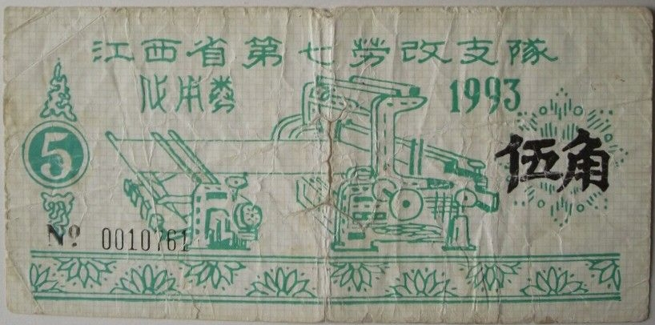  
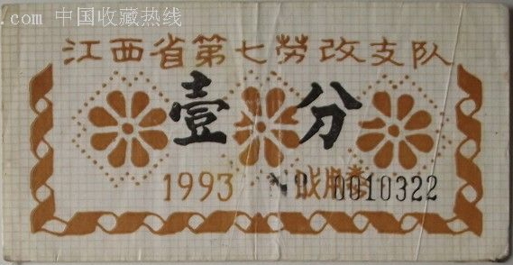  
  
山西省第一监狱前身为“山西模范监狱”，由“山西罪犯习艺所”改建而成。仿日式建筑。原址在山西省城大东门里之北，大校场之南，西界精营东华门，东界东萧墙。文革中监狱迁至祁县，原建筑被被拆毁。

  
  
四川省苗溪茶场始建于1953年，为四川省苗溪劳改支队，1989年升为四川省劳改总队，1996年更名为四川省川西监狱。2003年初整体迁建至成都市龙泉驿区。

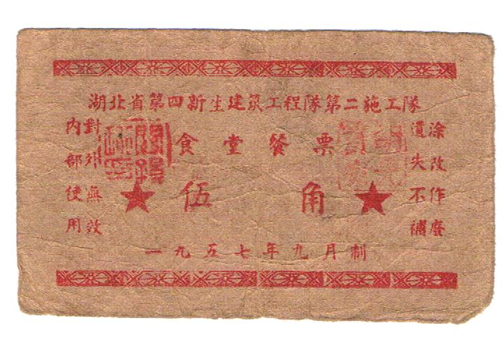  
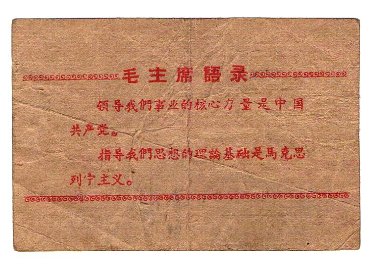  
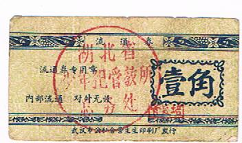  
  
  
  
成都市监狱副业队人犯通用  

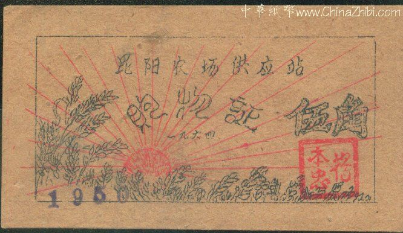  
  
  
湖南省第九劳改队对外称湖南新生机械厂  

  
  
  
  
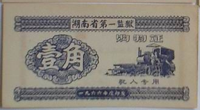  
湖南省赤山监狱原名湖南省第一监狱，于1955年3月更名为湖南省第一监狱，1995年5月改名为湖南省赤山监狱。位于沅江市赤山南嘴镇，占地面积78.1万平方米，总建筑面积12.9万平方米。地处洞庭湖腹地的西洞庭湖，四面环水的赤山岛北端。

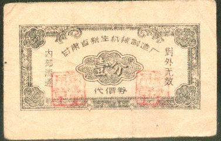  
  
青龙硫磺厂，三峡监狱的前身。位于奉节县青龙乡金凤村  

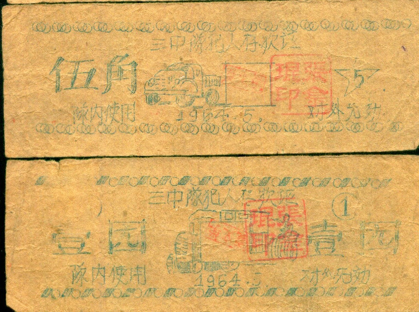  
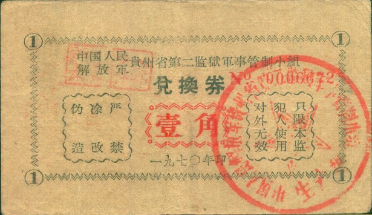  
  
  
山东省第三监狱  

  
中国三大劳改农场之一 ——沙洋农场建于1952年8月13日，是一座关押、管教各类犯人、监督其参加生产劳动、改过自新的特殊农场。地跨荆门、潜江、天门、钟祥、京山，沙洋6县市，总面积2100平方公里。总部设于沙洋城区。1995年6月，更名为沙洋监狱管理局，行政级别副厅。

  
大中农场，江苏省盐城监狱

  
  
  
  
  
  
  
  
上海市第二劳动改造管教总队，后改名白茅岭监狱  

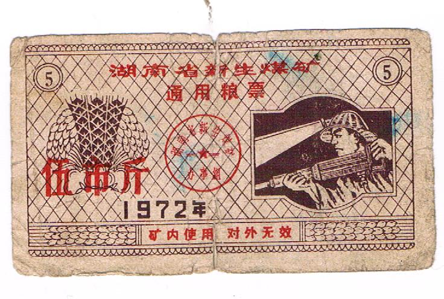  
  
湖南省新生煤矿，又称湖南省湘南监狱。位于湖南省耒阳市黄市镇，始建于1954年，是全国百家大型煤炭生产企业之一，省直大型监狱。

  
  
  
贵阳监狱"曾经叫"贵州省第一监狱"，始建于上世纪五六十年代,一监位于南明河岸.是长期关押重刑犯的地方。如被判20年以上刑期的刑事犯，以及贵州省的"**分子"基本上都在这里服刑

  
  
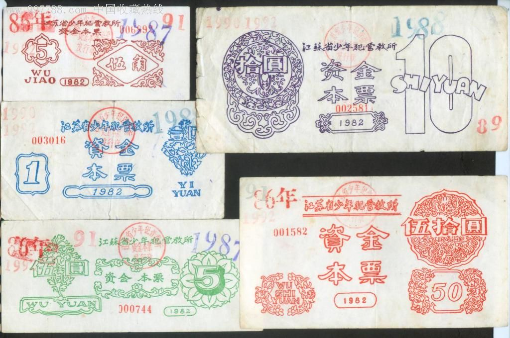  
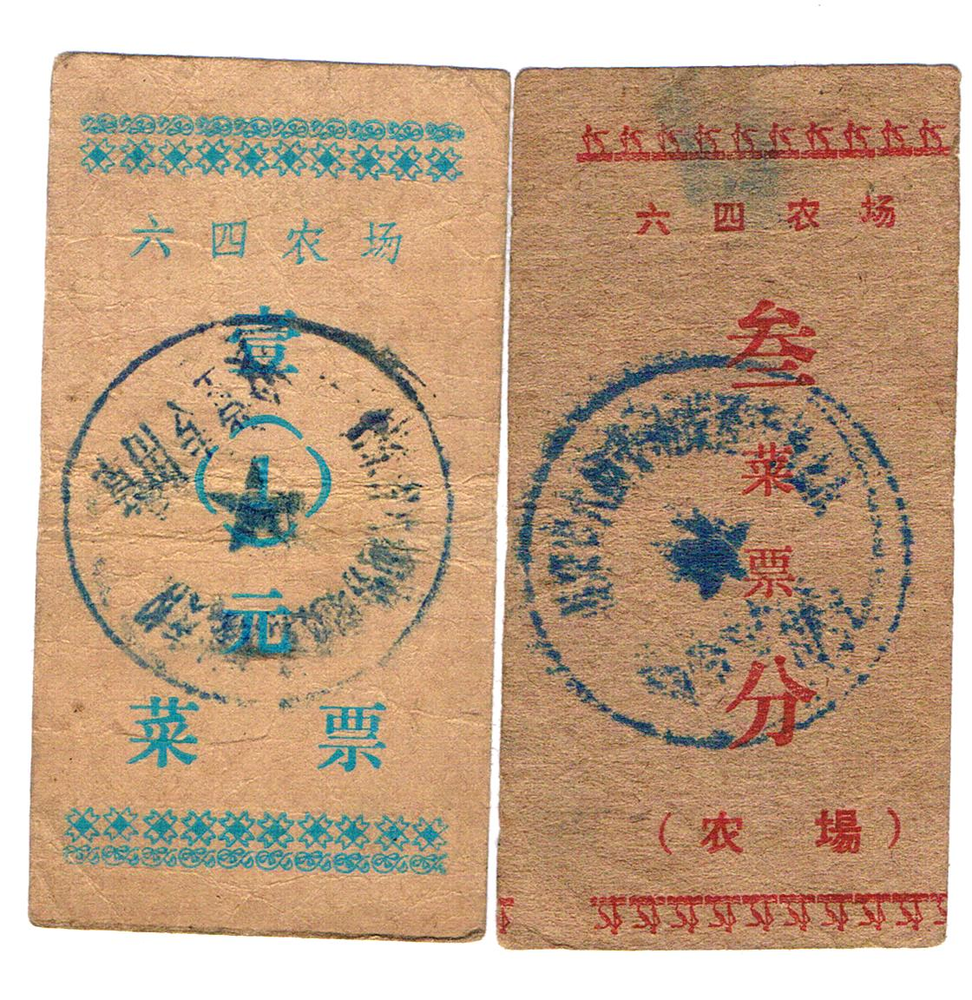  
（新河煤矿）山东省鲁宁监狱  

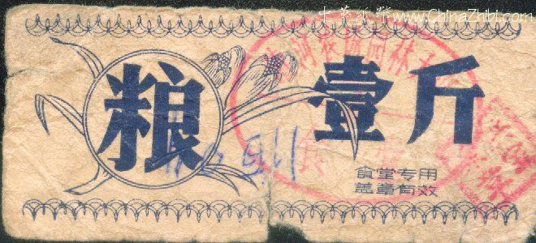  
  
清河农场又叫茶淀农场，是全国首家劳改农场，是北京市的飞地，位于天津市宁河区境内。

  
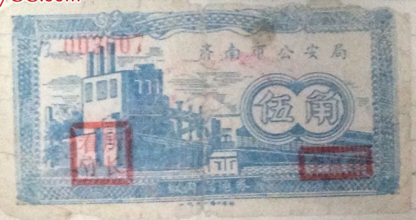  
  
  
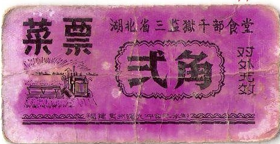  
  
  
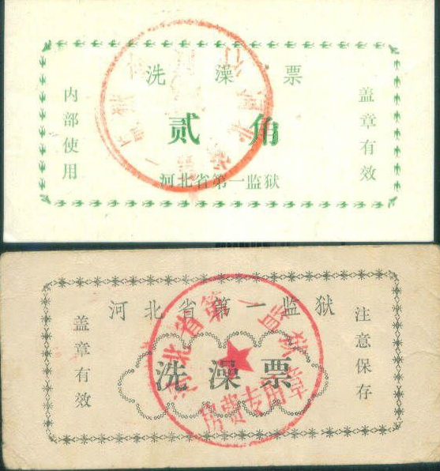  
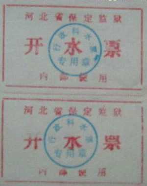  
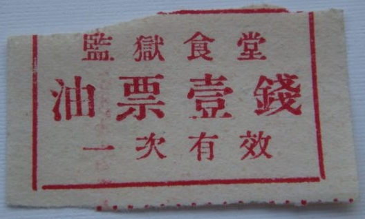  
  
ICE SUCK?
