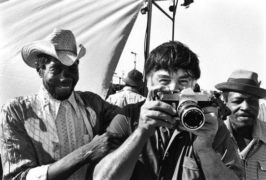
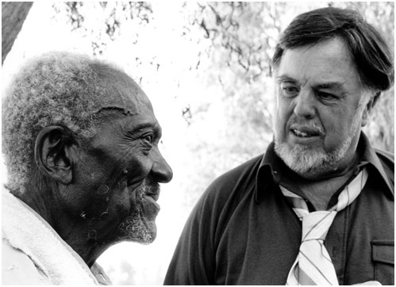
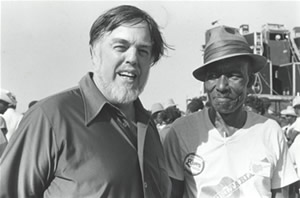

# 记录世界的人——音乐人类学家艾伦·洛马科斯

  
艾伦·洛马克斯(1915 –2002)，美国民歌收集专家、音乐人类学家、档案工作者等。在他87年的生涯中有70多年致力于收集、整理、研究和推广美国以及世界各地的“民歌”。成果包括5,000小时的录音、40万英尺的录像、3000张录像带、5000多张照片和二十多本著作。

由于身体原因，艾伦·洛马克斯18岁从大学休学，跟着作为民歌学者的父亲约翰·洛马克斯深入南方收集民歌，尤其是大部分白人不愿意去的地方，棉花地、工厂、监狱……。开创性的引入口述史的工作方法，包括系统的录音、拍照以及摄像。1934年在路易斯安娜的监狱发现了里·贝利，40年挖掘出了伍迪·格思里…..布鲁斯正是有赖于洛马克斯这些田野学者挖掘和推广得以被更多的人知道，进而打开一片天地。

  

  

  

  

  

1937年艾伦·洛马克斯成为国会图书馆民歌档案馆的主管助理，39年20岁的皮特·西格做了他的助理。他们一起继续收集和出版推介民歌。

由于麦卡锡的野蛮审查制度，洛马克斯被列入文化界黑名单，他不得不离开美国去往伦敦。五十年代大部分时间他在欧洲度过，在那里他走访记录了大量西班牙、苏格兰、意大利的民歌和风俗，编辑完成了18卷世界民俗和原始音乐图书。

1977年，作为卡尔·萨根的顾问，洛马克斯为旅行者号宇宙飞船制作了一张代表地球之声的镀金唱片，随宇宙飞船发射到太空。他挑选了古典音乐之外的大部分音乐，包括布鲁斯、爵士、摇滚和来自安第斯、西西里、保加利亚、扎伊尔、高加索、阿塞拜疆、秘鲁等地的音乐。

（专题片《民歌猎手》片段）  

艾伦·洛马克斯一直不遗余力的强调文化和语言的多样性，推动文化的多元性发展。他在市政厅和卡内基音乐厅举办了一系列音乐会，演出弗拉门戈、乡村音乐、蓝调、爵士、摇滚、阿巴拉契亚音乐、安第斯音乐等。他的广播节目也一直推介世界各国各地的音乐。1983年，洛马克斯成立了文化权益协会（TheAssociation for Cultural Equity），致力于促进文化公平，实践文化回馈和保存、出版和传播的自由。艾伦·洛马克斯冷冷的看着资本的高歌猛进，他说：“每消失一种文化，人类失去的不仅是一种观察、思维和感觉的方式，同时也失去了一种调整我们与环境相处的方式，而且抛弃了一个可能未来某天会迫切需要的互动、想象和象征的系统。”

  

  

  

互联网甫一出现，艾伦·洛马克斯就成立了一个团队，气势磅礴的在他们协会网站（culturalequity.org）建立了一个巨大数据库，他称之为全球点唱机，在这里不需任何手续可以免费听到他收集的几千个小时的录音、他所有录音的电台节目，浏览他拍摄的几百段视频以及他拍摄的照片。
