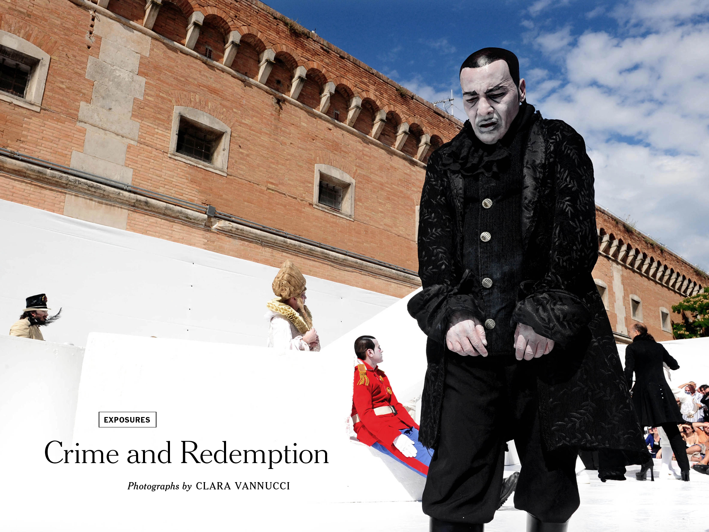

# 意大利沃尔特拉监狱重刑犯的戏梦人生

​  
意大利戏剧家阿曼多·旁左(Armando Punzo)

​  
意大利的监狱剧院的诞生始于19世纪70年代。社会改革者和艺术家们尝试用人文主义改造犯人，他们不认为关在监狱里有利于矫正。1988年，阿曼多·旁左(Armando Punzo)在沃尔特拉监狱（Volterra）成立了要塞演艺公司（Fortezza），一家由重刑犯甚至无期徒刑囚徒组成的剧院公司。

​  
至今，该剧团已持续运营了30年，排演了几十出剧目，在意大利全境巡演。

​  

​  

​  

​  

​  

“曾经有一个星期，他们在靠近意大利边境的一个小镇里表演。白天，犯人们在广场上自由活动，他们可以在当地咖啡馆自由交往。到了晚上，向如潮的观众表演。演出结束后，他们被送往当地监狱，在牢房里睡觉。监狱像旅馆一样。

我问一个囚犯，为什么没有人设法逃脱。他说：“我为什么要逃跑？我已经在监狱里生活了二十年了。现在，我有让我待下去的东西，生活有了意义。”——摄影师Clara Vannucci

​  

​  

​  

剧团25周年回顾（2014年）

​  

​  

  

​  

​  

​  

​  

​  

​  

  

​  

​  

  

​  

​  

​  

​  

​  

​  

  

​  

​  

  

​  

​  

​  

​  

​  

​  

  

​  

​  

  

​  

​  

剧团官网：http://www.compagniadellafortezza.org
