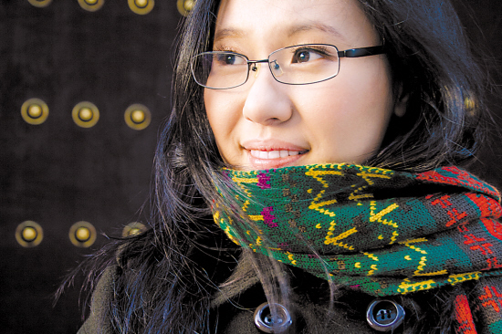
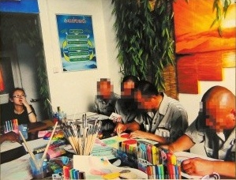
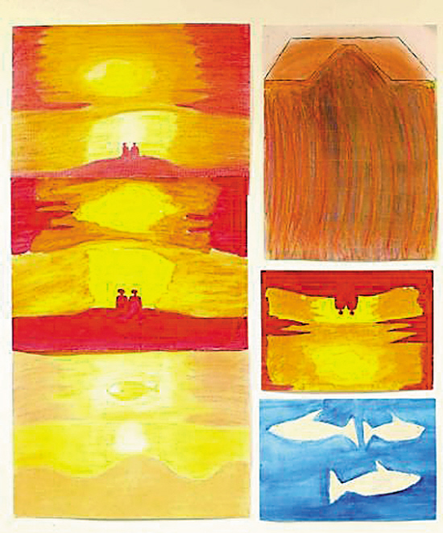
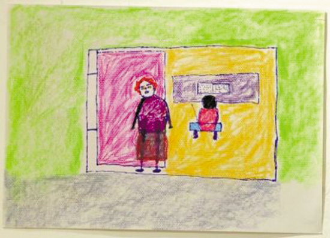
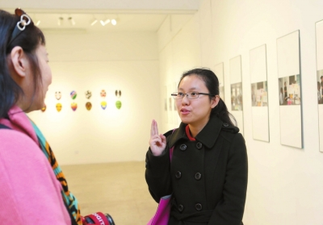
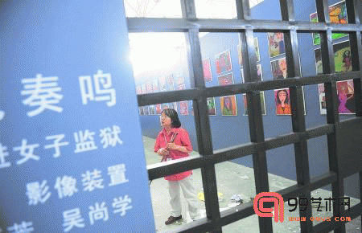

# 监狱里的美术疗法

2012年夏天，中央美术学院雕塑系研三的叶子和她的小伙伴贾坤、宋早贝“入狱”四个多月，在北京市监狱管理局清河分局某监狱尝试了一次“美术治疗”。2013年10月19日，“美术治疗”项目催生的四百多幅绘画，在中央美术学院研究所教学汇报展上展出。这些画的作者不能出席展览，他们的照片也都用马赛克挡住了脸。“我们和监狱签了保密协议，不能泄露服刑人员的姓名、年龄、罪名等隐私。”

## A

2009年，叶子从法国学习美术回来之后，曾在艺途社工事务所担任美术课程教师，给酒仙桥社区的精神及智力障碍学员教课。闲暇时参加禅修班，认识了首师大心理学系研究生贾坤。贾坤曾在两所监狱做过4期“正念减压”项目，每期6个星期。减压对象包括短刑犯、长刑犯，还有狱警。

  

“正念减压”通过打坐、冥想、站立式瑜伽等方式调节身心状态，“正念”就是“活在当下”——铲土就安心铲土，除草就安心除草，不要纠结于过去和未来。该疗法1970-1980年代创立于美国，最早应用在慢性疼痛患者身上。

“正念减压”与叶子一直做的绘画治疗项目的目的相同。谈及国外针对精神病患者、智力障碍患者、囚犯等特殊人群的美术治疗，二人一拍即合。于是他们决定，尝试也将绘画治疗带进监狱。叶子担心没有心理学背景的自己，无法处理学员通过绘画敞开内心后的情况，于是找来做了多年心理辅导的宋早贝共同完成这个项目。

监狱教育改造处处长刘卫丹知道美术治疗。他也想做一些尝试，于是，监狱大门向三个年轻人敞开了。

北京市监狱管理局教育改造处的杨畅全程陪同叶子的狱中美术治疗。杨畅学的是应用心理学。他告诉记者，司法部门正在尝试服刑人员教育改造的“社会化”——敞开大门，把各界专家学者引进监狱，把包括心理矫治在内的各种先进方式引进监狱。

中国传统的监狱改造俗称“三大手段”：狱政管理（监狱生活规范，奖惩措施等等）、教育改造、劳动改造。1990年代以来，“心理矫治”逐渐成为第四大改造手段。司法部也认识到“心理矫治”的重要性，曾专门发文要求监狱建立“服刑人员心理健康指导中心”。

美国学者认为，犯罪人群是“社会精神卫生的洼地”。“服刑人员很多有人格障碍，与童年的病态人格有很大关系，不能理智地正确地面对挫折，不能很好地与人相处，不正常的诉求……”杨畅说。

## B

监狱里人与人的关系非常微妙，贾坤认为，这里面更多的是紧张。无法表达的压抑和郁闷常常会越积越深，负面情绪也会越来越重。绘画则是用非语言的方式表达自己。“他们不用说，我们可以从画中看出来。”负责课后沟通和抚慰工作的宋早贝说。

接受“美术治疗”的服刑人员由监狱管理方挑选，从二十出头到老爷爷都有。有大学毕业的，有不认识几个字的，罪名不同，刑期不同，惟一共同点是这些人都没有美术基础。他们来自两个监区，一个班是患有传染病的服刑人员，8个人。一个班来自“惩教分监区”，5个人。患有传染病的服刑人员，其实就是艾滋病患者；“惩教分监区”的服刑人员，是在监狱里继续犯错误的人。

叶子用美国艺术家、心理学家贝蒂·艾德华的著作《像艺术家一样思考》为蓝本初步拟定了教学方案。这本书教人在5天之内学会画素描，它教的不是技巧，而是一种思维模式——“用右脑绘画”。

方案分几个步骤，第一个阶段是消除学员对纸和笔的恐惧，能够自由使用绘画材料；第二个阶段是学会观察前人画作和现实生活；第三阶段，开始尝试表达；最后是自由创作。

 叶子设定的目标是提升他们的自尊。

一束花和自尊有什么关系？“脾气暴躁，缺乏耐心，是不可能画好一束花的。当他把花画下来，在作品上签名，这就是一种自我肯定。”

  

## C

经过近4个月的准备，2012年7月，他们3个人精心准备的美术班开课了。前两个月，叶子和宋早贝每周给他们上4天课，为了避免学员们产生情感依赖，后两个月逐渐抽离，每两周上一次课。

课堂上，服刑人员的名字可以用本名，也可以给自己取个外号。叶子不教技法，只教如何观察， “我们不设立审美标准，分享作品时鼓励大家相互欣赏而不是相互指责，每幅画得到的都是鼓励。”贾坤说。

叶子根据德国艺术家约瑟夫·博伊斯的理念：人人都是艺术家，告诉学员生活中处处可以创造艺术。她在课堂放了一些PPT，其中有幅摄影作品，路灯照射下来，影子像钉子一样立在街道上。一个中年男人突然站起来，说：“我要学会画那个钉子！”接着他讲起他童年时遭遇家庭暴力，经常离家出走，夜里在路灯下徘徊，不知去向何方。于是，他有了画画的欲望。他后来画了好多各种各样的钉子。美术治疗项目结束之前，他就出狱了，他很宝贝自己画的钉子，带走了很多。

  

一堂课下来，两个多小时没人乱动，下课都不愿意走。

 “艺术里没有好坏。”叶子说。在监狱教学的这段时间，她自己从来没有画过一笔画，她不想学员模仿或者把自己当成榜样，画画只是让他们能够享受不一样的生活。

“大概是美术能够让他们安心吧，在教室里没有管教与被管教的关系，这里是温暖的，不被评价的，我和宋早贝只是引导他们画画，不作任何的干涉。”在贾坤看来，这还不能算作治疗，只是通过画画，给他们提供一个不一样的环境和氛围，让他们放松自己，舒缓压力。

后来，越来越多的服刑人员开始想学画画。叶子暗暗高兴起来，她的绘画课吸引住了不少学员。

也有人越画越怕。有位学员一开始画得很好，两天之后说，老师我坚持不下去了。“他是惟一直接告诉我不想继续画画的人。”叶子说，画画时有音乐听，又不用干体力活或者窝在铁窗里，他却不想来。

狱警告诉叶子，这个人干活不惜力，但总是在自己将要得到减刑时就忍不住打架，等他出了“惩教分监区”继续努力，然后再把自己将要得到的东西亲手毁掉。一位很了解这个人的老狱警听说他在画画很诧异：他怎么能画画？他种地很努力，但你让他缝皮球他会暴躁不已。

贾坤建议他把自己最不痛快的一天画出来。叶子鼓励他说，好看不好看无所谓，重要的是画出来。结果他真的画了，画面是一个漩涡，漩涡中间是一个红彤彤的血滴。

  

传染病班有位外籍学员，本来只是给另外一个想画画的学员做翻译，他喜欢音乐，尤其喜欢打非洲鼓。上课时他看到音箱，画画的兴趣上来了，他画的音箱完全不符合透视原理，两侧都冲着前面。后来他画了七十多张画，是作品最多的学员。

有一天，叶子展示了一幅画，沙漠黄昏，两个人看夕阳。这位外籍学员对叶子说，我想家了，课程结束之前我希望能把这幅画画出来。接下来他就反复地画，每张画都不一样。最初是两个红色的人坐在红色的沙漠上看红色的夕阳，越画，人的色彩越淡，最后一张画里没有人，就剩一个鱼状的太阳。

这位学员过生日时，问叶子能否把自己的照片给他一张，这在保密协议里是不允许的。“后来经监狱方同意，叶子在他的《圣经》书上画了幅自画像——当做给他的生日礼物。

  

还有一个学员迟迟不画。 “我怕透露心头的秘密。”叶子并不强求他，只是让他看别人作画，随意交流。三堂课之后，他开始认真地画画。他的画面绝大部分是光芒，而右下角黑漆漆一团，签着他的名字。他说千山万水、光芒万丈都和我没关系，我就在那个地方猫着。“他把美好的东西画得那么美好，越美好越拒绝，好像很有主见、不被忽悠的样子。”叶子说，他也是第一个敞开心扉的人。

其他作品里，有画一个大口大口吃面条的人，叶子说那是服刑人员画的同伴的吃相，有双喜字、花草树木、夕阳，还有临摹的广告画：“猫咪的营养点滴”、“纯天然葡萄酒”……

还有相当一部分画作像是儿童生活漫画，画作边上标注着这样的文字：“爸爸你真壮，我怕，我怕呀”、“这样对待孩子太残酷，警告那些家长，虐待儿童是非法的”……通过画作，似乎可以感觉到他们童年曾经受到的伤害，还有至今无法抹去的心灵伤痕。

一张画上写了一首诗：“悔恨几时休，强忍泪不流；待到自由时，举杯庆自由。”画的是一只张牙舞爪的蝎子。“这个人文字功底非常好，他的画背后都有大段大段的心得，只是当这些话和画面配起来，总是让人感到语言是多么苍白。”叶子说，从心理学角度来讲，语言往往是一种掩盖。在学员自由创作的画作里，还有写着“厚德，包容，创新，爱国”、“远离毒品，预防艾滋”的，这是不是学员真实的心声？“我确实不知道。”叶子说。

有一幅画，画的是葡萄架，每串葡萄都对准一朵盛开的黄花。美院一个老师猜测，这个作者可能有性方面的焦虑。“他不会用语言说出来，但绘画时潜意识就会宣泄出来，达到减压效果。”叶子说，正视宣泄，就不能回避监狱的性压抑问题。一位学员在画本封面写了两行字：闲暇书笔墨，本开性趣来。“愿意直面就是一种勇气，越藏着就越是事儿。”叶子说。

叶子把一些面具素坯带到课堂让学员随意上色。“面具是人的第二张脸，用面具作画更能直接地释放内心，修补人格。”展览时不同的老师都被一个通体墨绿的面具吸引，说这个好冷酷；面具的作者跟叶子说，这个面具是铁头功，我也是铁头功。后来知道，他是用脑袋撞玻璃之后才进了“惩教分监区”。他还画了一个脸上全是鳞片的人，像是蛇皮，那张蛇皮脸还在笑。

叶子说：“绘画的过程其实是个自愈的过程。”他们的美术课程就是让学员们在学习的过程中放松自己，用审美的方式去观察和表达，从而领悟生活中有意味的事，获得个体内在的审美愉快，提升正向的自我概念甚至积极的生命态度。

## D

4个月后，叶子带着四百多张作品“出狱”。这些作品有写实的，有抽象的，有速写，有漫画，乍一浏览完全看不出一点监狱色彩。

经狱方同意，2013年10月19日，这些服刑人员的作品在中央美术学院研究生教学汇报展上展出。400多幅作品中，门、夕阳、眼睛等成为服刑人员画得最多的东西。

  
  

美院一个老师认为，最好的一幅画是“童年的家”。绿窑洞，红砖墙，黄土地，一个孩子和母亲背对背站着，一条小路，路边芳草萋萋。

作者说那是他老家的路，他在北京打拼了好多年，最终因为迷失了方向，走向了离家乡越来越远的位置。他特别哀怨地说好多东西都记不清了。叶子说：“这是他最努力画的一幅画，他说没画好，我们表扬他也不信。他说这幅画，画得他胃疼，晚上睡不着觉。”

 “他们的绘画，能让人感受到对自由、生命和爱的不同体味。”叶子说。

## E

2007年6月，年近60岁的画家谢丽芳和他的先生、同为画家的吴尚学带着将油画带入监狱的想法走进湖南省女子监狱的时候，同叶子的期望一样，他们想“为她们搭建的是一个与自我对话的平台”。

“女犯是最容易被人忽略的，但因为女性的心理特点，她们又是最需要关怀和帮助的。”这是谢丽芳夫妇选择走进女子监狱的原因。

湖南省女子监狱从80名女囚中选出了29名不同文化背景和犯有不同罪行的女囚接受油画培训，她们的年龄跨度在15岁到59岁之间。65岁的谢丽芳说：“可能我比较亲切吧，很多人都把我当成奶奶或者妈妈，聊她们的故事，她们的苦恼，就像一般人一样，常常忘了她们囚犯的身份。”

对于这些没有绘画基础的人来说，第一节课常常是由欣赏开始，谢丽芳不看重他们画得好不好，也不限定主题，关键是“通过绘画的方式表达出平时无法表达的心声，帮助学员进行有效的自我暴露，找到引起他们行为异常的心理根源。作品创作的质量并不是太重要”。

因为监狱里还有一些劳动任务，整个绘画创作班的创作分为3个阶段，每个阶段7天。完成一个星期的创作，劳动一个星期，再接着参与下一个星期的创作。学习期共计21天，大多是利用下午或晚上的时间进行创作。创作前谢丽芳简单介绍一下绘画的基本技巧，学员们就可以开始自由创作。

虽然没有主题的限定，但是很多人最后的主题常常是家庭，对过去经历的回顾和对未来的期望。真情、忏悔、思念、渴望、感恩常常从她们的画作中流露出来。

在油画艺术教育活动中，把压抑在心中许久的负面情绪通过油画创作的方式表达、发泄出来，特别是潜意识中对法院判决的不满和对社会的偏见用涂鸦的方式呈现在大家的面前。她们学会了用画笔来表达内心的抑郁与挣扎，也学会了用色彩来倾诉对自由的渴望、对亲人的思念。

现在说起来，谢丽芳还能清晰地回忆起当时一位29岁的学员吴某创作的9幅油画。吴某因为吸毒、贩毒而被捕入狱，消沉是她对外界唯一的情感回应。
她的第一幅画画的是小女孩在路上等待，却见到一条蛇骑着一辆自行车，后面还有一束玫瑰花。

第二幅画画的是她的亲身经历。她写道：“在一个雷雨交加的夜晚，在下班回家的路上我遭遇车祸，导致截肢，因对生活感到失望，自暴自弃染上毒瘾，最终走上犯罪的道路。”接下来她画的是梦，她希望有一天能骑着马去看日落，看星星。当年的6月19日，她画的是和儿子在一起，并希望能早日回家陪伴孩子，以尽母亲的责任。接下来她画了漂亮的嫂子、姐姐和猫以及爱抽烟的弟弟，还有为自己变得白发苍苍的老父亲，并渴望在老人有生之年陪他安享晚年。

“在向大家介绍自己的自画像时，她想让我替她说。”谢丽芳说，“但我坚持让她自己说出来。”

“我想要一份爱情。”她的声音近乎耳语。

  

2009年，在第四届成都双年展上，谢丽芳和吴尚学专门为这些作品办了一个名为《灰色四度的视觉奏鸣———艺术走进女子监狱》的展览。在展场他们搭建了一座监狱。这座小小“监狱”，虽然占地面积比真实的监狱小了很多，但四围封闭的高墙和粗大的钢筋铁栏做成的大门却像真实的监狱一样，给人以冰冷、威严的感觉。

步入“监狱”，录像机里播放着艺术家夫妇教女犯们画画的场面，“监狱”的墙壁上是拍摄于监狱里女犯们学画的照片，靠近大门的一面墙上，贴的则是女犯们在狱中的绘画作品，上面有女犯自己的形象，也有女犯画的亲人的形象，有的画风景惨淡、人物哀愁，有的充满欢快的气氛。

对于画画给这些女囚带来的改变，谢丽芳说：“画画的时候，她们都很快乐。”湖南省女子监狱后来的测试也证实了谢丽芳的看法：“大部分原本性格有明显缺陷、脾气暴躁、情绪容易失控的罪犯通过一段时间的(油画)学习，思想变得稳定，性格变得开朗，且更乐于帮助她人。”
