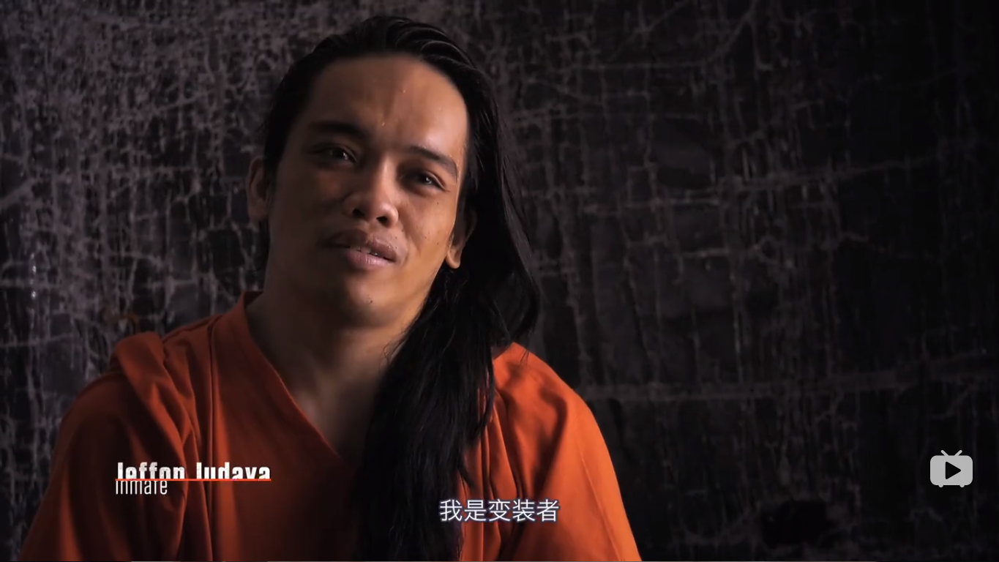
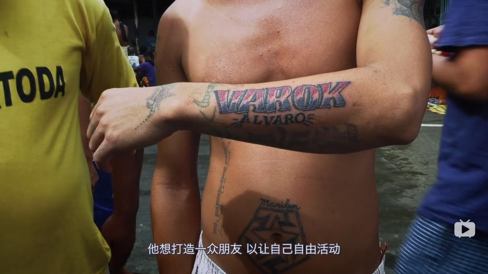
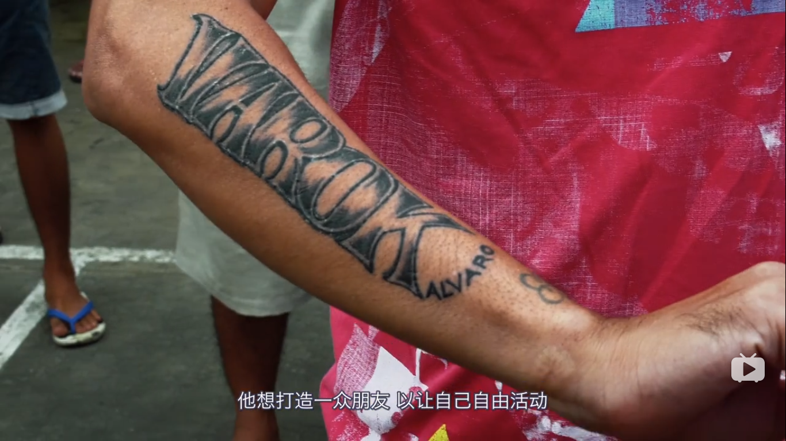
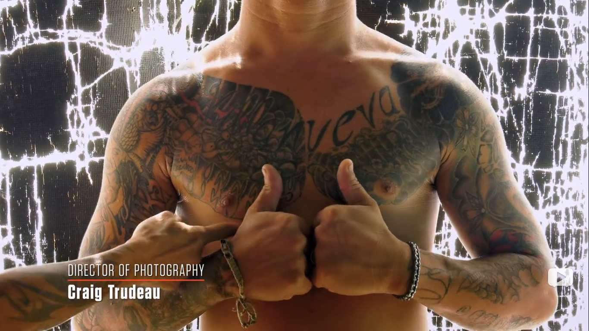
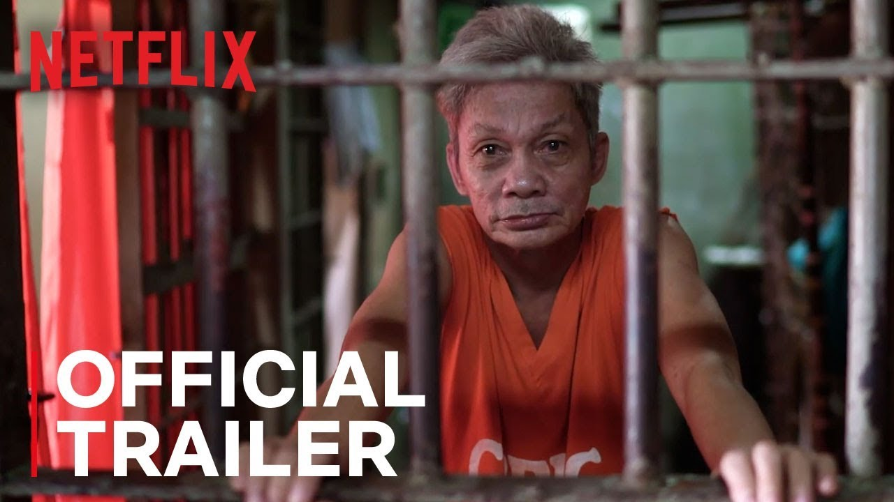

# 宿务安乐监狱

菲律宾宿务看守所素以跳舞闻名。2007年，时任监狱顾问的拜仁·加西亚看了电影《肖申克的救赎》，他很感慨，由是尝试在监狱里播放音乐，效果很好。接着他进了一步，组织犯人跳舞，拍摄并传到网上。同年犯人们表演的麦克·杰克逊的一系列歌舞在YOUTUBE爆红，此后该监狱每个月的最后一个周六对外免费开放，游客在看台上给热舞的犯人们打CALL，由此成为宿务的网红项目。当然，犯人们的生活得到很大程度的丰富。

编舞并教犯人跳舞的是一位外来的老师，他不是犯人，但深爱这份工作。他感觉到舞蹈在这个封闭空间里的力量。

在宿务，看守所并不是一个被冷落的角落，电视台总有一只眼睛盯着它，省长也时常去视察，前任省长身材苗条、积极阳光，落落大方。一次视察中，还有犯人亲了她脸颊。

  
  

菲律宾的监狱人满为患，宿务看守所关押的既有未审判的嫌疑犯也有已判刑的犯人，有男人也有女人，不少犯人挂个吊床睡在半空中。杜特尔特实施强力扫毒之后，犯人密度又增一倍，有3000人之多。其中不乏同性恋、异装癖等，镜头里大家相处也很和谐。

  

  

  

  

2016年奈飞（Netflix）获准进入宿务看守所拍摄，并于2019年制作完成一套五集的纪录片《Happy Jail》（安乐监狱）。“Happy Jail”在片中至少出现四次，一次是跳舞的时候犯人们摆出一个Happy Jail的队型，一次是一个犯人理发时让理发师在背后刻出这俩字，一次是一位犯人将这两个单词纹在自己背上。

  

  

  

监狱里的确流行纹身，每个人都身上有各种各样的符号，有的是监狱帮派的标志，有大佬的名字，一位毒枭叫Warok Alwaro，他发话只要把他的名字纹在身上，就可以去他那里领100比索（合人民币14元），有什么事也可以找他帮忙，据说纹了WAROK的有上百人之多，背上、肩上、脖子上......。马科托罗的左上臂有两个汉字“忍者”。

  

  

  

  

  

  

  

  

  

本片聚焦饱受争议的监狱顾问马科托罗。马科托罗因涉嫌毒品问题在宿务看守所关了7年，2016年马科托罗出狱，省长找到他，问他愿不愿意做监狱的顾问，他认为这个工作很有意义，就接了下来。之后，他成了宿务看守所实质上的负责人，像一个山大王，架空了监狱长，监狱长也乐得省心。马科托罗作风凌厉干练，上任先换了狱警，他认为以前的狱警都腐败了，没法管理好监狱。他对新的狱警（包括和他一样在里面服过刑的）进行魔鬼训练，还使出滴蜡的虐招。他了解犯人的心理，知道如何与他们相处，营造了一个相对宽松舒适的氛围，允许犯人用手机跟家人联系，允许家属周末来探亲并过夜。一系列做法饱受争议，频频被前任省长以及监狱顾问批评。

  

  

  

2016年7月25日，一名犯人伪造了印章跟着探亲的人从监狱逃跑。马科托罗大为光火，搜捕牢房里的违禁品，并对四个犯人施以杖刑，当着犯人的面朝空中开了一枪，虽然里面是空包弹，但是这是被严格禁止的，他惹了麻烦。接着省长被问责，马科托罗辞职，监狱长也被迫辞职。之后，看守所政策急转直下，手机被没收，探亲被取消，甚至跳舞也要被禁止。

  

片子的后面，犯人们跳最后一次集体舞，马科托罗意外现身，受到热烈欢呼。他告诉大家，避过这阵子的风头，他还会回到看守所，探亲和舞蹈还会继续。

  

但是没过多久，省长也换了，原来的美女省长回来了，马科托罗再无法再回到监狱。

那晚的纵情舞蹈，那晚的火光四射，成了他们好日子的谢幕式，宿务看守所从此黯淡无光。

  
  

在这个特殊的时期，希望病毒没有进入拥挤的监狱，保佑所有人健康、平静。
