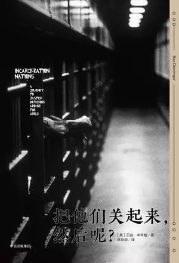

# 把他们关起来，然后呢

此地遗世独立，风俗特异，律法、衣着、礼仪皆自成一格，是活死人居住之地。他们与外界隔绝，生命截然不同。——陀思妥耶夫斯基

评判一个国家，不是看它如何对待最尊贵的公民，而是看它怎样对待最卑微的那群人。                     ――曼德拉

为了教化囚犯，于是将囚犯置于完全独处的空间。然而绝对的孤寂若无外力介入则超越人类所能忍受，不留情面也不留余地摧毁了罪犯的人性。那不是教化，而是杀害。
――托克维尔

“把他们关起来”是我们面对的现实，“然后呢”是我们要继续深思的问题。

今天的监狱书系推荐美国女学者贝兹·卓辛格（Baz Dreisinger）的《把他们关起来，然后呢》（Incarceration Nations:A Journey to Justice in Prison Around theWorld）。贝兹·卓辛格两年里去了九个不同的国家（卢旺达、南非、乌干达、牙买加、泰国、巴西、澳大利亚、新加坡和挪威）进入他们的监狱进行实地探访（这很让我嫉妒，因为她考察的方向，也正是我感兴趣的）。作者把她的经历、感触和思考集结到这本书里。书的介绍里写道：“贝兹·卓辛格以美国刑罚学家和记者的身份，向我们揭开我们以为的正义是什么模样。”而我更感兴趣的是书中涉及到的艺术介入监狱的案例以及修复式正义。

本书涉及的议题有：修复式正义、社会复归、单独监禁、民营监狱、艺术教育等。每个都是很大的课题，作者以自己探访到的一例例个案让读者感受监禁政策以及被监禁者的状态。

惩罚之外，书中涉及到的每个国家对监禁人员有不同的策略及机构设置，比如：南非为解决种族斗争问题而建立的“真理与和解”委员会，促成让犯人和受害者面对面交流的“修复式正义”活动、巴西的单独监禁、乌干达和牙买加的艺术教育，泰国公主发起的针对监狱女性的“康兰吉计划”。卓辛格与犯人们见面，通过参与戏剧讲习班、写作课程、阅读矫治计划等，带他们打破坚冰，进行角色扮演练习，寻求建立更多同理心的途径。

这一趟看似轻松愉悦的旅程中，作者也多次表达自己的反思以及无力感，在庞大而僵化的体制下，如此极端的环境中，艺术能起到多大作用？有多大意义？

## 【作者简介】

贝兹．卓辛格（Baz Dreisinger），纽约市立大学约翰杰刑事司法学院副教授，也是美国知名Prison-to-College计划的创办人，这个计划旨在提供囚犯出狱后上大学的机会。卓辛格同时是一位记者，为《纽约时报》、《洛杉矶时报》、《华尔街日报》、NPR等媒体写关于流行音乐、加勒比海地区、世界音乐以及种族议题的文章。她还在监狱授课，推动司法正义，共同制作以及编写过两部纪录片（主题分别是嘻哈文化及司法体系），出版过Near Black: White to Black Passing in American Culture（2008）。因为工作机会，卓辛格得以实地探访世界各地的监狱，让她不禁探索一个重要的问题：监狱这项惩罚机制，真的有效吗？

## 【本书目录】

### 1. 报复与和解 | 卢安达

宽恕并非无视已经发生的过去，而是毫无回避认真面对，最后拔除记忆上的刺，防止毒性扩散全身。宽恕代表理解犯行者，发挥同理心，站在对方的角度思考，感受究竟是什么样的外力、压力迫使他们采取那种行动。

### 2. 对不起 | 南非

修复式正义的核心概念在于：犯罪是不尊重他人、不负责任的行为，但我们需要的并非更多的刑罚，而是修补损坏的关系。为了达成这些目的，最好的做法不是审判和刑罚，而是双方对话。

### 3. 牢笼里的艺术 | 乌干达与牙买加

在牢笼、在艰苦环境中也要阅读讲话写作的理由：为了唤起人性。为了乘上言语的双翼。为了回到语言。为了找回监狱想磨灭的身分。为了在肉体遭到禁锢时掌握心灵自由。为了不再只是“我”，成为以文字填满教室的“我们”。

### 4. 女性和戏剧 | 泰国

所谓公关不就是精心策划的一场好戏？对于监狱和囚犯，最重要的不也就是公关？将妇女逼进监狱的是法条，而法条之所以存在是奠基于民意，若能改变舆论对犯罪和司法的认知，对囚犯和罪犯的想像，如此一来政治人物也得改变立场。

### 5. 单人禁闭与超高级监狱 | 巴西

他们算是活着吗？陀思妥耶夫斯基描述单独监禁是“抽干一个人的生命养分、削减他的灵魂使其萎靡衰弱，然后高高捧起干枯如木乃伊、已经失去心智的人，赞扬为改过自新的模范”。对他们来说，能被人看见、出现在笔下，已经是难得的重生：他们尚未被彻底遗忘。

### 6. 民营监狱 | 澳洲

### 7. 社会复归 | 新加坡

“社会复归计划就像为癌症病患准备急诊室”葛伦．马丁曾这样告诉我。新加坡再度展现他们正为伤口止血。
 “社会复归”听起来很单纯的四个字，仿佛一个人只是离家些许时日，回来时一切无缝接轨。事实上当然没这么容易，要回到原本的生活是个重大转变，想要重启人生需要巨大努力，也因此是个铺天盖地的危机。“中途之家”在新加坡提供这方面的帮助。

### 8. 什么是正义？ | 挪威

我们必须开始扮演所谓的好撒马利亚人，而且这只是开始。总有一天我们得清除路上所有障碍，每个人在人生旅途上无需担心遭到殴打或掠夺。同情心不是给乞丐硬币，而是扭转创造出乞丐的体制。
