# 古拉格气象学家

​1934年1月8日，苏联首席气象学家阿列克谢·费奥多谢维奇·范根格安姆约了妻子瓦尔瓦拉·伊万诺夫娜·库尔古佐娃一起去看歌剧：尼古拉·林斯基·科尔萨科夫的《萨科》，这部歌剧讲述了一个商人在海上和海底的冒险经历。库尔古佐娃在大剧院的柱廊下等到深夜，始终没有看到丈夫的身影。那晚，丈夫就在离剧院很近的地方，他被带到卢比扬卡大楼的秘密警察总部接受审查。

其时范根格安姆是苏联水文气象局局长，也是一名忠诚、乐观的共产党员。经过长时间的审讯，旺格海姆被判犯有经济破坏罪，依据第58条第7款，他被被判处10年劳动教养，被送上开往「索洛韦茨基特别监狱」的列车，再没有回家。那一年，他的女儿埃利奥诺拉刚满四岁。

与古拉格群岛千千万万劳改犯一样，范根格安姆的命运是被处决，并很快被历史遗忘。

时间来到2012年，法国作家奥利维埃·罗兰到俄罗斯旅行，他在一位老太太的家里看到了一本小册子。老太太告诉他，这本小册子属于一位曾经被关押在古拉格的气象学家，内容是他写给妻子的信件和画给女儿的画。那些画非常精美、清新雅致，吸引了罗兰的目光。他反复翻阅这本信件集，并开始搜寻这位气象学家的故事。在搜寻的过程当中，他遇到了两位同路人。三人联手，从这本信件集入手，抽丝拨茧，使得气象学家范根格安姆的故事逐渐浮出水面。

阿列克谢·费奥多谢维奇·范根格安姆，1881年生于乌克兰的一个小村庄，克拉皮付诺，村庄名意为「荨麻生长的地方」。他的父亲出身贵族，他因此受到良好的教育。1906年，他有了第一任妻子和一个女儿。第一次世界大战期间，他是第8集团军的一名士兵。他的天气预报被苏联军队用来对奥地利军队在前线使用毒气。在圣彼得堡，他领导地球物理天文台。1929年，他成为苏联水文气象局局长。1930年，他离婚再娶，其后有了小女儿埃利奥诺拉。他积极筹备1933年的国际极地年，是该会议两个苏联代表之一。研究云也是范根格安姆的专长，他是国际云委员会里的苏联代表，1929年他成为苏联水文气象局的第一任局长，1930年他创建了天气办公室，创建了苏联的水文志、风力档案和日照档案。

但他的命运比云还轻，苏联的政治比气候多变。

范根格安姆为什么被捕，后来的研究者认为，可能是下属出于嫉妒举报了他，说他是气象局内反革命组织的头目。但被捕是那个年代许许多多的苏联人无法逃脱的命运。下属的嫉妒，也许只是一个可以让掌权的人说出来的借口，或者后人聊以安慰自己的说法。

1934年7月10日，一艘名为“突击手”的船把他和一批犯人一起运到索洛韦茨基群岛的古拉格。范根格安姆在古拉格的三年，也是他人生中最后的三年时光，是通过他坚持不懈的写给妻子和女儿的168封信件来展开的（他平均一个星期写一封信）。

在信里，范根格安姆坚持给年幼的女儿埃利奥诺拉寄去小画、标本、谜语，“信件中有植物图集，有线条干净、天真、沉着的图画，用铅笔或水彩着色。里面有北极光，有海冰、黑狐狸、母鸡、西瓜、茶炊、飞机、船、苍蝇、蜡烛、鸟……”

在劳改营里，范根格安姆种树、打扫、管理图书、做演讲，争取多给妻子与小女儿写一封信的机会。

严酷的环境让他无法阅读，他请求妻子寄给他一本英俄词典。他负责整理图书，不停给斯大林写信，在信件中他不断重复「我对苏维埃政权的信心始终没有动摇」，「斯大林同志所在的世界离被流放的范根格安姆比月球或火星还遥远」。他心怀侥幸，总觉得自己能够申冤，可写的信都石沉大海。他对妻子说「我给斯大林寄去了我的第七次申诉，目前一切都是徒劳，我完全无法理解」，「在这里，我是彻底的孤独」。他无法改变自己的困境，但一直努力寻求办法。他有无尽的求知欲，对生活充满热情，是个内心十分温暖而极富责任感的父亲。1937年9月，他寄给妻子最后一个邮包，其中夹了一副小小的斯大林碎石肖像。

1934年│我负责管理图书，从8点到16点然后是17点到22或23点。剩下的时间，吃饭，休息。我几乎无法阅读。只能找一小段一小段的时间练外语。今天下午我给我的小女儿画了画。我真想到一个极地气象站去过上一年，太想了，至少能干点有用处的事啊！

1935年7月20日│那个地方很大，清洁工作占用了我所有闲暇时间，所以我都腾不出时间给我的小女儿画一则谜语。我给她寄一幅浆果小画，这种浆果是这里独有的，我想给她画一个花和浆果的图集。

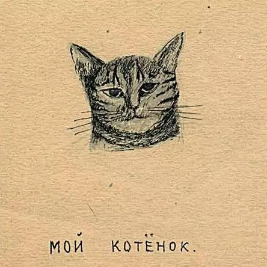

1935年9月20日│我断断续续地学习外语。说到孤独，我忘了讲一个小造物：我的小猫。我们互相依恋对方。它在我肩头安安静静地睡了一觉，刚跳下来。它守规矩、温柔又淘气，它知道我什么时候吃饭，便凑上前来挠我的绑腿。有一次门开着，它出去了，我找了好久，最后它自己回来了。听着可能有些奇怪，但这个灰色的小生物能抚平我的哀伤，即使玩耍的时候它会弄乱我的纸，或者它的爪子会弄脏我的桌子。

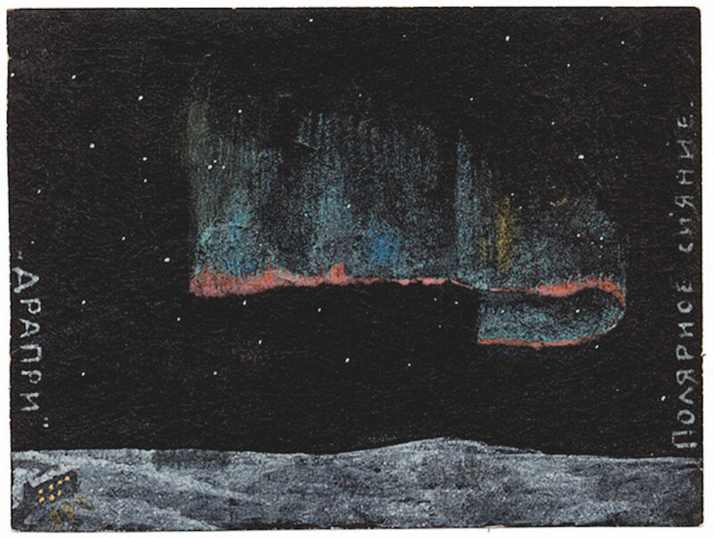

1935年│昨天，我看到了非常美丽的绿色极光。日子平淡无奇，一天接着一天，每天都被绝望地浪费掉，只是离生命尽头更近一步。……

1936年3月22日，我做了几十场关于极光的讲座。我见过许多次极光，通常是拱形的，但有一次我看到一张绿色的线编成的毯子在空中闪烁，轻轻飘动，仿佛有风吹拂。我让别人学到东西，但我自己什么也没学到，因为缺乏相关的书。

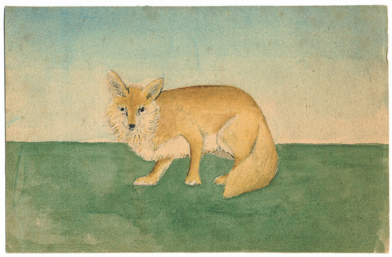

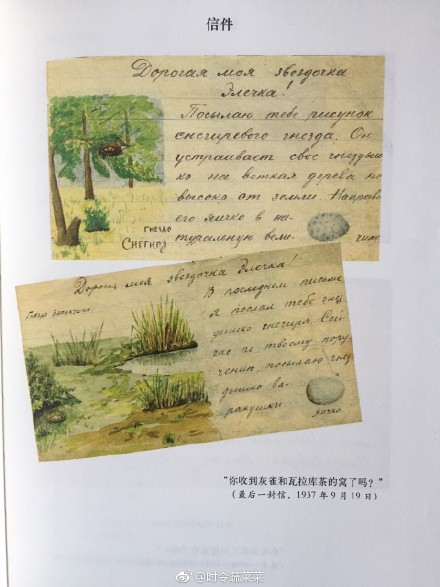

1937年9月19日│我亲爱的女儿，他在9月底写信给埃利奥诺拉，我将有一段时间不能给你寄我的画了，但我希望你可以把你的画寄给我。你收到第二只蓝狐狸了么？。你收到灰雀和瓦拉库茶的窝了吗？瓦拉库茶是一种背呈蓝色、腹部呈呈褐色的鸟，酷似山雀。你现在在做什么呢？你的音乐课上得怎么样？我的小猫一直很乖，我们是好朋友。

这是他的最后一封信。

1937年10月9日，他被指控是资产阶级民族主义者，被判处死刑。1937年10月底，1116名犯人上船前往凯姆。1937年11月3日，十月革命20周年之际，范根格安姆在卡累利阿的桑达莫奇与一大批囚犯被枪决，并埋在万人冢中。很长一段时间，没人知道他们的下落。

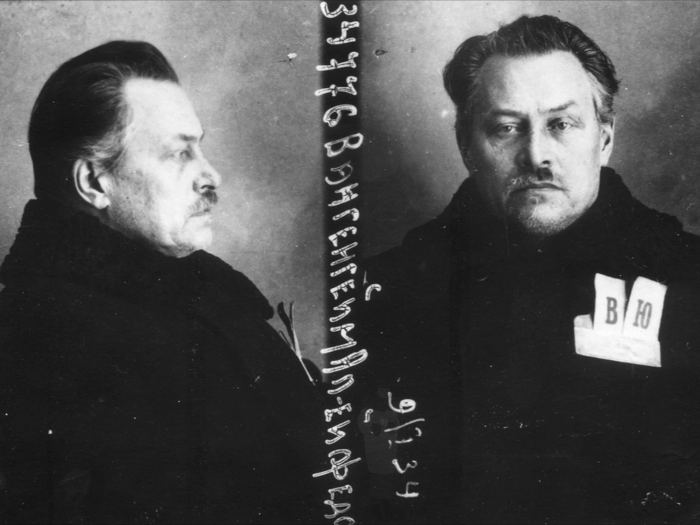

16年后（妻子根本无从得知他的死以及死在什么地方），1956年8月10日，苏共第二十次代表大会之后，苏联政府给了他的家人一张平反决议。

令人欣慰的是范根格安姆的女儿埃利奥诺拉（Eleonora Wangenheim）成长为一名科学家。

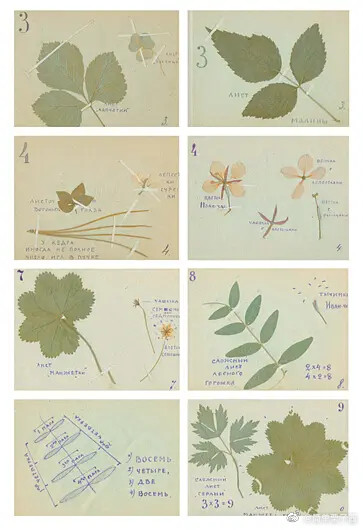

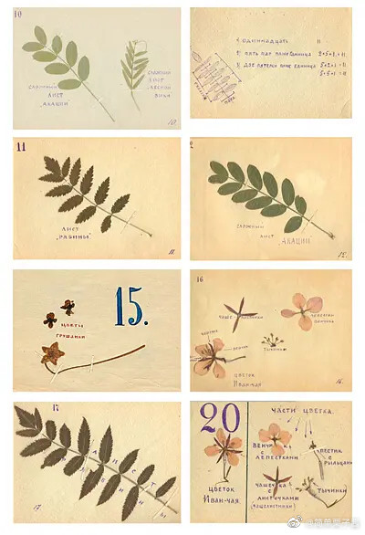

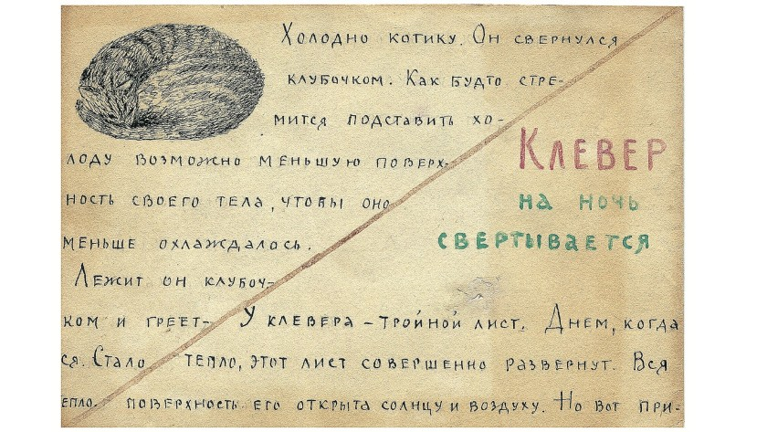

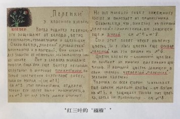

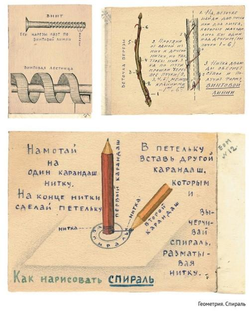

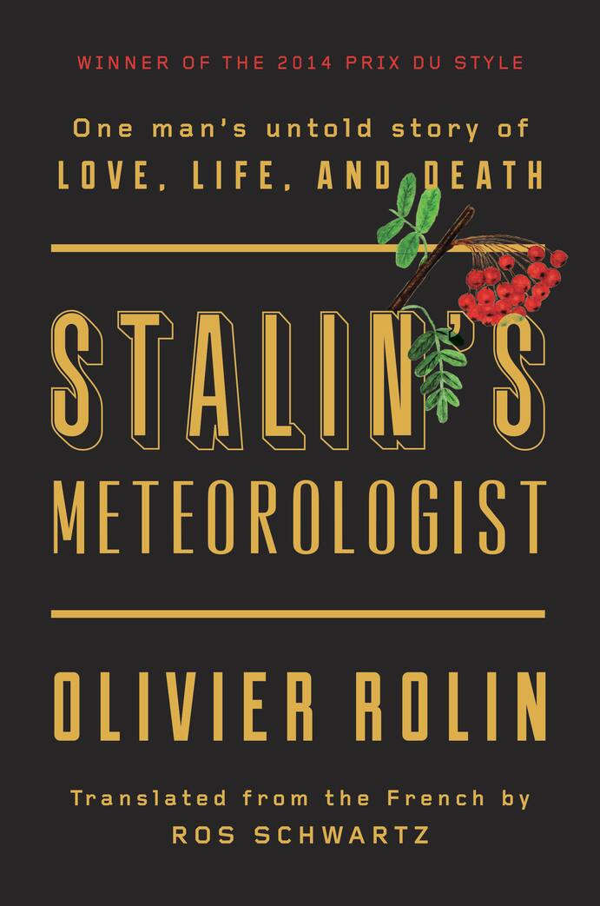

作者简介：奥利维埃·罗兰，法国作家，1968年法国“五月风暴”后期担任过左翼组织的军事领袖。作品有《苏丹港》、《纸老虎》和《猎狮人》。曾获法兰西文化奖、费米娜文学奖。2011年，法兰西学院授予罗兰保罗·莫朗大奖。

在书的最后作者写道：  
「气象学家的故事，以及其他所有在壕沟深处被枪决的无辜者的故事，在某种意义上也是我们的故事的一部分，因为和他们一起被屠杀的是我们（我们的父母，我们之前的一代人）曾经共享的希望，是我们曾经至少在某一刻相信这将变为现实的乌托邦。」
