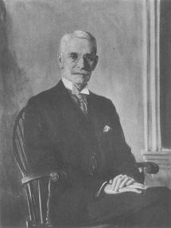

# 新新监狱的玫瑰匠

《新新监狱的玫瑰匠》说的是20世纪初纽约报业传奇人物查尔斯·查平（charles chapin）的生平。

查平任普利策集团旗下《世界晚报》本地新闻主编达20年之久，职业声誉卓著，凌驾于纽约野蛮生长的各种小报大报之上（他曾主持独家报导泰坦尼克号沉没事件等），是公认的工作狂，但为人尖刻、管理严苛，是个令人不寒而栗的暴君。20世纪初美国股市迎来一波空前的繁荣，查平身处上流社会，能听到各种消息，于是他靠内幕消息操作股票维持自己奢华的生活。但是投资频频失手，最后一败涂地，负债累累，备受煎熬，心力憔悴，无法面对，计划一了百了。他担心自己相伴38年的娇弱的妻子无法面对贫困孤独、债务缠身的日子，于是策划先杀掉妻子，然后自戕。但杀了妻子之后，他游走了一天，也没能了断自己。最后，他走入警察局自首。（这个故事告诉我们：内幕消息害死人！）

1918年60岁的查平因谋杀罪被判服刑20年，监禁在臭名昭著的纽约市新新（sing sing）监狱，成为该监狱代号696690的犯人。新新监狱建成于1828年，是最高警戒级别的监狱，专门关押重刑犯，号称“哈德逊河畔的巴士底狱”。

好在从19世纪后半页开始，新新监狱迎来一波波的改革浪潮。查平在狱中一直受到特殊对待，开始他负责了一段时间监狱的图书馆。很快新的年轻的典狱长劳斯上任，他立即让查平负责新新监狱公报，并给了他宽敞舒适的办公室。干回老本行，查平自然如鱼得水。报纸办的风生水起，5000份的发行量供不应求。报纸的火爆让州监狱警长很不舒服，他或撤掉查平或由他审查报纸，查平丝毫没有屈服，他停办了当月的报纸，这时读者不干了，很多读者包括查平上流社会的朋友投诉，有人找到州长那里，州长责问州监狱警长，警长只好亲自去了一趟新新监狱，报纸又开始不受审查的继续出版。

1920年查平在公报上连载的自传被出版社看中并得以付梓，书出版后查平收到大量的读者来信。由此他跟一位名叫库珀的24的加州女士鸿雁传书，开启一段热恋。他们筹划着想象着在查平重获自由之后驾帆船驶向南太平洋，库珀还时不时来探视查平。他俩热恋期间，州监狱警长还是以开支庞大为难新新公报，监狱本身预算有限，本来可以由富有的朋友捐赠继续，但倔强的查平选择了停刊。

1922年6月监狱的神父凯森建议查平做些园艺，从没有侍弄过花草的查平一发不可收拾的爱上了这份工作。他发掘自己巨大的能量和强迫狂的特质，利用一切资源（购买与受捐），将监狱的不毛之地改造为蜚声世界的大型花园。花园包括5万株植物，有各种玫瑰、郁金香、风信子、长寿花、美人蕉、百日菊、翠菊、鸢尾花、牡丹、月季、蜀葵、蓝云杉等等等等，通往死刑室的小路两边也种上了漂亮的植物。他还加盖了一个鸟舍，里面有150只各种鸟。新新监狱又一次备受关注，成了观光圣地。玫瑰繁盛之际，他和库珀女士的恋爱之花却凋零了。库珀女士爱上了航海，跟另一位女士乘船出海，真的去了南太平洋，并且回来还写了一本畅销书。

查平呢，精力充沛，他又迅速的陷入一段新的恋情，对方是联邦储备银行31岁的内刊编辑康丝坦斯·纳尔逊。纳尔逊女士也多次来探望他。1925年后，二人感情逐渐冷淡。

1930年12月，被监禁12年的查平因胃病死于新新监狱。

