# 监狱书系 | 《像自由一样美丽》

​从捷克首都布拉格往西北方向走六十公里，有一个小镇叫特莱津。1780年，国王约瑟夫二世为了防御北方的敌人，保护布拉格，在波西米亚山建立了一个军事要塞。国王以他母亲的名字命名了这个要塞，叫做特莱津（Terezin）。

1938年9月30日,德国、英国、法国和意大利，一起签署了“慕尼黑协定”，把捷克斯洛伐克的西部送给了希特勒。1939年3月15日，纳粹占领捷克斯洛伐克全境。这个国家有九万多名犹太人，他们的命运随之急转直下。根据希特勒的“雅利安人纯化运动”，1939年6月，纳粹在占领区宣布了一系列反犹太人的法律。从1942年2月开始，纳粹开始勒令犹太人离开家，他们将陆续被送往集中营。

1941年10月10日，特莱津被纳粹看中，当做囚禁犹太人的集中营。整个特莱津独特的军事城堡的结构，非常容易封锁和看守。而小镇上宽宽大大、宿舍一样的楼房（以前国王的士兵们居住的营房），可以成批地挤入囚徒，很容易管理。

  
特莱津集中营入口，ARBEIT MACHT FREI意为工作使人自由

这个原来容纳六千人的小镇，在这个集中营存在的两年多时间里，有近十万的囚徒被临时安排在这里居住，然后再被送往死亡营。关在这里的，除了捷克斯洛伐克的犹太人，还有来自德国、丹麦、匈牙利、奥地利、荷兰等其他欧洲国家的犹太人。在他们中间，有过一万五千名犹太儿童。

  
特莱津（Terezin） Ruth Schachterova

如此残酷的境遇中，有一些成年囚徒虽然对未来十分悲观，可是，看到孩子，他们暂时忘记了飘荡在头上的死亡阴影。开始想应该如何帮助孩子们度过非常岁月。

特莱津集中营，比一般的纳粹集中营还更特殊，它是纳粹的“模范集中营”。被关在这里的有许多一流的艺术家、音乐家、学者和教授。在竭力照顾孩子们生活的同时，他们几乎本能地开始考虑孩子们的教育。于是，他们利用一切可能的机会，甚至违反禁令，悄悄地给孩子上课，教他们如何勇敢地面对现在和不可知的未来。

其中，就包括音乐课和绘画课。

囚禁在特莱津的音乐家们为孩子们排练了儿童歌剧。其中最著名的一个歌剧，叫做《布伦迪巴》。纳粹为了应付国际舆论和国际红十字会的检查，制造了一些假象。比如1944年在特莱津拍摄了一个虚假的纪录片，把特莱津描绘成一个送给犹太人的‘礼物’。犹太人委员会和艺术家们，利用这个机会，为孩子们争取到了《布伦迪巴》上演的许可，且演了55场。在这55场演出期间，向着东方死亡营的遣送并没有停止。一些孩子演了一半，被送走了。新的孩子顶上来演。

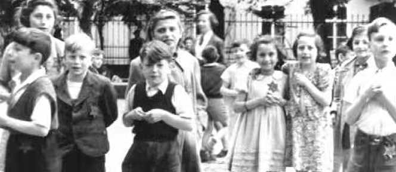  
国际红十字会到访特莱津所拍的照片

特莱津的画家们也教孩子们画画，其中最重要的一位是弗利德·迪克-布朗德斯（Friedl Dicker-Brandeis）女士，弗利德16岁师从摄影大师Johannes Beckmann学习摄影，17岁成为Franz Cizek的学生，学习艺术教育，21岁，弗利德进入赫赫有名的包豪斯。离开包豪斯后，弗利德和合作伙伴一起建立设计工作室，在包豪斯风格中糅入了维也纳风情，她的设计从建筑、家具，到手工业产品都有，事业十分兴旺。1931年，33岁的弗利德受维也纳市政府的邀请，向幼儿教师教授艺术课程。

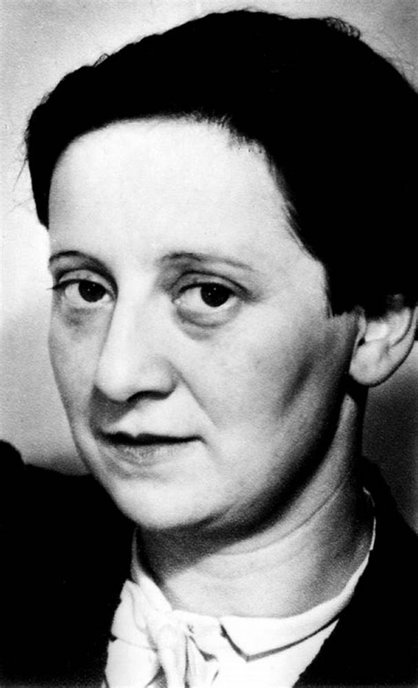  
弗利德

1934年1月，奥地利的右翼在维也纳引发暴乱，弗利德当年设计的作品被大量捣毁，她设计的建筑也被拆除。德国入侵捷克斯洛伐克后，本可以离开欧洲的弗里利德，为了自己的丈夫，选择留在捷克。1942年12月17日，弗利德和丈夫被遣送到特莱津，她的编号是548。

在特莱津，画画是不被允许的，被发现真会死人。纸张也是稀缺的，画画的其他工具也不允许拥有的。但是画家们还是想尽办法作画，弗利德与其他集中营画家的区别是，其他人都在用画笔记录集中营地狱般的生活，她依然画着花卉、人物和风景。

弗利德认为，在这样的时候，更重要的，是引导孩子保留一双正常的眼睛，仍能看到和理解什么是美；引导他们保留爱的能力，把这样的种子播入孩子们的心田，期待它慢慢地萌芽和生长。

第一堂课，弗利德和孩子们一起大哭了一场。然后，她带领孩子们去洗手，弗利德严肃地说，你们一定要把手洗干净，否则不能画画。接着，她拿来纸和颜料，很快把孩子的注意力吸引到她的课程中。

弗利德的教育理念是在引导孩子们的心灵走出集中营，让他们闭上眼睛，想象过去和平宁静的生活，想象看到过的美丽风景，让自己的幻想飞翔。她带着他们来到房子阁楼的窗口，让他们体验蓝天和观察远处的山脉，画下大自然的呼吸。

她说：“你要用光明来定义黑暗,用黑暗来定义光明。”

  
瓶花（Flower in Vase）Kitty Marke ta Passerova

在老师们的帮助下，孩子们在集中营办了一份手工杂志，取名《看见》（vedem，林达译作先锋），他们有自己的编辑、记者和专栏作家，刊载孩子们自己的诗歌、散文还有人物专栏，专栏名字叫“我们中间的一个”，他们自己设计封面，自己画插图。那些画画的小画家们都是这个杂志的插画师。这是一份周刊，封面上还有“定价”。

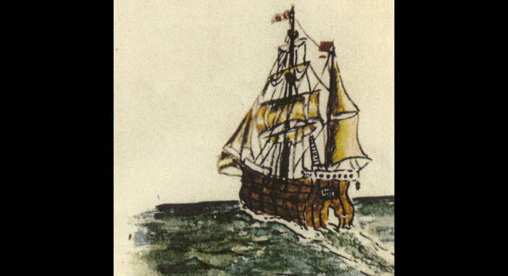

从1942年12月18日到1944年7月30日，《看见》出版了83期共800页。1944年后，杂志的编辑、记者们被纷纷送往奥斯威辛，但这些珍贵的杂志被保存了下来。通过这些杂志，我们可以看到孩子们的勇气和恐惧，苦难和梦想。上世纪90年代，这些杂志终于得以出版，书名就叫《我们也是一样的平常孩子》。在书的最后，是特莱津L417宿舍一号房间的孩子们的名单，一共92个孩子，1945年战争结束的时候，他们绝大多数都死在了奥斯威辛集中营的毒气室里，只有15个孩子侥幸活下来。在特莱津，这个房间的孩子是存活比例最高的，原因是他们年龄比较大，已经是劳动力了。

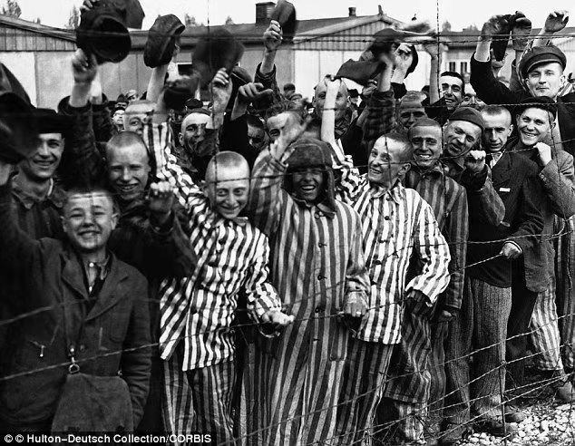

1944年9月，弗利德的丈夫巴维尔和其他共五千名男囚徒，接到了被遣送的通知。弗利德扔下一切，去到决定名单的委员会，要求与丈夫同行。被拒绝后，她再次坚决地要求把自己补进下一批遣送名单中。被获准后，弗利德和L410宿舍的管理员维利·格罗格（Willygroag）一起，包好所有孩子们的画作，小心的把它们藏在阁楼里。

一万五千名曾经生活在特莱津的犹太孩子，只有一百多名存活下来。战争结束后，藏着画作的铁皮箱，从土里被重新掘出。藏在板壁中、藏在阁楼里的画，也都被陆续找了出来。一共有将近四千五百张画作。纳粹曾经夺去了孩子们的名字，给每个人一个编号。弗利德在教画画的时候，要求孩子们在画作上签上他们的真实姓名。这四千五百张画作，绝大多数，都有孩子们自己的签名。

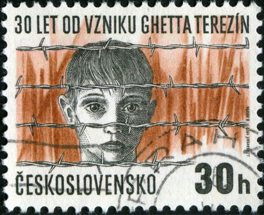

多年以后，面对这些画作，捷克总统哈维尔说：怀着一颗沉重的心，我不止一次地面对这些由特莱津孩子们提供的、关于他们的经历、渴望和梦想的证明。他们把我带回那个时代，我们的国家被纳粹占领、世界在战争之中。我作为一个小男孩，遇到了恐惧、羞耻和挑战。这些画也在唤醒我，那些我或许是无能为力的事情，却使我确实感到羞愧：事实是，我的犹太人同学们被赶出了学校，他们被迫在外套上佩戴区别于他人的六角星，他们被遣送集中营，最后，我活了下来，而那些和我一样的孩子们，却没有能够幸存。

这些将近四千五百张由弗利德的学生在特莱津创作的绘画作品，现在被布拉格犹太人博物馆收藏和展出。

本书的一大部分，选刊了四十多张孩子们的画作，每幅画后有小画家的简介：某某某，生于XX年X月X日，被遣送到特莱津集中营时X岁，XX年被遣送至奥斯威辛，被杀死。后面还配有一些小诗人的诗作。

  
特莱津的旧营房（Terezin Barracks）Sonja Waldsteinova

  
院子（The Courtyard） Pavel Sonnenschein

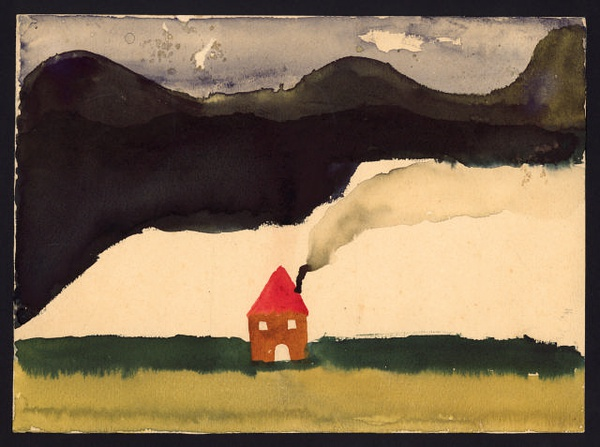  
特莱津的房子（House）Hana Kohnova

  
日落 Helga Pollakova

  
特莱津 Margit Gerstmannova

  
有房子的风景 Bedrich Hoffmann

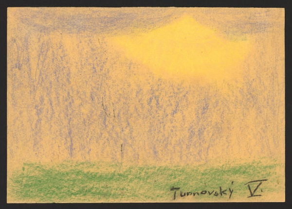  
风景 Hana Turnavska

  
阴影 Jiri Metzl

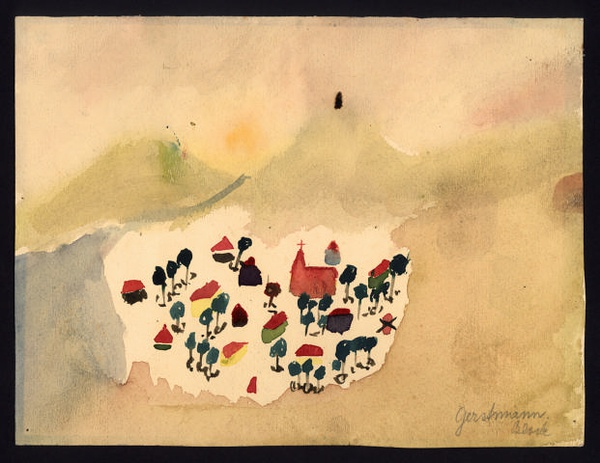  
风景 Margit Gertmanova

  
台阶上的花盆 Anna Grunwaldova

  

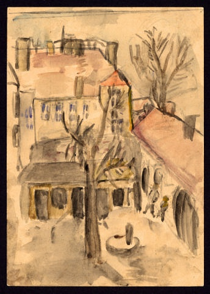  
特莱津小院 未署名

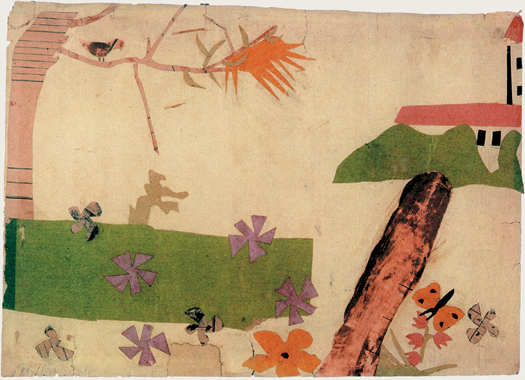  
鸟和蝴蝶 未署名

  
黑屋子里的星光 Sona Spitzova

  
夜色中的房子 Dita Polachova

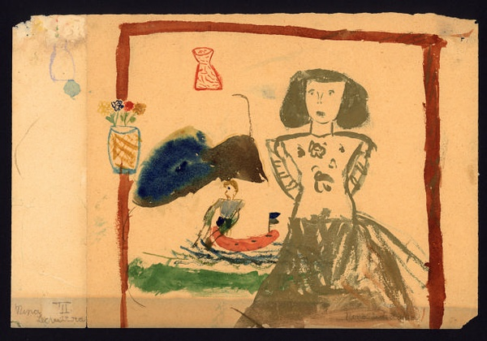  
望向窗外的女孩 Nina Ledererova

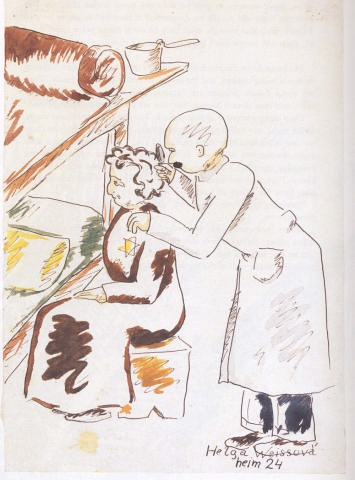  
《检查虱子》（Checking for lice） Helga Weissova

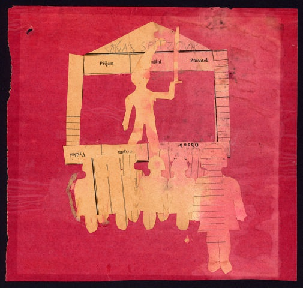  
拿棍子的警卫 Sona Spitzova

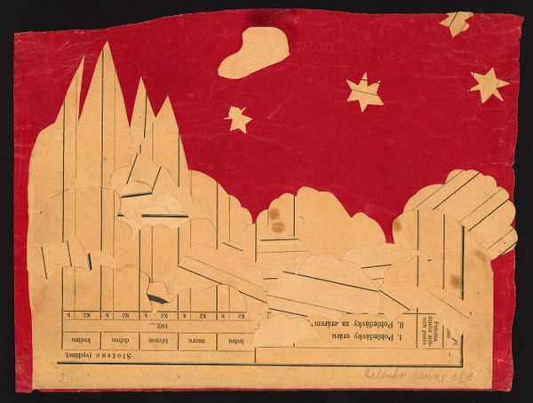  
夜空 Helena Mandlova

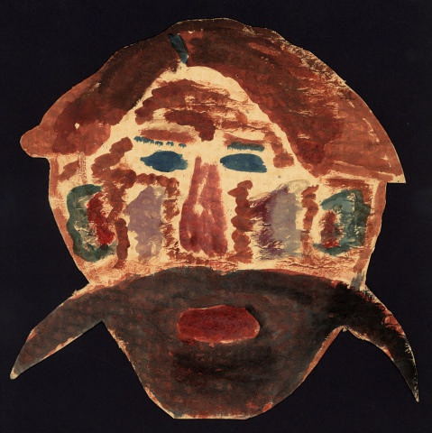  
有着长胡子的人 Hanus Klauber

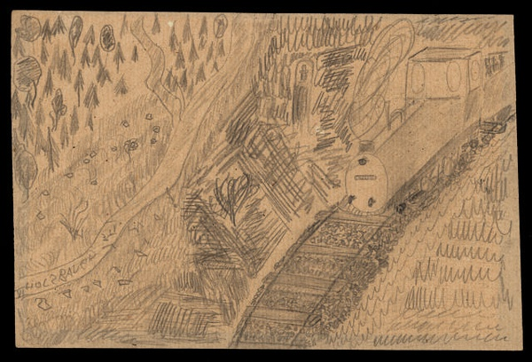  
遣送的火车(deportation train)  Peter Holzbauer

  
火 Kurt Koralek

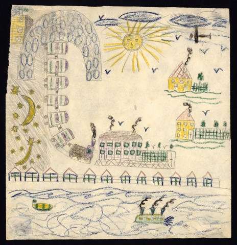  
河边的风景 Edita Pollakova

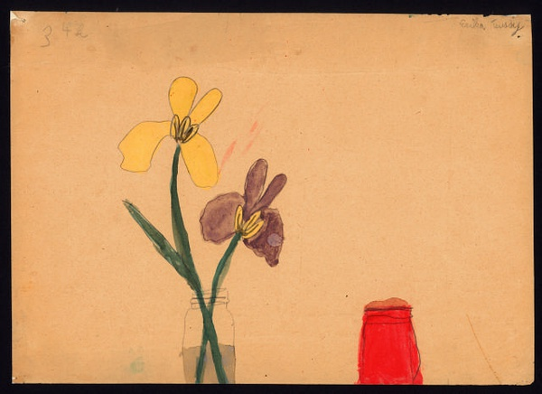  
瓶中花 Erika Taussigova

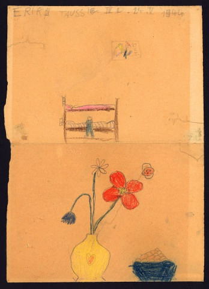  
有架子床的房间 Erika Taussigova

  
花园 Ruth C Echova

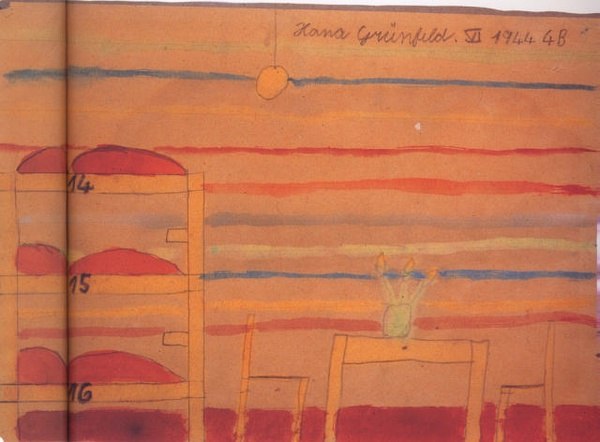  
特莱津的住处 Hana Grunfeldova

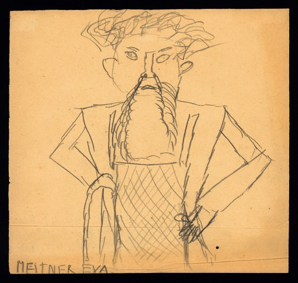  
长胡子的男人 Eva Meitnerova

  
有圣诞树的桌子 Eva Wollsteinerova

  
有树的风景 Alice Sittigova

  
风景 Lenka Lindtova

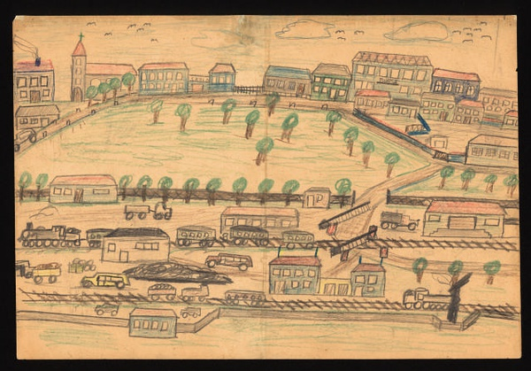  
城市 Josef Kraus

  
奉献日（Hanukkah，pastel on paper）Irena Karpelesova

  
人与船 Elly Hellerova

  
公园 Hana Turnovska

  
风景 Bedrich Hoffmann

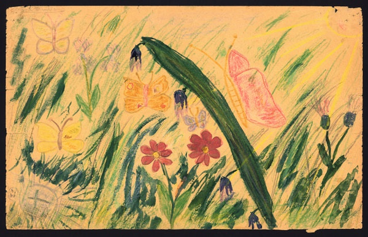  
花儿与蝴蝶 Liliana Franklova

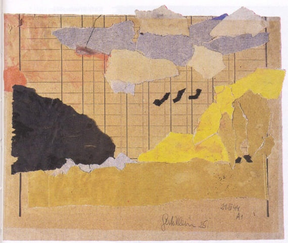  
风景 Gerti Kleinova

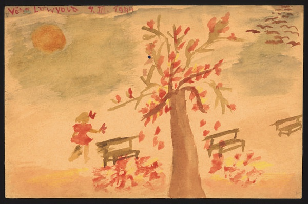  
我在公园里 Vera Lowyova

  
纳粹威胁犹太人（Nazi Threatening Jew） Jiri Beutler

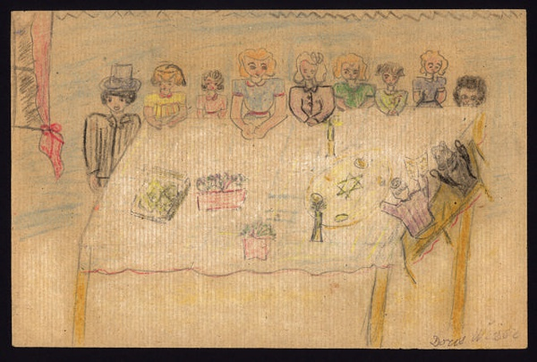  
逾越节聚会 Doris Weiserova

  
帆船 Lilly Bobasova

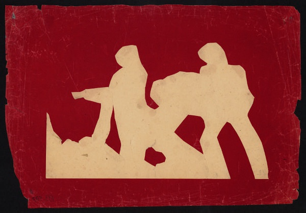  

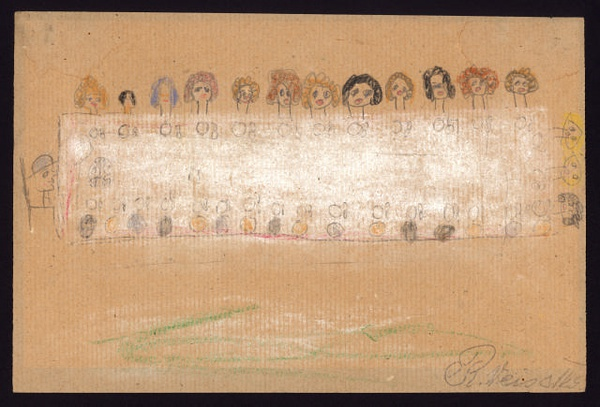  
聚会 Ruth Weissova

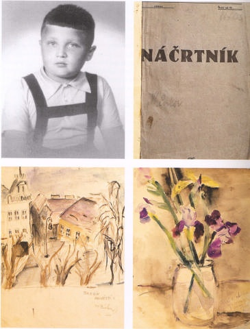  
Milan Eisler和他的速写本

  

林达，是一对美籍华人作家夫妇合用的笔名。夫为丁鸿富，妻为李晓琳。他们都于1952年出生在上海，1978年进入大学。曾在黑龙江省插队，1991年移居美国。1997年以来，林达先后出版了“近距离看美国”系列《历史深处的忧虑》、《总统是靠不住的》、《我也有一个梦想》以及《从边缘看世界》等书，《像自由一样美丽》是林达在翻译了《汉娜的手提箱》之后延续的一部特莱津集中营题材的作品。
