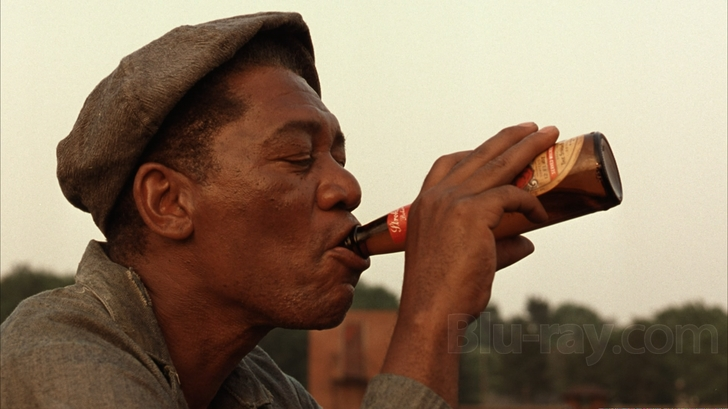
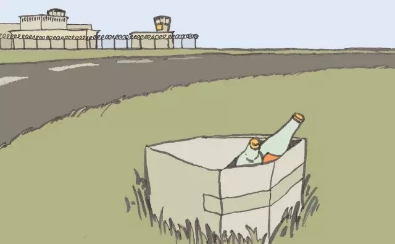
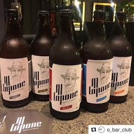
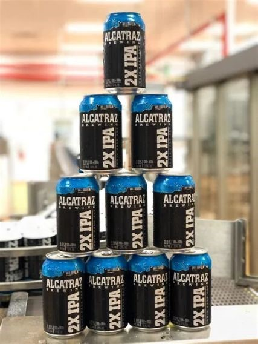
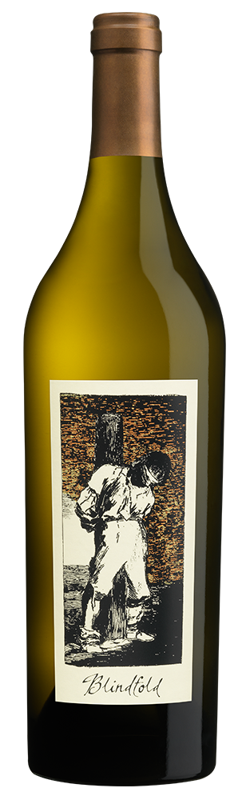

# 监狱私酿，走一个？

​电影《肖申克的救赎》中，安迪给狱友争取来一箱冰啤酒，瑞德感慨的说：“我们坐着喝酒，阳光洒过肩头，觉得自己是个自由人。”

这小酒，喝的可是自由。

大概全世界的监狱都不允许犯人喝酒。倒是也有些例外，18世纪法国的贵族监狱会给被监禁者提供酒水。伏尔泰在巴士底狱住了11个月，他除了可以带着自己的仆人随侍左右，还能免费得到国王提供的优质葡萄酒。狄德罗在同是贵族监狱的文桑监狱坐牢时，每天也可以得到一瓶酒。希特勒在啤酒馆暴动失败后被关在德国兰茨贝格监狱，在那里他两个月喝了124听啤酒。

  
（希特勒在兰茨贝格监狱）

虽然管理不规范的监狱犯人也能想办法带酒进去。但大部分情况下，还是只能靠犯人们战天斗地各显神通。
世界各地监狱私酿的新闻屡见不鲜不胜枚举，比如2015年澳大利亚新南威尔士的监狱就一共查出了8604升烈酒。

英语中专门有一个词表示监狱私酿，叫“Pruno”。 显然，它已是是监狱文化以及酒文化的一部分，Pruno也成了自酿酒的一支，这个门类下也成长起了不少品牌，2004年美国自酿协会的酿酒大赛中就加了Pruno专场。

说回正宗监狱私酿，原料自然不拘一格，土豆、苹果、橙子、糖、番茄酱、牛奶等等，估计能到手的食物都是宝贝，酵母则多用面包屑，调和好装在塑料袋中让其发酵。装好的袋子要藏起来，因例行检查囚室多不触及马桶的水箱，故袋子常常藏在马桶的水箱里，所以，不少地方也将这种酒称为马桶酒（Toilet Wine）。

具体的酿造方法我就不扒了，文末附一首诗：《监狱私酿配方》，作者是圣昆丁监狱的死刑犯Jarvis Jay，他把酿酒过程捋了一遍。

怎么说呢，酿的好，可能就是自由的味道。失手的话，你想想，在监狱里喝自己亲手酿下的苦酒，什么滋味？
意大利的托斯卡纳地理和自然优势全球闻名，成片的葡萄藤在托斯卡纳阳光下等着被加工成葡萄酒。同一片天空下，托斯卡纳还有个监狱小岛：戈尔格纳。那里不仅有成片的葡萄藤，还有几十名重刑犯。上世纪八九十年代，狱方指挥犯人开辟了一片1公顷大小的葡萄园，但由于疏于打理，这片园子逐渐变成了杂草丛生的荒地。2008年，一名有栽培经验的囚犯设法让这片园子重见天日，拯救了那些毫无生机的葡萄藤。2010年，另一名罪犯用这些果实酿造了葡萄酒。虽然这些酒的口感实在不敢恭维，但监狱总管却萌生了一个念头：让葡萄酒专家来帮忙指导犯人酿造葡萄酒。2012年，监狱当局与意大利著名葡萄酒家族花思蝶（marchesidi frescobaldi）接洽，请花思蝶家族亲自指导犯人，从种植、采摘到酿造成品。如今，犯人们把这片葡萄园打理得像模你像样。健康的葡萄藤扎根在富含铁元素的火山岩土里，享受着海上微风的吹拂，长势颇为喜人。耕耘与收获的同时，犯人还可以获得同等的薪水报酬。弗朗西斯教皇、意大利总统都品尝过这所监狱酿出来的酒，“浓烈而有惊人的品质”。

德国塔尔海姆（talheim）市的施腾塔斯监狱（staatsdomane hohrainhof）也让重刑犯酿造葡萄酒，一位品酒师品尝之后赞不绝口，知悉该酒售价很低时，她忍不住说：“这简直是犯罪。”

国内也曾曝出过这种喜闻乐见的新闻：阆中看守所为弥补资金不足，在看守所办起酿酒作坊。

还有一些并没有犯人参与酿造，走“监狱”路线的精酿啤酒。

ALCAPONE 艾尔·卡彭，“疤面煞星”，美国禁酒令时期最大的私酒制售商人，芝加哥黑手党党魁，罪案累累，曾被关押在恶魔岛等监狱。这家啤酒公司的名字叫私酿者（Bootlagger），延续了禁酒令时期走私酒贩的说法。

已经开辟为观光点的恶魔岛（阿尔卡特兹）监狱的礼品店就有卡尔卡特兹啤酒出售。

日本北海道网走监狱啤酒

Jailhouse brewing 2009年成立于美国佐治亚州的一家精酿啤酒制造厂，厂房原来就是Hampton监狱。

美国俄克拉荷马州PrairieArtisan Ales公司的生产一款监狱牛仔啤酒，当地的监狱牛仔比赛曾经相当火爆。

  
越狱   加拿大精酿啤酒

  
断头台     比利时老牌酒厂粉象的一款产品  

  
囚犯   美国葡萄酒

  
19宗罪   澳大利亚酒

  
Crude Oil 也是监狱私酿的一种

《肖申克的救赎》中犯人们在屋顶喝啤酒的场景。

下附美国加州圣昆汀监狱死刑犯Jarvis Jay 写于1991年的诗：监狱酿酒配方。本诗获得美国笔会91-92年诗歌类三等奖。

监狱酿酒配方  
Recipe for Prison Pruno  

10个橙子去皮，  
Take ten peeled oranges,
加尔维斯•马斯特斯，本庭判决如下  
Jarvis Masters, it is the judgment and sentence of this court,
8盎司水果鸡尾酒一听  
one 8 oz. bowl of fruit cocktail,
被控信息属实，  
that the charged information was true,  
将水果挤入小塑料袋里，  
squeeze the fruit into a small plastic bag,  
陪审团此前已经，在上述日期，  
and the jury having previously, on said date,  
果汁混着果渣一起  
and put the juice along with the mash inside,
认定应处死刑，  
found that the penalty shall be death,
加16盎司水，再把袋子封紧。  
add 16 oz. of water and seal the bag tightly.  
本庭业于1991年8月20，  
and this Court having, on August 20, 1991,  
袋子放进水箱，  
Place the bag into your sink,  
驳回你的上诉请求，  
denied your motion for a new trial,  
用热自来水加温15分钟  
and heat it with hot running water for 15 minutes.  
本庭判你死刑  
it is the order of this Court that you suffer death,  
袋子裹上毛巾以保温发酵用  
wrap towels around the bag to keep it warm for fermentation.  
上述判决将在圣昆丁监内执行。  
said penalty to be inflicted within the walls of San Quentin,  
把包裹藏在你的牢房里静置48小时，  
Stash the bag in your cell undisturbed for 48 hours.  
在那里你将被处以死刑。  
at which place you shall be put to death,  
当时间过去，  
When the time has elapsed,  
依律行事  
in the manner prescribed by law,  
加40到60块白糖，  
add 40 to 60 cubes of white sugar,
日期待执行令随后再定  
the date later to be fixed by the Court in warrant of execution.  
6茶匙番茄酱  
six teaspoons of ketchup,  
你将被移交圣昆丁的狱长监禁  
You are remanded to the custody of the warden of San Quentin,  
再次加热30分钟，  
then heat again for 30 minutes,  
羁押直至终极  
to be held by him pending final  
再次封好袋子，  
secure the bag as done before,  
上诉裁定。  
determination of your appeal.  
贮藏起来再静置72小时。  
then stash the bag undisturbed again for 72 hours.  
决议如此。  
It is so ordered.  
每日重新加热15分钟，  
Reheat daily for 15 minutes.  
以资证明，  
In witness whereof,  
72小时之后，  
After 72 hours,  
我将手放在这里行使本州高院法官的权力，  
I have hereon set my hand as Judge of this Superior Court,  
用勺子撇去渣滓，  
with a spoon, skim off the mash,  
并已加盖本庭公印。  
and I have caused the seal of this Court to be affixed thereto.  
剩下的部分灌进两只18盎司的杯子  
pour the remaining portion into two 18 oz. cups.  
愿上帝宽恕你的魂灵。  
May God have mercy on your soul.  
S.Y.Z 译

  
那么问题来了，啥前儿能喝上一瓶呢？
