# 将20年牢狱生涯雕在鸵鸟蛋上的艺术家吉尔·贝托

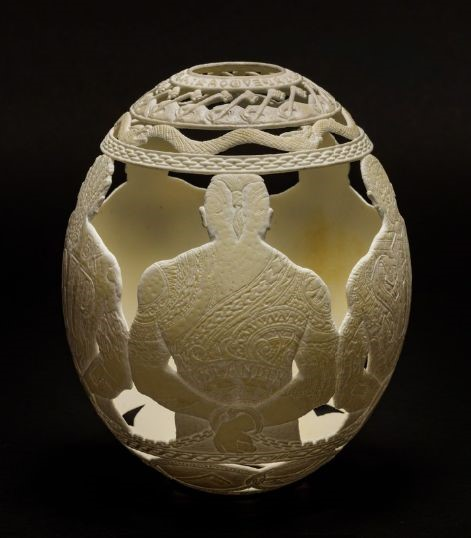

​吉尔·贝托（Gil Batle）是出生和成长在美国的菲律宾人。因诈骗和造假（伪造旅行支票、汇票、假身份证和信用卡等）被判入狱。二十多年的牢狱生涯里，他住过加利福尼亚的五所监狱，包括声名赫赫的圣昆汀。二十多年，他见识了监狱太多的传奇与沧桑，暴力和凄凉。

  
吉尔·贝托自制的纹身枪

靠着自己的艺术细胞，吉尔·贝托用纹身在监狱获得一席之地。出狱之后，他定居在菲律宾的一个小岛上，在那里，他用艺术讲述自己二十年的铁窗生涯。

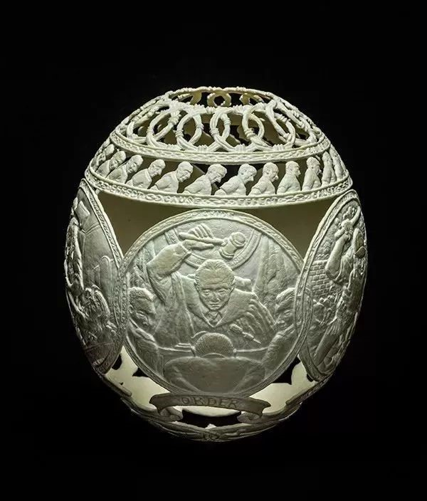  
法槌落地，罪无可逭

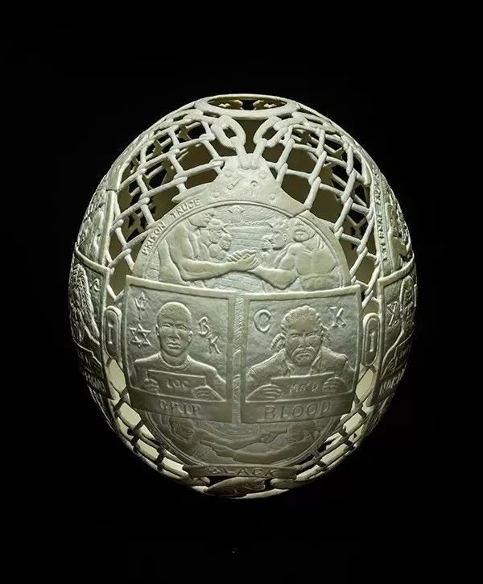  
入监照

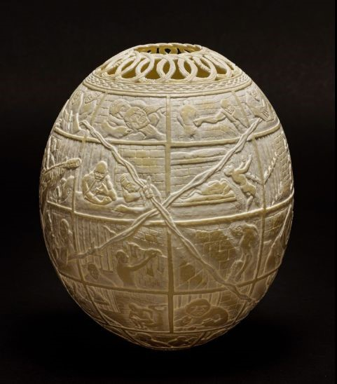  
日常

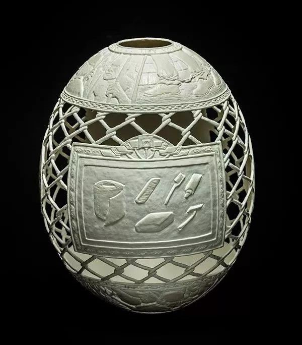  
生活用品

读信：“我想你，爸爸。”

  
凶狠的狱警

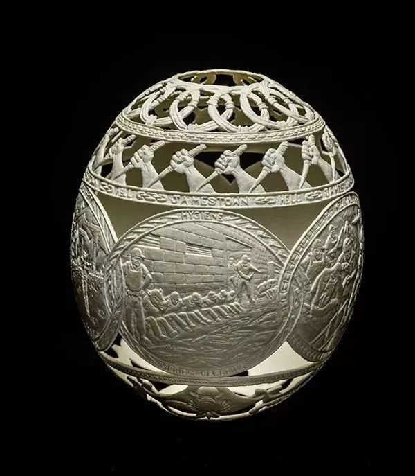  
服从

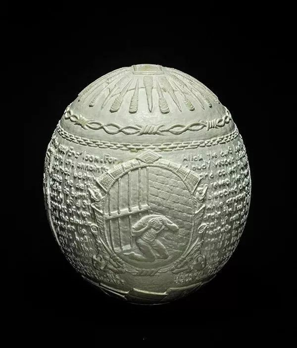

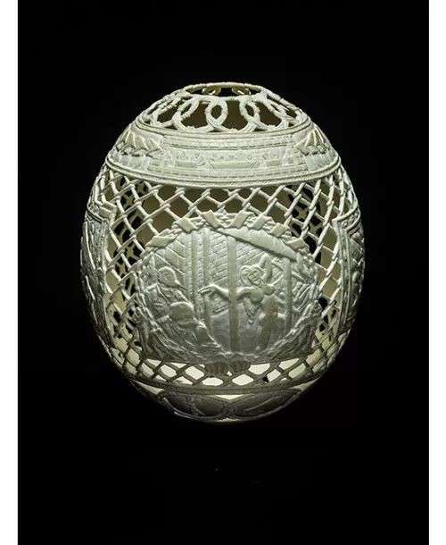

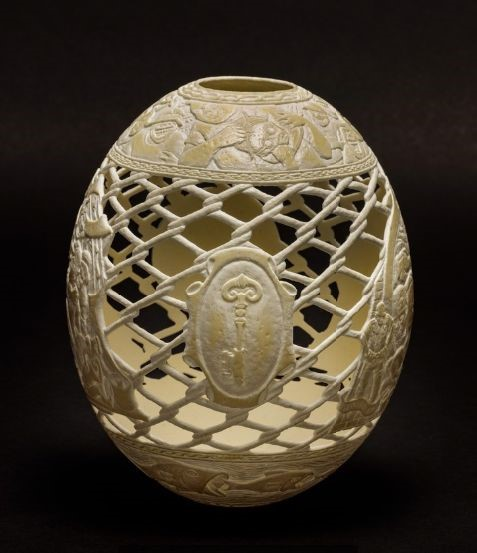

  
安检

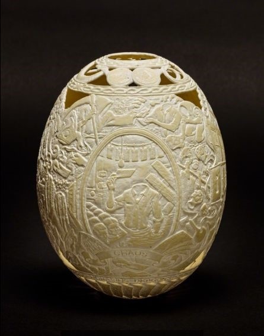

  
读信

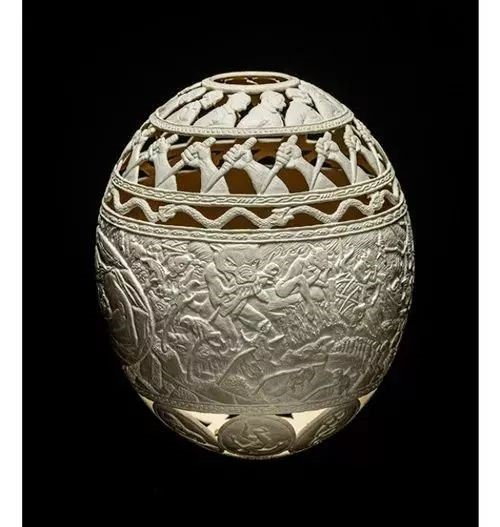  
群魔乱舞

  
凶狠的狱警

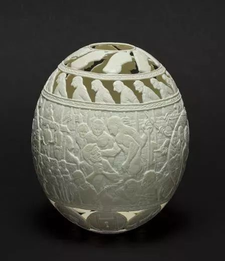  
无处不在的暴力

2015年11月5日，他的这组作品在纽约Ricco Naresca画廊进行了展览。展览的名字叫：Hatched In Prison，意思这些从鸵鸟蛋破壳而出的艺术品孵化自监狱。

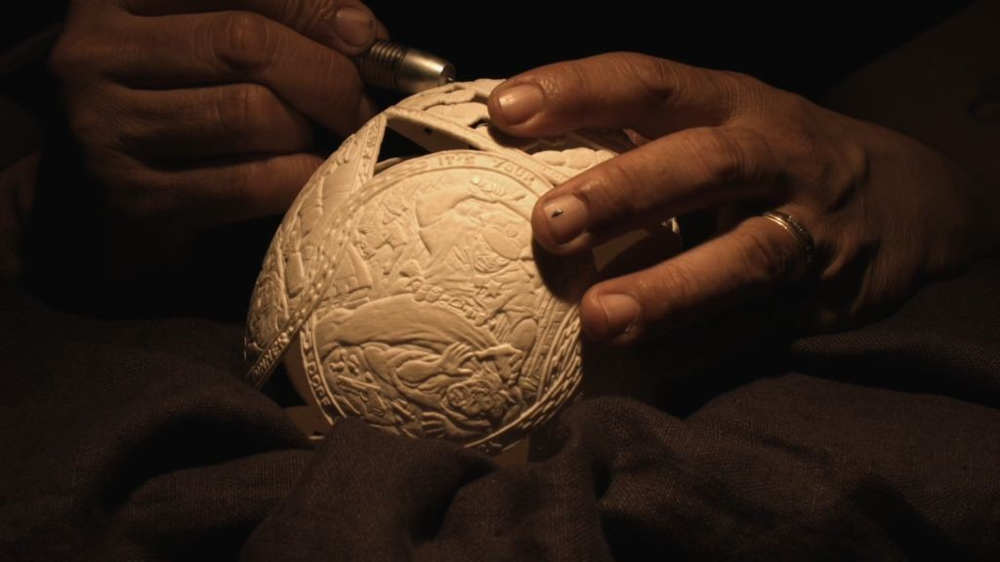

蛋雕之外，吉尔·贝托还以监狱生活为题材画了一些铅笔画。

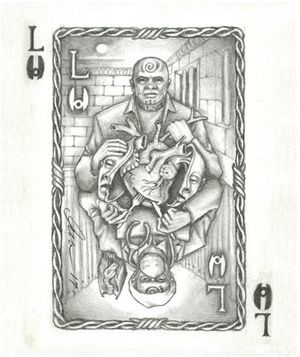

