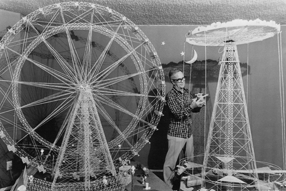
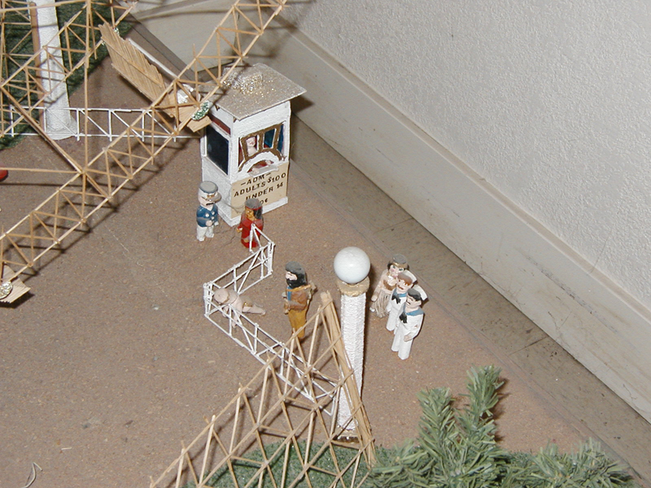
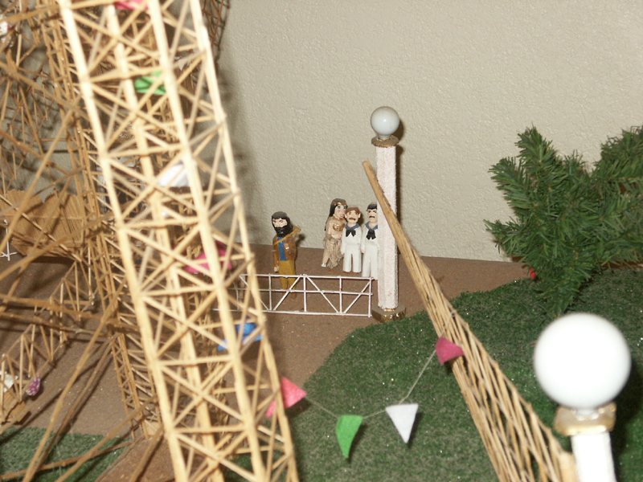
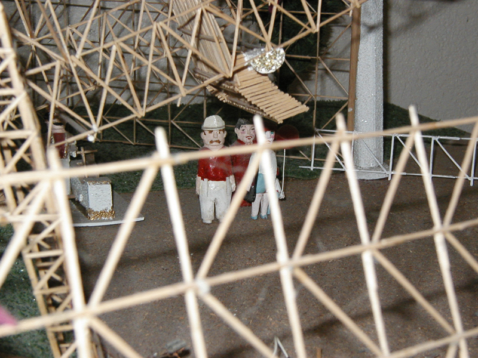
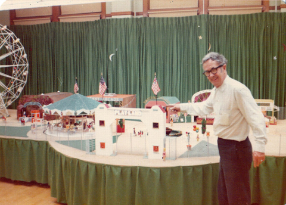
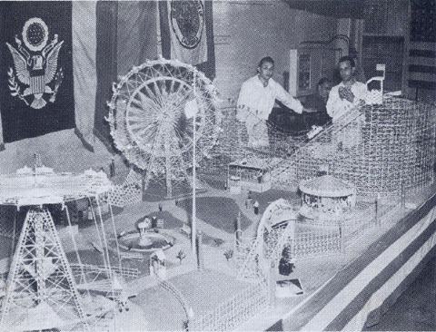
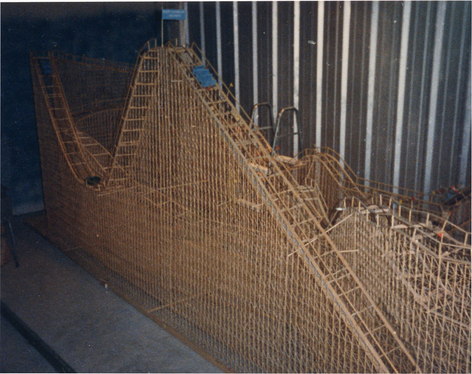
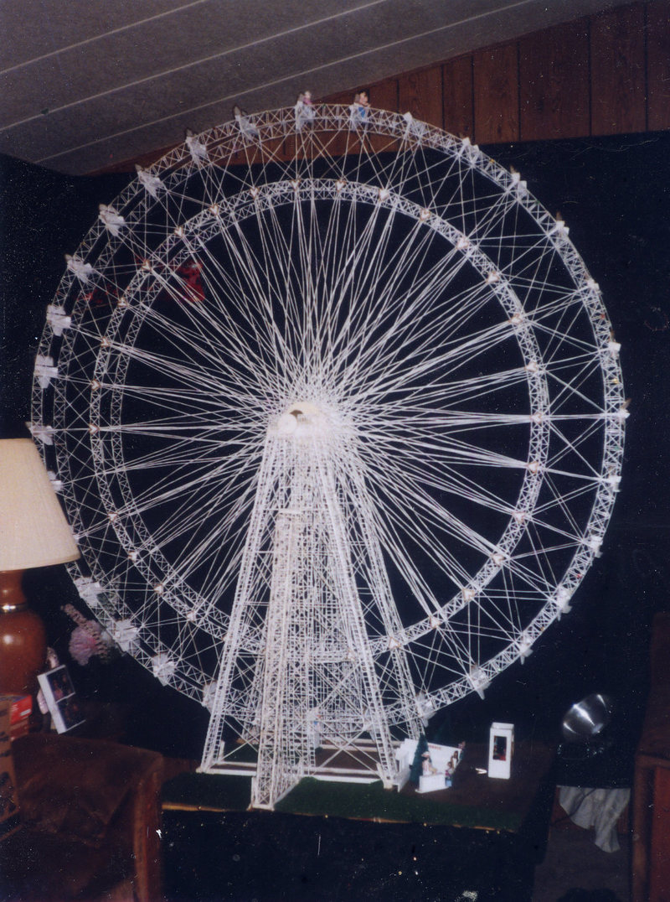
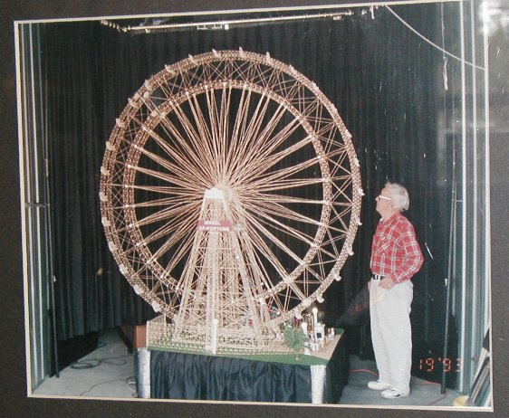

# 布莱恩·伯克和他的牙签游乐园

​
加州福尔松监狱博物馆有一座1.8米高，名为幸运之轮的摩天轮。这座神奇的摩天轮全部由牙签胶合而成，上面32个位置，坐了两个小人。而且还装了电动马达，各个部位运转如仪，每个细节都处理的特别精致。

牙签摩天轮的制作者叫布莱恩·伯克（Billy Burke），是福尔松监狱的一名囚犯。

布莱恩·伯克，19岁（1928年）入狱。起先他琢磨怎么越狱，挖墙、钻地道......他甚至搞了个热气球准备飞越。最后......他还真出去了。伯克做了个假人放在床上应付了查房，他自己藏在监狱太平间里，夜深人静后，他爬过了草地和守望塔，跳进监狱旁的河沟里溜之大吉。

但是重获自由的他没有珍惜自由，重操旧业，两个月后，作死的他回到了监狱。因为越狱他被关6个月禁闭。

  
（记者采访布莱恩·伯克越狱经历之后写的一本书《逃离福尔松监狱》）

关在禁闭室里的伯克并没有放弃越狱，但是在狱方的“亲切照看”下他再也没有成功过，几次禁闭后，伯克决定安住地狱，立地成佛。

安下心之后，闲不住的伯克开始了创作。“不做无聊之事，何遣有涯之生。”他根据儿时的记忆，用牙签和小刀开始了浩瀚的牙签工程。

由于伯克对于牙签的需求量太大，加上越狱的前科，监狱甚至一度把牙签列为违禁品。不过，监狱长很看好他，这一切的禁令对他毫无影响。好心的监狱长时不时的带一堆牙签给伯克，还让警卫离他远点，给他一个安静的空间创作。伯克还被特批可以随身带把小刀。五年之后，大功告成。伯克提刀而立，为之四顾，为之踌躇满志。摩天轮上还有一位心爱的女士陪他一起转转转。

1959年，伯克刑满释放。出狱后他意犹未尽，继续建造牙签王国，规模甚至大过监狱里那一个。

这些牙签艺术品也经常展出，但伯克不收门票。万不得已的时候卖出过两个作品（美国Musee Mecanique博物馆收藏了一件），心疼的他赶紧做出新的补上。

2001年91岁的布莱恩·伯克走完了他的一生，但他的牙签们还在继续吸引着大众。

  
回到第二故乡

84岁的伯克与他的牙签摩天轮。
