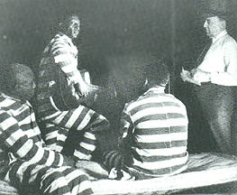
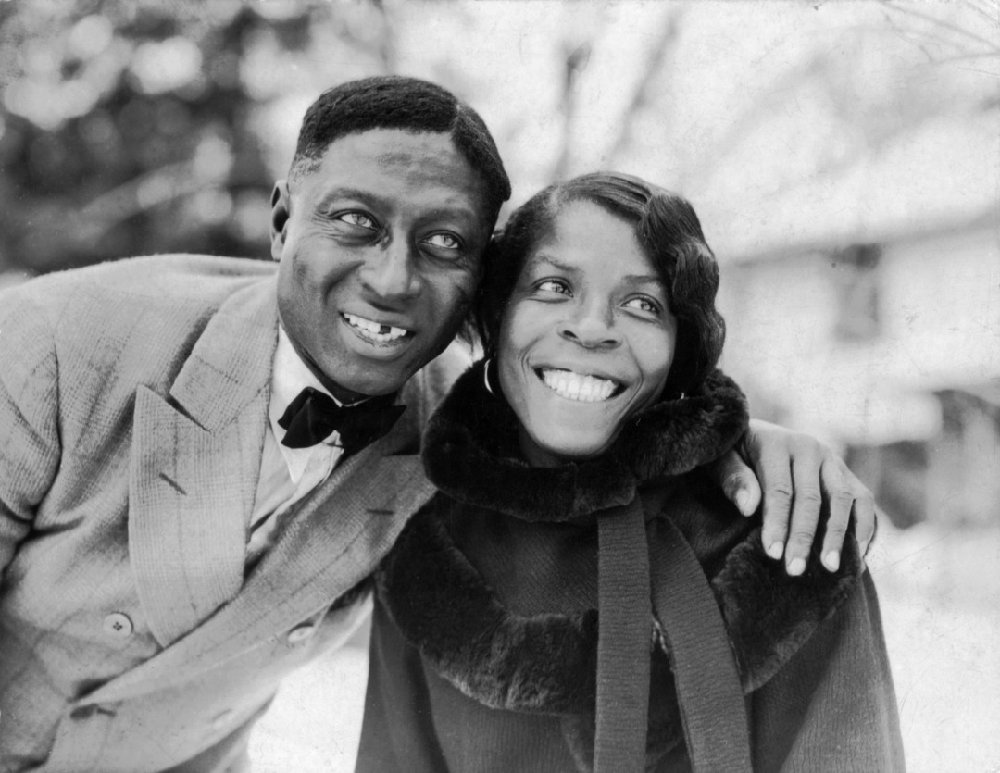
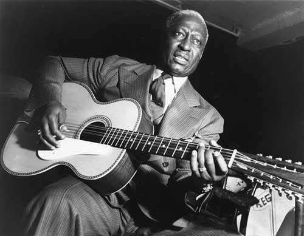

# 牢狱歌手枪肚皮

上面这首歌叫《午夜列车》，唱的是囚犯对亲人的思念及对自由的向往。

它出自美国最早的黑人歌星里贝利（leadbelly）。写这首歌的时候里贝利因打架致人死亡在一个叫糖地（Suger Land）的监狱服刑。糖地流传着这样一个说法：如果火车车灯照到某人的床头，就说明那个人的亲属要来看他了。其实八成是那时候火车比较新鲜，而犯人在囚室又特别无聊，不管怎么说，里贝利据此写了首好歌。他还靠唱歌离开了这块Suger Land：1924年德州州长来监狱视察，监狱长让里贝利给州长唱了几首歌。老里抓住机会，现编了一首委婉的请求宽大处理的歌。没多久，州长提前释放了他。但，这些并没有给他带来更多的好运，他发现刑满释放的黑人备受歧视，于是又开始酗酒打架，1930年，42岁的他又因打架坐牢。判了六年，关在安哥拉监狱，他在那里等待洛马克斯父子。   洛马克斯父子是美国早期最重要的民歌收集者，他们对这个行当做了不少革新。当时的民歌收集者多是学者，他们看不起商业化，写的书旁征博引，内容复杂深奥。老洛马克斯（约翰·洛马克斯）也是学者，但他很注重书的通俗性，省去大量反复的考证，加入旋律和伴奏谱，以便读者照着弹唱。他于1910年出了一本民歌集《牛仔歌曲和其他边远地区民谣》（Cowboy Songs and Other Frontier Ballads），此书由时任总统的西奥多·罗斯福作序，出版后引起一阵轰动，引起更多人关注美国民歌。

  
(约翰·洛马克斯在德克萨斯Jasper民间歌手比利·麦克雷的家里)

(约翰·洛马克斯在阿拉巴马州Sumterville和民间歌手“老叔”里奇·布朗握手)

后来约翰·洛马克斯因卷入政治纠纷被所在的大学免职，经济危机中又遭遇股市崩盘而破产。落魄的他去找美国国会图书馆的民歌档案馆寻求帮助，民歌档案馆聘请洛马克斯当馆长，并拨款支持他去南方收集民歌。这已经是1933年了。当时，流行歌曲已经被经济危机打垮，与之相反，民歌得到越来越多的支持者，对于穷人来说，讲真话的民歌是他们重要的精神支柱，那时美国曾流传这样一个说法,说那些失业的工人农民到杂货店总是买三样东西：一条面包，一磅黄油和一张吉米·罗杰斯的唱片。洛马克斯订制了一套当时最好的“便携式”电动录音设备。这套设备重达159公斤，被固定在一辆福特车的后备箱里，此时，洛马克斯已经是一个体重近150公斤的60多岁的老年人了，为了使工作更加顺利，他带上自己18岁的儿子艾伦·洛马克斯（后成为更有成就的音乐人类学家）。他们选择收集黑人的歌曲，在此之前，鲜有人关注黑人音乐。早期的民歌学者们都是白人，对黑人民歌带有偏见。提到黑人音乐也仅止于黑人教堂歌曲：黑人圣歌（spirituals）。可黑人要么忙于生计，要么不理解。没什么人愿意为他们唱歌，于是约翰想到了一个黑人多、而且肯定会合作的地方：监狱。另外，监狱里的黑人很少听到电台，口味不会受商业音乐的污染。于是，他们来到安哥拉州立监狱，看守给他叫来一个洗衣工。

  
(当时很先进的“便携式”录音设备)

这位洗衣工便是多年前的里贝利。他粗壮结实，带着一把十二弦吉他。
他们随即录了6首歌，其中一首抒情慢歌艾瑞（Irene），让洛马克斯父子非常兴奋，这首歌后来也的确红极一时。里贝利希望这两位来访者给他转运。抓住机会讲起了自己的身世：

里贝利本名休迪·莱德贝特（huddie ledbetter），1888年生于南部的路易斯安那，路易斯安那是个穷州，只产棉花，休迪的父母也是靠种棉花为生。休迪从小就有音乐天赋，弹琴唱歌泡妞打架，14岁那年有了一把吉他，成为当地舞会上最受欢迎的歌手。1904年他开始数次离开家乡，靠音乐混生活，这段时间人们开始叫他里贝利，意思是铅肚皮，有一种说法是他身体结实，打架勇猛，另一种说法是他床上工夫了得。30岁那年为了女孩打架，枪杀了对手，判了十年，关在糖地，七年以后州长发慈悲提前赦免了他。42岁又打架入狱，看守喜欢他的歌，给他安排了个轻省活：洗衣服。洗了三年，他盼来了洛马克斯父子。

一年之后，休迪才得以出狱，他找到约翰求助，约翰收留他当司机，加入了洛马克斯搜歌小分队。休迪不仅善于向黑人朋友们解释录音的重要性，还经常给他们做示范。有了休迪，民歌收集工作比以前顺利多了。

又过了一年，洛马克斯的研究经费用得差不多了，该回总部整理资料了。休迪着急了。约翰灵机一动：为什么不把休迪打造成歌手呢。休迪的背景、经历与音乐实力具备了明星的潜质。于是洛马克斯把休迪带到纽约，一番包装炒作，1935年1月1日因杀人进过两次监狱的休迪以里贝利的身份在梦迪克莱饭店首演，当即全城轰动，一炮而红。随即演出不断，甚至受邀去欧洲演出，洛马克斯则是他的经纪人。洛马克斯从不让里贝利唱流行歌曲，而且总是让他穿着囚服表演，加上财务的问题，里贝利和洛马克斯一度打算对簿公堂。

  
（里贝利和妻子玛莎·普罗米斯Martha Promise Ledbetter）

在一次欧洲巡演时，里贝利被诊断出得了肌肉萎缩症，回纽约不久，也就是1949年12月6日，里贝利去世了。享年61岁。老洛马克斯则在前一年就去世了。一年之后，他的《晚安艾瑞》成了全美年度最佳歌曲。其后，无数歌手翻唱他的歌。最为人所知的当属涅槃翻唱的《Where Did U Sleep Last Night》。

资料来源：《来自民间的叛逆》、《音乐人类学家艾伦·洛马克斯与音乐教育》
