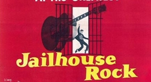

# 20首与监狱相关的歌

​1.Jailhouse Rock

1957年米高梅出品了一部歌舞片《监狱摇滚》，由猫王出演，大获成功。《Jailhouse rock》为该片同名主打歌，甫一面世便成为最红的打榜歌，并成为猫王的代表作之一，披头士、皇后等乐队都翻唱过。歌里唱的典狱长和犯人欢聚一堂开趴体，大家互相关怀，相亲相爱。好一似进了加州旅馆。欢乐的很。

这段舞蹈段落被称为“猫王最伟大的银幕瞬间”。

2.San Quentin

说到趴体，之前写过jonnhy cash特别热衷于去监狱跟犯人趴体，1969年他去圣昆汀监狱演出他就唱了这么一首歌。

开篇就是“圣昆汀啊你简直就是地狱”。然后“我恨透你了...希望你朽烂、在地狱里燃烧。希望我能见证你垮掉，希望人们忘了你曾经存在，希望你世界对你的所作所为感到后悔。”
San Quentin, you've been livin' hell to me......San Quentin, I hate every inch of you.......San Quentin, may you rot and burn in hell./May your walls fall and may I live to tell./May all the world forget you ever stood./And may all the world regret you did no good.
典狱长和看守都在现场，犯人听的忍不住阵阵鼓掌尖叫。

3.Greystone Chapel

1968年卡什去福尔松监狱（Folsom）监狱演出。前一晚，监狱教堂的牧师给了卡什这首歌，词曲作者是正在服刑的犯人Glen Sherley，Sherley对此并不知情，当舞台上的卡什说，接下来我要唱一首在场的一位兄弟写的歌，他叫Glen Sherley，可想这哥们当时飞了起来，他激动的到前面跟卡什握手，卡什说希望我能演绎好你的歌，我会全力以赴的。

4.Folsom Blues

这是卡什第一首监狱主题的歌，写于1953年他在西德作为空军服役期间。20首歌卡什就占了三首，着实有点多，但其实单卡什关于监狱的歌我就想推荐20首，如A Boy Named Sue、Cocaine Blues 、Joe Bean等等。他实在是能唱到犯人心里。不玩荷尔蒙不玩忧郁伤感，也不作是非判断，像多年不见的老朋友促膝聊天，互道往事，插科打诨、轻松随意。对人生遭际的无奈满是同情。稳稳的坐到本主题歌曲的头把交椅。

5.Old Alabama

美国的劳动号子，大部分是由非裔美国黑人唱的，他们在南方的种植园、铁路等地方干活，备受奴役。这个录音是艾伦·洛马克斯在路易斯安那州的监狱种植园录的犯人原声。里面的节拍是砍树的声音，汤姆·汉克斯演的电影《绿里奇迹》里用过这一段。
这种音乐错落而有层次，歌词简洁质朴。我之前把它和诗经的“坎坎伐檀”做了一个简单的呼应。
号子保证了大家在一个节奏上干活，能避免有人偷懒还有安全上的好处。后来修铁路的时候工地上就雇有专门的领唱，不需要他干别的工作。从录音能听出来比一般的工人声音温柔很多。

6.No More My Lawrd

这首歌最初也是劳动号子，但被不断翻唱，这里选了一个当代法国爵士歌手波尼法西的版本。她2014年出了一张全是翻唱劳工号子的专辑。

7.Chain Gang
黑人福音歌手山姆·库克坐火车回家的时候看到一队队被锁在一起的黑人劳工在铁路上唱着劳动号子干活，他很受触动，写了这首歌。

8.Work Song

也是劳动号子主题

9.Midnight Special

这首歌的作者铅肚皮是一位黑人囚犯，1933年被洛马克斯父子在路易斯安那的糖地监狱发现，后来一直扶持他，做了世界级的明星。那首《Where Did U Sleep Last Night》便是由他原创。
这首歌叫《午夜列车》，糖地监狱挨着铁路，从囚室狭小的窗子能看到火车经过。久了，该监狱就流传这么个说法：如果火车车灯照到谁的床头，就喻示着他的家人要来看他了。于是看火车成了犯人为数不多的消遣，调剂单调的生活。铅肚皮据此写下这首歌。

10.立场记

这首歌听起来是跟监狱没有一点关系。我问了一下在里面呆过的朋友，他们说这首歌在监狱传唱度极高，也许他们很少人听过杨一的版本，完全出于对此类酸曲的热爱。
​11.Fish in the Jailhouse

老汤这歌唱的什么我也拿不准，不过好像也可以意会一点。

12.George Jackson

乔治·杰克逊是一位激进的黑人民权活动家，参加黑豹党什么的，1971年在圣昆汀监狱试图越狱被击毙了。他的死间接引发了阿提卡监狱的暴动。那时候种族歧视还很严重，乔治·杰克逊的死被很多人认为是受了诬陷，迪伦愤怒的唱到：有时候我觉得整个世界就是一个监狱，一些人是犯人，其余的是看守。“Sometimes I think this whole world/Is one big prison yard./Some of us are prisoners/The rest of us are guards/Lord, Lord/They cut George Jackson down/Lord, Lord/They laid him in the ground.”
监狱方面的歌迪伦也没少写，比如“hurrican”、"the aulttriangle"、"I shall be released"等等。

13.Prison Trilogy

与迪伦变换风格不同，琼·贝兹一直特别关注时事和社会问题，一副温柔的嗓子充满力量。

14.Jail Guitar Doors

The Clash代表作之一，The Clash的吉他手Billy Bragg也很关注社会问题，他成立了一个音乐介入监狱的机构“Jail Guitar Doors”，给监狱募捐乐器，并教犯人学音乐写歌。2009年MC5的吉他手Wayne Kramer把这个活动带到了美国。

15.The Mercy Seat

说的是一个即将坐电椅被执行死刑的犯人，歌里有不少宗教的语言表述，The Mercy Seat也指即将去亲近的上帝的宝座。Nick Cave沉郁的嗓子像杀手一样迷人。

16.Please,Don't Kill My Child

这首歌来自宗巴监狱项目的专辑《I Have No Everything Here》（在这里我一无所有），该专辑由几十位非洲东南部的贫穷国家——马拉维最大的监狱里的囚犯演唱。获2016年的格莱美“世界音乐”奖项的提名。虽然听不懂歌词，但是他们简单的旋律、朴素的声音依旧非常动人。2016年9月他们出了第二张专辑《我不会停止歌唱》。

17.Sing Me Back Home

这首歌的原唱是梅尔·哈格德，卡什去圣昆汀演出的时候哈格德正在里面服刑，很受卡什感召，他后来也进了摇滚名人堂。哈格德有一张名为“prison”的创作专辑。这首说的是一个狱友，因越狱导致一名看守死亡要被处决。临死之前，他请求再给朋友弹唱一曲，唱了首关于回家的歌。

18.Prison Grove

19.托锁

基本属实

20.充满希望

末了，借监狱风云励志一把。
