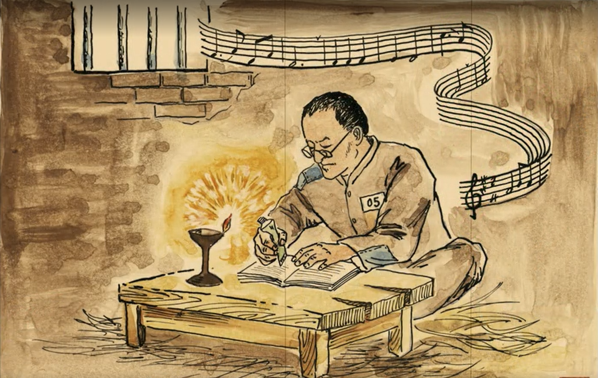
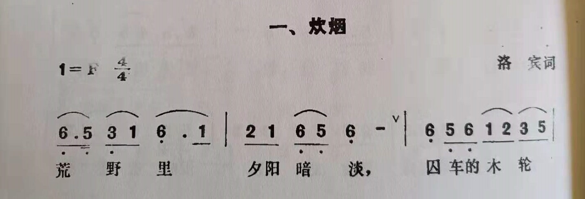
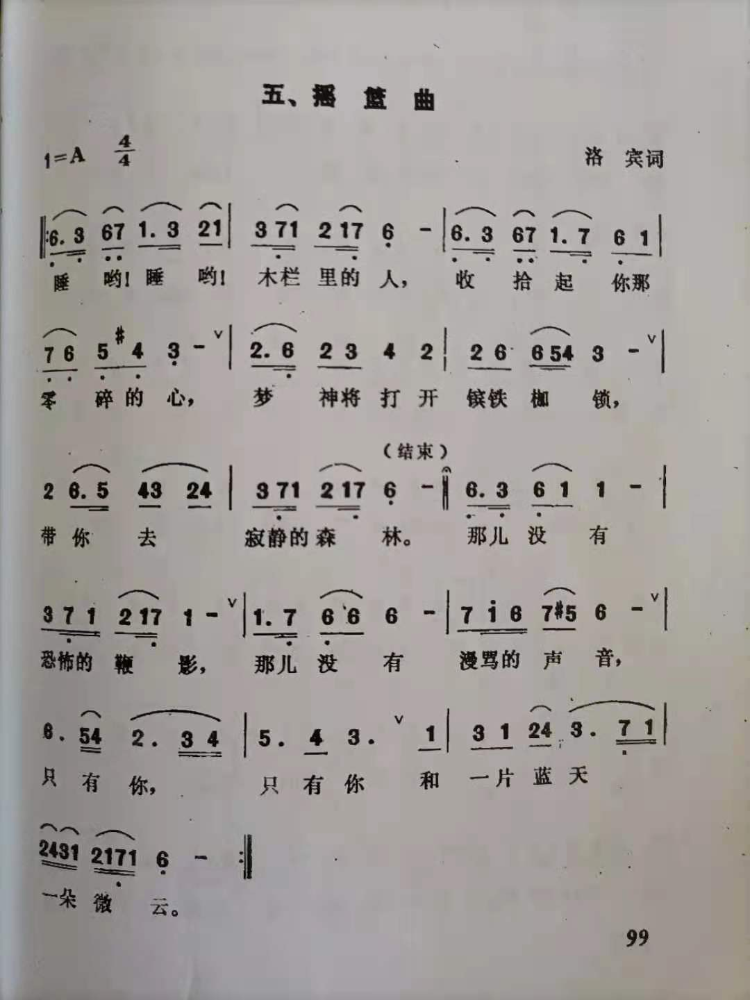
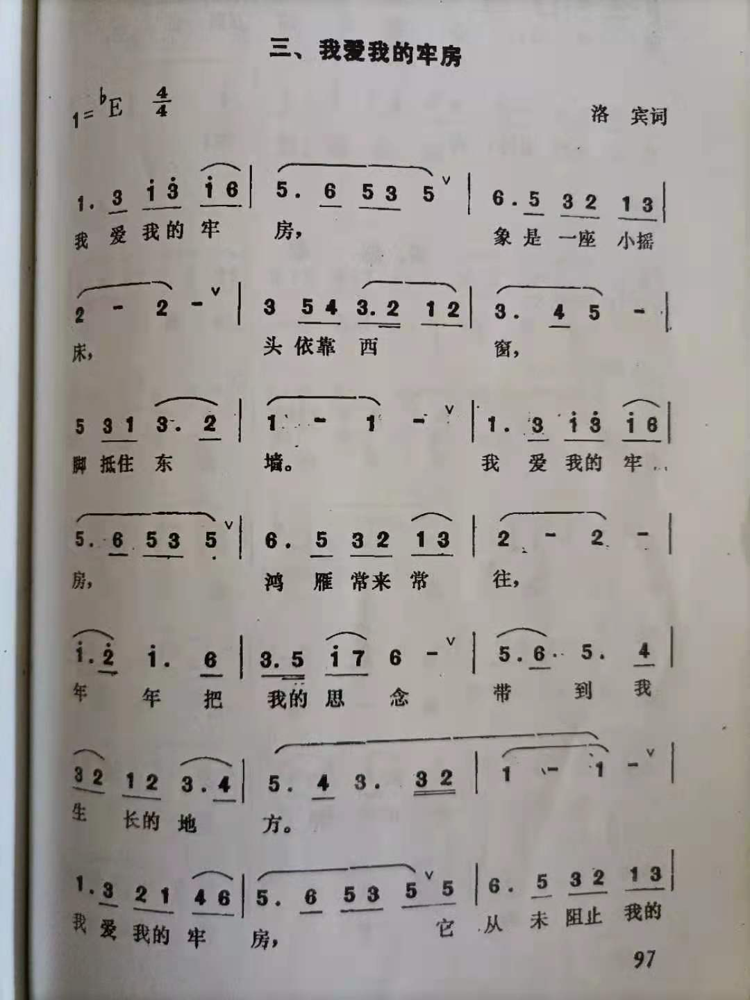
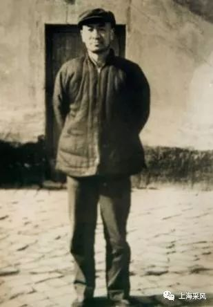

# 几经囹圄的王洛宾

1937年七七事变后，24岁的王洛宾前往山西参加八路军“西北战地服务团”，1938年3月，转移到西安，5月赴兰州参加“西北抗战剧团”，在甘肃、青海各地宣传抗日。1940年，王洛宾在西宁任音乐教育工作，负责组建“青海儿童抗战剧团”，期间创作颇丰。1941年，妻子罗珊提出解除婚约。王洛宾赴兰州看望罗珊，二人登报宣布离婚。回程中王洛宾被军统特务逮捕，因共产党嫌疑被投进兰州沙沟监狱。在狱中，王洛宾创作了《炊烟》、《蚕豆谣》、《我爱我的牢房》、《睡在戈壁滩上》、《云曲》等二十余首囚歌。1944年，国民党青海省主席、军阀马步芳得知王洛宾被关在监狱，拍着桌子怒吼：王洛宾不是共产党的人，是我马步芳的人。1944年5月，王洛宾回到青海继续从事音乐教育工作。被提携为国民党第四十集团军军官训练团音乐教官，后来又担任国民党西北行政长官公署政工处上校文化高参。

  
写于押解途中的《炊烟》

  
摇篮曲

  
我爱我的牢房

  
蚕豆谣

1946年初，为了欢度抗战胜利后的第一个春节，马步芳下令“马家军”各师、旅、团长筹办社火。马步芳用浓重的河州腔，给王洛宾哼唱了他少年时会唱的一首河州民歌“四季调”。王洛宾记录了马步芳新唱词曲，编排出名为“八大光棍”的节目，“四季调”由此传唱开来。

1947年底王洛宾回北平省亲，马步芳委任他为特使，为过60大寿的傅作义送寿礼。

1949年7月的一天，在兰州任国民党西北行政长官的马步芳对王洛宾说：“兰州要打仗了，你回青海去吧，你是个文化人，这里不需要你了。”

这样，王洛宾回到了西宁，两个月后，西宁宣告解放。1949年12月20日，中国人民解放军新疆军区在迪化(今乌鲁木齐)发布第一号人事通令，通令第47条任命王洛宾为新疆军区文艺科科长。
 
1950年初春，留在西宁的妻子给王洛宾写来信说，家被查抄了。因为王洛宾当过马步芳的上校，她成了反革命家属。家里连一包棉花都被收走了。王洛宾急忙请假回了西宁，他听说，曾经与他一起组建青海儿童抗战剧团的副团长赵永鉴一解放就被枪毙了；妻子的姐姐因嫁给了当地的地主受到很大的冲击，吓到不敢再待下去，整个西北都不敢待了。他往新疆寄去一封辞职信，带着全家迁回了北京。

1951年6月，在派出所民警的带领下，新疆军区保卫部的干部将正在北京八中上课的王洛宾抓走，直接押上西行的火车。王洛宾想起家中还躺着一个大出血的妻子黄玉兰，三个年幼的孩子，他反反复复想，怎么也得回家作个交代。于是，在火车刚离开高碑店时，他趁上厕所的机会跳了下去……他赶回机织卫胡同的家时，家中已乱成了一锅粥。望着被抄了个底朝天的家，王洛宾也没了主意。还不等他作出安排，押解他的军区保卫干部赶回来给他戴上了手铐，又押解着他踏上了西行的征程。妻子刚生下小儿子，遭受如此打击，一个月后就离开了人世。1952年2月军法处以“长期逾假不归”判处王洛宾劳役两年，下放到新疆军区监狱进行劳动改造。时任南疆军区副政委的“独臂将军”左齐得知这一情况后，与新疆军区交涉，提出以监外执行的名义把王洛宾带到喀什去，为王洛宾写了保证书，担保他不会越境不会逃跑。于是王洛宾被调到南疆军区文工团。文革中，左齐被揪斗，其中一项罪名就是袒护过王洛宾。

1959年，新疆话剧团以库尔班大叔骑毛驴到北京看望毛泽东为素材，编写了音乐话剧《步步跟着毛主席》赴北京参加会演。当时在新疆军区文工团工作的王洛宾写出了《萨拉姆毛主席》。此剧在北京怀仁堂为中央领导演出结束时，观演的毛主席起身鼓掌，盛赞此剧的音乐。

1960年，王洛宾又一次被捕入狱，罪名是历史反革命加现行反革命——他曾在马步芳属下任过职，作为“国民党历史嫌疑分子”“历史反动”；写过一首《萨拉姆毛主席》，“萨拉姆”在维吾尔语中是“衷心祝福”的意思，在歌曲中是作为衬词运用的。在一些人嘴里，被指谐音“杀了毛主席”；他导演的《大比武》舞剧，演员的枪口曾对着台下的军区首长，被指“用心险恶”。由是王洛宾被判处有期徒刑15年，剥夺政治权利20年。

1962年，独臂将军左齐又一次以假释的名义把服刑中的王洛宾要回了文工团，他不能穿军服，属于戴罪服务。任音乐教员、创作员。期间他改编了《江巴拉汗》、《草原上的金太阳》、《天上的云》、《高高的白杨》、《撒阿黛》等数十首民歌。

  
服刑中的王洛宾

1964年10月，文化部下发了通知《关于停止演唱反革命分子王洛宾的歌曲的决定》，所有与王洛宾有关联的歌曲都从节目单中划去了。他的境遇又变了，后来甚至不被允许迈出单位的大院。1965年的一天，没有任何征兆，王洛宾骑着自己心爱的自行车“出走”了。他一辈子最爱骑自行车，直到80多岁了出门还是跨一辆自行车。他骑着车一路往东，一直骑到吐鲁番，发现自己没有粮票，没粮票就买不上吃的，于是又折返回来。在回来的路上，他又累又饿地昏倒在达坂城的街头。之后，事情被定性得很严重。全家从团里的房子被赶出来，无居可栖。他本人也被再次投入监狱，又关了10年。在监狱的砖瓦厂里，他和其他年轻的囚犯一样，顶着灼人的炽热，背着几十公斤重的红砖、砖坯，出窑装窑，煎熬地度过5475个日日夜夜。期间，他也有过轻生的念头，但理智最终使他避免了悲剧。他先后在狱中搜集改编《哈来龙》、《离别》、《阿顿江》等数十首民歌，还帮新疆第一监狱排一段河南豫剧。

1975年，刑满出狱。在政治上继续被管制。1979年4月，应兰州军区政委肖华将军邀请前往兰州为战斗歌舞团创作歌剧《带血的项链》进京参加国庆30周年汇演，获文化部颁发创作二等奖。11月29日，乌鲁木齐军区军事法院撤销了1961年对他的判决。

1981年，新疆军区召开平反大会，为他恢复名誉和军籍，王洛宾终于重新穿上了军装，任新疆军区文工团艺术顾问。

1941年，中共甘肃省工委副书记罗云鹏，因叛徒出卖被捕。他的爱人樊桂英和八个月的女儿罗力立也一同被关押在兰州沙沟监狱。罗云鹏惨遭杀害，王洛宾被关进沙沟监狱时，罗力立已经三岁了，她是这所监狱中唯一能自由走动的犯人。罗力立非常喜欢新来的大胡子叔叔王洛宾，听他唱歌、讲故事。一次放风的时候，罗力立问大家什么是世上最好吃的东西，王洛宾猜了几次都没猜对，罗力立拿出仅有的两颗黄豆说：“是大豆！”。感慨之下，王洛宾找出用牙膏皮做成的笔，在一张烟盒纸上写下了《大豆谣》：

蚕豆杆，低又低  
结出的大豆铁身体  
牢房的丽丽夸大豆  
世界上吃的数第一  

小丽丽，笑咪咪  
妈妈转身泪如雨  
街头上叫卖糖板栗  
牢房中大豆也稀奇  

小丽丽，有志气  
妈妈的哭声莫忘记  
长大冲出铁大门  
全世界大豆属于你  

我不懂乐谱，单是看到王洛宾先生的这几首歌词，就已经很折服了。几年前，阿坚帮忙联系到王洛宾的儿子王海成先生，他也乐见有人来编唱这些囚歌。几年过去了，我还是没能听到哪位唱这些歌。遗憾之余，再抄一遍这两首歌词：

我爱我的牢房

我爱我的牢房  
像是一座小摇床  
头依靠西窗  
脚抵着东墙  

我爱我的牢房  
鸿雁常来常往  
年年把我的思念  
带到我生长的地方  

我爱我的牢房  
它从未阻止我的想象  
我的心常去那万里云空  
做着无拦阻的奔放。  

摇篮曲

睡哟！睡哟！  
木栏里的人  
收拾起你那零碎的心  
梦神将打开镔铁枷锁  
带你去寂静的森林  
那儿没有恐怖的鞭影  
那儿没有谩骂的声音  
只有你  
只有你和一片蓝天  
一朵微云。
