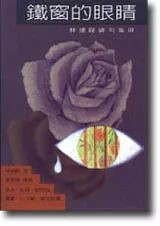

# 《铁窗的眼睛》—林建隆俳句选

​1、  
说是铁  
其实是钢  
鱼肠剑也削不断的窗  

2、  
框住飞机  
和云的机翼  
好大的铁窗  

3、  
排列整齐的坟墓  
每一个铁窗  
都是镂空的墓碑  

4、  
一再撞上铁窗  
初次操作  
声纳的蝙蝠  

5、  
留在铁窗上  
一根  
蜜蜂的螫针  

6、  
暴动后的铁窗内  
没有一只苍蝇  
不是跛脚的  

7、  
飘进来的野菊花  
要找哪一位？  
铁窗里有许多活的鬼  

8、  
寄给妳  
一扇铁窗，变化无穷的  
风景明信片  

9、  
铁窗的耳朵  
可以听出九十九种  
雨的声音  

10、  
铁窗上的雨珠  
每一粒都嵌着  
妳的脸  

11、  
铁窗是一把弦琴  
窗外的风雨  
奏不完的曲  

12、  
铁窗欣然笑了  
从雁的翅膀飘落  
一张邮票  

13、  
连铁窗外的树  
也加入警卫  
一律穿着黄色卡其服  

14、  
何必劳驾法师？  
铁窗就是一本  
现成的金刚经  

15、  
那年我在铁窗内  
为自己捡骨时  
发现了诗  

16、  
一轮半的明月  
停格在铁窗  
入定的探照灯  

17、  
铁窗为月娘蒙上面纱  
母亲的脸  
仍是一清二楚  

18、  
铁窗上已布满星子  
独不见下棋的  
日与月  

19、  
夜空是大海  
铁窗是竹筏  
用食指垂钓星星  

20、  
星星是金鱼  
瞳孔是思念针织的网  
相逐于方形的宇宙  

21、  
又是失眠  
干脆睁开铁窗  
湛蓝的独眼  

22、  
梦见铁窗  
漂浮在故乡的海上  
我立在上头垂钓  

23、  
清明的夜  
雨渗入铁窗  
在坟墓里思念坟墓  

24、  
铁窗里的死鱼  
一一复活了  
秋夜的大雨  

25、  
每一根铁窗栏栅  
都缩着脖子  
十二月的风  

26、  
铁窗是一台电视  
天天转播  
云的马拉松  

27、  
天边响起  
父亲的喝斥  
还好有铁窗的庇护  

28、  
三年没用过伞了  
铁窗外  
仍飘着雨  

29、  
铁窗外的青蛙  
对着我鸣叫了三年  
我还是不出去  

  

林建隆（1956年－），台湾现代诗诗人、东吴大学教授、政治评论家。因其自传《流氓教授》而有“流氓教授”之称，后被台湾电视公司改编并播映成八点档连续剧，常受邀参访电视评论节目。

林建隆出生于基隆月眉山矿区一个贫苦家庭。23岁时，因“杀人未遂”被捕，被以流氓名义移送警备总部管训；半年后，转送台北监狱。发监期间，在狱中附设的学校“宏德补校”努力苦读。三年后假释，在警备总部继续管训，管训期间考取东吴大学英文系。毕业后，前往美国深造，获美国密西根州立大学英美文学博士学位。1992年，入职东吴大学英文系。
