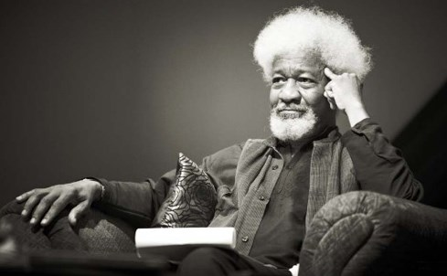

# 监狱诗选 | 非洲诺奖得主渥雷·索因卡狱中诗抄  

渥雷·索因卡，尼日利亚诗人、剧作家、小说家、评论家，也是非洲民族的自由斗士和政治领袖。他一生写了30多部作品，绝大多数讽刺非洲的社会文化风气和社会弊端。由于“以广阔的文化视野创作了富有诗意的人生戏剧”获得1986年诺贝尔文学奖，成为有史以来第一位获此殊荣的非洲作家。  

渥雷·索因卡1934年出生于尼日利亚西部阿贝奥库塔约鲁巴族一个学校督学的家庭。他先在尼日利亚伊巴丹大学接受教育。1954年，他二十岁时，进英国利兹大学，专攻英语。  

1958年被接纳进皇家官瑟剧院担任剧本编审、导演和演员。1960年，沃莱·索因卡作为一位戏剧研究人员回到尼日利亚。他遍游全境采风，着重考察和研究民间文艺，有意识地把西万戏剧艺术同非洲专统音乐、舞蹈、戏剧结合起来，创造出且有非洲特性的新型话剧。他还研究尼日利亚民间文艺，把西方戏剧艺术和非洲传统的音乐、舞蹈和戏剧结合起来，开创了用英语演出的西非现代戏剧，并很快就以一个具有非凡才华的剧作家、演员和导演脱颖而出。  

在1961年，他帮助创办了尼日利亚作家和艺术家团体姆巴里俱乐部，对尼日利亚文学艺术的发展起了很大的推动作用。索因卡一直在尼日利亚政坛较为活跃，1966年1月的军事政变之后，1967年8月，他秘密地和非正式地会见了东南部地区埃努古的军事统治者，试图避免内战。结果，他不得不躲藏起来。后来，在尼日利亚内战期间，他写了一篇呼吁停火的文章，被军政府指控与比夫拉叛军合谋，破坏和平，被关进拉哥斯和卡多那监狱单独囚禁。此后，国际社会不断关注和施压，1969年内战结束，国家宣布大赦，被关押22个月后，他和其他政治犯才被释放。在狱中，他创作了许多诗歌，后来全部收录在《狱中诗抄》（Poems from Prison）。他还将自己在狱中的经历写进了《此人已死：狱中笔记》（The Man Died：Prison Notes）。  

1969年10月，渥雷·索因卡隐居住在法国南部的一座农场，创作了《欧里庇得斯的酒神之女伴》。年底，他回到伊巴丹戏剧大教堂的校长办公室。1971年诗集《地穴梭巡》出版，创作了戏剧《疯子和专家》。索因卡前往巴黎，在他的作品《杀人天使》中扮演主角——刚果共和国被谋杀的首任总理帕特里斯·卢蒙巴。他强有力的自传作品《此人已死：狱中笔记》也出版了。4月，由于对政治局势的担忧，他辞去伊巴丹大学教职，流亡海外。  

1976年，他回到了尼日利亚，在伊费大学执教。作为剑桥大学和谢菲尔德大学的英语客座教授，他还定期前往欧洲。同时，他还是耶鲁大学的客座教授。  

索因卡也一贯以大胆直言著称，他经常批评尼日利亚的行政部门，也反对全世界其他国家的暴政，包括津巴布韦的罗伯特·穆加贝政权等。他的许多著作都有明显的反对独裁反对专政的论调，这些激进言论经常使他身处险境。  

1994年，阿巴察将军派出暗杀小组追杀他，他骑着摩托车从尼日利亚逃到贝宁，然后逃到美国。1997年他还被阿巴查将军缺席判处死刑。他再次因国内的独裁统治而被迫流亡海外，成为美国亚特兰大艾默里大学的教授，在牛津大学、哈佛大学任教，直到四年后阿巴查神秘猝死。1999年随着尼日利亚恢复文官统治，索因卡回国，接受了伊费大学授予名誉教授的头衔，但开出的条件是，这个大学必须禁止招收政府高级官员中的军官。  

2020年10月，渥雷·索因卡宣布即将出版《地球上最快乐的人的编年史》（《Chronicles of the Happiest People on Earth》）。这是时隔将近50年来索因卡创作的第一本小说。  

  

《狱中诗抄》摘选：  

## 囚犯  

灰暗，面对稀疏的浅草  
被扬起，潮湿的苔藓，如此滞重的  
烟雾中的细缕，躲避  
向上地弯卷的利刃，繁殖  
灰色的时刻  
以及日子，以及年月，因为  
智慧的灰庙不必由我们建造给  
发热病的年月，从这里开始，不必  
带着眼泪或灰尘，然而这悲哀的嘲弄  
思绪，是时刻的逼迫吗？  

沙漠的荒野，那时，孤独的仙人掌  
食人生番是他的爱——纵使在  
巉岩和山谷中间，在跳耀和夜晚的颤慄之间  
纵使像遗留的陶片以及陷落的  
沙暴——暗示已经出现。  

在这风暴的漩涡中心，一曲挽歌  
但并非由此而来。因为那遥远的伴侣  
突然被变成陌生人，当风力减弱  
中心塌陷，悲哀。而打碎的  
陶片躺在地上，闷闷不语——又一次暗示  

但并非由此而来。他只知道  
突然地占有。时间的征服  
把无助的他捆缚于每一件灰暗的物体。  

（马高明 译）  

## 琥珀的墙壁  

太阳的呼吸  
灌溉绿藤和珀珠  
有童声自远方之门响起  

你随着太阳来狩猎  
向昏沉的大地扬眉  
在苏醒的湖散播硫磺火焰  

太阳的手停顿在猎物  
在最高的树枝，眼神游漫着欲望  
质疑这个隔绝的人之谜  

比梦烧的芒果更丰饶的幻想  
闪过太阳尊贵的心  
开放的正午高悬封锁的大门  

愿你近午时不太痛苦  
这男囚监狱  
内在的损失里是一堵墙的收获  

你黄昏的笛音，你唤醒种籽之舞  
给黑夜以生机，我听见  
星光闪闪的歌中太阳哀愁的伴唱  

（郑臻 译）  

## 活 地 狱  

十六步乘以  
二十三步。他们抓住  
围攻人性  
和真理  
使用时间钻透他的正常理性  

精神分裂的  
安蒂冈妮 ① 的爱人！  
你会吗？你会挖掘出  
去年的  
尸体？曝露出此刻生命的肥料  

将他活活封在  
那同样的大墓地里  
惟愿他那鬼魂情人  
指示出那经典的  
外乡人通往冥间的迷津。  

偷窥者。  
他们安排巡视  
君临一切的时辰  
我想他们颤动于  
听见缪思便秘的呻吟  

公告：  
他睡得好，吃得  
好。他的医师没发现  
任何身体损害  

## 涤 罪  

饱受鞭撘的墙朝向南方——  
正义的博动削弱了喜宴的气息——  
清算的日子来临了!  

在出场的傀儡里：首先，是法律驱迫的  
外科医生，麻醉为酷刑准备好了。  
然后啊，一列囚犯的卡纸隔间，胶水黏上的  
眼皮——观察的小队伍。以及：  
作品中的英雄，高耸的阴影横越  
降伏的恶棍，切裂了层层包扎在空气中的  
审判，怀念老式姆指刑具  
拷打台和拔指甲器——天啊，所有  
美好的事物将都远去了——他渐渐适应  
这任意摆布的魔杖。舞台的道具：  
收容裸体的长板凳，打结的毛巾，  
整桶的黄色防腐剂散发  
润湿的音色于枯干的法律上。  
杂技团终将来到竞技场  
奇异的演出不免陷入畸形  
而古老的露天盛会供给  
涤罪的原型来解闷  
这大地啊，狂人中夹杂着该下地狱的人。  
羊癫疯，先知和梦想家  

不详药物的瘾患，植物性  
灵魂的灵媒，以及划时代的  
鬼魂的灰色伙伴  
在终身的旅途上蹒跚走向可怕的司法审判  

（荒原、王浩威 译，贝岭 校）  

## 旅 程  

我从不感到我已经抵达，尽管我来到  
旅行的终点。我走上这条路，  
它把羽冠丧失给问题，却把我压在  
另一片归家的土地里。我知道  
我的肉被啃得一干二净，给在生锈船壳中  
泛起波纹的鱼----  
我一路经过它们  

于是我带着面包和酒  
没有跟失败和死亡分享  
我一路经过它们。  

我从不感到我已经抵达  
尽管爱情和欢迎诱我回家  
篡夺者送给我杯子，每一顿  
都是最后的晚餐  

（黄灿然译）  

## 黑 歌 手  

——献给玛吉·纽约  

冰冷的葡萄藤圈，黑黑地  
盘绕着暗夜；深沉地回响在  
秋天淌血的静脉里。  

一个还愿的花瓶，她的歌喉  
将众多灵魂当成一个倾注，多么黑啊  
这酒变成了暗夜。  

从脱臼中中长出肉，从街头  
警笛的伤口长出，一个黑暗中的  
酒池颤抖  

在炮弹碎片中，而你在问  
今夜的酒如何？黑呀，女士  
黑成更深的伤口  

再次充满应允  
应允那些深而静的伤口  
应允黑暗之酒的各个残酷时期  

声音啊，歌是孤独的使者  
夜是供淡漠的酒流奔驰的小河。  

（黄灿然译）  

## 季 节  

锈即成熟，锈  
以及调谢的玉米缨；  
花粉即交配季节，当燕子们  
编一只  
羽箭之舞  
把玉米杆织进有翼的  
光线。而，我们喜欢听  
风的移接的短语，听  
田野中的擦刮声，那里——玉米叶  
穿刺如竹片。  

此刻，我们这些收获者  
在等待着穗上的锈，在黄昏  
拖着长长的影子，在柴烟中  
扎起干燥的茅舍。满载的杆  
驮着病菌的腐败——我们等待着  
锈的承诺。  

（黄灿然译）  
