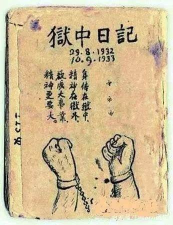
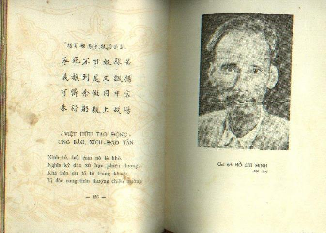

# 监狱诗选 | 胡志明狱中打油诗  

1942年8月，因越南已受日本支配，越共领袖胡志明为进行抗日行动，前往中国，欲联系抗日力量，但进入边境（德保县附近）时被重庆政府拘捕。此后，胡志明被辗转押送到广西十三个县三十个监狱十四个月，至1943年9月获释。  

因监狱条件恶劣，衣食不足，使他牙齿脱落，头发变白，形容憔悴。但虽如此，胡志明仍对越南独立运动抱乐观态度，深信自己“身体在狱中，精神在狱外，欲成大事业，精神更要大”，于是在“囚中无所为”的时候“聊借吟诗消永日”，以反映他的经历及心理状况。  

胡志明精通多国语言，尤擅长汉文，因此在写诗歌作为日記，记录监狱生活，就是这本《獄中日記》汉文诗集，收汉文诗一百三十五首。  

胡志明的狱中诗，抄录在一本浅绿色封面的日记本上，封面画有一双戴着手铐的手，并写有“狱中日记”四个大字，是为留存后世的《狱中日记》。  

胡志明的的诗，不管古体诗与近体诗的格律体制要求，也不完全按照现代诗的写法，而是胡志明以自己认为能够写出自身感受的方式，意到言止，在语言上接近现代白话诗，某些句子还带有中国五四时期的新诗味道。读来别有趣味。  

狱 中 日 记  

\*  
1  
开 卷  
老 夫 原 不 爱 吟 诗  
因 为 囚 中 无 所 为  
聊 借 吟 诗 消 永 日  
且 吟 且 待 自 由 时  
*  
2  
在 足 荣 街 被 扣 留  
足 荣 却 使 余 蒙 辱  
故 意 迟 延 我 去 程  
间 谍 嫌 疑 空 捏 造  
把 人 名 誉 白 牺 牲  
*  
3  
入 靖 西 县 狱  
狱 中 旧 犯 迎 新 犯  
天 上 晴 云 逐 雨 云  
晴 雨 浮 云 飞 去 了  
狱 中 留 住 自 由 人  
*  
4  
早  
太 阳 每 早 从 墙 上  
照 着 笼 门 门 未 开  
笼 里 现 时 还 黑 暗  
光 明 却 已 面 前 来  
5  
二  
早 起 人 人 争 猎 虱  
八 钟 响 了 早 餐 开  
劝 君 且 吃 一 个 饱  
否 极 之 时 必 泰 来  
*  
6  
午  
狱 中 午 睡 真 舒 服  
一 睡 昏 昏 几 句 钟  
梦 见 乘 龙 天 上 去  
醒 时 才 觉 卧 笼 中  
*  
7  
午后  
二 点 开 笼 换 空 气  
人 人 仰 看 自 由 天  
自 由 天 上 神 仙 客  
知 否 笼 中 也 有 仙  
*  
8  
晚  
晚 餐 吃 了 日 西 沉  
处 处 山 歌 与 乐 音  
幽 暗 靖 西 禁 闭 室  
忽 成 美 术 小 翰 林  
*  
9  
睡 不 着  
一 更 二 更 又 三 更  
辗 转 徘 徊 睡 不 成  
四 五 更 时 才 合 眼  
梦 魂 环 绕 五 尖 星  
*  
10  
双 十 一  
从 前 每 到 双 十 一  
纪 念 欧 洲 罢 战 期  
今 日 五 洲 同 血 战  
罪 魁 就 是 恶 nazi  
*  
11  
囚 粮  
每 餐 一 碗 红 米 饭  
无 盐 无 菜 又 无 汤  
有 人 送 饭 吃 得 饱  
没 人 送 饭 喊 爷 娘  
*  
12  
难 有 吹 笛  
狱 中 忽 听 思 乡 曲  
声 转 凄 凉 调 转 愁  
千 里 关 河 无 限 感  
闺 人 更 上 一 层 楼  
*  
13  
赌  
民 间 赌 博 被 官 拉  
狱 里 赌 博 可 公 开  
被 拉 赌 犯 常 嗟 悔  
何 不 先 到 这 里 来  
*  
14  
自 勉  
没 有 冬 寒 憔 悴 景  
将 无 春 暖 的 辉 煌  
灾 殃 把 我 来 锻 炼  
使 我 精 神 更 紧 张  
*  
15  
果 德 狱  
监 房 也 是 小 家 庭  
柴 米 油 盐 自 己 营  
每 个 笼 前 一 个 灶  
成 天 煮 饭 与 调 羹  
*  
16  
绑  
胫 臂 长 龙 环 绕 着  
宛 如 外 国 武 勋 官  
勋 官 的 是 金 丝 线  
我 的 麻 绳 一 大 端  
*  
17  
限 制  
没 有 自 由 真 痛 苦  
出 恭 也 被 人 制 裁  
开 笼 之 时 肚 不 痛  
肚 痛 之 时 笼 不 开  
*  
18  
因 肚 饿  
从 前 送 饭 天 天 早  
现 在 开 餐 迟 又 迟  
况 复 时 间 不 一 定  
十 十 一 或 十 二 时  

*  
19  
世 路 难  

走 遍 高 山 与 峻 岩  
那 知 平 路 更 难 堪  
高 山 遇 虎 终 无 恙  
平 路 逢 人 却 被 监  
20  
二  
余 原 代 表 越 南 民  
拟 到 中 华 见 要 人  
无 奈 风 波 平 地 起  
送 余 入 狱 作 嘉 宾  
21  
三  
忠 诚 我 本 无 心 疚  
却 被 嫌 疑 做 汉 奸  
处 世 原 来 非 易 易  
而 今 处 世 更 难 难  
*  
22  
问 话  
社 会 的 两 极  
法 官 与 犯 人  
官 曰 你 有 罪  
犯 曰 我 良 民  
官 曰 你 说 假  
犯 曰 我 言 真  
法 官 性 本 善  
假 装 恶 狠 狠  
要 入 人 于 罪  
却 假 意 殷 懃  
这 两 极 之 间  
立 着 公 理 神  
*  
23  
脚 闸  
狰 狞 饿 口 似 凶 神  
晚 晚 张 开 把 脚 吞  
各 人 被 吞 了 右 脚  
只 剩 左 脚 能 屈 伸  
*  
24  
二  
世 间 更 有 离 奇 事  
人 们 争 先 上 脚 钳  
因 为 有 钳 才 得 睡  
无 钳 没 处 可 安 眠  
*  
25  
学 奕 棋  
闭 坐 无 聊 学 奕 棋  
千 兵 万 马 共 驱 驰  
进 攻 退 守 应 神 速  
高 才 疾 足 先 得 之  
*  
26  
二  
眼 光 应 大 心 应 细  
坚 决 时 时 要 进 攻  
错 路 双 车 也 没 用  
逢 时 一 卒 可 成 功  
*  
27  
三  
双 方 势 力 本 平 均  
胜 利 终 须 属 一 人  
攻 守 运 筹 无 陋 算  
才 称 英 勇 大 将 军  
*  
28  
望 月  
狱 中 无 酒 亦 无 花  
对 此 良 宵 奈 若 何  
人 向 窗 前 看 明 月  
月 从 窗 隙 看 诗 家  
*  
29  
分 水  
每 人 分 得 水 半 盆  
洗 面 烹 茶 各 随 便  
谁 要 洗 面 勿 烹 茶  
谁 要 烹 茶 勿 洗 面  
*  
23  
中 秋  
中 秋 秋 月 圆 如 镜  
照 耀 人 间 白 似 银  
家 里 团 圆 吃 秋 节  
不 忘 狱 里 吃 愁 人  
*  
30  
二  
狱 中 人 也 赏 中 秋  
秋 月 秋 风 带 点 愁  
不 得 自 由 赏 秋 月  
心 随 秋 月 共 悠 悠  
*  
31  
赌 犯  
公 家 不 给 赌 犯 饭  
欲 令 他 们 悔 前 非  
硬 犯 肴 馔 天 天 有  
穷 犯 饥 延 共 泪 垂  
*  
32  
难 友 原 主 任  
国 家 重 托 镇 边 陲  
胡 乃 忘 公 只 顾 私  
锑 矿 常 从 边 界 去  
金 钱 炉 里 铸 囚 诗  
*  
33  
双 十 日 解 往 天 保  
家 家 结 縩 与 张 灯  
国 庆 欢 声 举 国 腾  
我 却 今 天 被 绑 解  
逆 风 有 意 阻 飞 鹏  
*  
34  
走 路  
走 路 才 知 走 路 难  
重 山 之 外 又 重 山  
重 山 登 到 高 峰 后  
万 里 舆 图 顾 盼 间  
*  
35  
夜 宿 龙 泉  
白 天 双 马 不 停 蹄  
夜 晚 尝 尝 五 味 鸡  
虱 冷 乘 机 来 夹 击  
隔 邻 欣 听 晓 莺 啼  
*  
36  
田 东  
每 餐 一 碗 公 家 粥  
肚 子 时 时 在 叹 吁  
白 饭 三 元 不 够 饱  
薪 如 桂 也 米 如 珠  
*  
37  
初 到 天 保 狱  
日 行 五 十 三 公 里  
湿 尽 衣 冠 破 尽 鞋  
彻 夜 又 无 安 睡 处  
厕 坑 上 坐 待 朝 来  
*  
38  
难 友 之 妻 探 监  
君 在 设 窗 里  
妾 在 设 窗 前  
相 近 在 咫 尺  
相 隔 似 天 渊  
口 不 能 说 的  
只 赖 眼 传 言  
未 言 泪 已 满  
情 景 真 可 怜  
*  
39  
各 报: 欢 迎 威 基 大 会  
同 是 中 国 友  
同 是 要 赴 渝  
君 为 坐 上 客  
我 为 阶 下 囚  
同 是 代 表 也  
待 遇 胡 悬 殊  
人 情 分 冷 热  
自 古 水 东 流  
*  
40  
野 景  
我 来 之 时 禾 尚 青  
现 在 秋 收 半 已 成  
处 处 农 民 颜 带 笑  
田 间 充 满 唱 歌 声  
*  
41  
粥 摊  
路 旁 树 影 凉 阴 下  
一 椽 茅 芦 是 酒 栖  
冷 粥 白 盐 供 食 谱  
行 人 过 此 暂 停 留  

*  
42  
隆 安 刘 所 长  
辨 事 认 真 刘 所 长  
人 人 赞 颂 你 公 平  
文 前 粒 米 都 公 布  
干 凈 囚 笼 好 卫 生  
*  
43  
早 解  
一 次 鸡 啼 夜 未 阑  
群 星 拥 月 上 秋 山  
征 人 已 在 征 途 上  
迎 面 秋 风 阵 阵 寒  
44  
二  
东 方 白 色 已 成 红  
幽 暗 残 余 早 一 空  
暖 气 包 罗 全 宇 宙  
行 人 诗 兴 忽 加 浓  
*  
45  
同 正 十 一 月 二 日  
同 正 正 同 平 马 狱  
每 餐 一 粥 肚 空 空  
水 和 光 线 很 充 足  
日 日 还 开 两 次 笼  
*  
46  
难 友 的 纸 被  
旧 卷 新 书 相 补 缀  
纸 毡 犹 暖 过 无 毡  
玉 床 锦 帐 人 知 否  
狱 里 许 多 人 不 眠  
*  
47  
夜 冷  
秋 深 无 褥 亦 无 毡  
缩 胫 弓 腰 不 可 眠  
月 照 庭 蕉 增 冷 气  
窥 窗 北 斗 已 横 天  
*  
48  
落 了 一 只 牙  
你 的 心 情 硬 且 刚  
不 如 老 舌 软 而 长  
从 来 与 你 同 甘 苦  
现 在 东 西 各 一 方  
*  
49  
隆 安 - 同 正  
此 间 土 地 广 而 贫  
所 以 人 民 俭 且 勤  
听 说 今 春 逢 大 旱  
十 分 收 获 两 三 分  
*  
50  
街 上  
街 上 人 争 看 汉 奸  
汉 奸 与 我 本 无 干  
无 干 仍 是 嫌 疑 犯  
使 我 心 中 觉 点 寒  
*  
51  
路 上  
胫 臂 虽 然 被 紧 绑  
满 山 鸟 语 与 花 香  
自 由 览 赏 无 人 禁  
赖 此 征 途 减 寂 凉  
*  
52  
征 兵 家 眷  
郎 君 一 去 不 回 头  
使 妾 闺 中 独 抱 愁  
当 局 可 怜 余 寂 冥  
请 余 来 暂 住 牢 囚  
*  
53  
解 嘲  
吃 公 家 饭 住 公 房  
军 警 轮 班 去 护 从  
玩 水 游 山 随 所 适  
男 儿 到 此 亦 豪 雄  
*  
54  
往 南 宁  
铁 绳 硬 替 麻 绳 软  
步 步 叮 当 环 佩 声  
虽 是 嫌 疑 间 谍 犯  
仪 容 却 像 旧 公 卿  
*  
55  
警 兵 担 猪 同 行  
警 士 担 猪 同 路 走  
猪 由 人 担 我 人 牵  
人 而 反 贱 于 猪 仔  
因 为 人 无 自 主 权  
*  
56  
二  
世 上 千 辛 和 万 苦  
莫 知 失 却 自 由 权  
一 言 一 动 不 自 主  
如 牛 如 马 任 人 牵  
*  
57  
南 宁 狱  
监 房 建 筑 顶 摩 登  
澈 夜 辉 煌 照 电 灯  
因 为 每 餐 惟 有 粥  
使 人 肚 子 战 兢 兢  
*  
58  
纳 闷  
环 球 战 火 铄 苍 天  
壮 士 相 争 赴 阵 前  
狱 里 闲 人 闲 要 命  
雄 心 不 值 一 文 钱  
*  
59  
一 个 赌 犯 硬 了  
他 身 只 有 骨 包 皮  
痛 苦 饥 寒 不 可 支  
昨 夜 他 仍 睡 我 侧  
今 朝 他 已 九 泉 归  
*  
60  
又 一 个  
夷 齐 不 食 周 朝 粟  
赌 犯 不 吃 公 家 粥  
夷 齐 饿 死 首 阳 山  
赌 犯 饿 死 公 家 狱  
*  
61  
夜 半 闻 哭 夫  
呜 呼 夫 君 兮 夫 君  
何 故 夫 君 遽 弃 尘  
使 妾 从 今 何 处 见  
十 分 心 合 意 投 人  
*  
62  
黄 昏  
风 如 利 剑 磨 山 石  
寒 似 尖 锋 刺 树 枝  
远 寺 钟 声 催 客 步  
牧 童 吹 笛 引 牛 归  
*  
63  
工 金  
煮 一 锅 饭 六 毛 钱  
一 盆 开 水 银 一 元  
一 元 买 物 得 六 角  
狱 中 价 格 定 昭 然  
*  
64  
忆 友  
昔 君 送 我 至 江 滨  
问 我 归 期 指 谷 新  
现 在 新 田 已 梨 好  
他 乡 我 作 狱 中 人  
*  
65  
替 难 友 们 写 报 告  
同 舟 共 济 义 难 辞  
替 友 编 修 报 告 书  
奉 此 等 因 今 始 学  
多 多 博 得 感 恩 词  
*  
66  
癞 疮  
满 身 红 绿 如 穿 锦  
成 日 捞 搔 似 鼓 琴  
穿 锦 囚 中 都 贵 客  
鼓 琴 难 友 尽 知 音  
*  
67  
闻 桩 米 声  
米 被 桩 时 很 痛 苦  
既 桩 之 后 白 如 绵  
人生 在 世 也 这 样  
困 难 是 你 玉 成 天  
*  
68  
警 报 十一月十二日  
敌 机 浩 荡 到 天 中  
避 袭 人 民 跑 一 空  
我 们 出 笼 避 空 袭  
人 人 欢 喜 得 出 笼  
*  
69  
折 字  
囚 人 出 去 或 为 国  
患 过 头 时 始 见 忠  
人 有 忧 愁 优 点 大  
笼 开 竹 闩 出 真 龙  
*  
70  
旅 馆  
照 例 初 来 诸 难 友  
必 须 睡 在 厕 坑 边  
假 如 你 想 好 好 睡  
你 要 多 花 几 块 钱  
*  
71  
早 晴  
朝 阳 穿 过 笼 全 部  
烧 尽 幽 烟 与 暗 霾  
生 气 顿 时 充 宇 宙  
犯 人 个 个 笑 颜 开  
*  
72  
越 有 骚 动 邕 报 赤 道 讯  
宁 死 不 甘 奴 隶 苦  
义 旗 到 处 又 飘 扬  
可 怜 余 做 囚 中 客  
未 得 躬 亲 上 战 场  
*  
73  
英访华团  
美 团 去 了 英 团 到  
到 处 欣 逢 热 烈 情  
我 也 访 华 团 一 部  
却 遭 特 种 的 欢 迎  
*  
74  
苞乡狗肉  
过 果 德 时 吃 鲜 鱼  
过 苞 乡 时 吃 狗 肉  
可 见 一 般 递 解 人  
生 活 有 时 也 不 俗  
*  
75  
宾 阳 狱 中 孩  
oa...! oa...! oa...!  
爷 怕 当 兵 救 国 家  
所 以 我 年 才 半 岁  
要 到 狱 中 跟 着 妈  
*  
76  
寄 尼 鲁  
我 奋 斗 时 君 活 动  
君 入 狱 时 我 住 笼  
万 里 遥 遥 未 见 面  
神 交 自 在 不 言 中  
77  
二  
我 们 遭 逢 本 是 同  
不 同 的 是 所 遭 逢  
我 居 友 者 圈 囹 里  
君 在 仇 人 梏 桎 中  
*  
78  
灯 光 费  
入 笼 要 纳 灯 光 费  
桂 币 人 人 各 六 元  
步 入 朦 胧 幽 暗 地  
光 明 值 得 六 元 钱  
*  
79  
狱 中 生 活  
每 人 各 有 一 火 炉  
大 大 小 小 几 个 锅  
煮 饭 煮 茶 又 煮 菜  
成 天 烟 火 没 时 无  
*  
80  
郭 先 生  
萍 水 相 逢 谈 片 刻  
郭 君 对 我 甚 殷 懃  
雪 中 送 炭 虽 然 少  
世 界 仍 存 这 种 人  
*  
81  
莫 班 长  
慷 慨 宾 阳 莫 班 长  
解 囊 买 饭 给 囚 人  
晚 间 解 缚 给 他 睡  
不 用 威 权 只 用 恩  
*  
82  
撘 火 车 往 来 宾  
几 十 日 来 劳 走 路  
今 天 得 撘 火 车 行  
虽 然 只 得 坐 炭 上  
毕 竟 比 徒 步 漂 亮  
*  
83  
他 想 逃  
一 心 只 想 自 由 境  
拚 命 跳 车 他 走 开  
可 惜 他 跑 半 里 许  
又 被 警 兵 捉 回 来  
*  
84  
来 宾  
监 房 班 长 天 天 赌  
警 长 贪 吞 解 犯 钱  
县 长 烧 灯 辨 公 事  
来 宾 依 旧 太 平 天  
*  
85  
到 柳 州  
千 辛 万 苦 非 无 限  
九 日 吾 人 到 柳 州  
回 顾 百 余 天 恶 梦  
醒 来 面 尚 带 余 愁  
*  
86  
久 不 递 解  
苦 药 杯 将 干 更 苦  
难 关 末 步 倍 艰 难  
长 官 部 只 隔 里 许  
何 故 长 留 我 此 间  
*  
87  
夜 半  
睡 时 都 像 纯 良 汉  
醒 后 才 分 善 恶 人  
善 恶 原 来 无 定 性  
多 由 教 育 的 原 因  
*  
88  
柳 州 狱  
*  
89  
到 长 官 部  
想 这 难 关 是 最 后  
自 由 日 子 快 来 临  
那 知 还 有 难 关 在  
我 们 应 该 解 桂 林  
*  
90  
四 个 月 了  
一 日 囚 千 秋 在 外  
古 人 之 话 不 差 讹  
四 月 非 人 类 生 活  
使 余 憔 悴 十 年 多  
因 为  
四 月 吃 不 饱  
四 月 睡 不 好  
四 月 不 换 衣  
四 月 不 洗 澡  
所 以  
落 了 一 只 牙  
发 白 了 许 多  
黑 瘦 像 饿 鬼  
全 身 是 癞 痧  
幸 而  
持 久 和 忍 耐  
不 肯 退 一 分  
物 质 虽 痛 苦  
不 动 摇 精 神  
*  
91  
病 重  
外 感 华 天 新 冷 热  
内 伤 越 地 旧 山 河  
狱 中 害 病 真 辛 苦  
本 应 痛 哭 却 狂 歌  
*  
92  
到 桂 林  
桂 林 无 桂 亦 无 林  
只 见 山 高 与 水 深  
榕 荫 监 房 真 可 怕  
白 天 黑 黑 夜 沉 沉  
*  
93  
入 笼 钱  
初 来 要 纳 入 笼 钱  
至 少 仍 须 五 十 元  
倘 你 无 钱 不 能 纳  
你 将 步 步 碰 麻 烦  
*  
94  
空 空 苦 了 四 十 天  
四 十 天 苦 不 胜 言  
现 在 又 要 解 返 柳  
真 是 令 人 闷 又 烦  
*  
95  
柳 州 桂 林 又 柳 州  
踢 来 踢 去 像 皮 球  
含 冤 踏 遍 广 西 地  
不 知 解 到 几 时 休  
*  
96  
到 笫 四 战 区 政 治 部  
解 过 广 西 十 三 县  
住 了 十 八 个 监 房  
试 问 余 所 犯 何 罪  
罪 在 为 民 族 尽 忠  
*  
97  
政 治 部 禁 闭 室  
二 尺 阔 兮 三 尺 长  
四 人 住 此 日 傍 偟  
要 伸 伸 脚 也 不 可  
因 为 多 人 少 地 方  
*  
98  
蒙 优 待  
吃 够 饭 菜 睡 够 毡  
又 给 零 钱 买 报 烟  
主 任 梁 公 优 待 我  
我 心 感 激 不 胜 言  
*  
99  
朝 景  
太 阳 每 早 从 山 上  
照 得 全 山 处 处 红  
只 为 笼 前 有 黑 影  
太 阳 未 照 到 笼 中  
*  
100  
清 明  
清 明 时 节 雨 纷 纷  
笼 里 囚 人 欲 断 魂  
借 问 自 由 何 处 有  
卫 兵 遥 指 辨 公 门  
*  
101  
伍 科 长 黄 科 员  
伍 科 长 与 黄 科 员  
两 二 见 我 太 可 怜  
殷 懃 慰 问 和 帮 助  
这 像 冬 寒 遇 暖 天  

*  
102  
不 眠 夜  
茫 茫 长 夜 不 能 眠  
我 做 囚 诗 百 几 篇  
做 了 一 篇 常 搁 笔  
从 笼 门 望 自 由 天  
*  
103  
久 雨  
九 天 下 雨 一 天 晴  
可 恨 天 公 没 有 情  
鞋 破 路 泥 污 了 脚  
仍 须 努 力 向 前 行  
*  
104  
惜 光 阴  
苍 天 有 意 挫 英 雄  
八 月 消 磨 梏 桎 中  
尺 璧 寸 阴 真 可 惜  
不 知 何 日 出 牢 笼  
*  
105  
秋 感  
熊 到 山 峰 晚 十 点  
虫 声 断 续 庆 秋 来  
囚 人 不 管 秋 来 未  
只 管 囚 笼 何 时 开  
106  
二  
去 岁 秋 初 我 自 由  
今 年 秋 首 我 居 囚  
倘 能 裨 益 吾 民 族  
可 说 今 秋 值 去 秋  
*  
107  
陈 科 员 来 探  
一 年 只 见 兵 和 警  
今 日 看 见 儒 雅 人  
雅 人 使 我 心 兴 奋  
我 发 黑 反 两 三 分  
*  
108  
侯 主 任 恩 赠 一 部 书  
顷 承 主 任 送 书 来  
读 罢 精 神 觉 顿 开  
领 袖 伟 言 如 在 耳  
天 边 轰 动 一 声 雷  
*  
109  
蒙 上 令 准 出 笼 活 动  
久 闲 两 脚 软 如 绵  
今 试 行 行 屡 欲 颠  
片 刻 已 闻 班 长 喊  
返 来 不 准 再 迟 延  
*  
110  
秋 夜  
门 前 卫 士 执 枪 立  
天 上 残 云 傍 月 飞  
木 虱 纵 横 如 坦 克  
蚊 虫 聚 散 似 飞 机  
心 怀 故 国 千 塘 路  
梦 绕 新 愁 万 缕 丝  
无 罪 而 囚 已 一 载  
老 夫 和 泪 写 囚 诗  
*  
111  
晴 天  
事 物 循 环 原 有 定  
雨 天 之 后 必 晴 天  
片 时 宇 宙 解 淋 服  
万 里 山 河 晒 锦 毡  
日 暖 风 清 花 带 笑  
树 高 枝 润 鸟 争 言  
人 和 万 物 都 兴 奋  
苦 尽 甘 来 理 自 然  
*  
112  
看  家 诗有 感  
古 诗 偏 爱 天 然 美  
山 水 烟 花 雪 月 风  
现 代 诗 中 应 有 铁  
诗 家 也 要 会 冲 锋  
*  
113  
即 景  
树 稍 巧 画 张 飞 像  
赤 日 长 明 关 羽 心  
祖 国 终 年 无 信 息  
故 乡 每 日 望 回 音  
*  
114  
结 论  
幸 遇 英 明 侯 主 任  
而 今 又 是 自 由 人  
狱 中 日 记 从 今 止  
深 谢 侯 公 再 造 恩  
*  
29-8-1942  
10-9-1943  
*  
115  
新出狱学登山  
云 拥 重 山 山 拥 云  
江 心 如 镜 净 无 尘  
徘 徊 独 步 西 峰 岭  
遥 望 南 天 忆 故 人  

