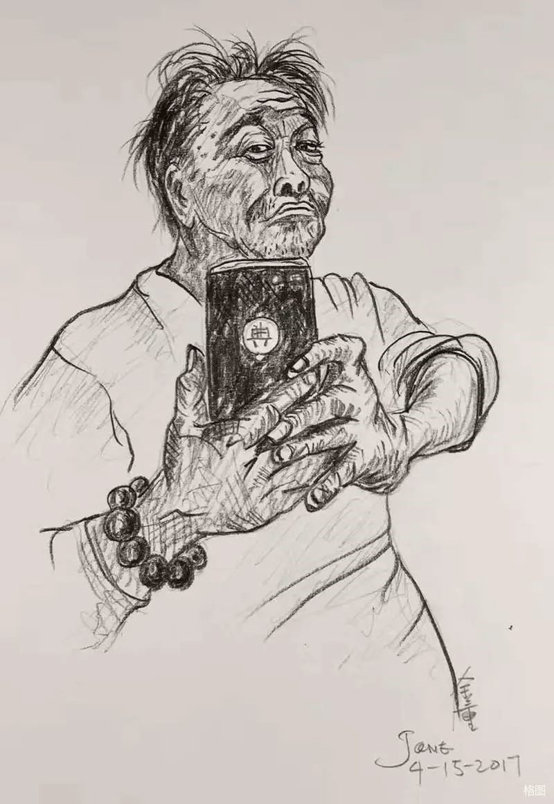

# 时代三部曲 之 看守所  

  

​选自典裘沽酒长诗——时代三部曲 之 看守所  

折掉围墙，世界就是一个最大的看守所  
没有围墙，世界仍然是个看守所  
那看守你的就是你自己  

只有骷髅，才能打开生锈的大锁！  
只有一场大火,才能烧毁这座人间地狱！  
                     ————题记

（哐当一声，门打开了。  
管教叫：112 ！出来，你女朋友来看你。  
有人怪叫：看得着，摸不着，白瞧）  

一只鸟飞过说  
这里是通向自由通向幸福的花园  
这里是通向死亡刑场的驿站  
一条狗走过说  
有多少各路英雄豪杰被囚禁在这里  
进进出出  
有罪并不一定非要进来  
无罪有时也要进来  

性欲在这里自摸希望在这里腐烂自由在这里上吊生活在这里死亡蚊子说最干净的是我们老鼠说最大胆的是我们死囚说最幸福的是我们哑巴说最爱唱歌的是我们贪官说最想自杀的是我们吸毒者说最痛苦的是我们杀人犯说最善良的是我们同性恋说最性福的是我们流浪汉说最不想家的是我们犯人家属说最想出去的是快刑满释放的人  

（哐当一声，门打开了。  
管教叫：007出来，律师会见。  
还有064！出来，剃光头。）  

一个诗人说：我一个人就是一个政府  
一个疯子说：我就能推翻所有对我的指控  
一个吸毒者说：我总是幻想自己是皇帝  
一个政治犯说：我总是在梦里推翻政府  
一个贪官说：我只能从情妇的阴道逃跑  
一个小偷说：我就是警服上的一粒纽扣  
一个妓女说：我让都市的霓虹灯更迷人  
一个杀人犯说：我让人们感觉人就是猪  
一个强奸犯说：我让妓女们羞愧无比  
一个艾滋病者说：我让许多眼睛看到什么皮包骨  

情欲，总在漫长的夜晚  
爬上乳房的山顶跳崖  
如果把一个男囚犯关进女囚仓  
那我们都会是罪加一等的强奸犯  
如果，档案袋装进了一粒米  
那我们就会被指控是我们拉的老鼠屎  
如果，从骨头抽出骨髓  
那就能抽出我们爬满苍蝇的灵魂  
如果，谁能改变罪恶的血型  
那我们就能真的重新做人  
如果，我们是国徽上生锈链刀收割的稻穗  
那我们骨头就是砌长城的砖  
高墙外总有喊我们名字的孟姜女  

我们总是听见管教的钥匙摇响自由的钟声  
我们也听见钟声里有妇人为浪子痛哭  
我们总是听见违反监规者被手镣脚镣铐着叫声  
我们听出那叫声像猪喉咙遇到一把尖刀的时候  
我们听见院子的水塘里一只小鸭子不停的叫着  
我们听说那是夜里被老鼠咬死的同伴的叫声  
在四面高高的围墙环绕  
它这一生中只有这么一个同类  
它是院子里最自由也是最孤独的生者  

（起床铃响如一把杀猪刀反复掉在钢板上  
一位管教在叫  
你们这些垃圾  
还不快跟我起床呀  
一个个以为你是什么少爷什么千金小姐呀  
不管有罪无罪罪大罪小,  
只要来到这里，在别人的眼里  
你们就是被人们遗弃的废物. ）  

折掉围墙，世界就是一个最大的看守所  
没有围墙，世界仍然是个看守所  
那看守你的就是你自己  

厕所是房间，房间是厕所  
厕所里的自来水最干净  
法官的脸是包公的脸  
包公的脸是管教的脸  
现代包公的脸  
比我们的罪恶还黑  

监仓没有黑暗  
耀眼的日光灯整天开着  
梦是最好的午餐  
仓霸是傀儡也是领袖  
自由走上断头台  
屠夫就是我们自己  
我们每天做花，悼念我们提前走向死亡  
我们的罪恶装进档案袋让法官宣判  
声音碰到高墙上的电网嗞嗞作响  
每一间监仓都是玻璃铸成，所有的隐私都摄制在监控室的电脑里  
每一个梦里都装有摄像头，每一声爱恨的呻吟都旋转着录音磁带  
每一次秘密约会，都被望远镜拉近放大，定格在博克勃的眼睛里  
每一只蚂蚁都没有秘密，蚂蚁唯一可做的事就是驼负饭粒奔跑着  
警察却反穿雨衣，雨水冲刷灵魂无一丝血色  

 （所长在院子里叫：快把这个标语挂上  
明天上级机关就要来检查了）  

人权写在墙上，褪色也依旧在风雨中显现  
他们是穿着制服的老虎总是虎啸  
他们王字的额头上总是国徽闪耀  
他们的腰上挂着一大串钥匙叮当作响  
他们表情麻木就像已宣判的死囚  
他们偶尔的笑容是在收押妖艳女人  
他们盾牌上的长城，砖都拆来砌高墙  
高墙外的孟姜女却哭不倒  
唯有金钱叠成飞机  
才能像鸟儿飞出奥斯维辛似的集中营  
他们遵守法律人性管理从不打骂在押人员  
他们放在背后的手却控制号称牢头狱霸的傀儡  
哪里有躲躲猫猫事件发生  
哪里就能听到乌鸦的叫声  

一只握着钥匙的腊制的巨手从故宫伸出  
无数无头的穿制服的人抬着  
他们几乎没有信仰，却信仰属于幻想形的终极哲学  
大头像挂在墙上  
他们却从不下跪祈祷忏悔  
起床的铃声却比火车的叫声更震撼人心  
我们梦中听见中世纪的钟声敲碎黑暗  
我们醒来听到的却是从未间断的万岁声  
他们有时也会迷惑  
为什么从监仓里飘出的歌声和渣滓洞里的歌声那么相似  
为什么这些人渣也爱唱他们先辈们爱唱的国际歌  
为什么那些律师们笑容中天秤从来金钱把良心压得很低  

（哐当一声，门打开了。  
管教叫：0872 ！出来，你男朋友来看你。  
一阵浪笑：阿丽好想你呀，啊强哥。）  

领导好  
报数  
12345678  
每天点名时我们都把双手放在脑后  
娇滴滴地撒一点合法的娇  
管教们走后有位难友笑着说  
领导好，好个屌  
女犯人都想搞  
姐妹们一片笑声  
大波妹拍她的屁股说  
还不是因为你整天放电  
她却说是呀先电死你  
边说边伸过手来抓大波妹的乳房  
我们笑着乱成一团  
生活就这样开始了  

放风了！黄昏的斜阳照在放风仓的墙上  
感觉在旧照片里低着头光着身子在低低的水龙头下轮流洗澡  
满身雪白雪白的泡沫好像一下洗掉了身上的罪孽  
那巡仓警察总是放轻脚步在偷看我们  
我们的乳房已很久没有男人摸过了痒痒的总是想粗造的手抚摸  
我们的阴道已很久没有东西充实了已经肿涨不想再空荡荡的寂寞  
我们慢慢开始圣洁了我们已慢慢的长出处女膜了  
我们已开始忘记那些臭男人只偶尔想起他们的生殖器  
我们抚摸着自己娱乐自己没有错吧管教要不我们一起来娱乐  
我们知道监控室的管教正在以法律的名义监视议论谁的乳房大  
我们知道他们说谁的阴毛多或少谁是白虎谁的肚子上有一条蜈蚣  
我们说看就看吧我们女囚也就只剩下身体还能吸引男人的眼球了  
我们听说前任所长总爱脱违反仓规的女囚裤子打屁股  
我们很坏的想象那像驴鸡巴的塑料胶管啪啪啪打在白花花的屁股上  
我们很过瘾的想象她们一边哭一边撒娇下次不敢了扭着肥胖的屁股  
我们当然不知道领导希望她们常犯仓规我们更不知道领导有窥阴癖  

今天，情人节。我们却在监狱里做塑料花  
过去情人节，男朋友送我们最喜欢的红玫瑰  
晚上去酒吧喝得醉熏熏回家澡也不洗就做爱  
啊！我们是多么怀念那浪漫的情人节呀  
可今晚我们却很早就睡了  
我们不祈求有人送花，就是想戴纹胸  
让自己回到女人的感觉这小小希望都难实现  
我们知道监规规定女在押人员人不许戴纹胸  
可姐妹的乳房个个都松松跨跨  
在这个情人节的晚上  
我们只想在梦里和一个男人约会  
却总是梦见一列龟头为火车头的列车冲进我们的黑暗的隧道  

（哐哐哐！管教敲铁窗叫：2114仓 ！  
你们发什么疯！开春晚呀！  
这么精神，明天罚你们多做些花）  

墙上壁虎在慢慢地回忆着亿万年前恐龙留下的缩影  
难得今夜那小窗口嵌着一弯月亮  
月亮啊，你是我们亲人们脸的重叠吗  
妈妈、爸爸、兄弟姐妹，还好吗  
我们后来哭了骂他妈的月亮是个骗子就像我们的情人  
我们的思念你从未传递你只是一块冰冷的大石头  
我们从此不再望窗外  
我们常常听到小鸟飞过的叫声  

一位戴铁镣的女毒枭她总是睡着  
她细皮嫩肉的脚已经浮肿让人想起了江姐  
我们问她临死前最后的心愿  
她说想和男人再做一次爱  
我们说吸毒的人对性不是没感觉吗  
她说上刑场前做爱能没感觉吗  
江姐临死的心愿是看到五星红旗飘扬在新中国的蓝天  
我们想江姐是否也会想到临死前和哪位同志做爱呢  
我们想江姐这样想不是没有可能的  
我们还想起了另一位女英雄张志新  
我们只是不明白为什么我们的监狱却总关着我们自己的英雄  

（哐当一声，门打开了  
管教叫：1012 ！出来，你老公来看你了  
有人淫荡的大笑：她在洗澡！是哪个老公？她可是每天换老公呀  
洗那么干净有啥用，又搞不到，白熬。）  

啊！乳房轻轻地拖过欲望的身子  
仿佛一辆坦克温柔地压过广场上的肉体  
啊！你们乳房上挂着五、一劳动奖章接客  
你们的淫荡为人类解决了比动物还凶猛的性问题  
啊！多少男人的性欲从沉睡中醒来  
夜夜深陷你们的温柔如红军过草地不可自拔  
啊！你们偷偷摸摸卖着货真价实的青春  
小贩却大声叫卖假货  
啊！谁还相信逼良为娼那些凄惨的故事  
但你们的身体比那些贪官的嘴脸要干净的多  
啊！你们敬业有理有节,宾主在友好的气氛中进行  
就像国家领导人会见外宾  
啊！警察总是性至勃勃的参加扫黃行动  
裤裆里的枪跟佩戴在腰的枪一样的硬  
啊！艺术家们在嫖的快感中创作多少惊世之作  
你们身价却比膺品要低贱  

啊！长江感谢你们高潮一浪高过一浪中华民族源头不会干枯了  
黄河感谢你们高潮叠起滔滔不绝母亲河不会再断流了  
长城感谢你们的叫床声胜过孟姜妇的哭声长城不会倒了  

啊！良心露出乳沟  
淫荡穿着齐B短裤  

（哐当一声，门打开了  
管教叫：064 ！出来，最后晚餐了。  
几人同声：兄弟好走！18年又是一条好汉！）  

远方一声枪响，震落死囚仓墙上的一只壁虎  
我们随时等候着最后的午餐  
我们从来没有吃过花生米  
我们知道这是人道主义在监所露出美人肚脐  
我们纯洁了很久的生殖器喷出泉水  
我们戴着手铐脚镣  
我们却从来不打架闹事  
我们不用劳动（做花）  
我们只是总是打牌  
我们打牌中度过这段等待枪决的日子  
我们很平静就像黎明前的曙光  
我们为何能这么安静面对待死亡  
我们也有信仰  
就是为了自由为了生活得更好而献身  
就像一些党派的宣言  

我们梦想在子弹头上擦上一点白粉  
我们已很久很久没有在长满罂粟花的山坡上滚来滚去了  
我们梦想政府杀猪时批准我们也杀一头猪  
让我们重新体验杀人和杀猪有什么区别  
我们梦想着强奸,看着她幸福的表情在高潮中死去  

（哐当一声，门打开了  
管教叫：036 ！出来，最后的审判！）  

政府，给我一盏灯吧，照亮我内心的黑暗。让太阳点燃我的骨头  
政府，给我一把火吧，我是垃圾我要燃烧，可我怕燻黑唯一的白衫衣  
政府, 给我一点白粉吧，让我居住在罂粟花丛不再失眼  
政府，给我一个烂苹果吧，我会把那条蠕动的虫子当肉吃掉  
政府，给我一句真话吧，我不想为听一句真话而死不瞑目  
政府，给我一场地震吧，让我在天地裂时死去才最痛快  
政府，给我一把枪吧，请不要怕，我只是想自己枪杀自己  
政府，给我一把刀吧，我想再杀一个该杀的人，手不再颤抖  
政府，给我一个母牛吧，让我强奸牛逼一次又一次，精尽而亡  
政府，给我一个男人吧，我的身体已很久没有男人开荒播种了  
政府，给我一餐最后的饱饭吧，人性管理就是让人死也有死的样子  
政府，给我一瓶烈酒吧，让我在醉酒中被枪毙在没有痛苦中死去  
政府，给我一个大一点的窗口吧，我好想再看看外面是怎样的世界呀  
政府，给我一个妓女吧,我不愿意再做一个同性恋者了  
政府，给我一次贷款吧,我要让咱村的孩子们都能上希望小学  
政府, 给我一次选择吧，让我选择加入某党派，为我的罪恶挡一挡呀  
政府，给我一颗良心吧，释放后我就再不会走进这人间地狱  
政府，给我一盘文香吧，不然艾滋病的血液就流淌在祖国锦绣山河了  
政府, 给我一副铁镣吧，让我高昂着头走向刑场，虽然我是大毒枭  
政府，给我一次做仓霸机会吧，让我在这里实现指点江山的欲望  
政府，给我一朵鲜花吧，面对着鲜花我的灵魂才会获得重生  
政府, 给我一腔喉咙吧,让我好好说话好好歌唱我们亲爱的祖国。  

2006年至2009年7月广州  
2014-5-30定稿  

作者简介：  
典裘沽酒：男，原名沈绍裘，垃圾派诗人、电影人，广东作协会员。1959年秋出生于湖南汨罗，现在广州铁路局工作。
