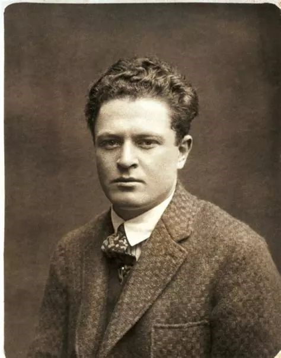

# 九点到十点的诗

纳齐姆·希克梅特（Nazim Hikmet）（1902—1963），土耳其诗人，被认为是土耳其现代诗歌的奠基者，"浪漫主义的共产主义者"，一生多次坐牢，系狱17年。

## 组诗：九点到十点的诗

（九点钟到十点钟牢房门关闭，但是没有熄灯。希克梅特承诺在这个时间里只为他的妻子Piraye写诗。）

想你，这多么美：  
周身有死亡与胜利的音讯，  
在狱中，  
我，年过四十……  

想你，这多么美：  
你的手抚摩蓝布，  
你的发灰白而柔软  
犹如我热爱的伊斯坦布尔的泥土……  
爱你，这欢欣  
　　犹如我内在的另一个我……  

天竺葵叶子的清香留在指上  
一股和煦的静，  
生理的呼唤：  
　　温暖、  
　　　　深邃的黑、  
被明亮的红线隔开……  

想你，这多么美，  
给你写字，  
独坐在狱中，记起你：  
某日某地因某事说了某些话，  
　　不是那些话本身，  
　　而是它们所指的世界发出晕光……  

想你，这多么美  
我必须用木头为你雕出什么——  
一只小盒子，  
一只戒指——  
为你编织三米长的细绢  
接着我要跳  
　　　起来，  
抓紧高窗上的铁栅栏，  
必须将我写给你的诗句喊出来，  
　　　对着乳白与蔚蓝的自由……  

1945年12月12日

平野上，树在做最后的努力，再次闪亮：  
　　　　　　　　　　碎片的金、  
　　　　　　　　　　　　　铜、  
　　　　　　　　　　　　　古铜与木……  
水牛的脚软软地陷入湿润的泥土。  
山峦沉浸在雾中：  
　　　　　　　铅灰、潮湿欲滴……  
就这样，  
秋季很可能就在今天结束。  
大雁划过，  
　　　　或许是飞往伊兹尼克湖。  
空气凉爽，  
　　　　散发出一种类似于煤烟的味道：  
　　　　而雪的气味已浮在空中。  

现在就出去，  
　　　骑马放步，奔向群山……  
你会说：“你根本不懂骑马”，  
但你可别笑话，  
　　　　也别嫉妒：  
在狱中，我已培养了一个新习惯，  
我爱大自然，  
　　　　　几乎与爱你一样了。  
　　　　　两者都是那么遥远……

1945年9月23日  

她在做什么，  
　　　此时此刻？  

在屋里还是户外？  
做事、躺着还是站着？  
也许她刚好举起了手臂——  
嗨，  
　　这样就突然露出那白藕似的手腕……  

她在做什么，  
　　　此时此刻？  

也许她在膝上  
抚弄一只小猫。  
或者，走着，一只脚提起而未落——  
那双可爱的脚将她带到我眼前  
　　　　　　　　度我黑暗的日子！  
她在想着什么——  
　　　　　　　　我么？  
或者——  
　　　哦，我不知道——  
　　　　　为何豆子那么难煮？  
或者别的——  
　　　为何大多数人如此不快乐？  

她在做什么，  
　　　此时此刻？

1945年10月28日  

天竺葵荡漾的香气，  
大海的哼鸣，  
秋天到来了，云朵丰满，大地睿智……  

我的爱人啊，  
年岁已经成熟。  
我们已经风历雨，  
　　　可称千岁有余。  
而我们仍是  
　　　睁大眼睛的孩童，  
　　　　在阳光下赤足奔跑，手拉着手……

1945年12月4日  

找出初相见时你穿的衣裳，  
穿出最美的你，  
穿成春天的树……  
将那朵康乃馨戴在头上，  
　　　　那是我夹在信中从监狱寄给你的，  
扬起你白皙的宽额头，黑发镶边，令人欲吻。  
今天，不可脆弱，不可悲伤——  
　　　　　　　　　　　　绝不要！——  
今天，纳齐姆. 希克梅特的女人必须美丽，
　　　　　　　犹如一面叛逆的旗帜……

1945年11月2日  

忘掉那些开花的杏子。  
它们不值：  
不能回来的事物  
　　　　　本不应该放在记忆中。  
到阳光下晒干你的头发：  
　　　　让那潮湿沉重的红色  
　　　　　　　　　　　与果实成熟的倦怠一同熠熠生辉……  
我的爱人啊，我的爱，  
　　　　这季节  
　　　　　　　落了……  

1945年11月8日  

从这座离我很远的城市屋顶之上，  
从马尔马拉海底，  
越过秋日的大地，  
　　　　　你的嗓音传来，  
　　　　　　　　　醇厚、清澈。  
三分钟。  
然后电话黑掉了……

1945年9月22日  

我读的每本书，  
　　　　　里面有你；  
我听的每首歌，  
　　　　　里面有你；  
我啃着面包，  
　　　　　你就坐在对面；  
我干活，  
　　　　你就坐在那儿盯着；  
你便是那无处不在的“我的永在”。  
　　　　我不能对你说话，  
　　　　我们听不到彼此的嗓音：  
你是我的八年活寡……

1945年9月26日  

他们抓了我们，投入牢狱，  
他们把我们关了起来：  
我，在墙内，  
你，在墙外。  
但这不算什么。  
最糟的是  
人们——自知或者不知——  
内心带着一座牢狱……  
大多数人是被逼如此，  
这些人诚实、勤劳、善良，  
同样值得爱，一如我爱你一样……

1945年10月9日

深夜里，我梦见  
你和我两人又同在一起，  
你忍受着那难以形容的痛苦凄然地望着我，  
你坐在我的身旁，  
抬起了头，伸出双手，  
和我讲着话，  
但是，我却听不到你的话语……  

这时，彷佛在何处响着  
节奏均匀的钟声，像在报道隆重的事情，  
空气在轻轻地说着生命和大自然的无穷，  
同时，也听到地下膨胀了的种籽的苗芽  
冲破了土壤，  
它们想走到光明的地方，  
看看星星。  
广大的人群行动着，  
大地响彻着他们的步伐……  
——你润湿的双唇轻声地谈些什么话，  
伹是，我却听不到你的话语……  

我气恼得醒来，  
才知道夜来睡在书上。  
铁锁沉默着，  
狱中的石墙也一语不发，  
但是，在夜半时分，  
我却和朋友们谈着话，  
你也和我同在一起。

土耳其诗人纳齐姆·希克梅特（Nazim Hikmet）出生于1902年，被认为是土耳其现代诗歌的奠基者，1922年受到俄国革命和社会主义的感召偷越边境去俄国，1924年回国，土耳其独立战争后，他因为创办左派杂志而被捕。1926年出逃到苏联，结识了马雅可夫斯基等人，并为戏剧大师梅耶荷德工作。1928年大赦，他被容许归国，但由于共产党在土耳其已不合法，因此之后的十年中他一直被监视，有五年时间因为各种不同指控而入狱。1929-1936年间，他出版了九本诗集，彻底革新了土耳其的诗歌传统，引入口语与自由诗。1938年，他因为"鼓动土耳其军队反叛“而被判入狱28年。1941-1945在狱中创作长诗《人的风景》。1949年，包括聂鲁达、萨特等在内知名人士在巴黎组成一个国际委员会，要求释放他，1950年希克梅特获得世界和平奖，同年被释放，但却以49岁的年纪被征兵。他乘坐一条小渔船逃离土耳其，其后到达莫斯科。流亡期间的1952年曾经到达中国。1959年被褫夺土耳其国籍后，他加入了波兰国籍。1963年6月心脏病发死于莫斯科，葬于莫斯科著名的新圣女公墓。　　


## 自传（外一首）

我生于1902年
我从未再回到出生地
我不喜欢回头
3岁时我是阿勒颇地方一个帕夏的孙子
19岁成为莫斯科共产主义大学的一名大学生
49岁作为契卡的客人我又回到莫斯科
而我从14岁始一直是一个诗人
有些人懂得植物有些人懂得鱼类
          我懂分离
有些人在心里熟知星星的名称
          我熟记缺席
我曾睡在监狱和大酒店
我知道饥饿知道绝食几乎没有我
不曾尝过的食物
30岁时他们要绞死我
48岁时我被授予
           和平奖
36岁时我在4平米的土牢里被关了半年
59岁时我从布拉格到哈瓦那飞过了18小时
我没有见过列宁1924年我站在他的水晶棺前注视过他
1961年我瞻仰的陵墓是他的书籍
他们试图把我与我的党分开
没有起效
我也没有被倒下的偶像压碎
1951年我与一个年轻的朋友乘船差点驶入死亡的口中
1952年我带着一颗破碎的心平静地等待死亡整整四个月
我嫉妒我爱的女人
我一点也不嫉妒查理•卓别林
我欺骗过我的女人
我从不谈论朋友的缺点
我喝酒但并非每天都喝
我诚实地赚取面包金钱以及所有构成幸福的东西
出于尴尬我对他人撒谎
为不伤害他人我撒谎
    但我也毫无理由地撒谎
我搭乘过火车飞机和汽车
多数人无此机会
我去剧院听歌剧
     大多数人甚至从不知道什么叫歌剧
1921年以来我从未去过多数人经常光顾的
清真寺教堂寺庙犹太教堂巫师堂
     但我有我的咖啡馆阅览室
我的诗文以30或40种语言出版
     但在我的土耳其我的土耳其著作被禁止
癌症还未俘获我
也无迹象表明将会如此
我永远不会去做总理或类似的事
我不想要这样的生活
我也会去打仗
不会钻进夜晚的防空洞
我绝不会去尝试潜水舵
但在年近60岁时我陷入了情网
简而言之
即使今天我在柏林因悲痛发着牢骚
    可以说我一直在像一个人那样生活
谁知道
    我还能活多久
    还有什么事情会发生在我身上

1961年9月11日 柏林

## 对将要坐牢的人几句忠吿

如果你还相信  
祖国、世界、人类——  
他们不是把你押上绞刑台，  
就是把你投入监狱。  
你将在那儿坐着，  
几乎一直坐到死，  
纵然在死亡的界标那边，  
我的好朋友啊，在那儿  
你的灵魂也得坐着  
度过宇宙的剰余时间！  

但是，在监牢里你不要请求  
把你用一根绳索  
像军舰上的小燕尾旗似地  
高高地向天空吊起，  
因为，即使生活成了重担，  
你还没有喝完一杯生命的酒！  
这一点你自己也知道。  
只要你还活在世上，  
你活着的每一个日子  
就是对敌人的一个打击。  

在监牢里，你会成为  
一个孤独的人，  
像一块石头  
躺在漆黑的井底。  
但是，你的一部分灵魂  
应该和我们留在一起，  
如果树林中的一片叶子  
掉进奔流着的溪水，  
你在监牢里也应该感觉到  
这片树叶落下时的声音！  

在监牢里面，你会  
想出一些悲哀的歌曲，  
你会躺在床板上不动，  
成星期地等待着来信，  
然而，这是愚蠢的，危险的；  
走了进来，你先要剃剃胡须，  
提防虱子爬上你的衣裳，  
不要在夜晚梦想春天，  
记住：春天的日子，  
牢房里令人特别难熬。  

整块面包你都要吃完，  
一点残渣也不要留下，  
抛开你的忧愁吧，  
随时地放声大笑吧，  
汤盘里的食物  
也不要剰一调羹……  
也许，人们忘记了你？  
这自然不那么容易忍受……  
也许，人们不再爱你？  
那可真是坏运气……  

不过你要记住，在监牢里  
甚至于树木上的绿芽  
你也会觉得它是枯枝——  
这是心灵的错觉。  
你在监牢里要忘掉香花——  
去幻想你正在爬上峭壁，  
正在大风浪的海洋里航行，  
正在呼吸咸味的海风，  
你去想吧，读吧，写吧，  
可是不要等待回答。  

去坐到织布机旁边，  
去用钻石琢磨玻璃，  
十年、十五年时光的飞驰  
将要快过一个星期，  
连你觉得不可思议的事情，  
也会很快地实现，  
忧愁不能再使你迷惑，  
藏在你左胸中的  
那颗最宝贵的钻石，  
理智也将使它平静！

## 今天是礼拜天  

今天是礼拜天。  
这是他们第一次带我出来见见阳光。  
也是我一生中第一次被惊呆：  
天空如此高远  
如此湛蓝  
如此辽阔  
我站在那儿一动不动。  
然后我谦恭地坐在地上，  
倚靠着白墙。  
现在，谁会关心那我渴望掀起的浪潮，  
或关心斗争，或自由，或我的妻子。  
这土地、太阳和我……  
我多么高兴。  

## 自由的可悲处境  

你浪费了你双眼的注意力，  
浪费了你双手闪耀的劳动力，  
你为大量的面包揉捏了太多的面团，  
而你连一小块也尝不到；  
你是自由的去做别人的奴隶——  
你是自由的去使富人更富。  

你出生的那一刻，  
他们在你周围建造  
磨坊，碾出谎言  
那谎言会持续你一生。  
你以你高度的自由继续思考，  
手指放在太阳穴上  
自由地拥有自由的良知。  

你的头弯着好像从后颈被砍了一半，  
你的手臂很长，垂着，  
你以你高度的自由四处闲逛：  
你是自由的  
有着被解雇的自由。  

你热爱你的祖国  
犹如对你是最亲近的、最珍贵的东西。  
举个例子，但是一天，  
他们会把它签售给美国，  
还有你，和你高度的自由——  
你有自由让它成为一座空军基地。  

你会强调，一个人必须生存着  
不是作为工具、数字或者链环，  
仅是作为一个人——  
而他们立即铐上你的双手。  
你是自由的被拘捕、被监禁  
甚至被绞死。  

在你的生命中，  
既没有铁质的、木质的帷幕，  
连一层薄纱也没有。  
没有必要去选择自由：  
你是自由的。  
但是这种自由  
是天底下一件可悲的事。
