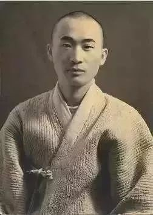

# 韩国诗人高银

​高银(1933年— ），韩国诗人。原名高银泰,法号一超。因在韩国民主运动中的角色而多次被监禁。三次被提名为诺贝尔文学奖候选人。  

他1933年生于全罗北道群山市，在日本占领期间，民族文化被压制的时候，他的祖父教他用韩文读写。他八岁时也开始学中文。1950年朝鲜战争爆发时，他的许多亲戚朋友死亡，在此期间，他被迫作为一名掘墓工工作。受到很大的心理创伤，甚至把酸倒在自己的耳朵上，以封锁战争的声音，让耳朵聋哑。然后1952年，他决定成为一名和尚。
十年之后，他出版了第一本诗集《彼岸感性》（“OtherworldSensibility”，1960）和第一部小说《另外的世界的樱桃树》（“Cherry Tree in Another World”，1961）。在山里过了10多年僧侣生活后，他又选择还俗。从1963年到1966年，他住在偏远的济州岛上，在那里设立了一所慈善学校，然后搬回了首尔。然而，因为酒精依赖和情绪不稳定，他在1970年尝试过毒死自己。

另一个时机改变了这种消极状态。一天，他在酒吧的地板上偶然拣起一份报纸，读到一个年轻的纺织工人在示威活动中为支持工人的权利而自焚。震惊之下，他转向社会行动主义。七十年代的韩国处于军事独裁的时代，充满了各种不公和腐败，贫富差距拉大，社会底层穷人的权利没有保障。高银要做的就是和这些斗争。1974年，他创立了实践自由作家协会。1978年，他成为韩国人权协会副主席，1979年担任民族团结协会副主席。

由于这些活动，高银被送到监狱三次，在那里他被殴打和折磨。其中一次，在1979年的一场殴打中，他的听力进一步恶化。1980年5月，在全斗焕领导的政变期间，高银被指控犯有叛国罪，并被判处二十年监禁，虽然他于1982年8月因为大赦而被释放。此后他的生活变得更加安静，1983年他与英国文学教授李相华结婚，最终后者成为他的几本书的合译者。

在京畿道安城搬迁后，他现在致力于多产的写作生涯，但一如以往的积极主动。他当选为韩国艺术家协会（1989 - 90年）和国家文学作家协会会长（1992-93）。他在1995年担任民族解放委员会代表。2000年，他访问了朝鲜，作为韩国首脑会议的特别代表之一，也导致了诗集《南，北》（2000）的产生。在此之后的几年里，他还多次访问了北韩。他也是一个南北联合倡议的主席，目的在于编纂一部泛韩词典，涵盖半岛今天所说的各种不同形式的语言，涉及到三十八线内外的数十名学者。2014年，他被教科文组织韩国国家委员会任命为亲善大使。
直到1990年以前，他都没有签发护照，最终他却成为海外韩国诗歌的主要代表。从2007年起，他在首尔国立大学担任访问学者，在那里讲授诗歌和文学。自2010年起，他与檀国大学国际创意写作中心合作。2013年初，他被邀请在意大利威尼斯Ca'Foscari大学举办了几次特别讲座，为期一学期，在那里他被授予荣誉研究员。

在琵瑟山监狱，高银听力尚好的那只耳朵被打聋了。出狱接受治疗，夜晚回到监狱，高银写下了《悟道颂》。

悟道颂

琵瑟山监狱
四十八岁
凌晨一点左右
睁开眼
晚得近乎愚蠢的领悟
所谓贫穷就是被剥夺

琵瑟山监狱
每间牢房都在沉睡
主任巡视之后
寂静
所谓罪过就是被剥夺
结果 这个国家
早已远离真理

一只耳朵手术后回来
凌晨的寂静之中
响起邱马高速公路夜行货车疾驰的声音

世界因贫穷和罪恶而日益肥硕
我想用奚琴声而不是笛声划过全身

阳光

我完全无助。
我必须吞掉自己的痰
和自己的不幸。
但是瞧！
一位高贵的客人屈尊拜访
我那狭小、朝北的牢房。
不是首长的巡视，不。
夜晚降临时的一抹夕照。
一线还没有邮票大的闪光。
我为此而疯狂！就像是初恋！
我试图让它安歇在我的手掌上，
让它温暖我胆怯而坦露的脚趾。
当我跪下，向它献出我不虔诚的瘦脸，
有一瞬间那阳光的碎片滑走了。
当栅栏里的客人离去后，
房间有好几次看起来更冷、更幽暗。
这个特殊的军事监狱
就像摄影师的暗室一样。
没有任何阳光，我笑得像个傻子。
一天那曾是装着尸体的棺材。
一天那曾是整个大海。多么奇妙！
很少人从这里生还。

活着是一个大海
眼里没有一片帆影。

《短歌》选

波兰的奥斯维辛集中营
那里有堆成山的眼镜
堆成山的鞋子
堆成山的静默

我的诗  

五十年代那废墟无边的日子里  
我是浪迹天涯的漂泊者  
战后那些四处遗落的句号  
是意想不到的救赎  
句尾一个黑点的伟大  
使跟在后面的句子不时闪亮  
我动不动要往我的诗里点上许多句号  

进入七十年代  
我的诗  
是在岸边打转的水  
面对遥远的路踌躇不决  
不知不觉间  
涌到河中央奔流  
在这过程中  
句号淡出了我的诗  
多年的救赎像穿烂的鞋变得无济于事  
  
唯有没有句号的诗  
不会以一首诗告终  
化作一首  
又一首新诗  
叼出藏在黑暗中的光  
靠它艰难辨别事物和事物的背后  
  
这世界生生不息  
在我的诗诞生之前  
已不允许哪怕一个句号的存在  
于是我那些没有句号的诗  
也汇为宇宙不可逆的运行  
终于明白这是不可逆的轮回  
除此之外，所有自觉都是错觉  

我幻想  
我的诗每天摇身化作  
成群起飞又成群降落的鸟儿  
化作其他诗人的许多诗  
哦，拂晓的幽蓝  
多么像令人震颤的霎时的音域  
当今天  
化作无数不知疲倦的过去之河向东流去  
我的诗从明天到后天永远没有句号  

1993

某天独白

下午雪下着下着就停了，狗儿们奋力跑开
不知何时才能盼到
可以不爱祖国的那一天
我所渴望的
不是祖国
而是可以不爱祖国的那份自由

雪重又下了起来

酒够了
书够了

遗落的诗

假如能够，假如真的能够  
谁不希望变回婴儿，从母亲的子宫深处重新出发  
生命注定孤独  
独自聆听下一轮涛声  
但即便如此，也不该改变初衷吧  
瞧这些年漂泊岁月的残片  
散落四处  
像晾晒的衣物在风中飘扬  
贫困时，就连泪都供不应求  
一些夜晚，在将熄的篝火边暖着冰凉的背  
忽又不胜寂寥，转身烤起胸膛  
还有一些夜晚  
在黑暗中沉沦，任身体冻透瑟瑟发抖。  
当无数明日转成今天时  
我总是坐在最后一排的客人  
日暮时分，群山重峦叠嶂  
前方的路  
比走过的路更远  
风在吹  
风在吹  
悲伤，终究不能易手  
看远处  
一盏灯火  
显得那般哀痛  
遗落在岁月那头的能有什么  
我却总是  
怅然若失  
无心逗留惶惶然起身  
在水雾消散的西海岸泰安半岛的尽头  
那是哪个年代哭泣的魂，还是诗

2002

回忆录

二十岁  
不知为何，厌食般排斥杏花盛放的春天  
被饥饿折磨着  
向往“哐”的一声  
栽倒在  
西伯利亚伊尔库茨克零下四十多度  
酷寒的冰天雪地  
再让年轻的十二月党人补上一枪  
愚顽的岁月里  
巴望的唯是无休止的疾风迅雷。  
然而铡刀剁下仙人的手腕  
泥土遭遇镐砍，皮开肉绽  
土渣哇哇呜呜地号泣  
六十岁  
毅然把各种杂八杂七清空  
最鄙视迟来的辩解  
依旧  
受不了风和日丽的大晴天  
当电闪雷鸣  
向漆黑的云层插一刀  
抑不住喜悦  
在旷野的身躯之上  
狂奔  
朝着遥远的那一端  
原野的尽头  
所有达观见鬼去吧  
所有解脱见鬼去吧  
六十岁后也一直幼稚灿烂  
与三两个好友  
只保留一只肺  
为了缺失的那一只  
不得不日夜朝另一侧跋涉  
迄今铭记着后知后觉的晚星似的格瓦拉  
后半生是前半生的大爆炸

2002

全斗焕政权时期，高银再次入狱，罪名是用诗歌颠覆国家政权，被判刑二十年，并随时有可能处死。就是在这次服刑期间，高银发下宏愿，如果他能活着走出监狱，他要为这些年来他在服刑期间认识的每一个人写一首诗。就是后来结集的《万人谱》。（国内出版的《唯有悲伤不会撒谎》有摘选）

（出家时期的高银）

