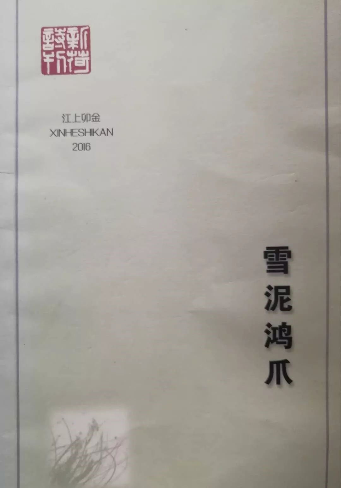
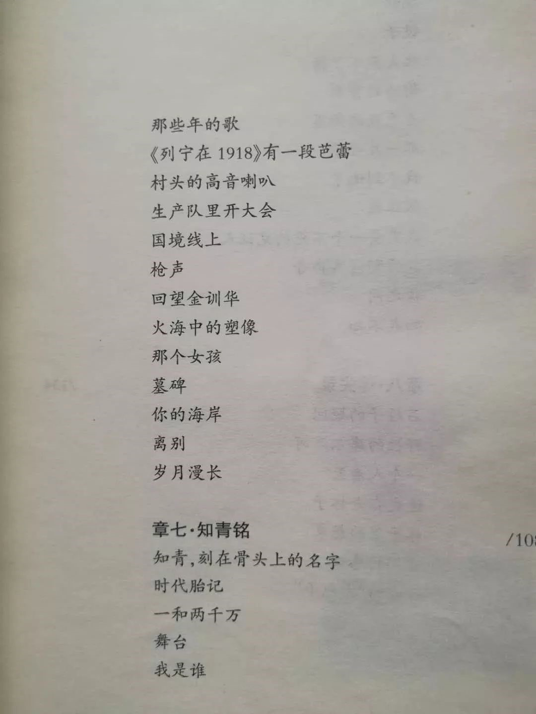

# 提篮桥监狱江上金卯诗集《雪泥鸿爪》  

前几天看到上海提篮桥监狱有内部诗刊，名为《新荷诗刊》，不无怀疑的试着买了两册。昨天下午收到后，很快翻完了这一本。  

藉着这本150页的小册子，要向提篮桥监狱管理方竖一个拇指。  

这本《雪泥鸿爪》是新荷为一位笔名叫江上卯金的犯人出的个人诗集，选了江先生2012到2015年的100首诗。这位江先生大概是上海人，年轻的时候在北大荒插队做知青。诗集里只捎带的提到两次黄浦江，多是关于白山黑水、知青岁月的回忆。那个时代，那段过往在他的书写下愈发猩红浓烈。  

江先生在序言里提到自己2019年要脱离高墙了，希望他过的从容安宁。  

新荷从1989年创刊，从季刊到双月刊，到现在出了近150期。刊登了8000多名服刑人员的数万首诗歌，作者来自全国29个省市区200多所监狱。2018年底在上海市提篮桥监狱首届蓝桥文化节出了30年专刊《新荷三十年集》。  
提篮桥监狱还有著名的新岸艺术团以及习美工作室。  

## 岁月漫长  

岁月漫长，你要等我  
记得你那时的神情  
你说下雪了，火苗在眼中闪耀  
下雪了，会告诉我什么  

岁月漫长，你要等我  
你可以拿走我的面包  
拿走我的空气和骄傲  
可不要拿走你的微笑  

岁月漫长，你要等我  
你的苍白可是因为面对寂寥  
我给每片叶子注入一个灵魂  
每天下午给你带来新鲜的阵雨  

岁月漫长，你要等我  
我遇见一个来自古国的行者  
他说两个巨大的影子  
站在沙漠中已经千年了  

岁月漫长，你要等我  
你看见高山吻着碧空  
黄昏不再忧伤  
波浪相互拥抱  

岁月漫长，你要等我  
当北方的气流被我征服  
我就带着雪带着火带着呼啸  
一头撞进你的房门  

2015.9.20  

## 我需要一个不死的见证人  

东方升起睡眼朦胧的太阳  
衰老苍白的月亮悬在西方  
沉重的露水压弯了一池新荷  
我需要一个不死的见证人  

那条生命之路，那个渡口  
被淹没在水库三十年了  
老林子被扭曲的小桦树替代  
我需要一个不死的见证人  

黑暗的前奏曲响成一片  
死神的绳索已经伸来  
我忘掉一切悲欢荣辱  
我需要一个不死的见证人  

时光像一座奔跑的坟墓  
疯了一样追捕惊恐的目光  
唯有你一定要跑过时间  
我需要一个不死的见证人  

我怎么能制止我的灵魂，让它  
不向你的灵魂接触，我怎能让它  
越过你向着其他的事物？  
我需要一个不死的见证人  

你在一百年后还能站出来  
指着那一截断碑，说  
挖下去就有我黑色的青春  
我需要一个不死的见证人  

## 知或不知  

我一直想知道  
——那个最高指示的形成  
在中南海什么的黑暗  
在御书房神秘的灯光  
在那支烟照亮了那颗著名的痣  
在8.18红色狂飙从天安门广场扑面而来  

我知道，那深夜触目惊心的鼓声  
足以让千万扇窗子从此彻夜不眠  
让黑色大字流下学生的鲜血  
让红色忠诚替代少女的贞操  
那个曾经在湘江畔指点江山的青年  
他的湘潭口音移动两千万羔羊不着一鞭  

我一直不知道  
两千万人走向人生拐角  
红色火焰落下黑色灰烬  
春来秋去潮升汐落  
难以估计的归期和明天  

我知道，这段人生可以  
为成功者镀金说无怨无悔  
千万人从这个拐角跌落  
一辈子乌云密布苦熬人间  

如果我用这段历史感动大地  
大地就会塌陷、崩溃  
两千万人露出赤裸的胸膛  
露出你们深陷心底的伤疤  

2015.9.12  

## 一和两千万  

静静的书架上堆着一排排书  
那宁静的怒吼在其中的一本沉睡  
写下的山是虚空的，水是枯瘦的  
写下的风是飘忽的，雨是酸涩的  
写下希望，希望就此消失  
写下梦想，梦想就被惊醒  

一个人要写两千万人的历史  
两千万人要写两千万人的历史  
两千万人十年的历史、五十年的历史  
可以翻动一座大山，掀起一条大河了  
历史就放在那里，没有人能动它的  
我们回过头去，翻那座山，淌那条河  

日落总是令人不安，那个属于他们的太阳  
无论它富丽浮华还是一贫如洗  
就像世纪前，世界还有三分之二生活在水深火热  
连绵的悸动，每个人都打上血红的印记  
就像世纪前，广场上疯狂的鼓点万人起舞  
一年比一年整齐划一，一年比一年漫无边际  

没有别的了，只剩下回忆  
和每天都受折磨的黄昏  
只感到有一种含糊的认命  
一问再问是什么命运的乖张  

我被我自己丢失了吗？  
在命运的悬崖上哽咽无言  
这座造成了又拆掉的庄园  
是在渴望我们的血，吞没我们的死亡  

2015.9.18  

## 一个人在林中行走  

一个人在林中行走，  
秋天在风中凋残。  
一颗橡子正好砸在  
我的头上，它认出我了吗？  

一个人在林中行走，近处  
有落叶松、柞树和  
不知道名字的树。 它们  
高高低低，树杈互相纠结。  

一个人在林中行走，我  
以为会遇见一个鄂伦春猎人，  
听他讲傻狍子和犴的故事。  
或者遇见一对流亡的鹿，在  
桦树林深处闪出身上的梅花。  

一个人在林中行走，与一棵  
美丽的雪松对视。闯进  
一匹脱缰的马，警惕地看着我  
飞快地跑去，把  
惊恐留给我。  

一个人在林中行走，走进  
一生的寂寞。万物都有  
隐遁的通道。 所以  
不要错过每一棵树每一株草每一朵花，  
不要错过每一只山雀每一只野兔每一只蝴蝶。  
每一个单独的生物，都  
只会出现一次。  

一个人在林中行走，确信  
一种神秘的力量曾经来过。  
我知道，我必须在这条路上  
走下去，必须在  
这条路上流亡。  

2012.6.28  

## 梦在1966  

一  
一只纸鹞，  
把我放到1966.  
一根线，  
捏在时间手里。  

二  
每一面墙都躁动起来，  
墨汁淋漓，  
涂抹在血色的年代。  

三  
红色的章鱼，  
流动在城市街头。  
从一个个开着或关着的窗户  
拖出一个个飘忽的灵魂。  

四  
哭泣是奢侈的，  
哭泣自己的死亡，  
谁会看到眼泪。  

五  
后来，就失去了  
说话的权力。让高音喇叭  
代替你和你们，他和他们  
我和我们，还有  
一只麻雀，在读红皮书  
三秒钟背出几页。  

六  
午夜的鼓声，  
对换黑白。  
顺天承运的号外，  
成为城市的飞雪。  
高举的手，升起，又  
举在腮边。 一滴虔诚的泪  
打在领袖的唇下，  
那颗著名的痣，  
点在1966那个深秋。  

七  
一条苍白的腿  
在剪开的裤脚飘零。说  
我跳过芭蕾。  
剃了半边的头，几道  
触目惊心的血迹，构成  
这座城市那天的风景。  

八  
死亡也保持不了尊严。  
贝多芬和莫扎特都  
成了哀乐。一件  
不是温良恭俭让的军装  
把整个春天送进了冬季。  

九  
一枚嵌进胸膛的像章，  
在冬季刺人这座城市。  
吸着年轻的和不年轻的  
血。蝙蝠飞翔时  
会绕着太阳，带血的翅膀。  
就是这样的红色  
成为一片汪洋。  

十  
牛皮带伤的铜扣  
笑着抽在寂寞的脸，  
升起红色的花。  
世界闭上了眼。  
一只白色的乌鸦  
惊恐不安。  

## 《列宁在1918》有一段芭蕾  

她呼吸的空气侵人  
我的眼睛和心底的平静  
她举手投足的韵律  
缠绕我年轻的心跳反反复复  

腿股间的烛火  
温暖着青春的种子  
我看见一个梦在移动  
荷尔蒙膨胀着聚拢过来  

春天一步跨过冬天时  
处处是危险的倒影  
我陷在黑暗的人群中  
每个人都只有自己  

黑白如此艳丽  
小提琴颤动着足尖  
天鹅的羽毛闪烁  
旋转着风雪无与伦比  

时光抛出我凡夫俗子的躯体  
灵魂仿佛落叶般飘零  
那两分钟的画面切入生命  
《天鹅湖》成为我唯一的《圣经》  

