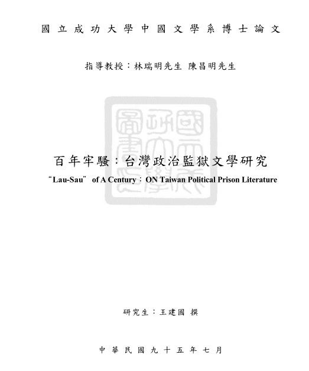

# 《百年牢骚：台湾政治监狱文学研究》

绪论 第一节：监狱文学巡礼

选自《百年牢骚：台湾政治监狱文学研究》
绪论 第一节：监狱文学巡礼
作者：王建国

每个囚儿坐牢  
上帝都带来了  
对你并未失望的信息  
我的诗风呵  
得到了熏冶，掠过了狱间  

穿过刑坊  
跨过牢墙  
越过了海洋和森林  
寻求它自由  
独创的歌声  

(曹开〈独创的歌声〉，1997：43)

自古以来，不乏如苏格拉底与耶稣等欲擎真理火炬照亮世界，反遭世人以黑牢回报进而牺牲生命者，前者饮鸩而尽，后者钉上十字架，皆成为这个世界不配有的人。此后，随着越来越多人下狱，监狱亦渐渐成为著述及文学炼成所。世纪之初，保罗诸多狱中书信，六世纪时波伊乌(Boethius)之《哲学的慰藉》⋯⋯等；欧洲文艺复兴以降，表面彰显人之发现其自我及理性诸价值，然深入历史底层后，将发现事实却非如此：伏尔泰(Voltaire，1694-1778)因 1717 年开罪于摄政王奥尔良公爵而被监禁于巴士底监狱约一年(曾以卡德琳‧美第奇屠杀胡格诺教徒之「圣巴托罗缪惨案」为蓝本创作史诗以抨击宗教迫害，六年后出版即被抢购一空)、1726 年再因与权势贵族争吵再度被投入巴士底监狱，旋即被逐出国(前往英国)、1734 年又因秘密印行的《哲学书简》宣扬洛克经验哲学推崇英国政治制度、商业及文学，向法人介绍莎士比亚，反对现行宗教与政治体制，面临投狱危险而又逃至女友夏特莱夫人在西雷村的庄园⋯⋯一生可谓与监狱结下不解之缘；尤有甚者，萨德侯爵(Marquis deSade，1740-1814)一生更断断续续有二十七年的时间在监狱度过，足迹遍及法国当时大大小小的著名监狱，包括位于巴黎市区的巴士底监狱－－《索多玛一百二十天》即在此完成：自 1785 年 10 月 23 日开始动笔，卅七日后完成。

陀思妥耶夫斯基(F.Dostojevskij，1821-1881)则因参加社会主义彼得拉舍夫斯基小组活动遭沙俄逮捕并判处死刑，于 1849年 12 月 22 日押往谢苗诺夫校场处决时，却又临时改判服苦役四年后充军，而注定其后写作皆与监狱脱离不了干系：关押期间共曾留下五封狱中家书，其中，最后一封更是写于其从刑场押回监狱而惊魂甫定之际，深刻反映其处于生死边缘之心理状态，日后所完成之《白痴》中死囚临刑的恐怖心态亦多取法于此；1854 年 1 月 23 日服刑期满出狱，亦立即去函其兄，曝露狱中之骇人听闻，并且，此段狱中经历也成为其后来《死屋手记》之思想基础。

不见容于维多利亚社会的王尔德(OscarWilde，1854-1900)也因系狱而使自己生命由快乐天堂坠入悲哀深渊，从而在其《狱中记》写下「有悲哀的地方，就是神圣的地方。」与「悲哀是人生的真理」等深刻体尝。

此后，布哈林(NikolaiBukharin，1888-1937)《岁月－－布哈林狱中绝笔》、葛兰西(Antonio Gramsici，1897-1937)《狱中札记》、伏契克(Julius Fucik，1903-1943.9.8) 《绞刑架下的报告》、希特勒(Adolf Hitler，1889-1945) 《我的奋斗》、朋霍费尔(Dietrich Bonhoeffer，1906-1945)《狱中书简》、拓尔(Pramoedya Ananta Toer，1925-)《逃犯》与《游击家族》、法兰克(Anna Frank，1929-1945)《安妮的日记》、索因卡(Wole Soyinka，1934- )《狱中诗抄》、哈维尔(Vaclav Havel，1936-)《狱中书简－致亲爱的奥尔嘉》、吴古奇(Ngugi w aThiongo)《拘留：一个作家的牢狱日记》⋯⋯莫不皆因囚禁而深切体现人作为本质性的存在，从而愈加激发其创作之泉源与情思、深化思维及冶炼智慧，终而化为为晶莹文字。

在中国，贯穿厚实狱墙之幽幽荧光亦从历史彼端透显而来。

李斯(BC 前？－BC208)曾于狱中上书，然遭人截获，故其书佚而其情终未获达。

太史公(约 BC145 或 BC135－？)因李陵祸而忍垢幽系，深惟「夫诗书隐约者，欲遂其志之思也。昔西伯拘羑里，演《周易》；孔子厄陈蔡，作《春秋》；屈原放逐，着《离骚》；左丘失明，厥有《国语》；孙子膑脚，而论《兵法》；不韦迁蜀，世传《吕览》；韩非囚秦，〈说难〉〈孤愤〉；诗《三百篇》，大抵贤圣发愤之所为作也。此人皆意有所郁结，不得通其道也，故述往事，思来者。」发愤而成名垂千古之《史记》。

邹阳因见嫉入狱，自辩而成〈狱中上梁王书〉云：「今臣尽忠竭诚，毕议愿知。左右不明，卒从吏讯，为世所疑。是使荆轲卫先生复起，而燕秦不寤也。愿大王孰察之！昔玉人献宝，楚王诛之；李斯竭忠，胡亥极刑。是以箕子阳狂，接舆避世，恐遭此患也。愿大王察玉人李斯之意，而后楚王胡亥之听，毋使臣为箕子接舆所笑。⋯⋯故偏听生奸，独任成乱。⋯⋯是以圣王制世御俗，独化于陶钧之上，而不牵乎卑乱之语，不夺乎众多之口。⋯⋯今欲使天下寥廓之士笼于威重之权，胁于位势之贵，回面污行，以事谄谀之人，而求亲近于左右，则士有伏死崛岩薮之中耳，安有尽忠信而趋阙下者哉？」终获孝王下令释放并尊为上客。

嵇康(224-263)为吕巽淫庶弟吕安妻徐氏事斡旋，唯吕巽却告吕安事母不孝，致吕安被捕下狱，且放逐边疆，康复仗义亲至狱中为安辨，并作〈与吕长悌绝交书〉；司马昭策士锺会则趁机进谗逮捕之，其〈幽愤诗〉云：「嗟余薄祜，少遭不造。哀茕靡识，越在襁褓。母兄鞠育，有慈? 威。恃爱肆姐，不训不师。爰及冠带，冯宠自放。抗心希古，任其所尚。托好老庄，贱物贵身。志在守朴，养素全真。曰予不敏，好善暗人⋯⋯咨余不淑，缨累多虞。匪降自天，实由顽疏。理弊患结，卒至囹圄。对答鄙讯，絷此幽阻⋯⋯庶勖将来，? 馨无臭。采薇山阿，散发岩岫。永啸长吟，颐性养寿。」。

骆宾王(约 AD640－？)因讽谏武后为当时所忌，系狱，而以〈在狱咏蝉〉自况：「西陆蝉声唱，南冠客思深。不堪玄鬓影，来对白头吟。露重飞难近，风多响易沉。无人信高洁，谁为表予心。」

苏轼(1037－1101)因乌台诗案，下狱而作〈狱中寄子由〉(其一)：「圣主如天万物春，小臣愚暗自亡身。百年未满先偿债，十口无归更累人。四处青山可埋骨，他年夜雨独伤神。与君世世为兄弟，更结人间未了因。」(其二)：「柏台霜气夜凄凄，风动琅珰月向低。梦遶云山心似鹿，魂飞汤火命如鸡。眼中犀角真吾子，身后牛衣愧老妻。百岁神游定何处，桐乡知葬浙江西。」

文天祥(1236-1283)遭虏慷慨而咏〈正气歌〉：「天地有正气，杂然赋流行。⋯⋯风檐展书读，古道照颜色。」

夏完醇(1631-1647)抗清事败而囚，临刑进呈〈狱中上母书〉：「斤斤延此二年之命，菽水之养无一日焉。致慈君托? 于空门，生母寄生于别姓，一门漂泊，生不得相依，死不得相问。淳今日又溘然先从九京，不孝之罪，上通于天。⋯⋯二十年后，淳且与先文忠为北塞之举矣。⋯⋯大道本无生，视身若敝屣。但为气所激，缘悟天人理。恶梦十七年，报仇在来世。神游天地间，可以无愧矣。」

方苞(1668-1749)因文字狱株连而撰〈狱中札记〉，是为目前所见关于中国古代封建监狱较为详赡纪实之作，其云：「禁卒居中央，牖其前以通明，屋极有窗以达气。⋯⋯每薄暮下管键，屎溺皆闭其中，与饮食之气相薄。⋯⋯方夜中，生人与死者并踵顶而卧，无可旋避。此所以染者众也。⋯⋯茍入狱，不问罪之有无，必械手足，置老监，俾困苦不可忍。然后导以取保，出居于外，量其家之所有以为剂，而官与吏剖分焉。⋯⋯凡死刑狱上，行刑者先俟于门外，使其党入索财物，名曰『斯罗』。富者就其戚属，贫则面语之。其极刑，曰：『顺我，即先刺心；否则，四肢解尽，心犹不死。』其绞缢，曰：『顺我，始缢即气绝；否则，三缢加别械，然后得死。』惟大辟无可要，然犹质其首。⋯⋯噫！渫恶吏忍于鬻狱，无责也；而道之不明，良吏亦多以脱人于死为功，而不求其情。其枉民也，亦甚矣哉！」 (《望溪先生全集 ‧ 第二集‧ 卷六‧ 集外文六纪事) 。

囚徒(目录作(阿 Q) 2 )因渴望自由而遭系秦城，其〈秦城之歌〉云：

我怕孤独，  
却连自己的影子也难得一见；  
我怕黑暗，  
却只能在铁窗后面仰望蓝天；  
只我靠梦过活，  
在我的梦里永远飞着染血的鞭子；  
而我全部的罪名，  
只是对自由的渴念！  

凡此，或踵前贤致成体大思精之作，或条陈史事以自救远祸，或幽囚自咏而明志，或抒兄弟情谊以待来者，或承夙昔典型而沛昂以与天地参，或竟趋庭绍志致恩嘱后仍不减少年英雄豪气干云，或乃揭露狱政腐败枉法合污，或系于现代化监狱而频频自悼，莫不亦因系狱而有所感、有所思而又有所作也。此熠熠亘古之文字何尝羞赧于照耀长夜之星辰；唯倘若吾人不厚古薄今亦不贵远贱近底「近庙欺神」，将发现上天并不独薄台湾，十九世纪末廿世纪初以降，黑水沟的此岸也开始有一片现代化监狱风景的淤积成形－－李敖不亦面对牢狱白墙而有脍炙人口之〈忘了我是谁〉传世：

不看你的眼，  
不看你的眉。  
看了心里都是你，  
忘了我是谁。  
不看你的眼，  
不看你的眉  
看的时候心里跳，  
看过以后眼泪垂。  
不看你的眼，  
不看你的眉，  
不看你也爱上你，  
忘了我是谁。  

肇因于中世纪之政教合一，主教虽握有司法实权，唯却囿于教义上的限制，故除对严重犯禁者处以绞刑外，漫长的监禁则成了不二选择－－地牢亦于焉出现。表面上，雨果《九三年》系以描写中世纪具有旧制度象征意义的城堡为擅，然在其表面灰色与暗地厚重石墙所砌迭出来的地牢，无疑才是整个城堡文化的精髓：面对门都没有的牢房，受刑者须赤身，由腋下夹系着绳索，被缒往漆黑的牢房，且不论牢房吞纳多少囚犯，每天皆放下固定的食物和水，故不难想见一场赤裸的野蛮格斗即将上场，尤有甚者，地牢被设计成深达 45 英呎，只有入口而没有出口的「洞」；雨果对此则说：「与其说是一个囚室，不如说是一口井」、「跌下去，就不能够再走出来。故囚徒在黑暗中必须小心。只要一失足，上层的囚徒就会变成下层的囚徒。这一点对囚徒很重要。假如他想活着，这个洞口意味着一条死路；假如他觉着活得厌烦，这个洞口就是出路」及「上面一层是地牢，下面一层是坟墓。」虽然如此，一四六一年，抒情诗人弗朗索瓦‧维庸(Francois Villon，1431 ？ -1463 后)，被关入默恩‧苏‧罗亚尔城堡的地牢，并熬过五个月后，却意外被行经此地的新登基法王路易十一赦免救拔出来。

近代以来，民族国家意识抬头，各国家机器无不在其领土内建造陆上监狱，尤有甚者，更利用其天然地形，在领海觅一孤岛，兴建海上监狱以禁锢反对者；不论何者，经岁月积累，皆已有丰厚历史人文景观或轶事流传。前者而言：诸如建于一三七○年，系三十英尺厚、一百英尺高、八十英尺宽并有濠沟环绕之法国巴士底监狱：除了是一可提供民军军火补给的火药库外，亦系关押得罪国王贵族的政治犯之所，唯一七八九年七月十四日，攻克该处后，被救出的囚犯只有七名；路易十四时，无须任何理由，即可将他人下狱及长期监禁，路易十四下葬后两日，为路易十五摄政之奥尔良公爵菲力普即下令除对社会确有重大危害者，一律释放－－上百名被释放者，当初皆凭国王一纸「密札」，即被捕入狱，成为政治、宗教迫害的牺牲品－－一个令人印象深刻的故事：一孤苦老人在完全没有受到任何审判的情况下，被关禁长达三十五年，在其跨出狱门后无处可去，也无法习惯自由，最后只好向当局要求回到监狱渡过余生而获准重新入监，附带一提，塞纳-马恩省河上西堤岛之贡塞榭峄(Conciergerie)，较诸巴士底监狱更具历史，自一三九一年迄一九一四年第一次世界大战的五百多年间，皆为巴黎境内主要监狱之一，其曾因囚禁刺杀亨利四世之弗朗索瓦‧阿瓦雅克而名噪一时(受酷刑后处死)，加以法国大革命时期曾关禁过无数名人，从而使其后来成为一座监狱博物馆。波兰境内之奥斯维辛(Auschwitz)集中营：设有四巨大毒气室，一日即可处死六千人，二战期间曾屠杀六百万犹太人。苏联两位诺贝尔文学奖得主笔下之监狱：索尔仁尼琴称为「古拉格群岛」者，系斯大林所设的劳改营，曾放逐数千万人于其中，恐怖的饥饿和死亡遍布各地；布罗茨基之十字监狱共有 999 间囚室。中国秦城监狱则曾有江青的血污游魂。后者而言：诸如英国治下之澳洲：一七八八年一月廿六日，菲利普总督(Governor Phillip)领十一艘英舰，二百九十四名士兵，七百卅六名罪犯；共一千零三十人抵悉尼。法国之魔鬼岛：或谓「恶魔岛」，系对重刑犯「流放」处，该岛四处峭壁，海域回流强劲，企图逃亡者最后往往仍被漂回原处。南非之罗本岛：南非黑人领袖曼德拉即曾于该处遭囚禁达二十余年。古巴松岛监狱：一九五三年，卡斯特罗等革命青年因攻打「孟卡达军营」(Moncada)失利被捕，即先囚于哈瓦那军事监狱，再移转至该处。美国之阿尔卡特兹监狱：位于美西旧金山港口外，又名 The Rock；其名自有一段历史：八世纪时，操阿拉伯语之摩尔人入主西班牙，称鸟喙附有大袋子者为 al catraz，意为「水桶」，十六世纪西班牙占领加州，发现旧金山湾小岛上，有大量今称为鹈鹕者，故名；唯监狱竣工后，鹈鹕绝迹，岛上却增添诸多插翅难飞之 jailbirds。而日据时期之火烧岛与国民政府时期之绿岛亦不遑多让，尤有甚者，还有水牢隐身其中：由绿岛指挥部向山头直走，在山海交接处，可见一如山洞的大凹穴，洞口前有一排早已锈剥的铁栏杆系防鲨鱼之用，石面上则有锁人的扣环；据闻，涨潮时，海水漫起约至人的胸口－－若此，则犯者采取坐姿岂非迅遭灭顶？

无论如何，监狱是最不分古今、东西、党派、阶级、性别⋯⋯，亦系人类文明发展过程之必须与必需：正是监狱促成了人类之文明，或者，人类文明之过程即监狱发达之过程；监狱是人类永不褪色的废墟与永恒的遗产，尤有甚者，正是关于监狱的书写揭启诸如「不嗜杀人者能一之」、「以德报怨」⋯⋯等统治的神话－－故监狱文学之存在，实犹如奥威尔〈我为什么要写作〉所云：「我所以写一本书，是因为我有一个谎言要揭露。」
