# ​大师画监狱

来看看笔下的囚人以及监狱。

1、 第一张请出老泰斗达文西的素描

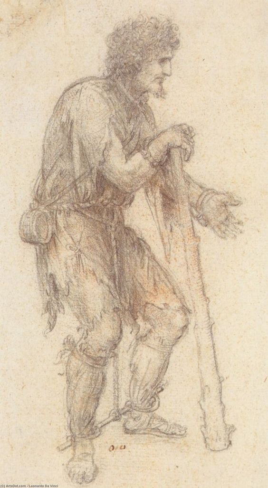  
（Masquerader sous le couvert d un Prisoner）

2、鲁本斯素描作品

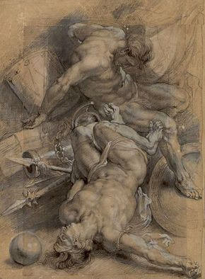  
（两名带锁链的囚人“Two Prisoners Chained“ 1600-1608）

3、伦勃朗

  
（圣彼得 Szent Péter a börtönben (1631)）

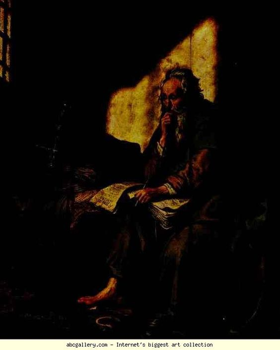  
（狱中的圣保罗 St. Paul in Prison）

4、喜欢画“连环画”的英国绘画先驱荷加斯

  
（A Rakes Progress是一组画，共8张，说的是一个花花公子由盛而衰的故事，这是第七张“The Prison”，花花公子破产入狱，画面上看那时候的监狱很生活，他的妻子可以进去探访，不过被他气晕了，他还有小钱来差遣临时仆人 ）

5、戈雅

  
（Casa de locos Autor ）

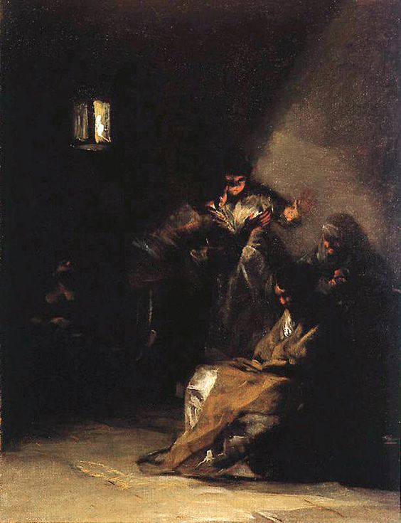  
（在狱中）

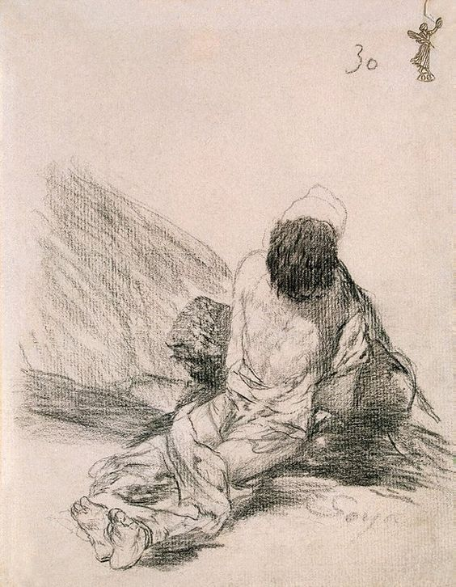  
（犯人）

  
6、威廉·布莱克

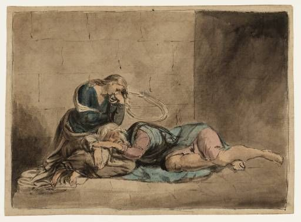  
（Lear and Cordelia in Prison）

7、米勒

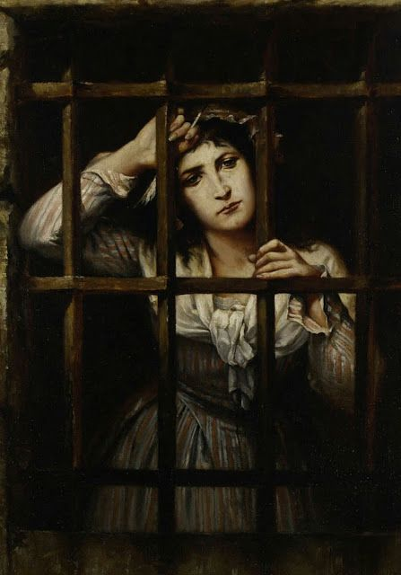  
（Le Prince Lointain Charles）

8、罗塞蒂（英国拉斐尔前派领军人物）

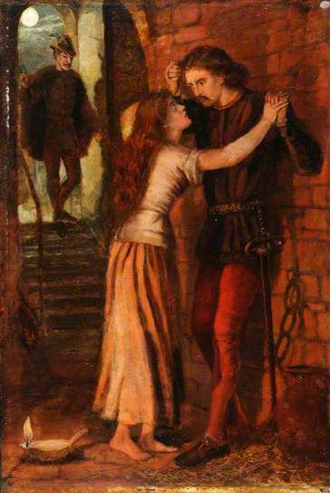  
（狱中的浮士德和玛格丽特  Faust and Marguerite in prison ）

9、古斯塔夫·莫罗

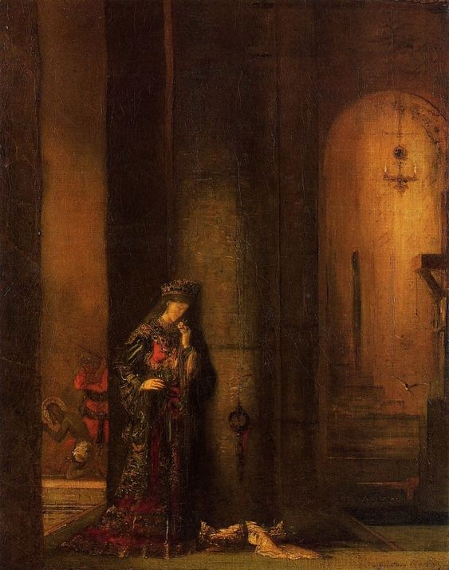  
（狱中的莎乐美  Salome in Prison）

10、埃贡·席勒
1912年春天，席勒因勾引未成年少女被捕。警方去工作室逮捕席勒的同时，也扣押了一百多张他们认为是色情物品的画作。席勒在开审之前被收押。开庭审理时，席勒诱拐的罪名被判不成立，但由于在幼童可接触的公共场合展示色情图像，席勒被判有罪。在被收押21了天后，席勒被判入狱3天。在狱中席勒绘制了12幅画，还写了一些日记。

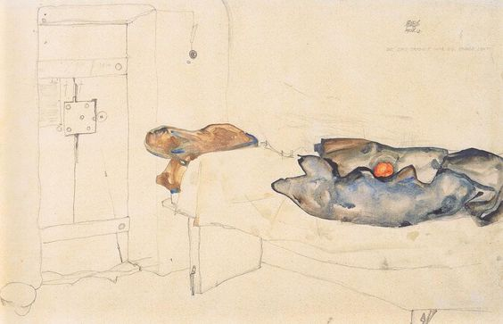  

  

  
（囚人）

11、梵高

  
（放风  Prisoners Exercising (after Dore)  1890  梵高在圣·雷米疗养院时临摹古斯塔夫·多雷，画的是伦敦的新门监狱）

12、毕加索

我们讲过毕加索蓝色时期以圣拉扎尔监狱女犯为蓝本画过一批画（《毕加索的蓝色时期与圣拉扎尔监狱》）

  
（双手交叉的女士）

13、保罗·克利

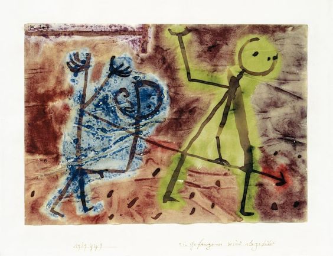  
（A Prisoner being Taken Away  被押解的囚犯）

14、“苦大仇深”的珂勒惠支

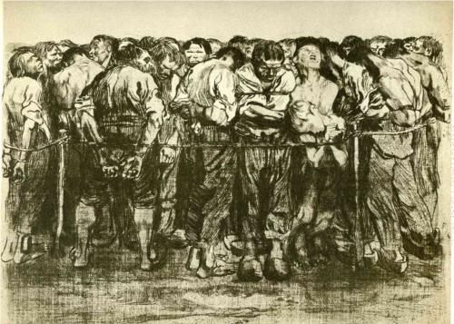  
（The Prisoners, 1908）

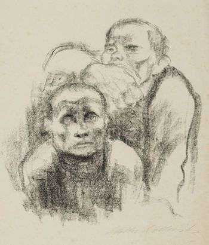  
（牢房里听音乐的孩子）

  
（她为囚犯保护联盟的海报 1919）

15、萨尔瓦多·达利

  
（The Prison）

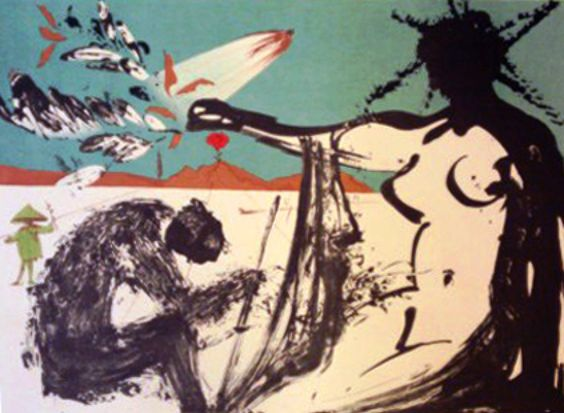  
（Peace in Vietnam, Liberation, The Prisoners Are Free越南和平、解放、释放战俘）

16、菲利克斯·努斯鲍姆Felix Nussbaum。努斯鲍姆是1904年出生在德国的犹太人，法西斯上台之后，他辗转意大利、瑞士、巴黎，在比利时落脚，1944年，他还是被告发，死在奥斯维辛集中营。

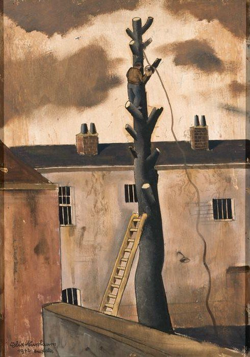  
（Prison, 1942）

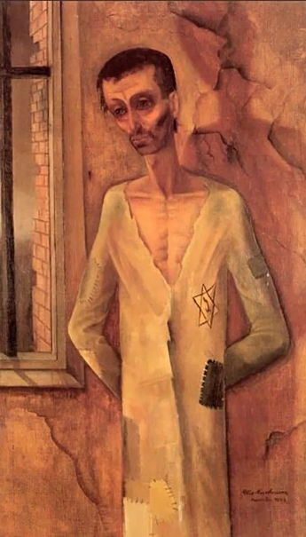  

17、安德烈·马松

  
（Prison gris (1961)）

18、大卫·霍克尼

  
（Viewing a Prison Scene 1961）

  
（囚人 1977  为大赦国际设计的海报 Prisoner from Amnesty International-1977 Poste）

19、路易斯·布尔乔亚 （亚洲巡展本月到北京松美术馆）

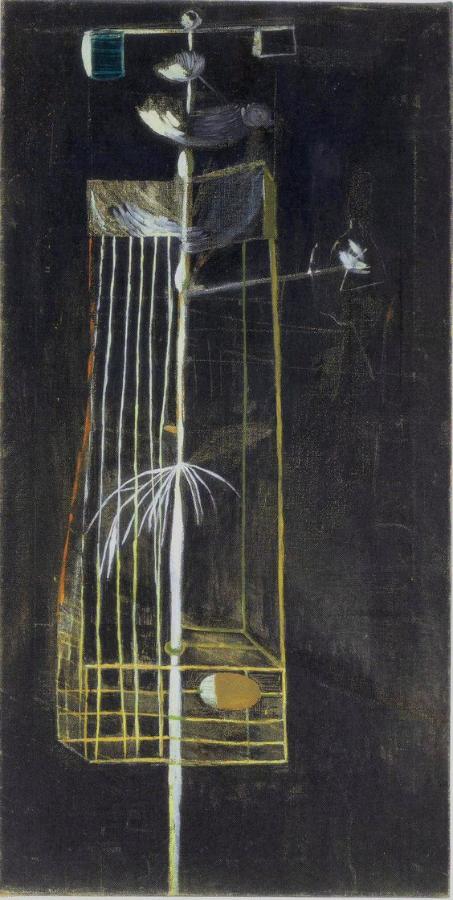  
（Louise Bourgeois. Prisons 1945 - 1947）

20、涂鸦大神班克斯

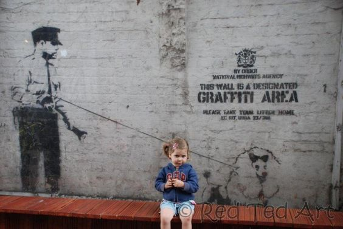  
（狱警）

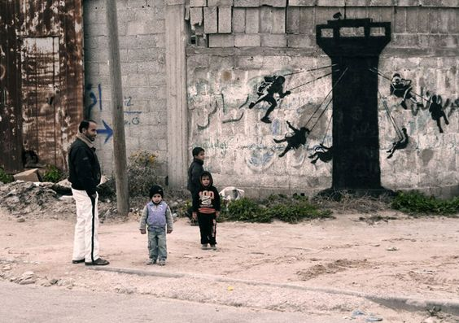  
（班克斯潜入加沙地带创作的涂鸦，他说道：加沙经常被描述为世界上最大的监狱，因为没有人被允许进出其间。）

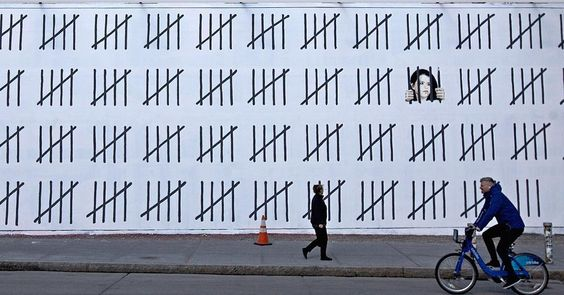  
（在曼哈顿街上创作的涂鸦  “FREE ZAHRA DOGAN”声援被土耳其政府囚禁的记者、艺术家zahra dogan，她因发表一幅被战争破坏的库尔德的照片被判入狱3年9个月22天。）

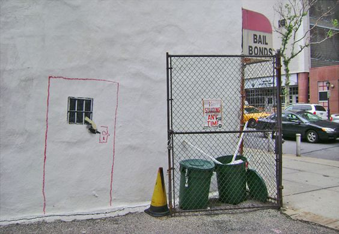  
（越狱）

21、南非女插画师larraine loots （2016年开始每天创幅一张硬币大小的插画）

  
（罗本岛上曼德拉的囚室）

22、哥伦比亚画家费尔南多·波特罗

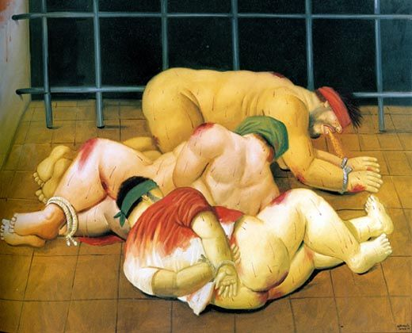  
（因阿布格莱布监狱虐囚事件而画 The Art of Abu Ghraib.  By Elizabeth Nash.  April 13, 2005）

23、南非画家Gerard Sekoto

  
（Prison Yard (1944)）

24、苏联画家Apollinari Vasnetsov

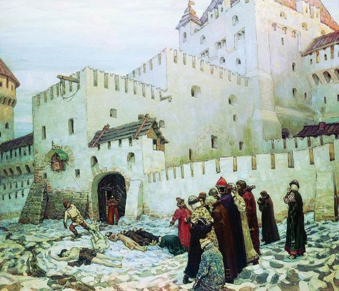  
（19世纪的苏联监狱）
