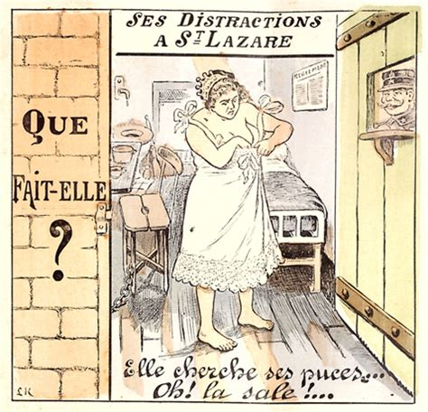
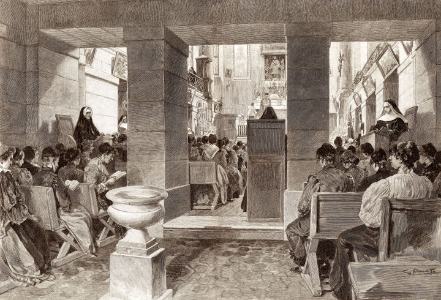
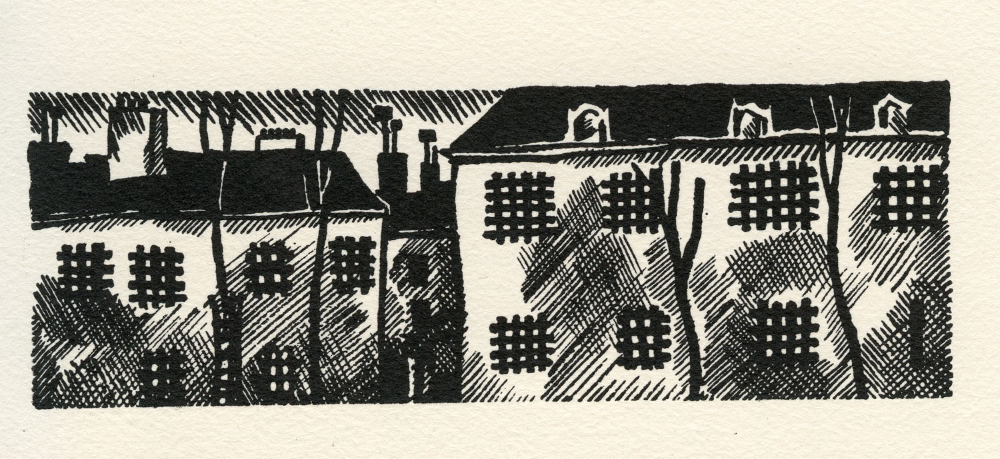
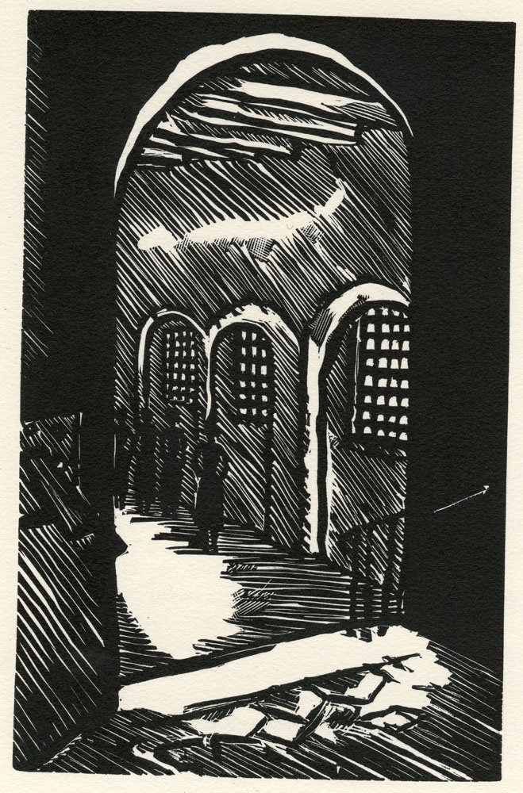
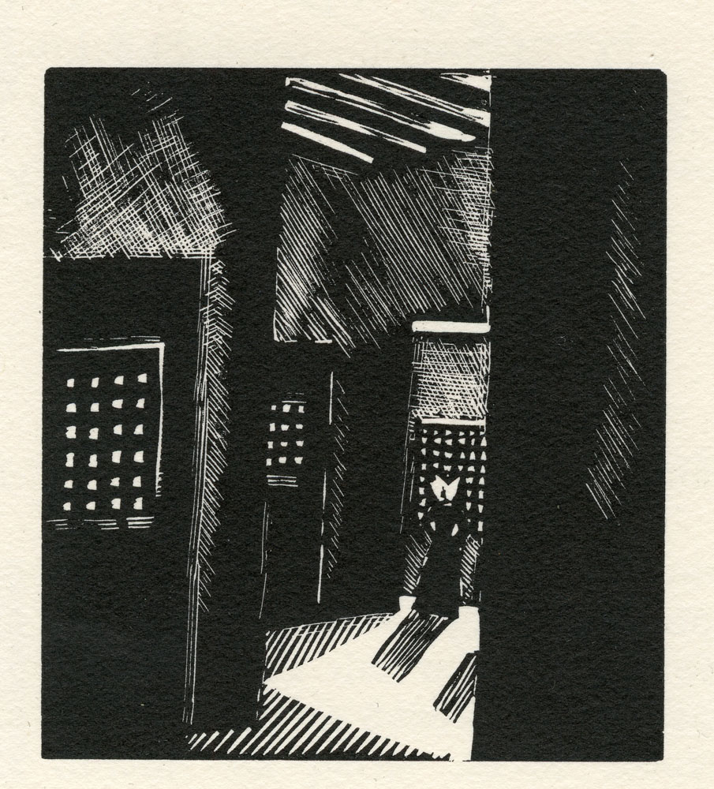
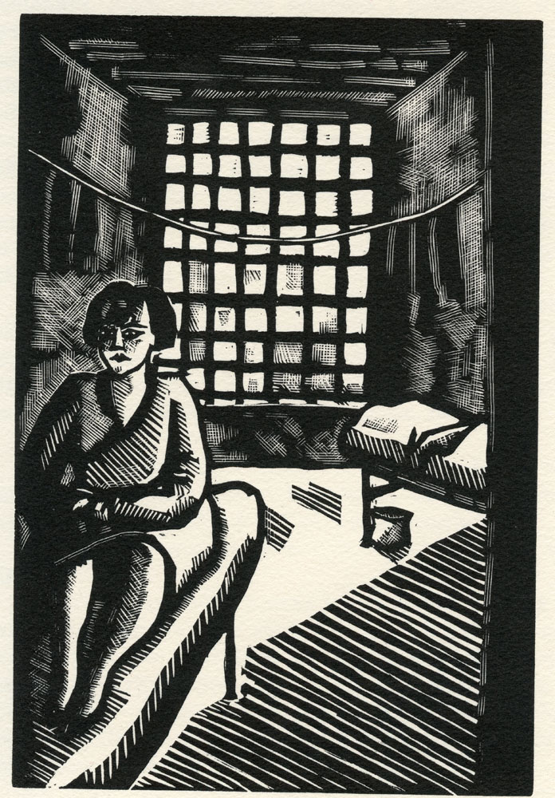
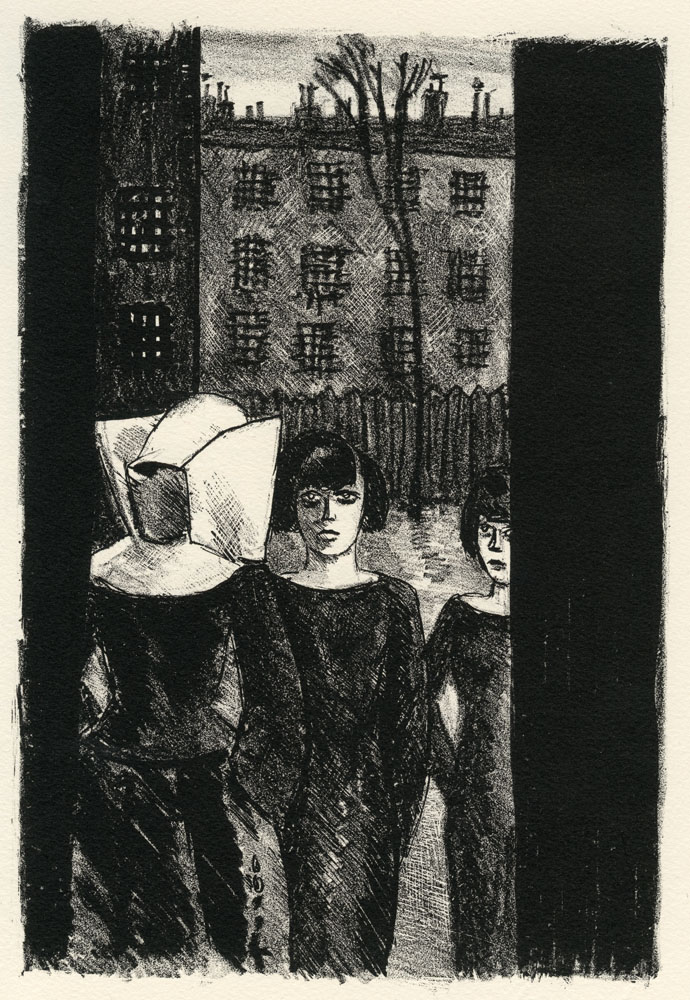
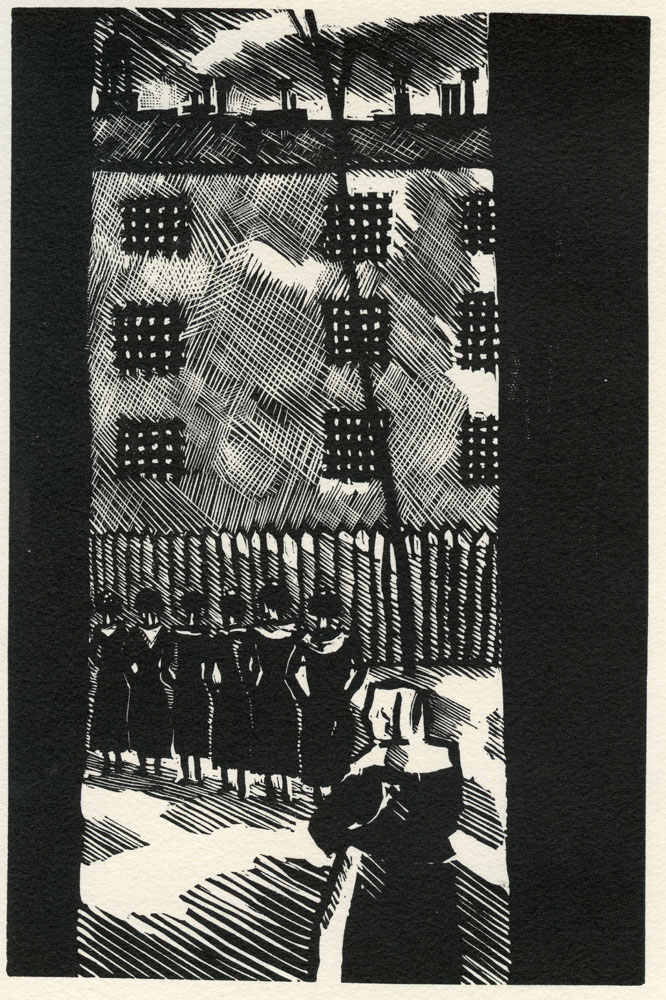
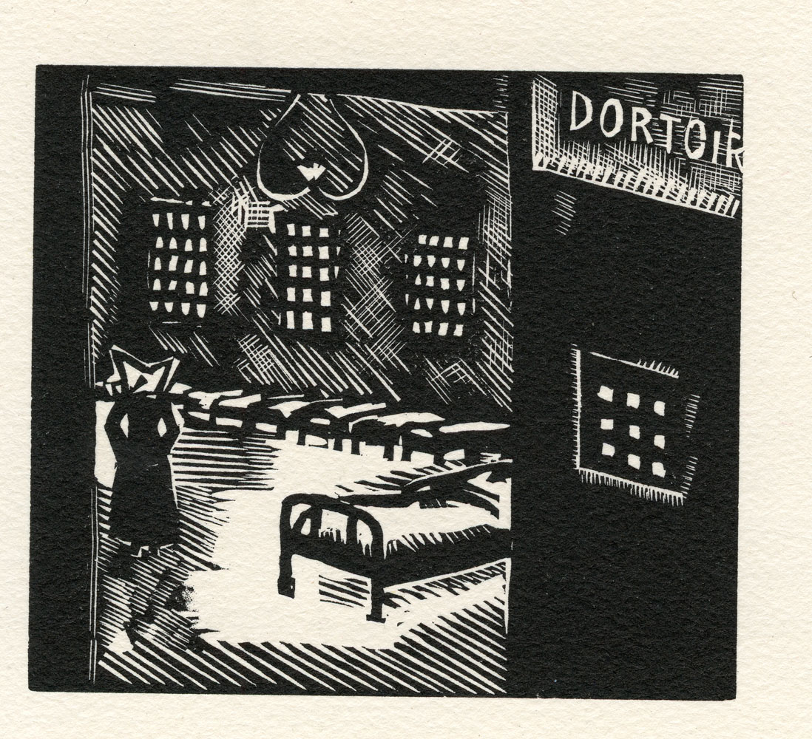
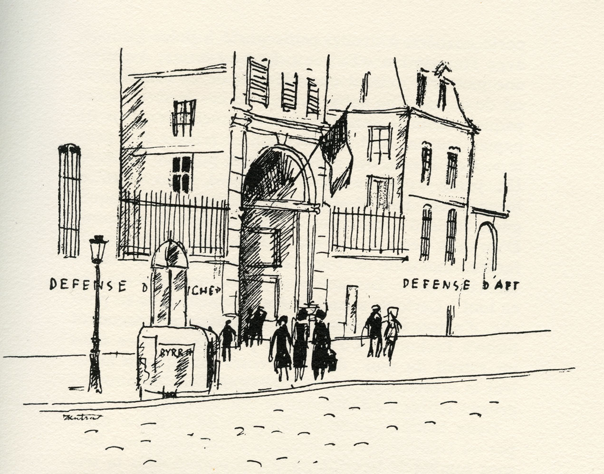

# 素描圣拉扎尔监狱

​
圣拉扎尔监狱位于巴黎蒙马特高地。该处几经变迁，12世纪用于隔离麻风病人，经17世纪重建，后曾作为修道院，1794年大革命期间被辟做监狱。后逐渐变成女子监狱。

由于问题频发，1838年由修女团体接替男性担任监狱管理人员。而被囚禁者多是因色情服务被逮捕的女子，有些还带着孩子。这些女性大多受到不同程度的性病侵蚀，那时候性病很难治愈，所以干脆把她们隔离起来。1835年，监狱专门增设了治疗梅毒的医务室，每年诊治数千名患者，巴黎各地注册了的妓女也必须到圣拉扎尔的医务室进行定期检查。19世纪后期，该医务室成为国际上受尊敬的性病研究和治疗中心。圣拉扎尔监狱还作为衰老妓女临终关怀之用，无处可去的她们可以在这里度过最后的岁月。

  
（研究&治疗中心）

  
(圣拉扎尔监狱流通币)

  
(20世纪初巴黎著名交际花marguerte steinheil在回忆录中展示她被控谋杀入狱时的日用品，包括：自制拖鞋、硬币打磨的镜子、自制面包篮、自制的咖啡滤网、钝刀以及杯子)

圣拉扎尔监狱于1932年关闭，1935年被拆除。取而代之的是一家医院。如今该处已成为托儿所以及居民社区。

关于圣拉扎尔监狱的画作，除了鼎鼎大名的毕加索，目前看到的多是各式素描作品，今天选一位署名pierre gobion先生的系列：

  
(会见)

