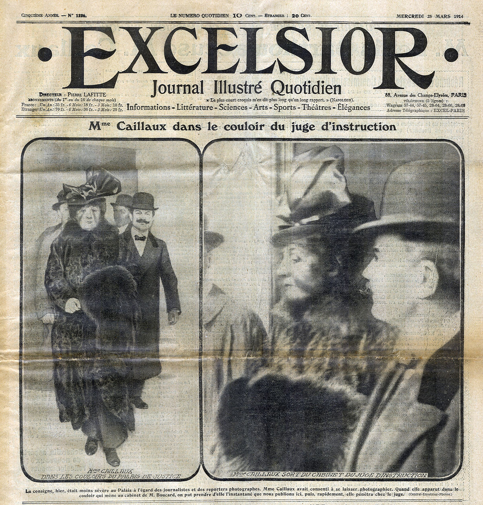
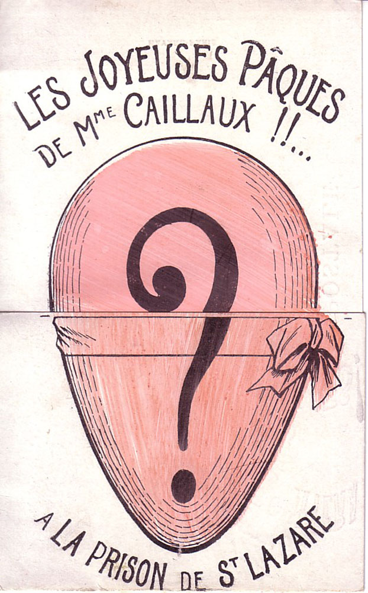
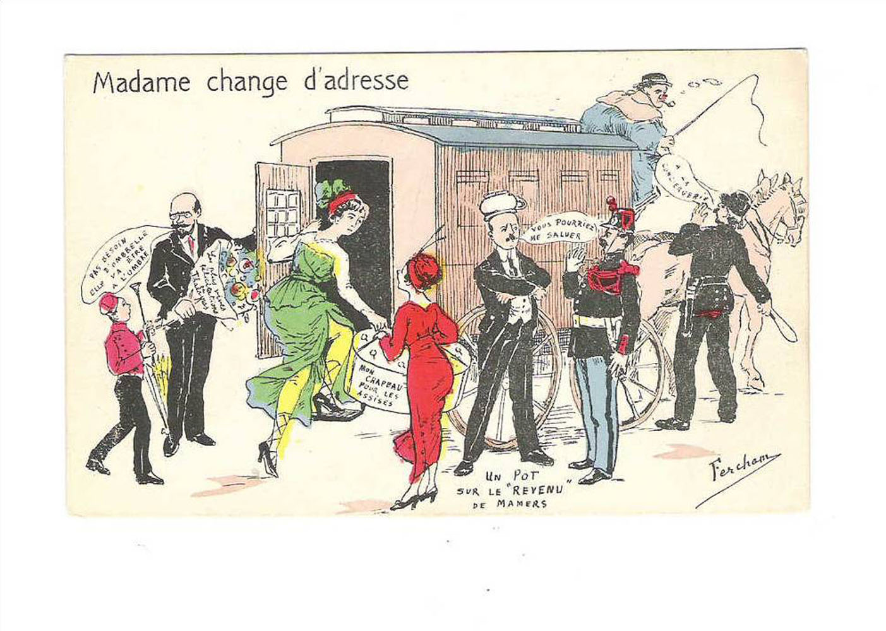
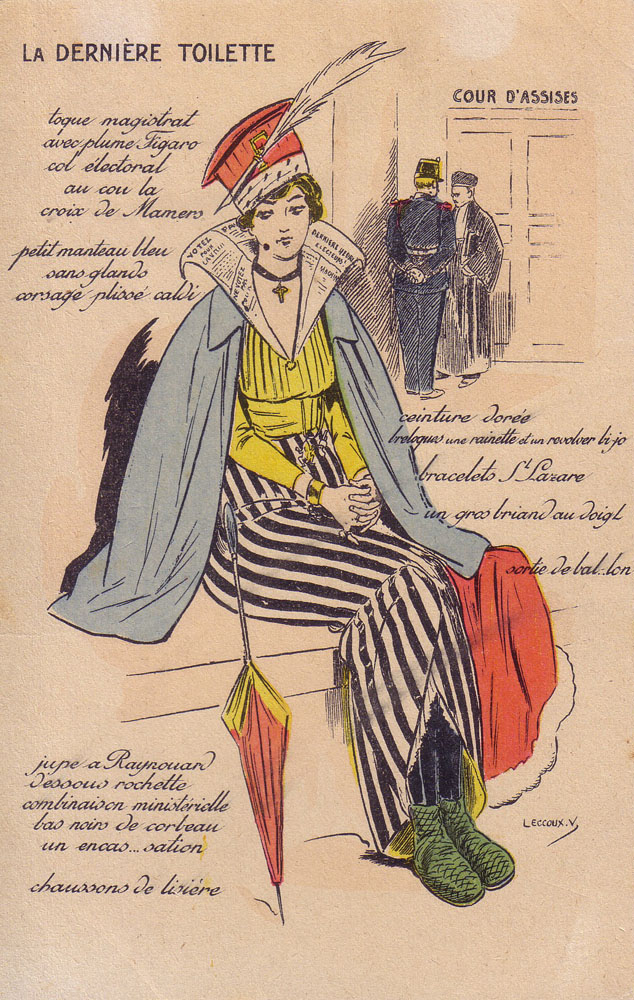
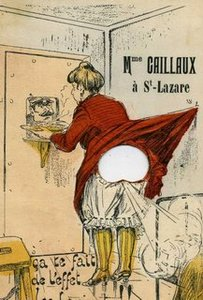
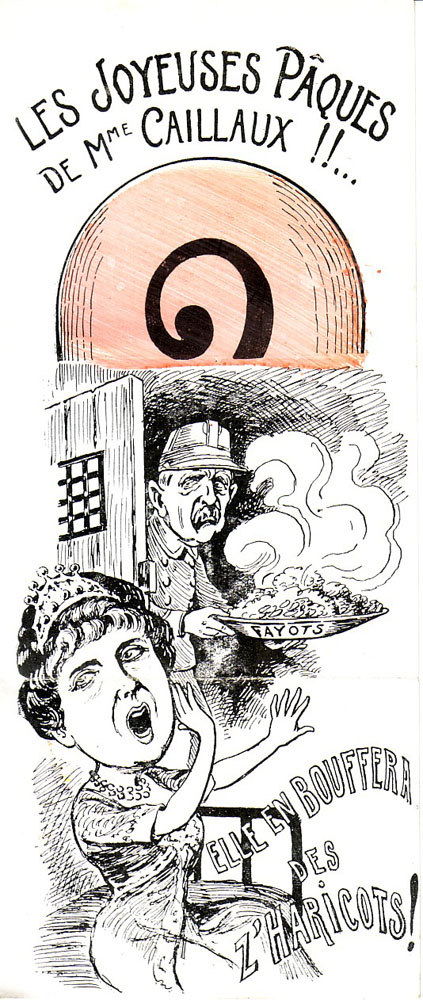
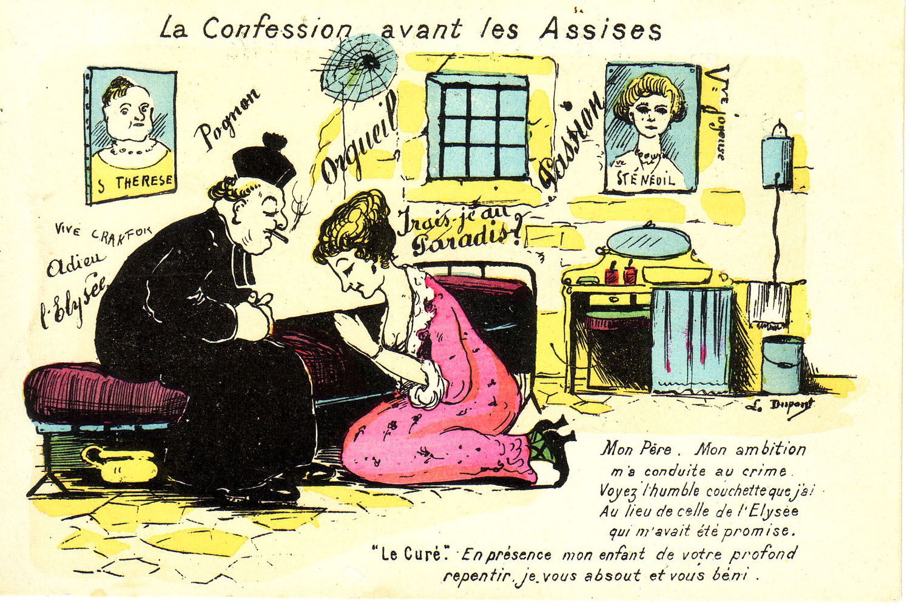
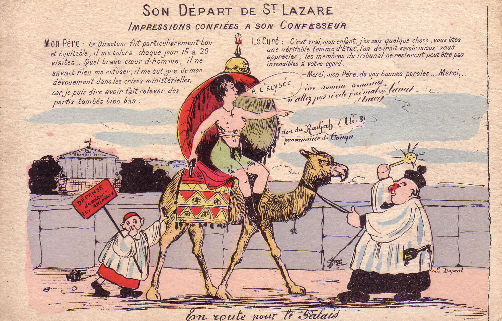

# 圣拉扎尔女囚轶事之一

圣拉扎尔监狱位于巴黎蒙马特高地。法国大革命期间设立，1935年拆除。服役一百多年，故事颇多，兹录取一则以漫画讲述的故事。

①卡约丑闻（Caillaux  Scandal）

曾任法国首相（1911.6—1912.1）的约瑟夫·卡约（JosephCaillaux）卸任后，执掌法国财政部，由于不当其任，遭受媒体猛烈抨击，尤以费加罗报为甚。

1914年3月16日，卡约的妻子亨丽埃特·卡约（Henriette Caillaux）进入费加罗报总编Gaston Calmette办公室，对其连开几枪，Calmette当天送医不治身亡。

亨丽埃特·卡约（Henriette Caillaux）随即被捕，并被送往圣拉扎尔监狱。但是约瑟夫·卡约通过手段干涉司法。1914年7月28日法庭以“急性情绪困扰”和她“不可控的女性情感”。当庭判决亨丽埃特·卡约无罪释放。

该判决在法国引发了激烈的争议和抗议。
以下为当时的一组漫画：

  
（盛装前往监狱）

  
（圣拉扎尔沙滩度假）

  
（档次低了可不吃）

  
（开庭前的祷告）

  
（前往法庭）

（宣判无罪）

  
（回家）

  
（法国市民建议为卡约夫人雕像，取代圣女贞德）
