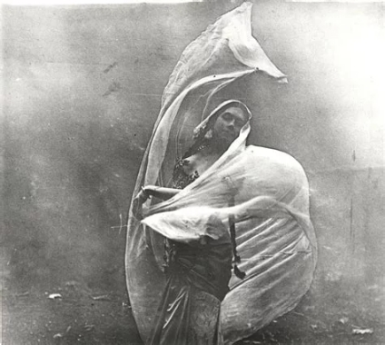
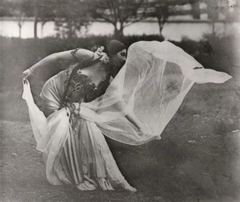
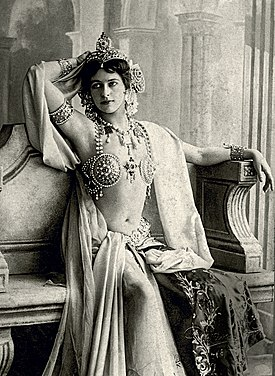
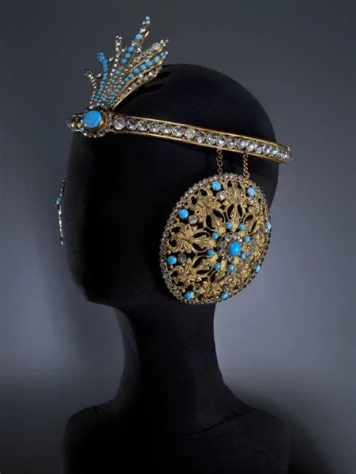
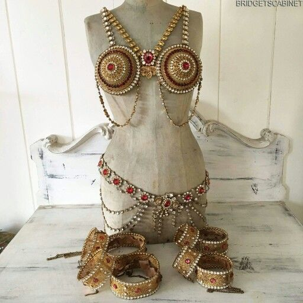
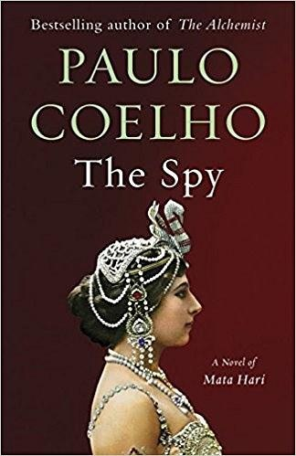
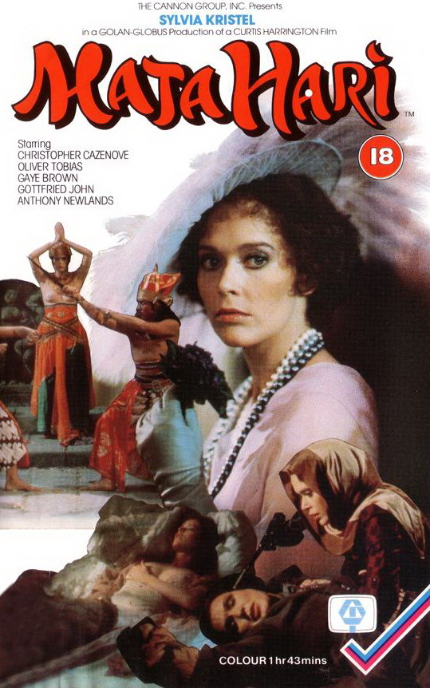
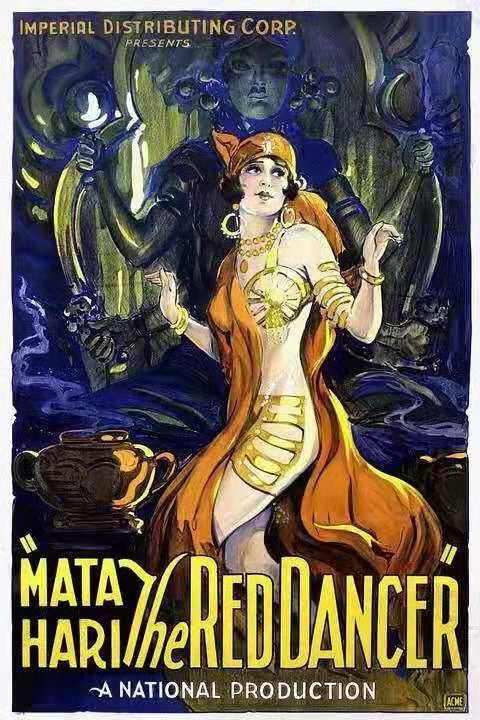

# 圣拉扎尔女囚轶事之二

​风流间谍鼻祖、十大著名女间谍之玛塔·哈莉

1917年10月15日，十几个法国军官走到圣拉扎尔监狱二楼,将女囚玛塔·哈莉（Mata Hari）从牢房带到东郊邻近万塞讷城堡的行刑场。

  
（《魔女玛塔》剧照）

面对黑洞洞的枪口，玛塔·哈里拒绝被蒙上眼睛。不仅如此，她还向行刑者飞吻……  
“预备！”  
“瞄准！”  
“开火！”  
三个口令后，玛塔·哈莉的生命按计划被夺走。

  
（新闻图片）

玛塔·哈里是一个女间谍。在得知自己将被处以极刑后，她用两个星期的时间写了一份厚厚的遗书，寄给律师克鲁内。遗书中，她特意叮嘱律师，一定要让自己的女儿读到她的这些话，从而了解她是怎样的人，经历过什么。

玛塔·哈莉曾是风靡欧洲的舞娘，在上流社会的各种沙龙中流转自如。  
“我是一个生不逢时的女人，这无法改变。”这是她对自己一生的总结。  

回到1889年，这一年，13岁的荷兰姑娘玛格丽特·泽拉的家庭遭遇了不幸。父亲破产，母亲患病。很快，父母离异，1891年她母亲去世，1893年父亲再婚。玛格丽特搬到了斯内克，与她的教父维瑟先生住在一起。随后，她在莱顿学习成为一名幼儿园老师。没多久，她与校长传出绯闻，愤怒的教父把她带离了学校。几个月后，她逃到了海牙的叔叔家。

一天，玛格丽特阅读报纸，被一个特别的广告吸引了：一位上尉希望寻找一位年轻女子做他的新娘，共赴国外生活。玛格丽特认为这个广告对她而言简直是天赐良机，但她不知道，这不过是军官的朋友开的一个玩笑罢了。后来，他们还是见面了。玛格丽特的美貌征服了军官。不久后，就向比自己小二十岁的玛格丽特求婚。婚礼在1895年顺利举行，距离玛格丽特读到广告那天，只过去三个月。

新婚夫妇去了印度尼西亚。在那里，玛格丽特生下了一个女儿。在印尼她加入了一家当地的舞蹈公司。1897年她与荷兰亲戚的通信中，她透露了她的艺名玛塔·哈莉（Mata Hari），来自马来语中的“太阳”一词。原本可以幸福度日的一家三口，却因为丈夫与印尼情妇相交甚欢而蒙上了阴影。不仅如此，丈夫还常常揪住玛格丽特当年与校长的绯闻不放，当面骂她“妓女”，接着施以拳脚。

时隔不久，上天又给她的人生路带来了另一次转机。

军营的指挥官邀请军官和太太们去欣赏一场当地的舞蹈表演。玛格丽特应邀出席，穿着昂贵的礼服，十分性感。舞会上，另一位军官看到了玛格丽特，四目交接时，双方都漫出了款款深情。这位军官的妻子走到玛格丽特面前，说了句：“我这样做不是为了自己，而是为了所有看似自由，实则却生活在枷锁中的女人。”说完后，就从口袋掏出手枪，照着自己的胸口扣下了扳机，就此撒手人寰。

军官太太的死惊醒了玛格丽特，像是用血为她施了洗礼。她觉得再不离开这样的生活，军官太太的今天就是她的明天。所以她一反常态地强硬告知丈夫，她要回国，否则下一个自杀的就是自己。丈夫这回不敢反对她，带她回了荷兰。然后她受不了荷兰的枯燥生活，又跑去了法国。

移居法国的玛格丽特·泽拉以玛塔·哈莉行世，与现代舞之母伊莎多拉·邓肯、鲁斯·圣·丹尼斯一起引领现代舞运动。只是她生活奢靡，也没有把艺术作为毕生志向。

巴黎“女神游乐厅”因半裸和全裸的舞女表演而著称，玛塔·哈莉是舞女中最摄人心魄的一个。她深谙脱衣舞要领，知道如何把看台上男人女人们的意念引向高潮。她的舞蹈不只是简单而低俗的肢体诱惑，还内涵某种神秘体验。她通过身体，将印尼的异域风情带到了法国。法国人被深深吸引了。各大报纸争相报道这个叫做“玛塔·哈莉”的舞者的故事。“她身体的千条曲线和动作以一千个节奏抖动。”“苗条而高大，拥有野性动物的灵活优雅。”赞扬与呵斥接踵而来，有人视她为艺界佳丽，也有人认为她是毫无才华的裸露狂。无论如何，她成了红人。

一个红人的影响力可想而知。于是，有人开始琢磨如何利用玛塔·哈莉的魅力来为自己服务。一位“朋友”把她介绍给了一个在荷兰工作的德国领事，经由领事，安排玛塔·哈莉可以打入法国政府内部，刺探军情。说白了，就是将玛塔·哈莉培养成女间谍。

“你的代号是H—21。记住，你的签名永远都是H—21。”

玛塔·哈莉认为自己在男人堆里摸爬滚打多年，极富经验，她只需要跳舞给那些官员看，听他们聊天，再把聊天内容向相关人员转述。就像朋友说的，“无论如何都不要表现出恐惧，要继续做你自己。”

时值一战，间谍玛塔·哈莉辗转于德国、法国、荷兰。她觉得自己的生命有了更为重大的意义，关乎好几个国家的命运。可她并不想给德国人刺探法国情报，于是故意提供边缘信息。后来因为出现了疑似故意陷害她的电报，指责她向敌人传播了重大军情而导致近五万名法国士兵死亡，这成为了她被法国判处间谍罪的证据。她自己在法庭上辩解道：“我是妓女，没错；但我不是叛徒，永远不是。”不管她涉案多深，失败的法国政府需要一个替罪羊，最终法国军方将玛塔·哈里定为超级间谍，并以叛国罪对其判处死刑。

于是发生了开篇的那一幕。

  
（被捕当天）

传奇女性的一生结束了，但她的传奇故事却还在继续。她的尸体被埋在一个浅坟里，她的头颅被割下来交给了政府。多年以来，一直被保存在巴黎圣佩雷路的巴黎阿纳托密博物馆内。经过特殊处理，依然红唇秀发，栩栩如生。然而，2000年，博物馆的工作人员发现头颅不翼而飞，普遍认为是被其崇拜者偷走。

位于荷兰吕伐登的弗里斯兰博物馆（荷兰语：Fries Museum）包含一个“玛塔·哈莉展厅（Mata Hari Room）”。 展览中包括她的两本私人剪贴簿和一件绣有扇形舞蹈足迹的东方地毯。该博物馆位于玛塔·哈莉的故乡。2017年10月14日，在她去世一百年的日子，弗里斯兰博物馆举办了有史以来规模最大的玛塔·哈莉展览。

玛塔·哈莉基金会还决定在为其单独建造一座博物馆，里面将展示大量实物，包括玛塔·哈莉充满激情的情书、绚丽多彩的舞台服装，光彩耀目的珠宝首饰，姿态各异的裸体照片和她被捕后的一份自述。
 

为玛塔·哈莉著书立传者历来不乏其人，除了她自己的日记，还有近年保罗·柯艾略的畅销书《间谍》、帕特·希普曼的《蛇蝎美人：爱、谎言与无名的生活》、菲利普·科拉斯的《玛塔·哈莉的真实人生》、罗素·沃伦·豪的《无罪间谍玛塔·哈莉的悲惨命运》等。关于她的电影、电视剧也不断有人翻拍，葛丽泰·嘉宝就出演过一部。还有以她为主题的芭蕾舞剧、歌剧以及其他数部舞台剧，不少关于她的音乐，甚至有人开发了以她名字命名的间谍解密游戏。

