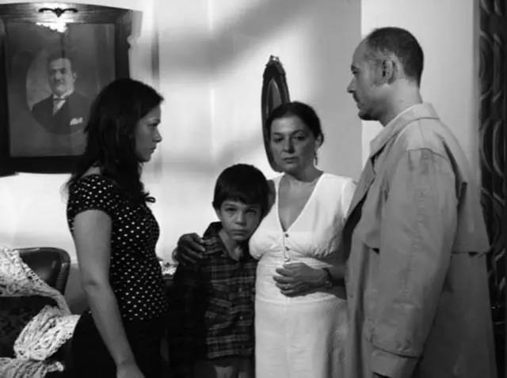
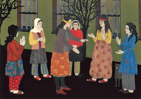
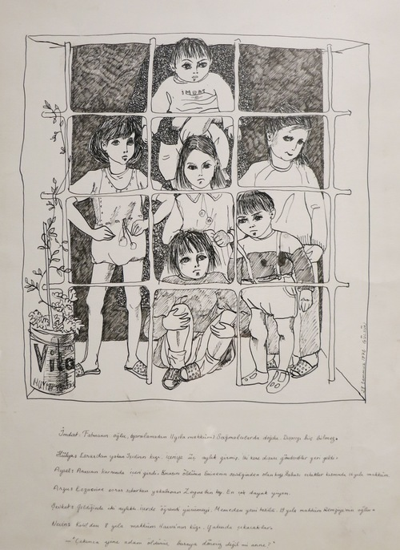
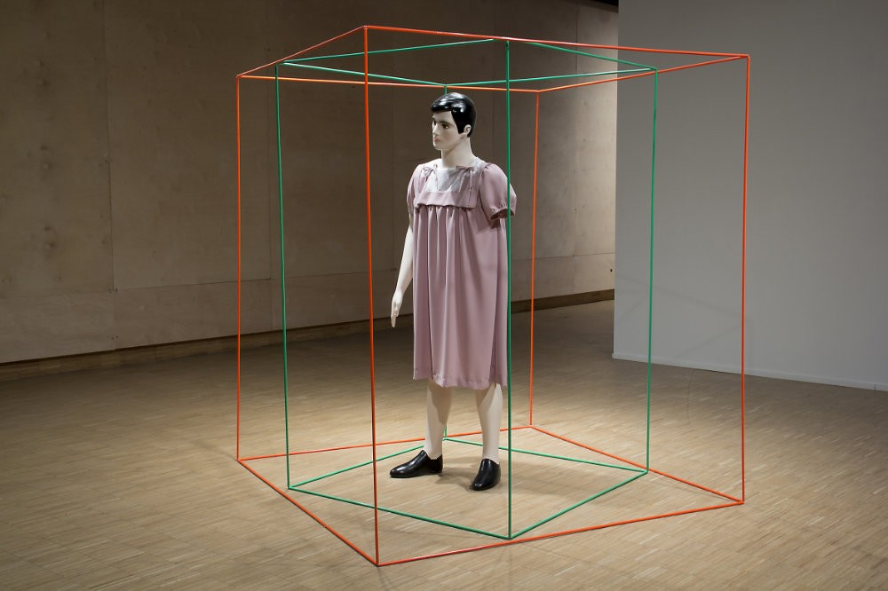
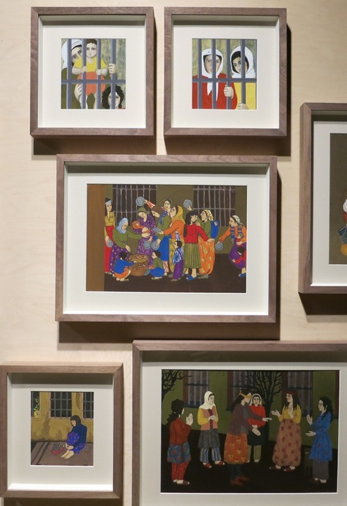
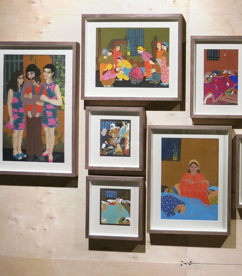

# 土耳其艺术家居尔辛·卡拉穆斯塔法与她的监狱绘画

​居尔辛·卡拉穆斯塔法（Gülsün Karamustafa）是土耳其20世纪下半叶最重要的艺术家之一，作品包括绘画、雕塑、视觉艺术以及装置。她的艺术实践影响了1990年之后的一批年轻艺术家。

受68年学生运动影响，卡拉穆斯塔法在大学期间就开始熟悉政治活动。她亲身经历了1960年代到1970年代土耳其的3次政变，她在其录像作品《广场回忆》（Memory of a Square）中以个人视角记录了这一段动荡的历史。

1971年，居尔辛·卡拉穆斯塔法被指控帮助政治逃犯，入狱半年之久。

  
卡拉穆斯塔法《广场回忆》截图

出狱后，卡拉穆斯塔法于1972年创作了《监狱绘画》（Prison Paintings）组画，描绘她在狱中的经历。

2013年，卡拉穆斯塔法在其伊斯坦布尔SALT举办的个展“A Promised Exhibition”中首次展出这组画。

“我为了铭记而创作它们，我要把那些记忆刻在大脑里。在伊斯坦布尔的Maltepe、Selimiye和Sağmalcılar三所监狱关押后，我被送往伊兹密特监狱，与被判处终身监禁的人一起服刑。“

居尔辛·卡拉穆斯塔法《双重现实》（Double Reality），1987年，摄影：Mustafa Hazneci

在1971至1986年，卡拉穆斯塔法被禁止离开土耳其国境，接受政府监视。但这份经历反而使卡拉穆斯塔法更加深入土耳其地区，成为土耳其政治历史与文化的观察者与记录者。

卡拉穆斯塔法1964年出生于土耳其安卡拉，她擅以中东视角批判性地考察西方传统，曾在作品中探索移民问题、政治放逐、流行文化、女性主义与性别等。在后冷战时代，她考察政治、宗教和历史如何在日益全球化的世界中影响人们的日常生活。卡拉穆斯塔法以灵活运用纺织品、日常用品、媚俗物件、录像素材而闻名，她的作品呈现出多样性与个人色彩，拒绝传统的艺术分类。早在1990年代早期的第3届、第4届伊斯坦布尔双年展（Istanbul Biennials）中获得国际声誉。作品在多个国家举办个展及参加联展。

整理自：艺术新闻中文版
