# 戈雅：画下怪诞时代的X光

西方精神历险中最绝望的一个。——安德烈·马尔罗

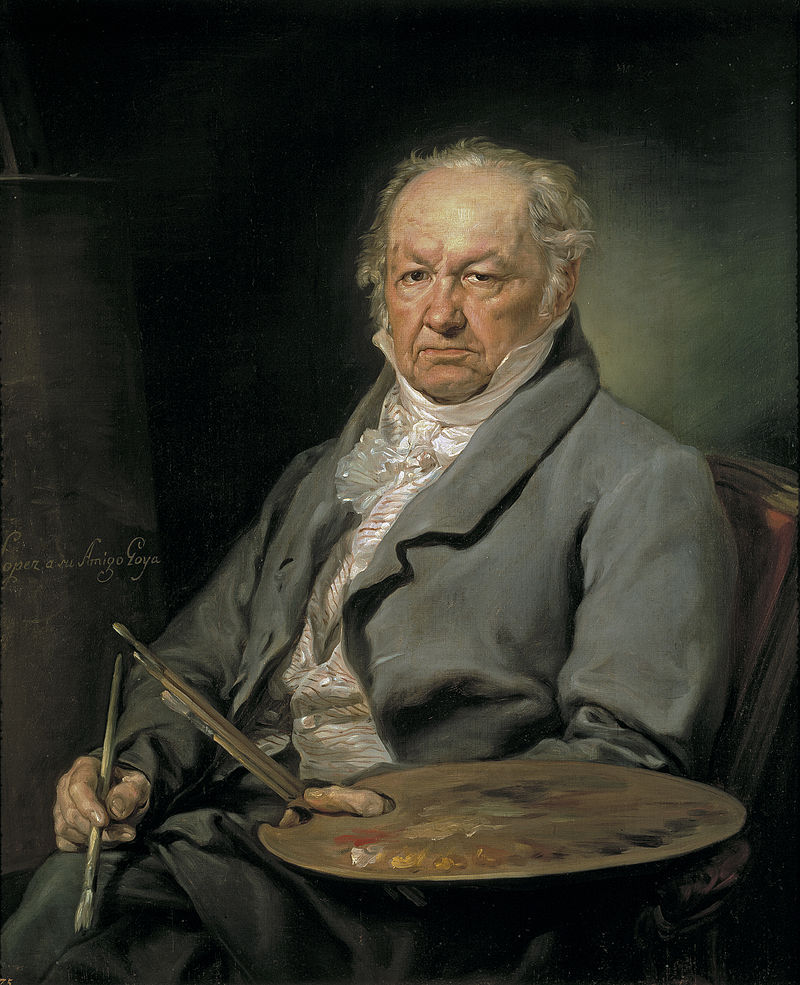  
戈雅自画像

弗朗西斯科·戈雅（1746—1828），西班牙画家，其画风奇异多变。从早期的巴洛克式到后期类似表现主义的作品，对后世的现实主义画派、浪漫主义画派和印象派都有不小的影响。

1746年戈雅出生于萨拉戈萨附近的乡村，父亲是一名贫苦的祭坛镀金工匠，母亲出身于破落贵族。14岁时一位教士发现了戈雅的绘画才能，鼓励他父亲将他送往萨拉戈萨学画，1763年戈雅到马德里投靠同乡宫廷画师弗朗西斯科·巴依也乌，并两次投考圣费南多皇家美术学院均落榜。

1769年戈雅随一队斗牛士去意大利旅行，参加了帕尔玛美术学院的绘画竞赛，得了二等奖。此后，他从师于一位那不勒斯画派的画家何塞·鲁赞·伊·马尔底涅斯。到 1770 年左右，戈雅在德里·比拉尔圣母教堂和萨拉戈萨附近的卡尔特吉教团的阿乌尔·德伊僧院画了若干幅宗教画。

1773年，戈雅再次去到马德里并结婚定居。妻子是好友画家弗朗西斯科·巴依也乌的姐妹霍塞法。也正是由于巴依也乌的关照，戈雅开始为皇家圣巴巴拉织造厂绘制葛布兰花毯图样。随后他得以进出宫廷，有机会研究委拉斯开兹的作品，将宫廷收藏的委拉斯开兹的作品翻刻成蚀版画。戈雅曾说自己有三位老师：委拉斯开兹、伦勃朗和自然。

1780年戈雅凭借画作《基督受难图》受聘为圣费南多皇家美术院成员，1785 年升任为副院长，1789年国王任命他为宫廷画师，在此期间他画了许多宫廷成员及贵族的画像。

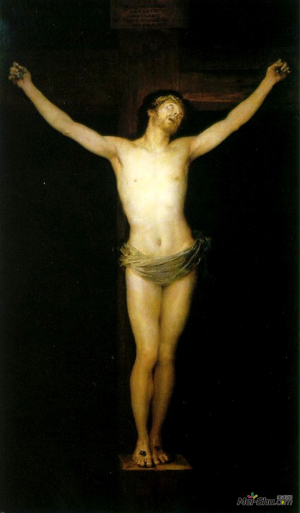  
基督受难图

当时西班牙是一个宗教法规严厉的国家，禁止描绘裸体，他敢于画《裸体的玛哈》(玛哈是西班牙语“姑娘”的意思)，由于被人告密，第二天要来检查，他连夜绘成《着衣的玛哈》，尽管如此，戈雅还是因这幅画受到宗教裁判所的质询。20 世纪 80 年代西班牙将《裸体的玛哈》印成邮票，成为集邮界热门的藏品。

  
着衣的玛哈

1792年，戈雅46岁，那年他得了一场大病，什么病目前没有定论，后人认为梅毒或脑膜炎的可能性较大。症状包括耳鸣、眩晕、视力下降、失眠甚至短暂的瘫痪。他经常听到耳朵里或头部充斥着各色杂音，最后戈雅从疾病中挣扎了出来，但是他失去了听力。

失聪的戈雅并没有被上流社会冷落，依然经常受邀参加宴会。喧闹的马德里，在他那里是无声流淌、跃动的人群。聚会上闪烁的衣饰，晃动的人影，张合吞吐的嘴唇，吞咽美酒，咬嚼佳肴，撇嘴的讥讽，露出牙齿的大笑，脸部的神情，酒后跳起的放肆、充满情欲的舞蹈。他再也不能靠听来的言语理解这世界——他只有用他天赋的锐利目光深深地注视着这些浮动跳跃的影像。

1799年，戈雅仍然被任命为宫廷首席画师，1800年，国王卡洛斯四世让他为自己全家画像，作为宫廷画家，戈雅本应该美化及修饰贵族的仪容。但是，在戈雅的画作中，他似乎已隐隐透露了革命前贵族的焦虑和不安。国王和王后似乎只是虚有其表，失去了内在的英明与自信；仿佛粉饰过了的鬼魂，在虚夸的华丽外表下显露出腐败的本质。那些躲在阴影中的王子和公主更是眼神恍惚，仿佛预感着惊恐的大事将要发生，无助地瞪大眼睛，似乎等待着悲剧命运的来临。不过，画中隐藏的焦虑不安并没有被国王的觉察，甚至还受到了国王的赞赏。

  
卡洛斯四世一家

从1792年开始，戈雅的创作慢慢从大画幅的宫廷订件转向更个人的表达。虽然还接受宫廷订单，戈雅辞去了美术院的职务，开始创作蚀刻画和版画。这时他的感觉变得更加敏锐，思想变得更加深邃。他放弃了明亮轻快的色彩，开始更多地使用暗沉的基调，内容也多为战争、死亡、疾病等。画面中所描绘的面庞大多不是介于人鬼之间的扭曲就是模糊不清。用强烈的明暗对比和交织在一起的长线条配合荒诞、怪异的人物形象和主题。

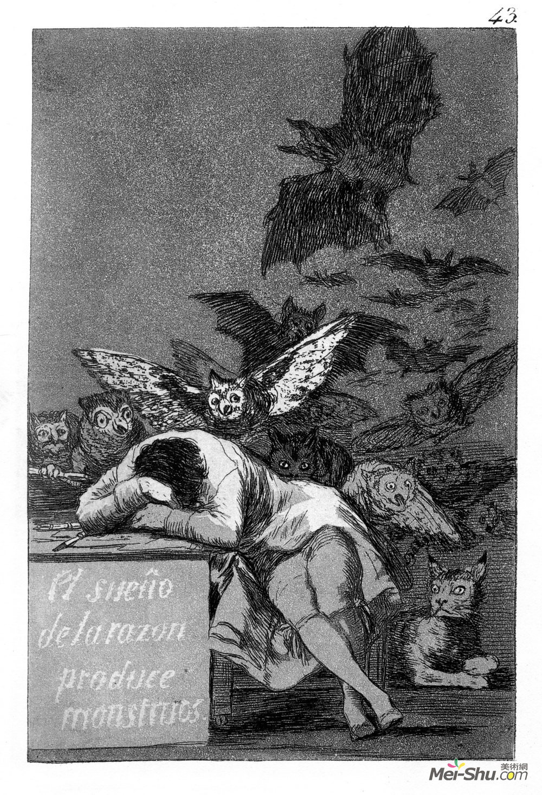
理性入睡产生梦魇

这些作品充满了让人不安的视觉体验，血腥、暴力、阴郁的场面充满其中。在当时看来是那样的有悖常规，戈雅本人没有为它们留下只言片语，以至于被后人不断诠释。对于这些画，人们有着各种不同的理解，甚至有在精神病学和病理学角度上的解读，这些角度从戈雅遭受的未知疾病来解读。还有一种说法倾向于戈雅在拿破仑和西班牙波旁王朝的半岛战争后所目睹的饥荒、残酷的景象重塑了他的世界观。

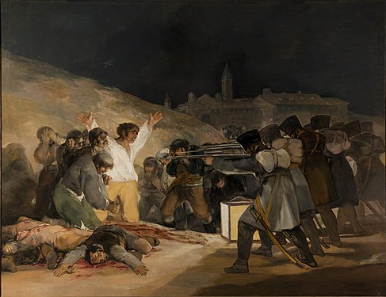  
1808年5月3日夜枪杀起义者

“戈雅，噩梦中充满了未知的事物；在巫魔夜会中被煮食的婴儿，镜中的老妇，赤身露体的女童，引诱魔鬼把最深处的邪恶暴露出来。”——波德莱尔

“戈雅的伟大功劳，在于他创造的怪物酷似真实。他笔下的妖怪是和谐而有生命的。在荒诞艺术方面，戈雅达到了极致。所有这些肢体的扭曲、野兽般的面孔、魔鬼般的怪脸都闪烁着人性的痕迹。即便从自然史的特殊角度来看，倘若生物的每个部分都有相似及和谐之处，就很难为它定性……即便最敏锐的分析家，也不能勾勒出这条模糊的分界线，因为艺术是既超群又自然的。”——波德莱尔《几位外国的漫画家》

这期间戈雅创作了不少监狱主题的画作。

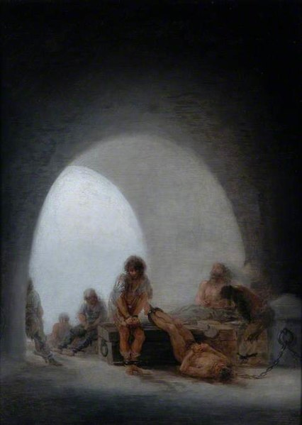

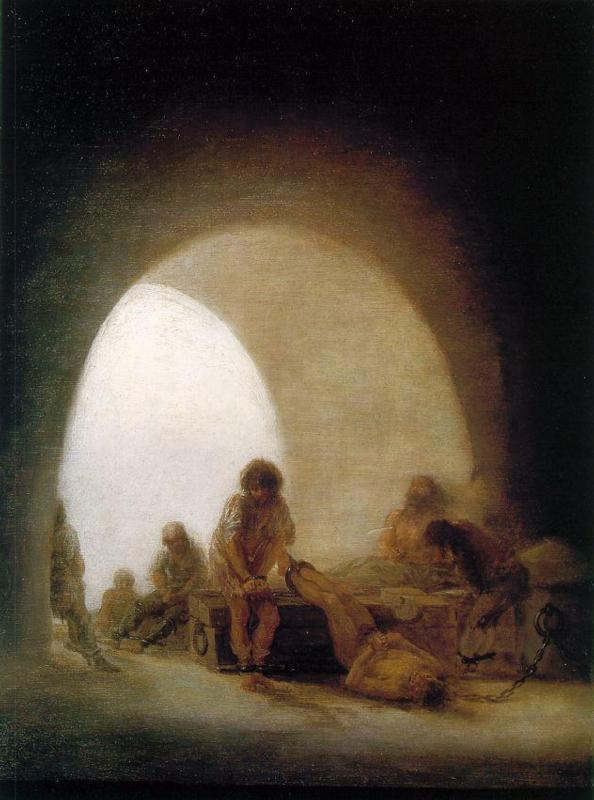

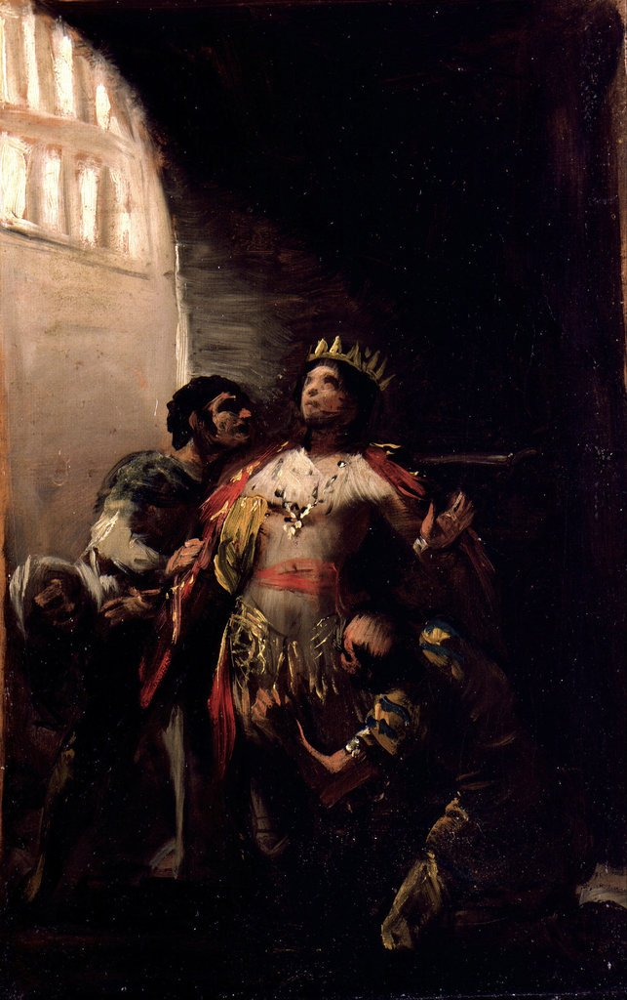

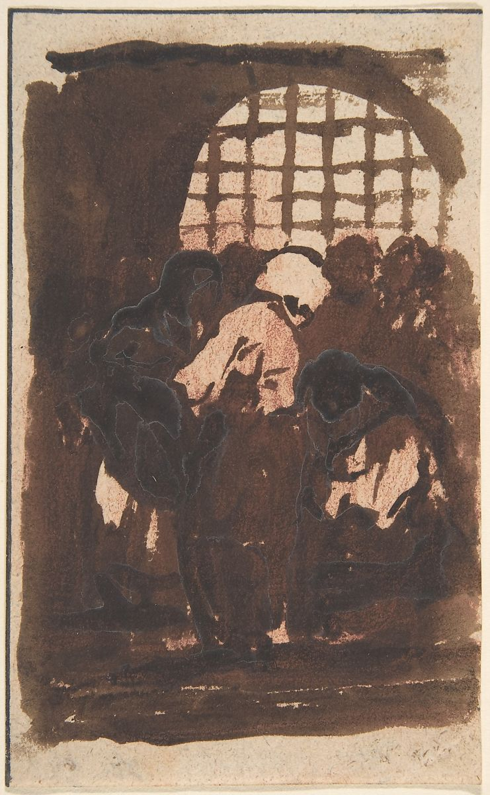

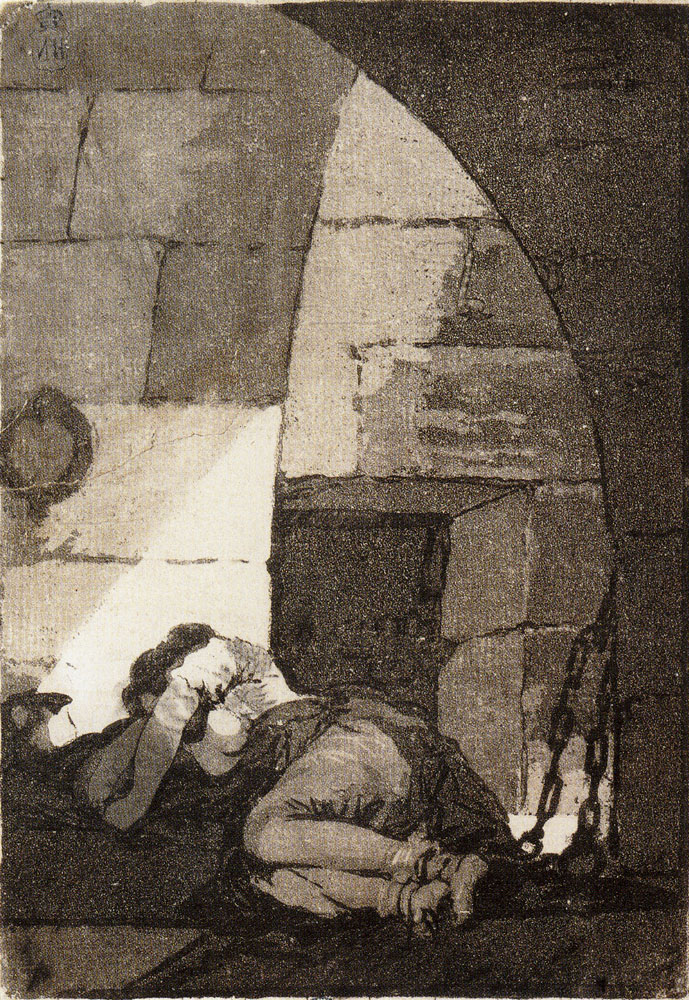

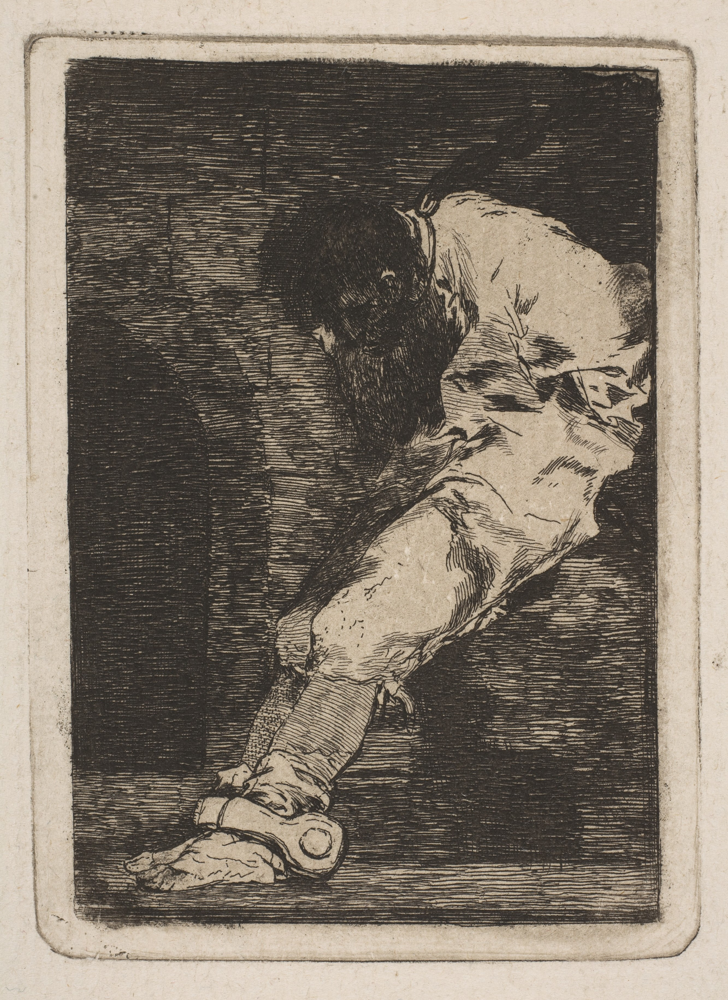

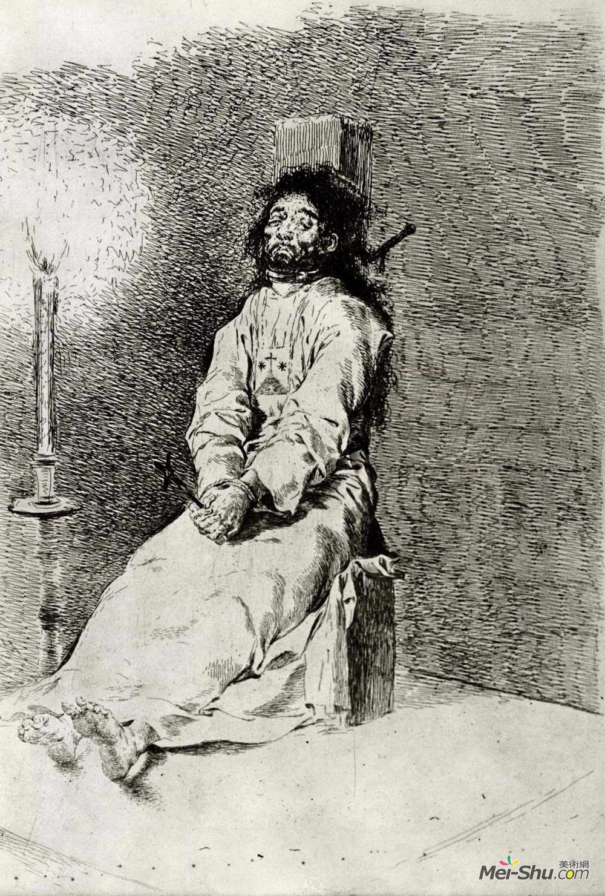

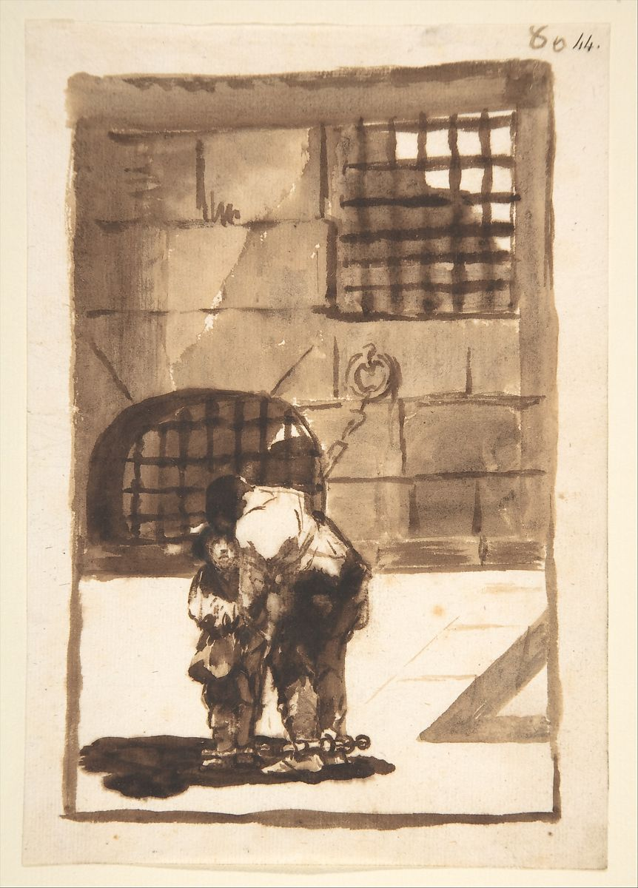

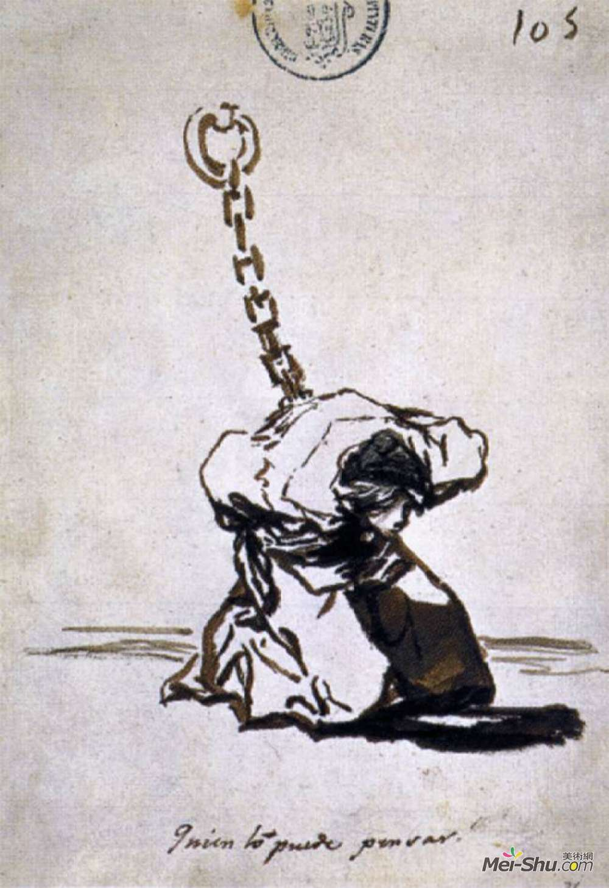

除了监狱，他还画了沉船、火灾、谋杀、抢劫以及被囚禁在疯人院和麻风病院里的人。

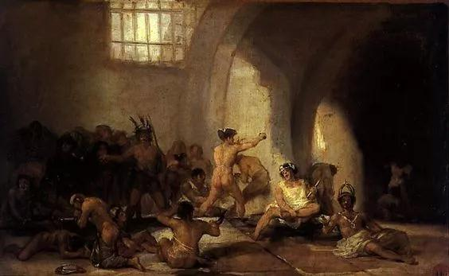  
疯人院

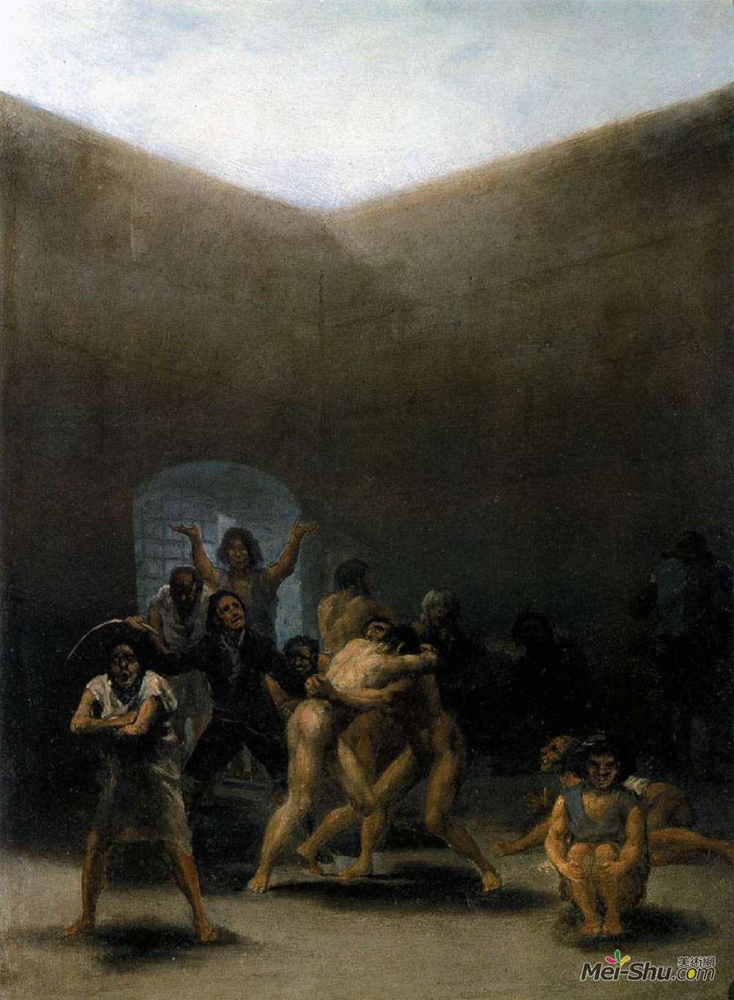  
疯人院的院子

  
鼠疫医院

  
疯癫酒吧

1819年戈雅在马德里郊外购置了一栋双层房屋，一楼是餐厅，二楼是卧室。他把这处住所称为“聋人屋”，并陆续在“聋人屋”的墙上绘制的15大幅油画，这些画作没有名字，被后人统称为“黑色绘画”。一楼7幅，二楼有8幅，其中包括大名鼎鼎的《农神吞噬其子》等。

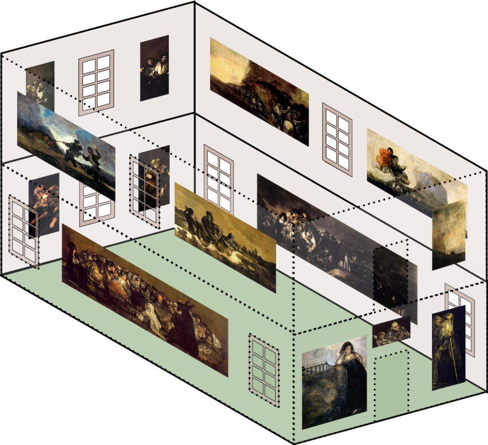

1824年，戈雅辞去宫廷画师的职务，此时妻子已经去世，他年老孤独，独自住到法国波尔多，随着病痛的折磨愈加激烈，戈雅几乎杜绝了一切社交，每天把自己关在屋子里画画，一直到生命的最后岁月。四年后戈雅去世，遗体于1900年运回西班牙，安葬在马德里郊外的圣安东尼·德·拉·弗罗里达教堂，该教堂的壁画由戈雅创作。

意大利的美术史学家文杜里评价戈雅：“他是一个在理想方面和技法方面全部打破了十八世纪传统的画家和新传统的创造者……正如古代希腊罗马的诗歌是从荷马开始的一样，近代绘画是从戈雅开始的。”
