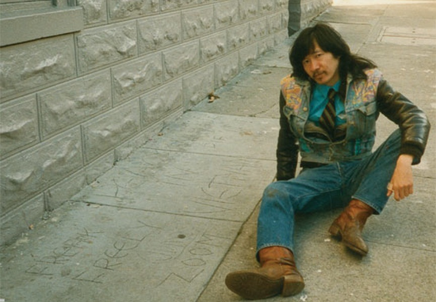
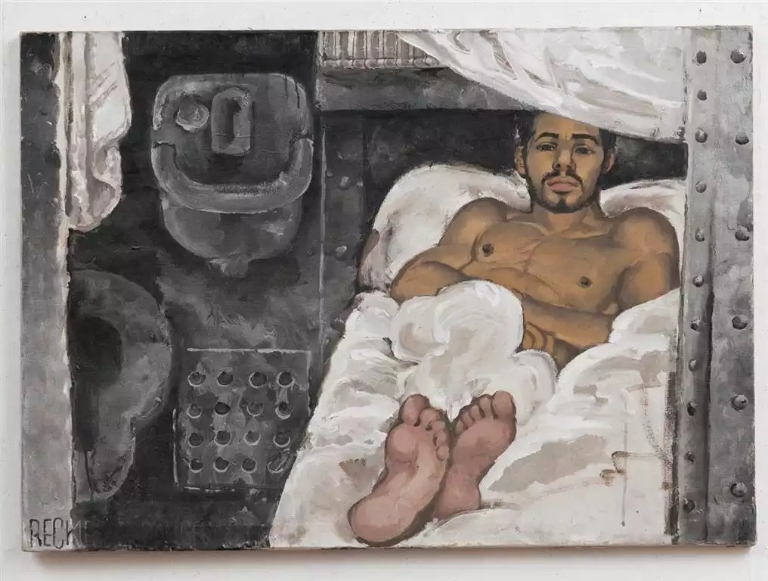
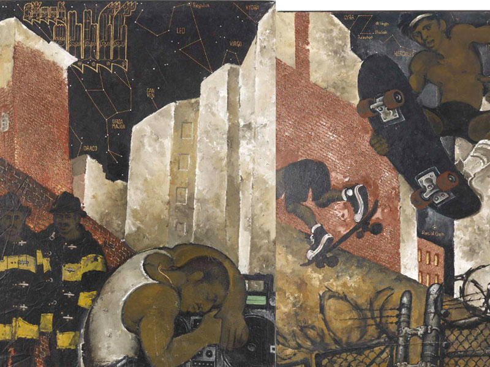
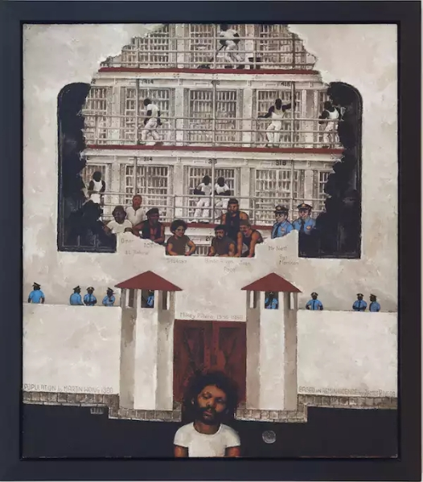
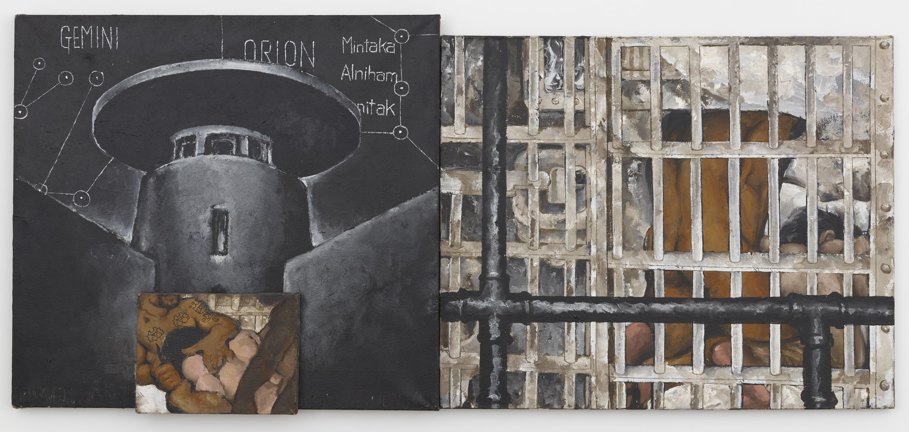
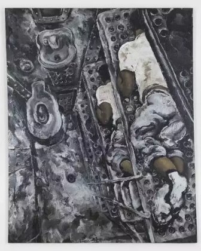
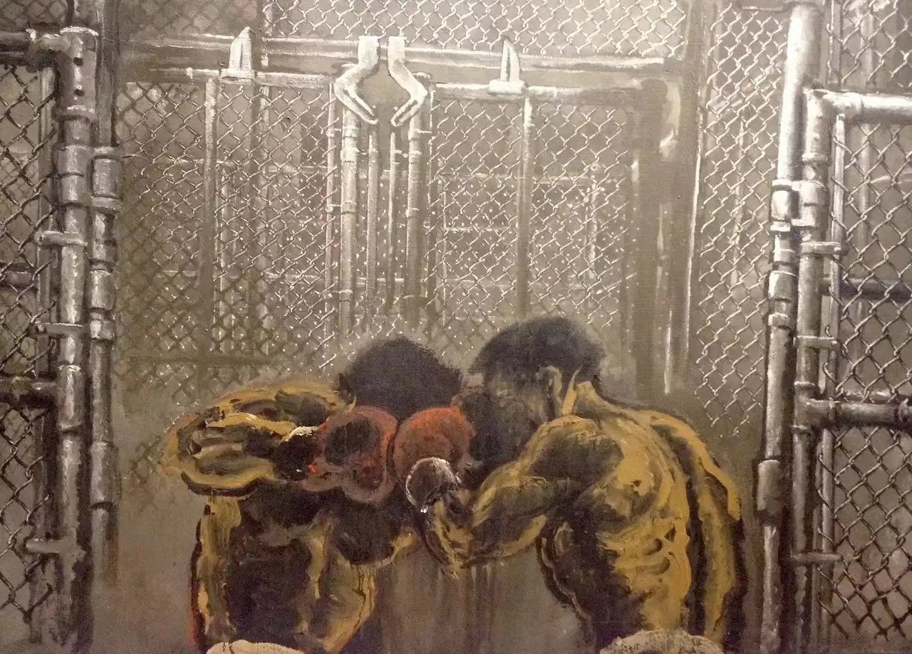
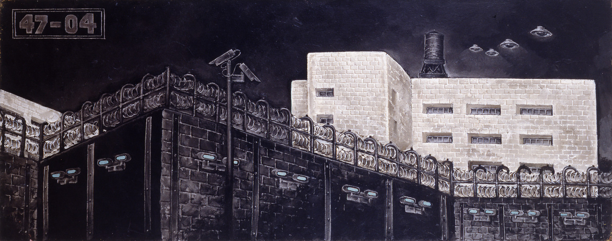
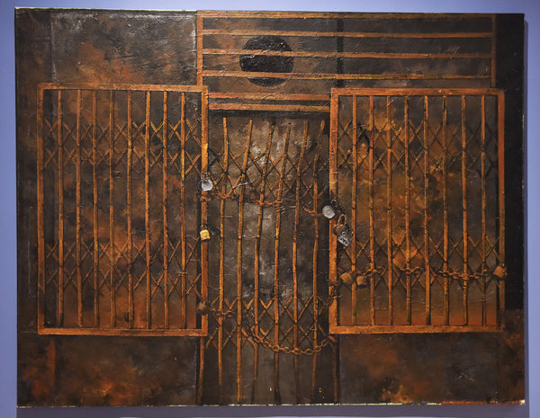

# 华人画家Martin Wong与他的纽约下东区生活

​
Martin Wong（黄马鼎），美国华裔画家。1946出生于俄勒冈州，在旧金山唐人街长大，1968年在洪堡州立大学获得陶瓷学学士。Martin Wong六七十年代积极投身嬉皮士运动，公开出柜，1978年定居到纽约曼哈顿混乱破败的下东区，从事过街头画像、看门人、书店店员等工作。后收藏和转卖东方古董并收藏涂鸦。1993年，旧金山艺术学院为其举办了名为唐人街绘画的个展，1999年Martin Wong因艾滋病并发症去世。

“我画中的所有东西都在我居所的四个街区之内，画中的人也都是我认识并且常常见到的人。”

下东区是一个蓝领社区，居住着大量少数族裔，包括非裔美国人、多米尼加人、波多黎各人、西班牙裔以及拉丁裔群体。混乱破败，光怪陆离。

除了描绘下东区，Martin Wong的主题还有监狱、手语以及消防员。他还曾与朋友合伙开了一家涂鸦博物馆，靠着对东方古董的品鉴、收藏转卖支撑涂鸦的收藏，并最后将自己的藏品捐赠给纽约市博物馆。

Martin Wong在去世之后才越来越被肯定，布朗克斯博物馆做了他的回顾展，作品被大都会博物馆等多家机构收藏。

Martin Wong并没有进过监狱，只是身处治安混乱的下东区，对监狱颇有耳闻。尤其是与朋友Miguel Pinero（Nuyorican Poets Cafe 的创始人） 的交往，让他更深的进入下东区。
Martin Wong笔下的监狱和消防员都有明显的性意味。与让·热内一样，监禁环境之下隐秘而蓬勃、粗糙又直接的性、动物本能不加掩饰的重又占据生活重心的性使得监狱成为他憧憬的圣殿。

  
求爱

  
纪念Miguel Pinero去世之作

