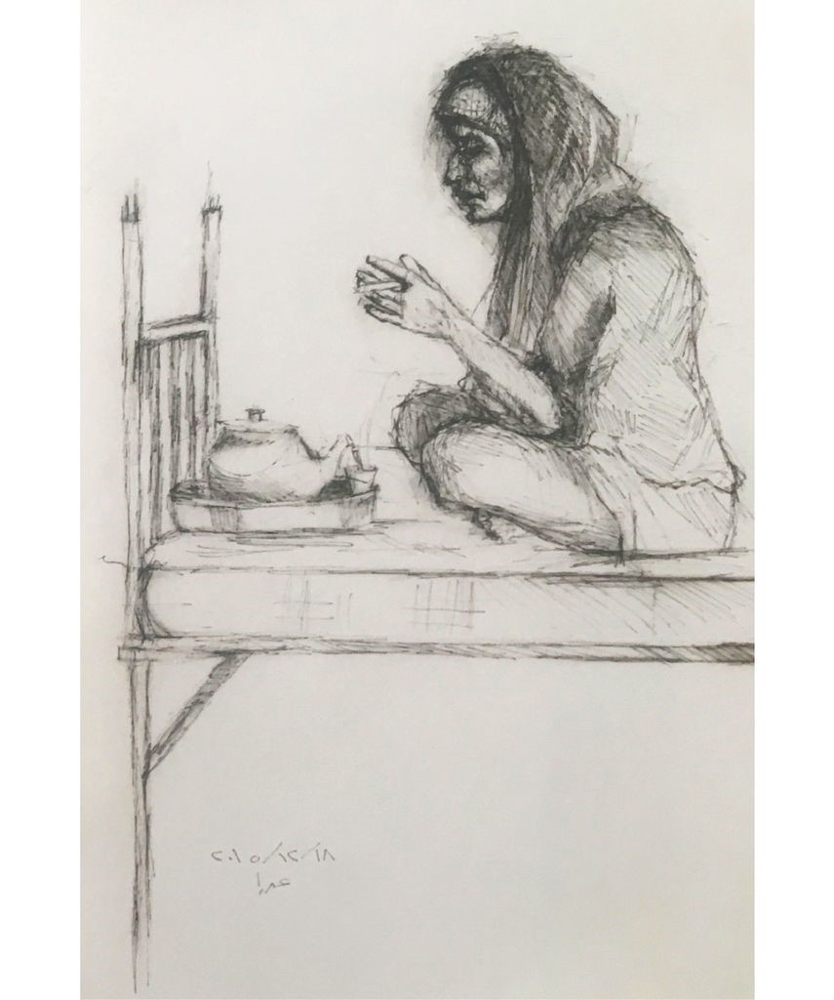
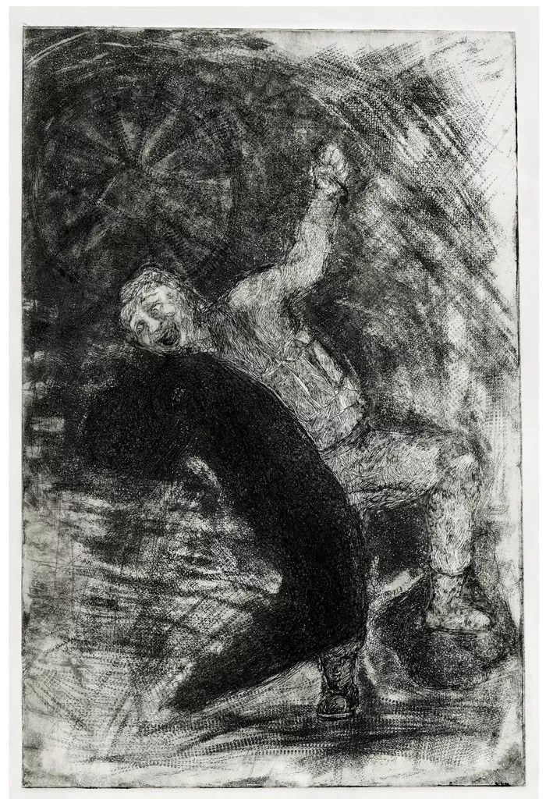
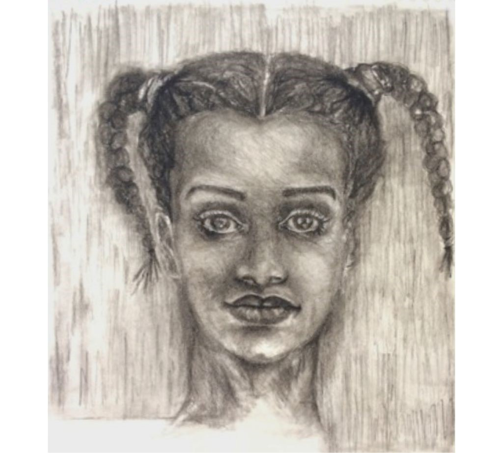
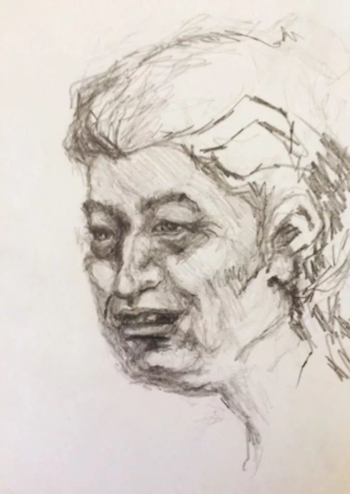
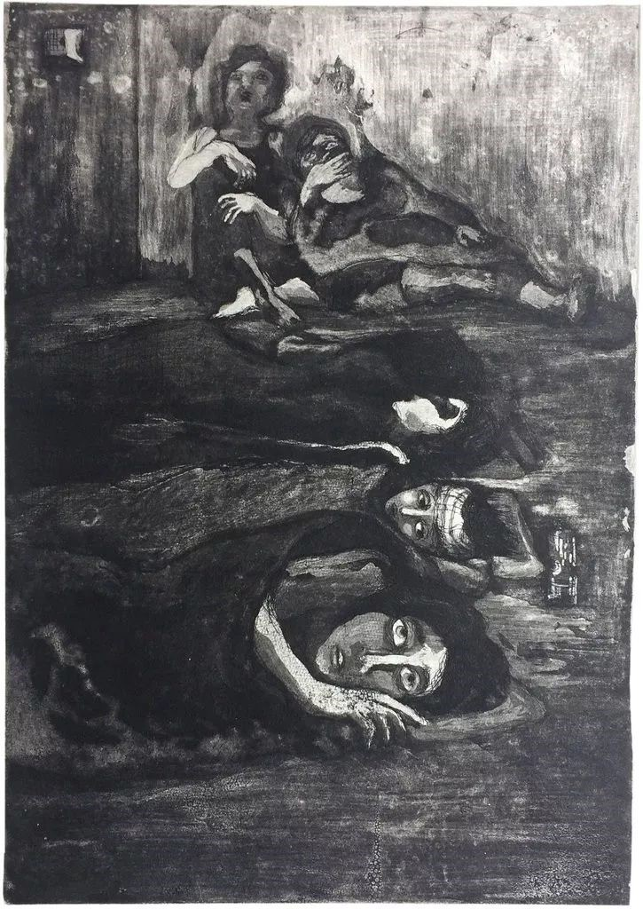
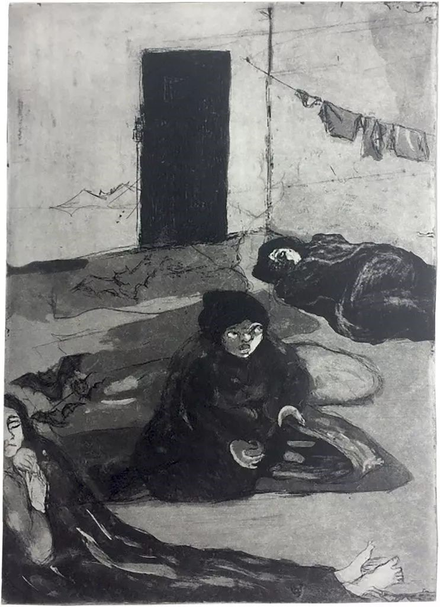

# 四号囚室的女人们

​叙利亚连年的战争让国家千疮百孔，人们流离失所。2015年，叙利亚女画家阿扎·阿博·雷比耶（Azza Abo Rebieh）被捕入狱后，用炭笔画下她的女狱友，并在出狱后持续创作，用画笔讲述战争和狱中的故事。

她叫希亚姆（Hiam），六十五岁。此刻，正抽着烟，呷着叙利亚常见的马黛茶。在灵魂破碎的地方、囚室的床上，这是片刻的独处。希亚姆入狱已两年半。

为希亚姆画像的女画家阿扎·阿博·雷比耶（Azza Abo Rebieh）是30名女囚之一，她们一起被看押在大马士革北部的阿德拉(Adra)监狱。因为她的画和激进行为，36岁时，阿博·雷比耶遭到逮捕，展开了一段在叙利亚监狱中不可思议的旅程。2011年叙利亚发生暴乱后，阿博·雷比耶开始了创作，她的作品如一面镜子，映照出那个混乱不堪的国家。她冒着被捕的危险，画下反抗运动的涂鸦壁画。

阿扎·阿博·雷比耶，在黎巴嫩贝鲁特家中。

2015年9月，阿博·雷比耶接到朋友的电话，约她在一家咖啡馆碰面。但那是一个陷阱，她刚到，警察已在等候。

阿博·雷比耶是受过良好教育的中产阶层，和她关在一起的女人却都目不识丁。阿博·雷比耶成了她们的发言人和传声板，替她们向看守传达需求、帮她们交流。她为狱友画的画，也像一面镜子。在狱中，什么都没有，女人们只能从画中看到自己的模样。画家仿照她最爱的艺术家戈雅，用清一色带阴影的黑白，画下她们痛苦的面庞和瘦削的四肢。

2016年，阿博·雷比耶获得释放，但她的案子没有了结。叙利亚仍在通缉她，她逃往黎巴嫩，暂时栖身。2017年，她赢得了一项西班牙的艺术驻留计划，让她深造戈雅绘画并画出叙利亚的经历。但是，西班牙政府拒绝为她发放签证。最近，阿拉伯文化艺术基金资助阿博·雷比耶在黎巴嫩贝鲁特一家画廊举行个展，展出了不少新作，她也在持续创作昔日的狱友。

“我要把她们画下来，让她们不被遗忘，”阿博·雷比耶坐在小客厅里，墙上挂着狱中的画，和她在牢里用橄榄核、破毛毯上的纱线扎成的娃娃。“它们会说话，让我时刻记得，我出来了，她们还在里面。”

  
阿博·雷比耶在狱中制作的玩具娃娃

阿博·雷比耶与《纽约时报》分享了她的作品，用英语、阿拉伯语讲述了狱中故事和在那里认识的人。

大英博物馆收藏了她的3件作品。其中之一是2011年起创作的蚀刻版画《他们带走了他——无耻》。叙利亚安全警察给一位男性抗议者套上女人的衣服，拉他上车，开过雷比耶居住的叙利亚西部城市哈马，阿博·雷比耶根据社交网上的视频创作了这幅版画。

另一幅版画，名为《仍在歌唱》。画中，反对者喊着“来吧，离开吧，巴沙尔”（Yalla Irhal Ya Bashar），因此被当作暴乱者。

  
阿扎·阿博·雷比耶，仍在歌唱，蚀刻版画，大英博物馆藏

阿博·雷比耶被捕后，在监狱里待了70天，她被扔进一间又小又脏的牢房，里面还住着15个女人，她们的头发里藏着虱子，被子里裹着蛾子。每天，她们只能在规定的几分钟里上厕所，厕所里堆满粪便，爬满蟑螂。无数人死于狱中，而家人对她们的厄运浑然不知。

在狱中，阿博·雷比耶得到了唯一一个画画的机会。当审讯者得知她是个画家，向她提出一个要求：画下仇恨。

“他给我一支铅笔、一张纸，逼着我画，”她回忆。起先，受审讯时，她的脸上蒙着布，为了让她画，布被揭了下来。“我看着那里，双手发抖。”她要画一个老头，牙齿脱落，面目狰狞，将一只鸟用力攥在掌心。“哇，”审讯者说，其他人也挤过来，起哄着：“这就是我们，我们都这样干。”犹豫了一下，阿博·雷比耶难以接受，“这不是你们，这是别人。”“不，不，”他说，“这就是我们干的事。我们知道，我们这么做很开心。”“并且这，”他指着那只被捏住的鸟，“就是你。”

“4号囚室的女士”

当阿博·雷比耶被转移到阿德拉的官方监狱后，环境终于有所改善，她说服看管给她纸笔，她开始画下和她关在一起的女人们。

“牢里没有镜子，她们只能在画里看到自己的样貌。她们比我画的还要美。牢里闲来无事，所以她们会打扮自己，整理头发，有的女孩让父母买化妆品。她们很年轻，夜里会跳舞，还比赛谁跳得更好。有时，她们边哭边跳。新年前夜，看管允许我们举行派对。我在女孩的双颊上画，一边画猫咪，一边画蝴蝶。一年之中，只有这一天看管让我们联欢。所以，我们给他们写新年贺卡，‘4号囚室的女士祝你新年快乐。’

当看管看到我们自称‘女士’，他们就生气了，说，‘你们是恐怖分子，不是什么女士。’”

拉玛·阿尔德，18岁  

“拉玛·阿尔德（Rama al-Eid）希望囚室里的每个女人都是她的妈妈。她很年轻，我们都管她叫巧克力。她是非常美丽的女孩儿，有双大眼睛。曾经她得过全国羽毛球比赛冠军。

拉玛是德拉（Daraa）人，那里最先开始暴乱。当她十几岁时，就被指控为反抗政权的激进分子，被抓进监狱。18岁那年，法官判了她6年零8个月。”

纳依菲（Nayfee）22岁  

纳依菲，她来自胡姆斯，在监狱里待了大约4年。她是个很可爱的女孩儿，在监狱咖啡吧工作。他们让这些女孩工作，挣点收入。

就因为来自胡姆斯，她就被当成罪犯。她被指控向媒体传递消息，把胡姆斯发生的事透露给外面。她每天抱着泰迪熊睡觉。”

塔勒·阿尔姆鲁希  

塔勒·阿尔姆鲁希（Tal El Mlouhi）是名博客写手，2009年，19岁的她被捕入狱。“她的举止，宛若公主。我想，她在监狱久了，已经失忆了。每当警卫来点名时，她都整理好自己，喷上香水。所以点名开始时，她总是很优雅。你看着她，你会怜悯她。”

希亚姆  

“希亚姆不会读写，但让我教她画画。她很喜欢兔子，我就教她画兔子。于是，她开始画自己的家，还有家周围的小花。

“我出狱前，她递给我一封信——那是别人代她写的——‘我没有必要学会读书写字。你教会我画画，这是我表达自己最好的方法。现在我可以画我的家，画我的梦想。’

“希亚姆总是高高兴兴的，从不让你觉得痛苦，即便身在狱中。65岁的希亚姆，是5个孩子的母亲，她被控为圣战组织成员提供性服务。叙利亚官方却拿不出任何证据，却以此为借口大肆逮捕女性。当你问希亚姆，‘你为什么在监狱里’，她会跳起来高兴地说‘性圣战！’她已经蹲监狱两年半了，从没有家人看过她，因为她的家乡在胡姆斯乡村，她的家人如果来看她，在路上的检查站会被捕。”

玛利亚，65岁  

在所有狱友中，阿博·雷比耶最担心的莫过于玛利亚（Maryam）。她有6个孩子，有好几个月，她被看押在阿勒颇一间秘密政府监狱，她被不停审问，孩子们在哪个反抗地区受训，然后被送往大马士革从事恐怖活动。但她当时足够幸运，法官发现她已经失忆了，出于同情释放了她。

但在叙利亚，事情并不如此简单。一个行政机构可以释放你，另一个可以重新逮捕你，两个机构互不协作，那些名字遥遥无期地挂在被捕名单上，这就是发生在玛利亚身上的事，这个目不识丁的女人本可以平安回家，却在混乱不堪之中，被投进大马士革的另一所监狱。

阿博·雷比耶出狱后，凭记忆画下玛利亚。她用炭笔画出玛利亚苍白、衰老的脸，那张脸上，双眼撑开，眼中流露出害怕与不解。玛利亚双手搭在膝上，充满哀求与怀疑。她常常这样坐在阿博·雷比耶身边，反反复复问着：“我为什么在这里？”过了一会儿，阿博·雷比耶的也控制不住情绪：

“她每隔4分钟就要问我一次，我快失控了。我曾经照顾过她，给她洗头、喂饭，但她不停地问，我受不了了，我冲她大喊，你别再问我了，然后我也痛哭起来。”

赛娜  

阿博·雷比耶出狱后，画了赛娜（Zeina）。

“这是赛娜，她在请求透口气。我们是9月被抓进来的，当时穿着夏天的衣服。到了冬天，衣着单薄，我们很冷。他们没收了我们的钱，拒绝给我们加衣服，扔进来的毯子裹着飞蛾。赛娜有哮喘，快喘不上气了。她敲门，恳求警卫给她几分钟透透气。她坐在门边，深深地吸气，然后哭起来。我永远忘不了那一幕。”

离开

2016年1月，寒冷的一天，5个又瘦又累的女人从马达亚小镇来到监狱。阿博·雷比耶不知道高墙外面发生了什么，她不知道马达亚小镇在被围困期间，好多孩子死于断粮。最终，当妇女们终于看到食物——仅仅几片土豆——扑上去狼吞虎咽，好像在啃羊排。

“女人们说：‘我们来自马达亚，在那里被围困的几个月中，除了水和一点调料，什么也没有。’另一个人补充道：‘每天，当我的孩子哭着要吃的时，我就拍他，直到他睡着，我接着拍自己，拍到我也犯困，就挨着他睡。’”不久后，阿博·雷比耶被释放，但是案子没结，她随时会再坐牢。她向人行贿，逃出叙利亚，来到黎巴嫩贝鲁特。

阿扎·阿博·雷比耶，在黎巴嫩贝鲁特家中。

“我感到很内疚，我出来了，她们仍在那里，”她说。“在我吃饭、走路、睡觉的时候，虽然身在外，但监狱在头脑中挥之不去。”她看了心理医生，医生让她把一切都画出来：“他要让我相信，我已经出狱了。”

一开始，阿博·雷比耶感到压抑，什么也画不出，但过了一阵，作品像洪水一样涌出，她画了一系列有关监狱经历的版画。这是军事拘留所。就像成百上千的消失者一样，关在这里的囚犯也切断了与外界的一切联系，家人根本不知她们去了哪里。

她们继续忍饥挨饿，唯一的愿望，是让家人知道自己的所踪。有些人拒绝服药，尽管身患心脏病或癫痫，随时可能死去。

当警卫对着女囚喊叫，阿博·雷比耶也会反冲他们吼：“如果你的女儿也突然消失，60天没有任何消息，你会怎样？”

“当我画完这些，觉得好受一些。就像我的心曾经紧紧地抓着她们，现在她们出来了。”阿博·雷比耶说。

“我们要不断述说监狱里的故事，”她说，“我的艺术，就是要表达这些。”

