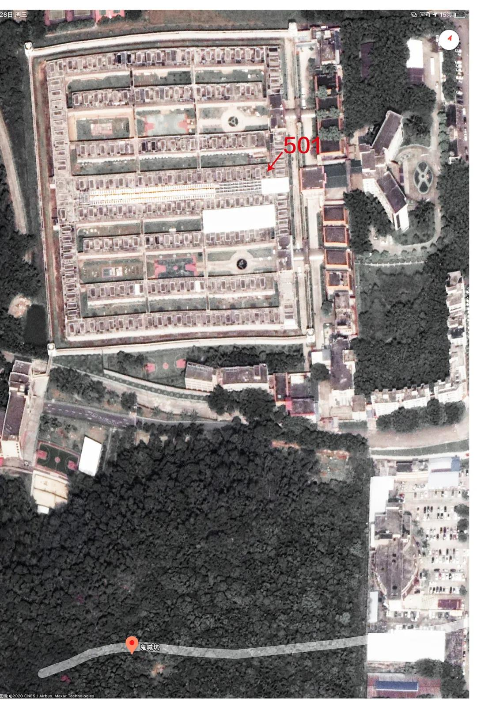
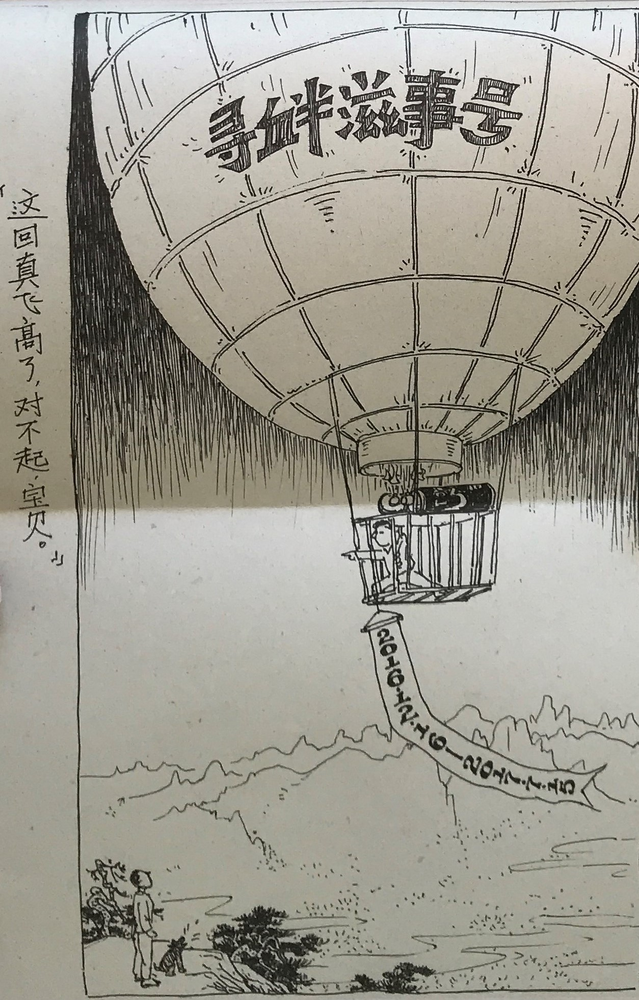
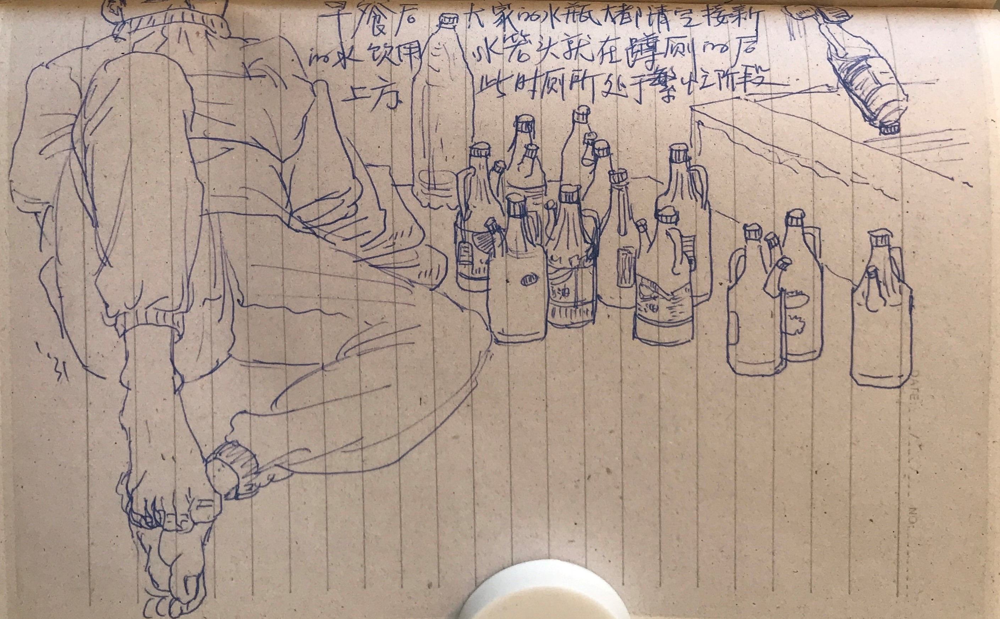
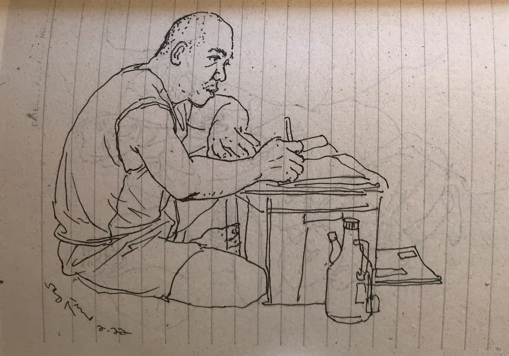
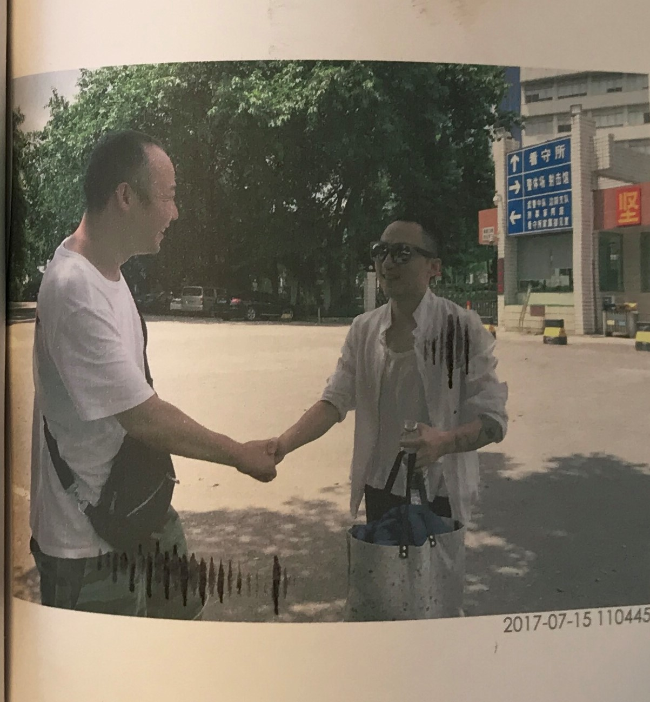
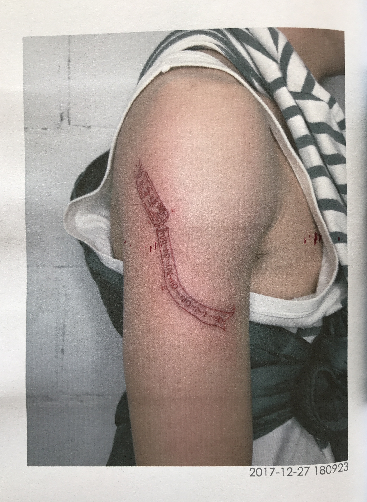
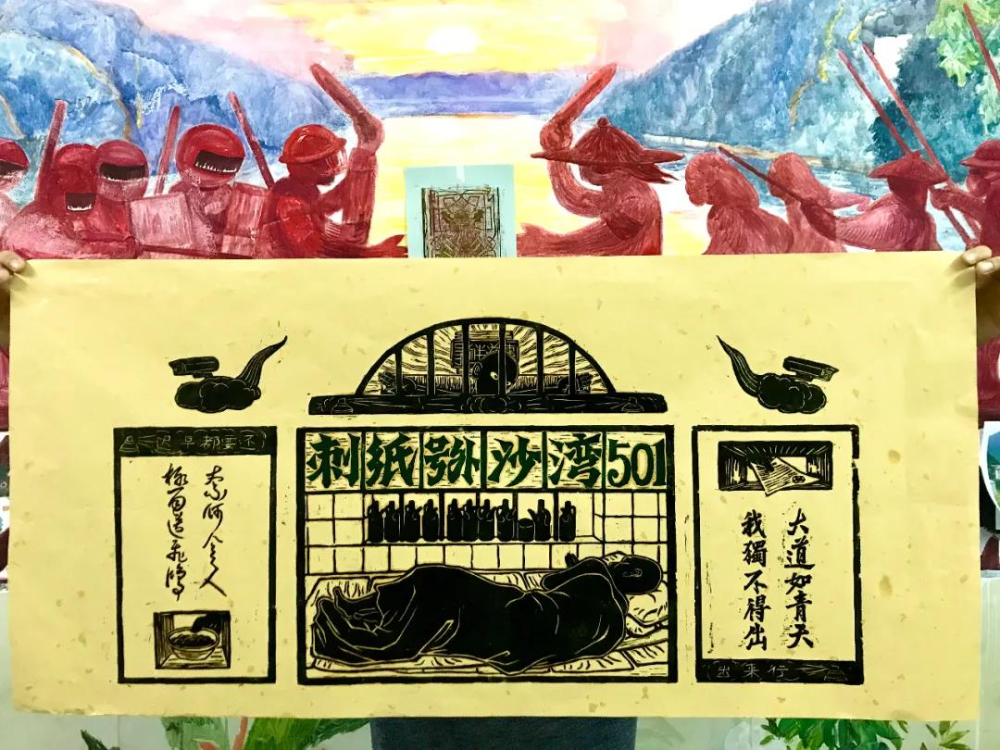

# 欧飞鸿与《沙湾501》

​本期狱望为大家带来的是欧飞鸿和他的《沙湾501》。

2016年底，因为涂鸦，欧飞鸿被控寻衅滋事，在广州番禺沙湾镇看守所501监仓度过了7个月的时光。

期间，他画了十多本册子，其中一部分得以陆续寄出。去年，他将这段经历以及部分画装订成册，也就是今天介绍的《沙湾501》。

本书部分细节：

  
封面

  
失蹄

  
事发地与被抹掉的涂鸦

  
这段经历中涉及到的种种文书构成本书不可或缺的一部分

  

他给审判员配了肖像：一张大脸配着左颊的一颗黑痣。让审判庭上的欧飞鸿不禁担心：“这多影响法律的庄严感啊。”

  
木刻版画：大道如青天，我独不得出。

极目看飞鸿

看守所里过大年

  
于无可救药之地，疗人寂寞是菩萨行。

  
监仓平面图

  
速写与看守所日常

  
洗漱、等早餐

  
接水

  
看电视。“有青春吻戏，即闻各仓连片高声尖吼，连绵不绝，其中固然有我一份。”

  
各自玩牌（四人散落成圈状，低头独自玩着手头的牌，沉默不语。）以及准备大扫除

  
鼾声如雷的惯偷

  
又准备大扫除

剪头发

写信

  
切身感受规训与惩罚

  
怀旧

  
有些画画在看守所内商品订购卡的背面。

不信教的欧飞鸿托弟弟打印了圣经《新约》全本寄给他，他画了不少妙趣横生的圣经故事，朋友们说他“很会坐牢”。

  

  
“比基尼大叔”版的耶稣基督

  
重获自由

  
  
欧飞鸿把这段经历纹在胳膊上

“编撰期间，和朋友们二度欢乐重访鬼喊坑，想着年前开心回家看看，可是它好像暂时不欢迎我了，仿佛卡夫卡笔下的K那样，无法接近它。但我心底知道，这一个个看似僵硬沉默的堡垒，它们从来都是我和大家，每个人潜藏的家，它们会在某一刻，在我们毫无准备的情况下，突然向我们打开威严的大门，激情吞纳我们赤裸的身体与灵魂。”

  
欧飞鸿
