# 弗兰克·琼斯的彩色铅笔画

“我看到了它们，所以我把它们画了下来。”
——弗兰克·琼斯在《当代原生艺术中的幽灵》

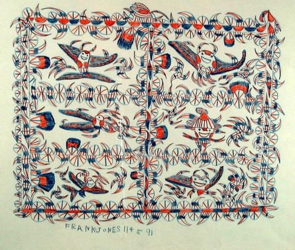

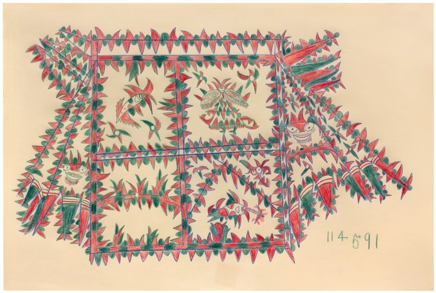

弗兰克·琼斯（Frank Jones）是一名非裔美国人，1900年左右出生于德克萨斯，他成年后的大部分时间都在监狱里度过。1964年弗兰克·琼斯开始画画，当时他因谋杀罪在德克萨斯州监狱服刑（琼斯坚称自己无罪）。他的绘画材料是从他工作的监狱办公室的垃圾桶里打捞出来的红蓝相间的铅笔和打字纸。后来，由于他的画在监狱内外受到好评，他得到了更好的纸和新的彩色铅笔。琼斯尝试了其他颜色，但更喜欢红色和蓝色，他说这代表火和烟。

弗兰克·琼斯出生时左眼上有一部分胎膜。在非裔美国人以及希腊和罗马那样古老的文化传统中，有胎膜的人被认为可以看到鬼魂和魔鬼。琼斯在九岁时第一次看到他的“幽灵”（鬼魂）和“魔鬼”，并在其后的一生中持续看到他们。他创作了几百幅复杂的房屋图纸，在类似牢房的房间里展示了这些“魅影”。

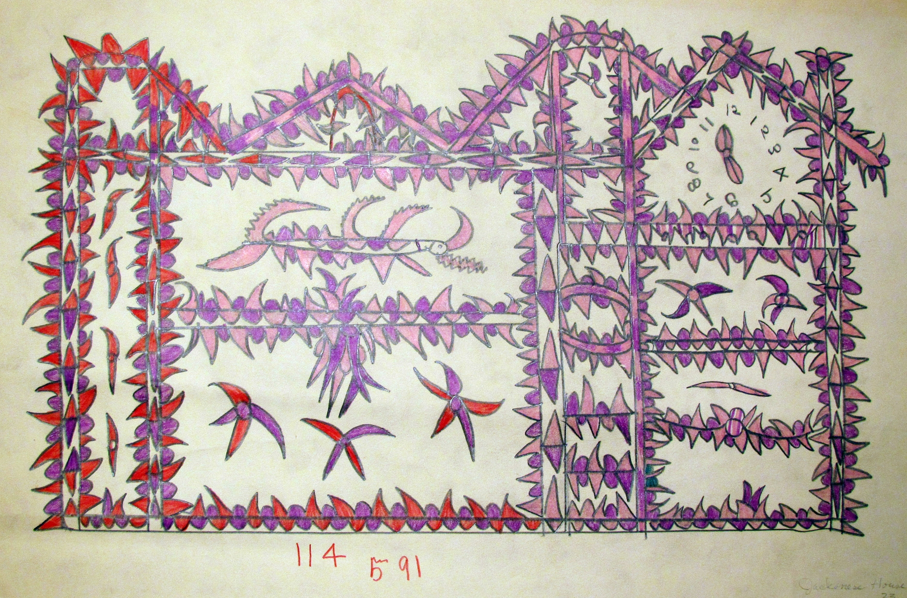

在他六十九年的监禁中，有二十八年是因为他可能没有犯下的罪行。琼斯三四岁时，他的父亲就离开了这个家庭，他五六岁时，母亲把他遗弃在街角。琼斯被母亲抛弃后，被威利·迪恩·贝克收养，她是一位上了年纪的黑人妇女，在邻居德拉·格雷的帮助下抚养长大。琼斯从未上过学，也没有学过读写。年轻时，他在克拉克斯维尔和邻近城镇做各种各样的零工。

琼斯在九岁左右见到了他的第一个幽灵。他余生都有超自然的幻觉。他把自己的“双眼”比作窥视孔和观察精神世界。琼斯交替地将他所看到的灵魂称为“海因茨”、“魔鬼”和“魔鬼海因茨”，坚持认为它们都是一样的。假设人类，动物，鸟类和无生命的形式，这些魔鬼是男性或女性和许多民族。对琼斯来说，他们的存在是真实而普遍的。

琼斯的超自然力量在他的东德克萨斯社区是众所周知的，在那里他早年的生活平安无事。他漫长的监禁历史始于1941年，当时他被指控强奸了一名年轻女子，这名女子是他在1935年发现被遗弃后抚养长大的。孩子的母亲6年后出现，要求领回孩子。据琼斯说，当他拒绝放弃对女孩的监护权时，母亲指控他犯有强奸罪。琼斯声称自己是无辜的，但被判有罪，在监狱里服刑两年零两个月。

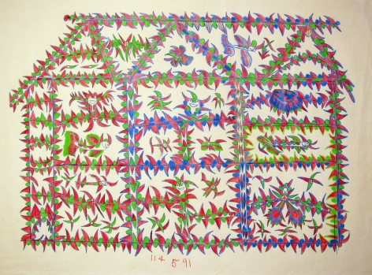

1945年左右，琼斯与奥黛丽·卡尔伯森结婚，后者育有两个成年儿子。1949年，琼斯的养母德拉·格雷遭到抢劫和谋杀。琼斯的一个继子被判谋杀罪，并与琼斯有牵连。尽管琼斯极力否认自己知道这一罪行，但他被判有罪并被判处终身监禁。他服刑九年，获假释。琼斯回到克拉克斯维尔，计划再婚。然而在1960年，他雇来打扫房子的一个女人指控他强奸了她。琼斯否认了这一指控，并坚称他是那个女孩和一个不喜欢他的男邻居“陷害”的。琼斯作为一个违反假释的人被送回监狱；他的余生都在监狱里度过。

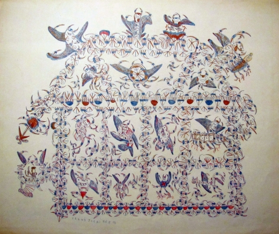

琼斯的“艺术”生涯始于他第三次被监禁期间，从大约1964年到1969年初他去世，仅历时五年。他专注于用红蓝铅笔在纸上创作图画，这些图画总是反映出基于在监狱里的经历以及与他精神世界中的“黑鬼”和“魔鬼”的交流而产生的幻觉。

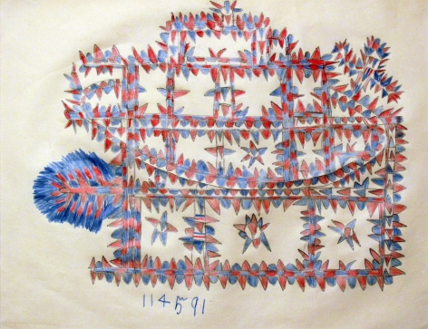

琼斯最早的画是用他在监狱娱乐办公室周围找到的材料画的，他被派去工作。他用的是监狱簿记员丢弃的红蓝铅笔头和通常从废纸篓里捡来的廉价打字纸。琼斯的作品最早是在1964年的一次监狱艺术展上获得认可的。不久之后，达拉斯一家美术馆开始推销他的作品，并为他提供了更大、质量更高的纸张和额外的彩色铅笔。琼斯变得越来越多产，四个月后，他在监狱艺术展首次亮相，他在画廊举行了他的第一个一个人的展览。这次展览受到了公众的欢迎，并吸引了大量的媒体报道，媒体对琼斯进行了多次采访。作为监狱名人身份的结果，琼斯的物质生活有了很大的改善。事实上，他很享受媒体的关注，因为在过去的15年里，他从来没有一个访客或收到过一封邮件。此外，他的狱友们对他非常尊敬，出售他的画的收入使他得以购买收音机和手表，这是他凄凉的监狱生活中仅有的两种奢侈品。

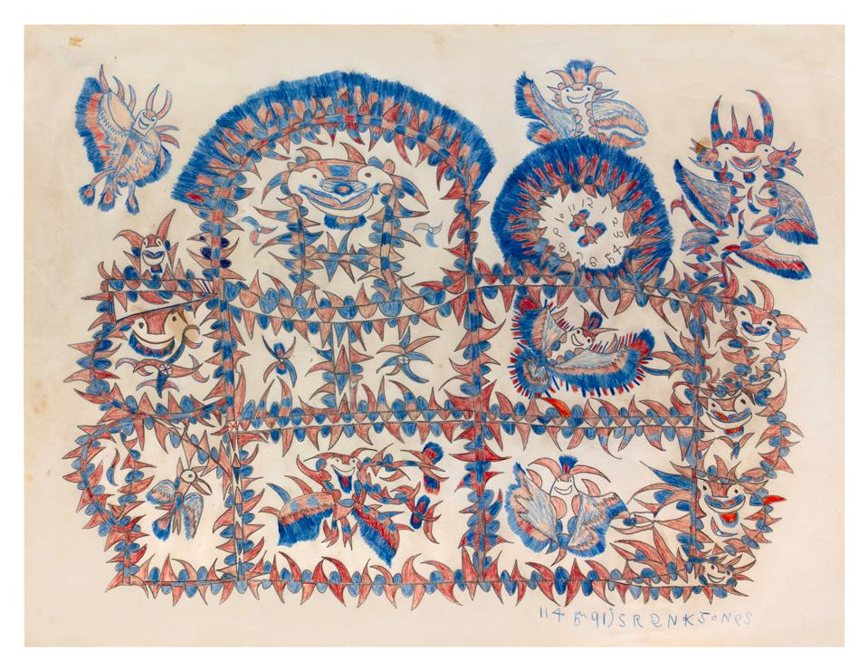

虽然琼斯在艺术上活跃了仅仅五年，但他的风格发生了明显的变化。他的第一幅作品完成于1964年，描绘了他特有的“魔鬼之家”，在多层建筑横截面上展示了各种各样的人物，代表了琼斯声称看到的灵魂。红色和蓝色主导了他的绘画，他继续喜欢他们，即使他提供了一系列的颜色。对琼斯来说，红色和蓝色象征着烟、火和地狱。琼斯认定的尖刺状的角创造了图案，也暗示了运动。他早期的绘画作品中经常出现飞鱼的形象和侧面显示的长翅膀的形象。

随着琼斯变得更加自信，他的画廊为他提供了更好的材料，他的“成熟”风格出现了。这些后来的图纸的特点是建筑结构充满了微笑的数字，盘旋在地板上，并悬挂在天花板上。把这些疯狂的人物围起来，有助于消除他们的情绪，这与实际的监狱墙限制囚犯行为的方式没什么不同。尽管琼斯被他精神世界里的恶魔折磨和嘲弄，他还是把他们抓在纸上，关在牢房一样的房间里，使他们无能为力。

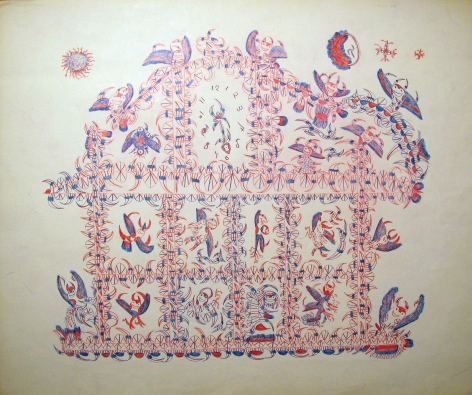

琼斯不少绘画作品中都有一个钟表。时间对囚犯有特殊的意义。再加上监狱的日常工作是以严格的时间表为基础的。由于囚犯失去了自由，他们总是忙于时间的流逝和最终获释的时间。在琼斯最早的画作中，空的圆圈出现在他的“精神之屋”的顶部。后来这些圆圈发展成带有指针的钟，表示特定的时间；在某些情况下，钟有多个指针和附件，可以旋转或环绕它们旋转。这些变化可能与琼斯不断要求假释以及随后被州当局拒绝有关。到20世纪60年代末，琼斯患上了肝病，并最终导致他的去世。

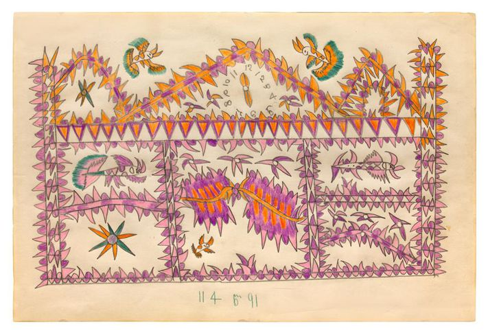

琼斯的监狱号码是114591，出现在他的一些画的底部，像签名一样放在那里。虽然一个狱友教他写自己的名字，但他的拼写前后不一，他发展出许多奇怪的变化。

琼斯既没有放弃获释的梦想，也没有动摇自己无罪的申诉。1969年2月初，琼斯终于获准假释。然而，他的健康状况突然恶化，他被送进了监狱医院。两周后，1969年2月15日，琼斯在被监禁期间去世。他的画为他赢得了一个体面的葬礼，遗体被送回家乡安葬。

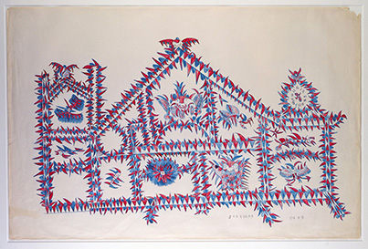

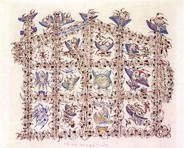

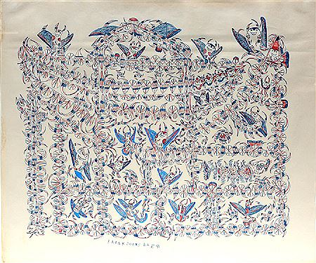

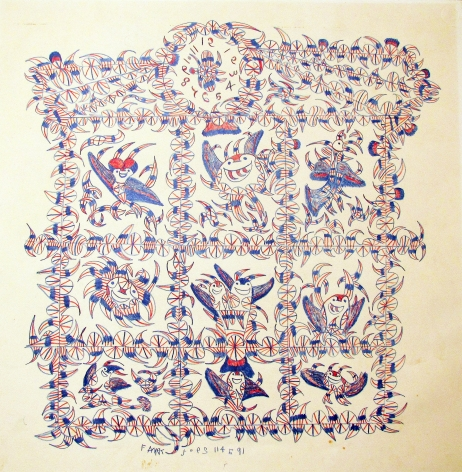

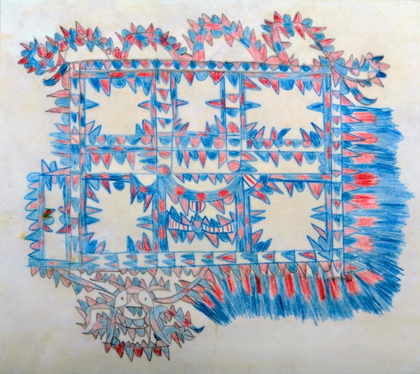

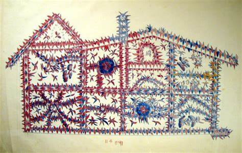

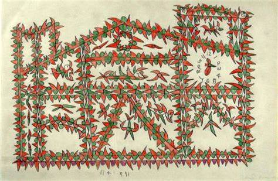

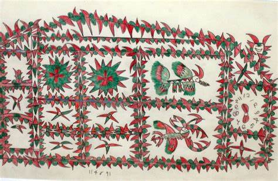

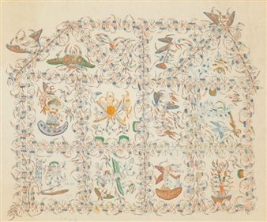

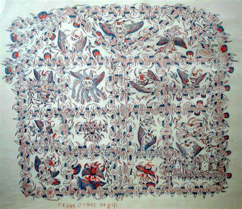

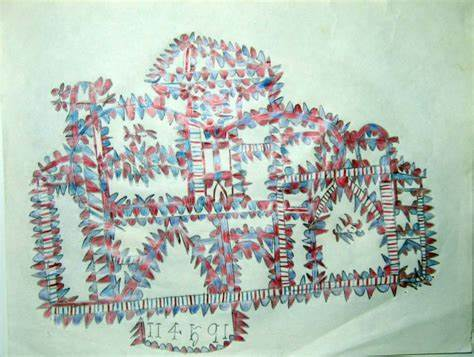

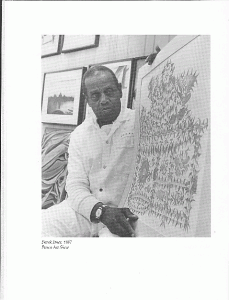
