# 伊朗女画家苏达比·阿达万画作

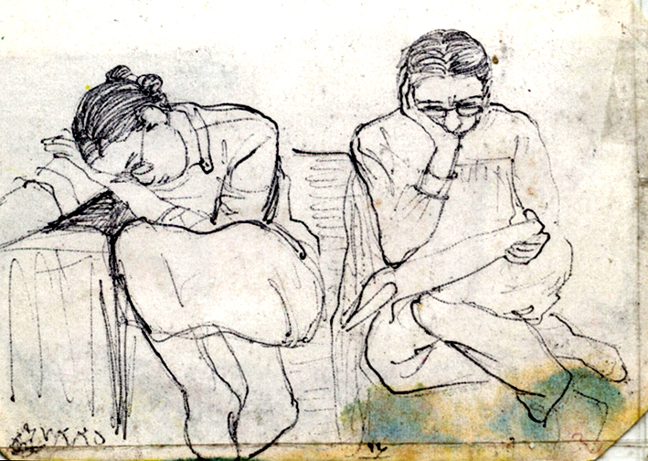

​苏达比·阿达万（Suudabeh Ardavan）出生于伊朗大不里士，是一名建筑设计师。1981年，23岁的阿达万被控参加反伊朗伊斯兰共和国的示威活动，在伊朗臭名昭著的埃文监狱（Evin Prison）被关押了八年。在狱中她绘制了数百张监狱场景和人物肖像，通过来探视的亲属带了出去。

1988年夏天，伊朗伊斯兰共和国秘密执行了全国大约5000名政治犯的处决。由阿亚图拉·霍梅尼本人发出的指令进行的杀戮是无情和高效的。囚犯包括妇女和青少年，他们五到六人一组，被装在叉车上，吊在起重机的横梁上。受害者包括知识分子、学生、左派、反对党成员以及少数民族和宗教少数派。据国际特赦组织称，许多人因分发传单、拥有一本被禁书或被“该政权的信任朋友”指控而被判入狱。

大屠杀是该政权从1981年至1989年进行的大规模消灭运动的高潮：在那个血腥的十年中，伊朗各地有大约20,000名政治犯被处决。阿达万幸存了下来。

阿达万的画笔用牙签和头发做成，一开始她只能画黑白画，后来她尝试用花瓣和茶叶配制颜料，再往后有人送进来一盒彩色魔术笔，所以她画了一些彩色画作。

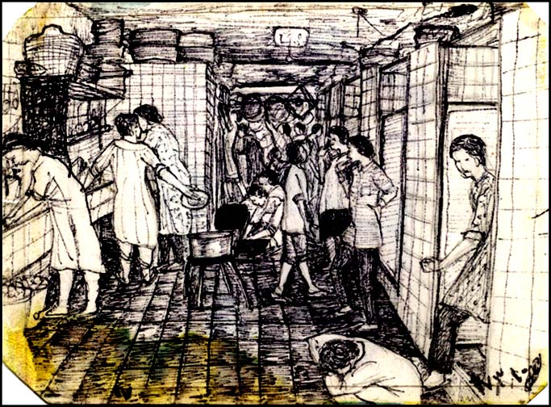

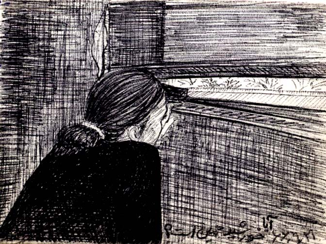

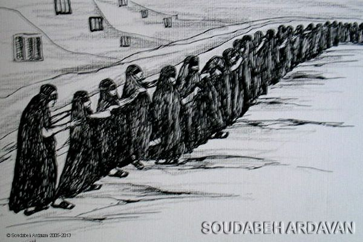

她说在那种极端艰苦的条件下，我常常为自己和其他人的生命担忧，在画板上捕捉各种瞬间，恐怖的、有时甚至是美好的瞬间。我画了卫兵的照片，他们的脸如此残酷，没有人性。我画了一些像我的姐妹般的同胞。她们的纯真、她们的青春、她们的恐惧。

我画了我们大家清洁区和居住区的画作。我画了丑陋的、不洁的，画了纯净的蓝天和飞鸟的画作，我希望有一天能看到自由。我画了一切。

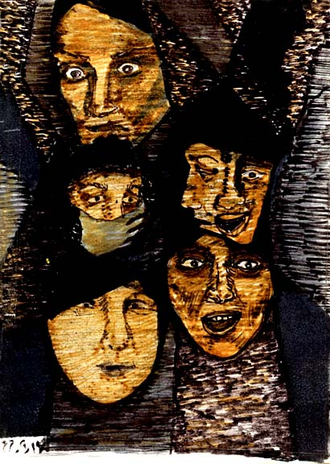

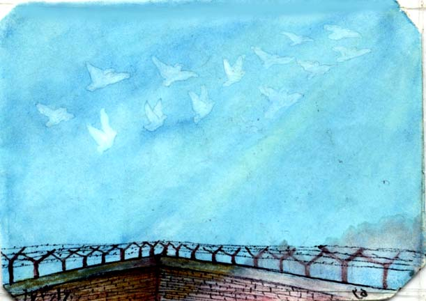

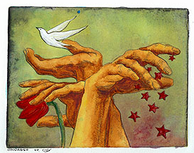

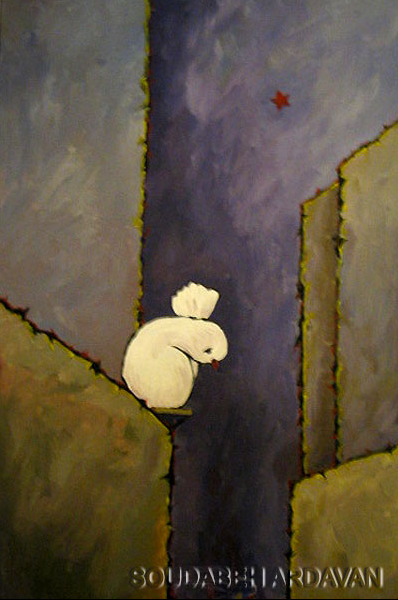

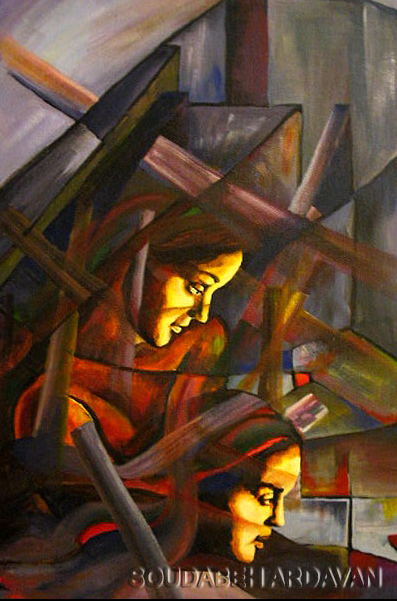

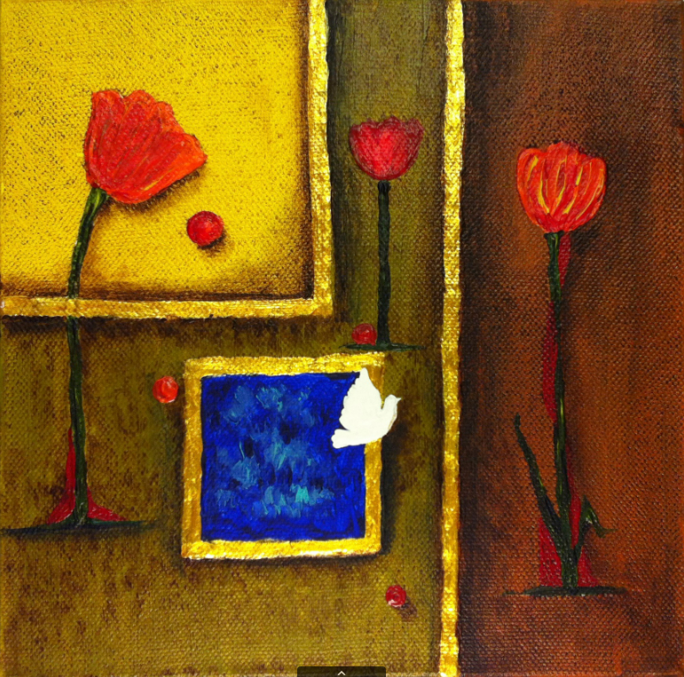

尽管尺幅很小且材料简单，阿达万的作品依然生动地描绘了监狱里的生活，记录了一段永远无法从她的记忆中抹去的时间。与“疤痕艺术”不同，它们传递出一种相当积极的气息。

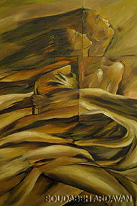

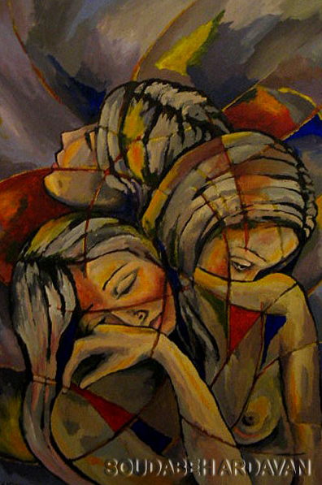

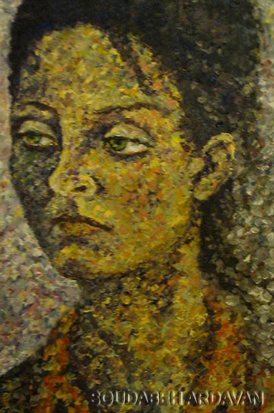

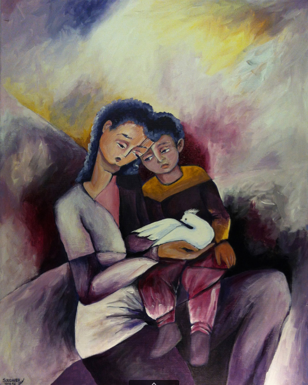

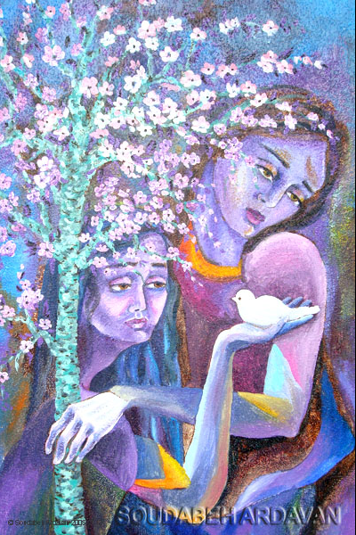

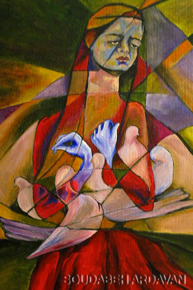

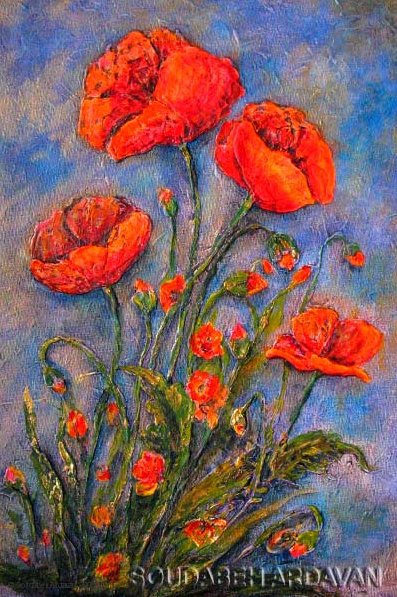

如今，阿达万生活在瑞典，在那里她继续绘画并在世界各地展览。她把自己在狱中的画作结集出版了一本名为《绘画中的监狱回忆录》（Prison Memoir in Painting）的书。
