# 莱昂纳德·佩尔蒂埃

莱昂纳多·佩尔蒂埃（Leonard Peltier），美国印第安人，生于1944年，土著民权活动家，1972年加入美国印第安人运动（American Indian Movement  AIM 一个印第安土著平权团体），成为该组织领袖，领导过多次抗议和游行。1975年两名联邦调查局特工在南达科他州松岭印第安保留地被谋杀。1977年，莱昂纳德·佩尔蒂埃被指控协助和教唆该谋杀案被判处两个无期徒刑。

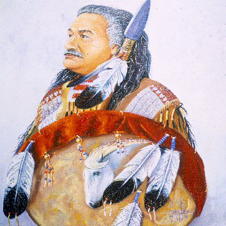  
佩尔蒂埃自画像

珀尔蒂埃于1944年出生于北达科他州龟山奇佩瓦印第安人保留地，有兄妹13人。佩尔蒂埃四岁时父母离异。留下他和妹妹与祖父母生活在一起。1953年，9岁的珀尔蒂埃在瓦普顿的印第安人学校就读。学校通过要求孩子们使用英语和禁止传播美洲土著文化来同化他们。

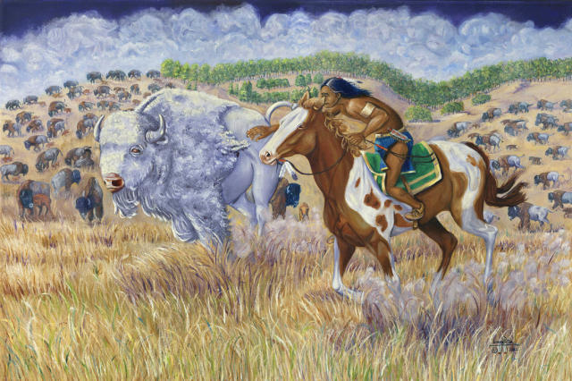

1965年，帕尔蒂埃迁往西雅图，他做过建筑工人、焊工、和人合伙开过汽车店。他们把汽车店的二楼用来做一个中途之家，让那些戒酒的或者刚刚出狱的印第安人使用，后来中途之家因经济原因关闭。

在西雅图，珀尔蒂埃积极参与美洲土著民权活动，于1972年成为美洲印第安人运动的正式成员。

1975年因身陷两名FBI特工谋杀案。1977年，佩尔蒂埃被指控协助和教唆该谋杀案被判处两个无期徒刑。

帕尔蒂埃1977年开始服刑，1979年7月20日，他和另外两名囚犯从联邦监狱逃走。一名囚犯在监狱外被警卫开枪打死，另一名囚犯90分钟后在大约在1英里外被抓获。珀尔蒂埃则逃出生天，直到三天后在加利福尼亚圣玛丽亚附近被一个搜索小组抓获，一名农民向当局报警说，珀尔蒂埃偷吃他的粮食。佩尔蒂埃在被捕时还持有一支步枪，因此，除先前两次无期徒刑外，越狱加刑五年，持有枪支加刑两年。

佩尔蒂埃在狱中坚持写作和画画，1999年他写下回忆录《监狱写作：我的生活就是我的太阳之舞》，他的画都是关于印第安文化，他们生活的那片肥沃的土地以及土地滋养着的元气充沛的众生。人桀骜不驯，动物膘肥体壮。令人心生敬畏。

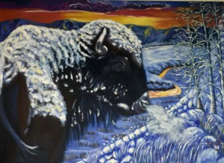

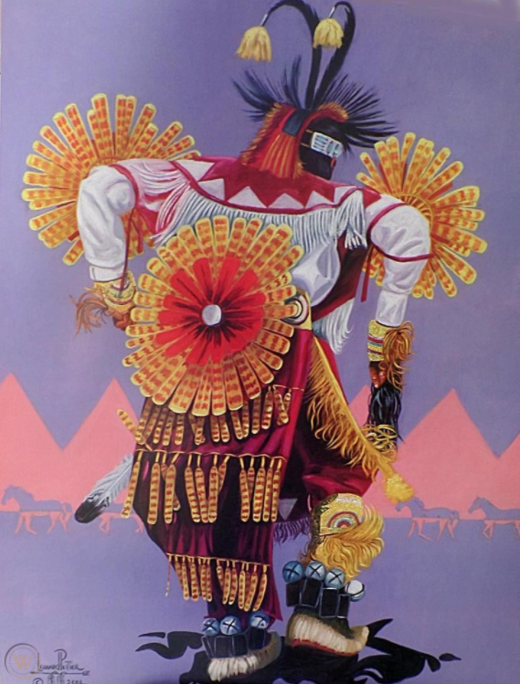

2004年，帕尔蒂埃参与竞选美国总统，他赢得了和平与自由党的提名，尽管美国许多州都有法律禁止给被判犯有重罪的囚犯投票（缅因州和佛蒙特州例外），但宪法没有禁止重罪犯当选联邦公职，包括总统。和平与自由党只在加利福尼亚州为帕尔蒂埃赢得了选票。他的总统候选人资格获得了27607张选票，占该州选票的0.2%。2020年帕尔蒂埃他作为格洛丽亚·拉里瓦（Gloria La Riva）的副总统竞选搭档，在总统竞选中获得了社会主义和解放党的提名。他在2020年8月初因健康原因被迫辞职。

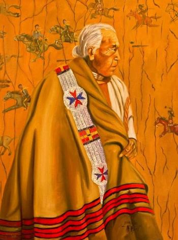

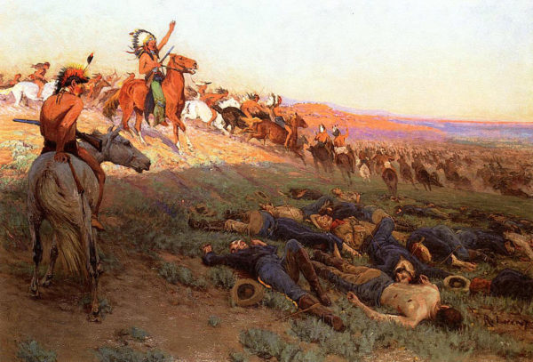

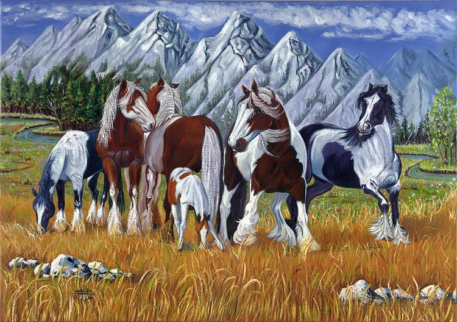

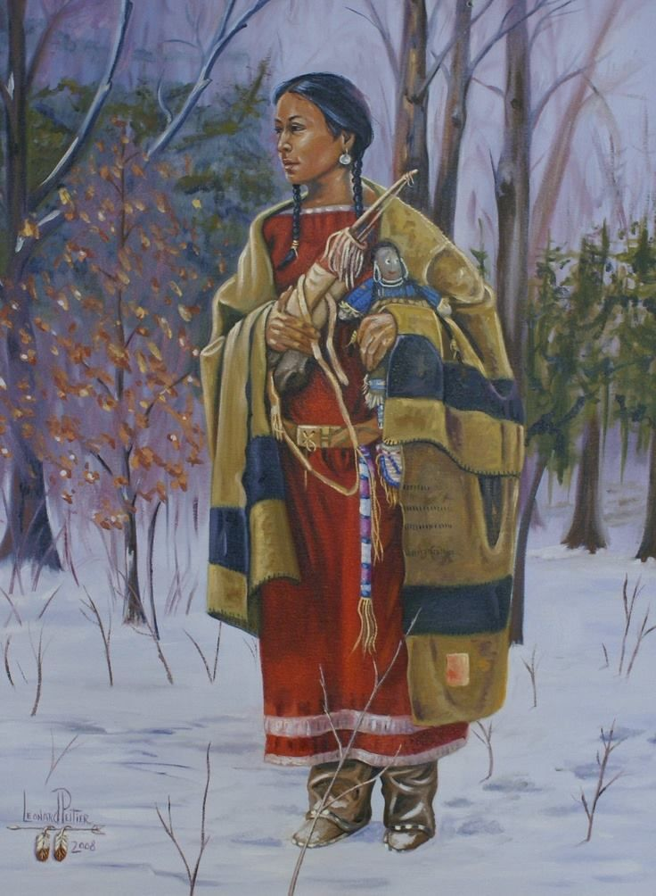

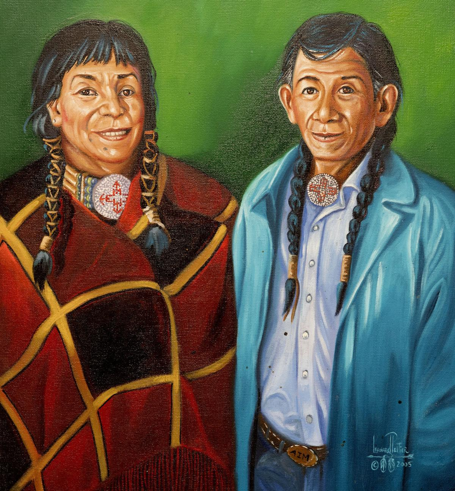

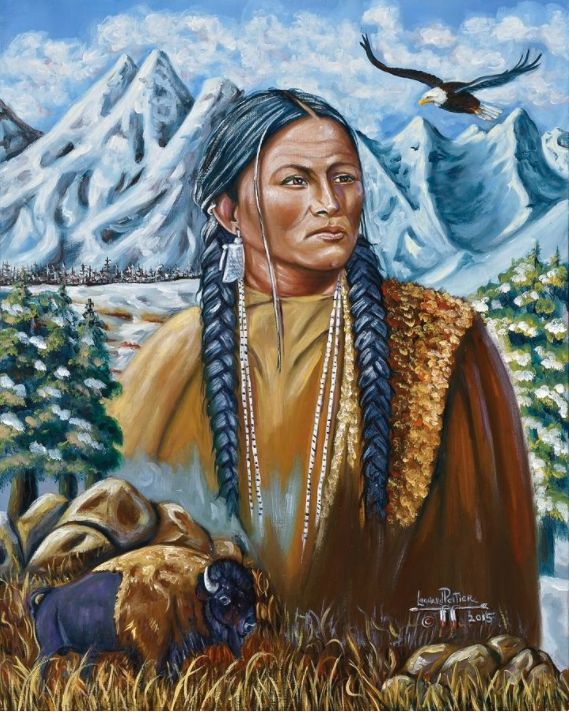

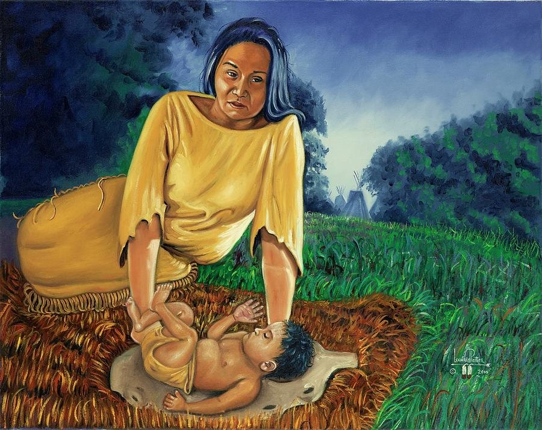

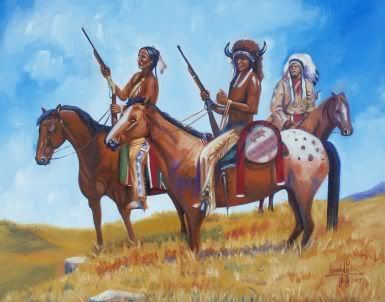

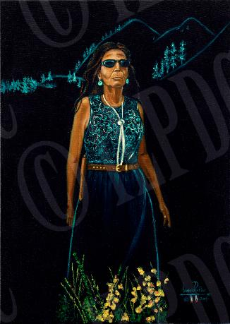

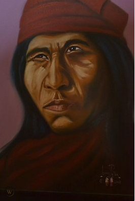

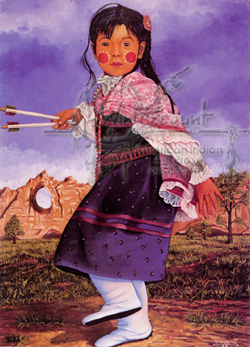

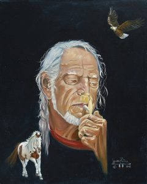

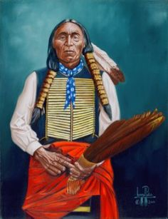

帕尔蒂埃的案件一直存在争议。近几十年来，联合国人权事务高级专员办事处、联合国土著居民问题工作组、欧洲议会、比利时议会、和意大利议会等国际政府、多家国际组及纳曼德拉、特蕾莎修女和图图大主教等都在为帕尔蒂埃争取宽大处理。在美国，肯尼迪人权纪念中心、关注科学家委员会、国家律师协会和美国法学家协会都积极支持对帕尔蒂埃的宽大处理。印第安民众也经常组织活动释放帕尔蒂埃。多只乐队为他写歌，比如U2为他写了《Native Son》，2012年，纽约比肯剧院举办了一场名为《让莱昂纳多·珀尔蒂埃回家》的音乐会，皮特·西格等多名音乐人呼吁释放帕尔蒂埃。电影人也根据他的事迹拍摄了多部电影，如纪录片《印第安谋杀事件》及故事片《雷霆之心》等。

2016年，美籍葡萄牙艺术家里戈创作了的12英尺高的大型帕尔蒂埃木雕，这尊像最初放在旧金山海湾面向阿尔卡特兹岛的地方，后来在多地巡回展示。

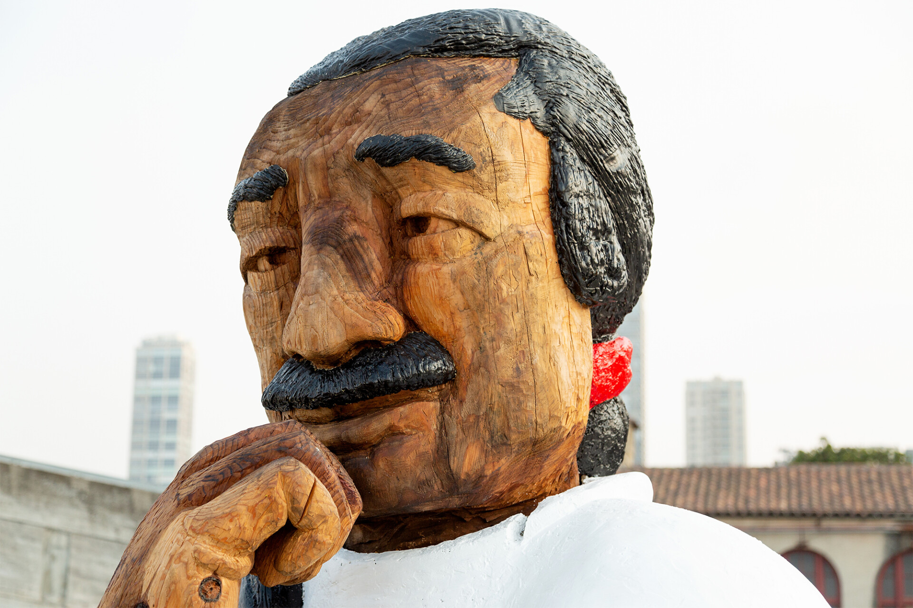
