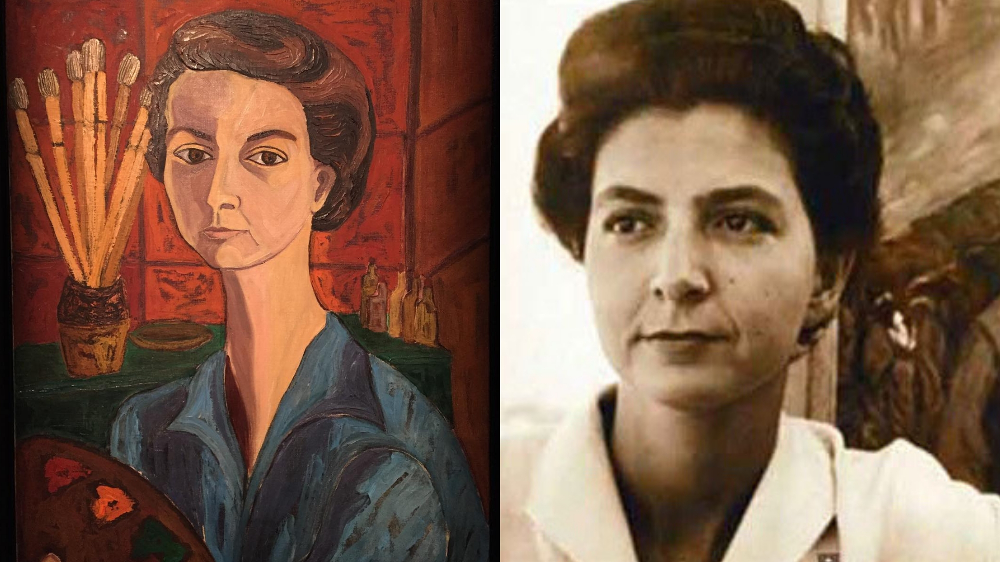
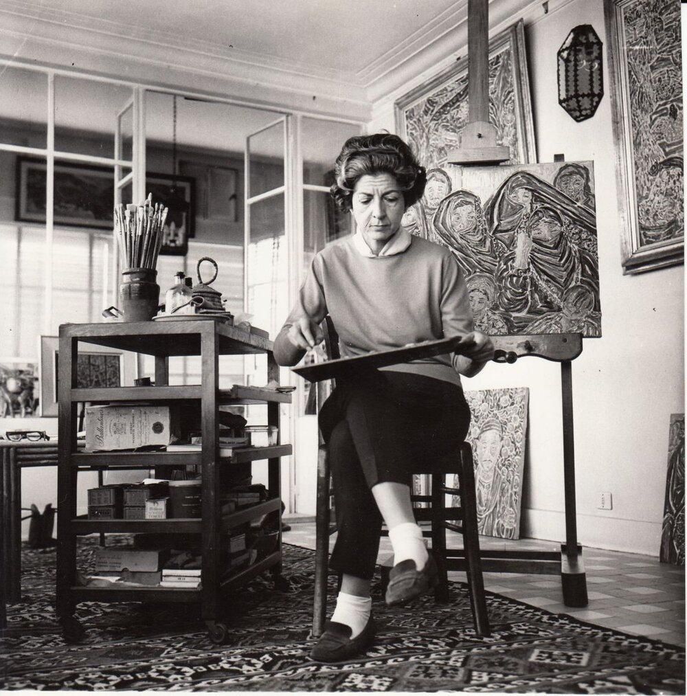
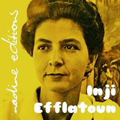
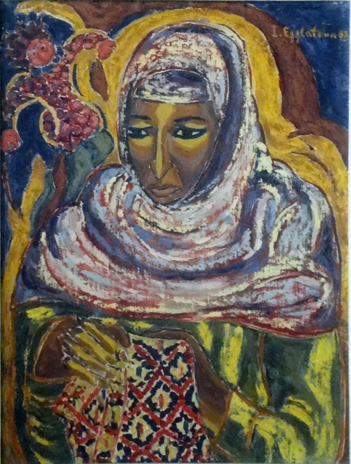
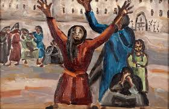
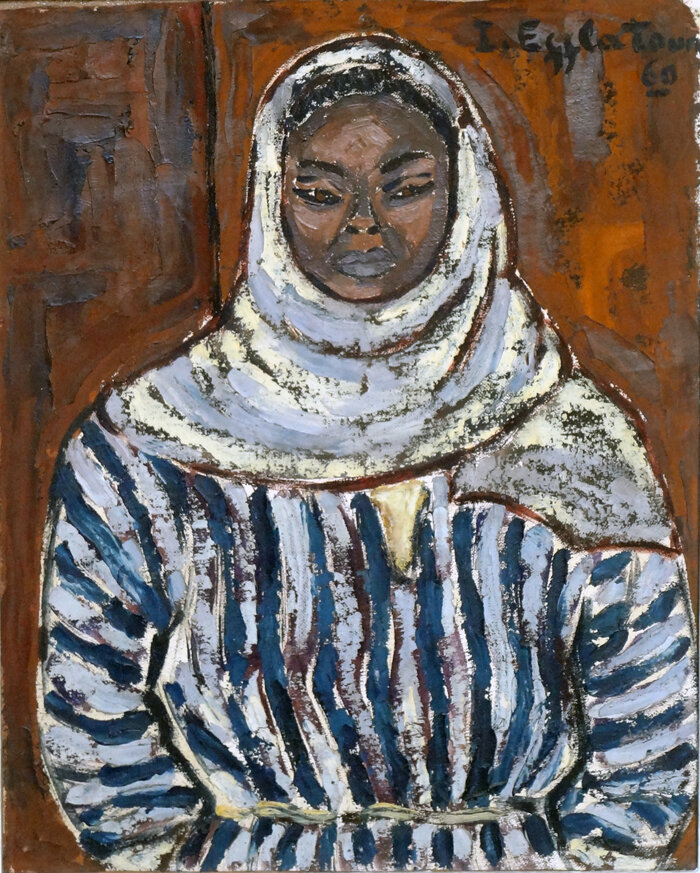
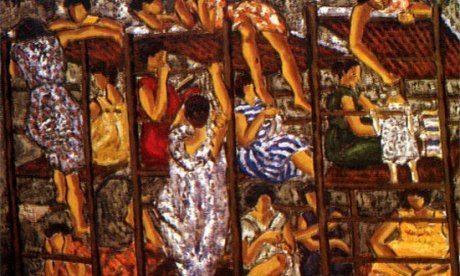
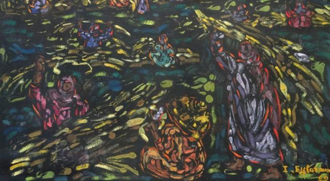

# 埃及艺术家英吉·伊芙拉通

​

英吉·伊芙拉通（Inji Efflatoun 1924 - 1989），埃及艺术家和社会活动家。出身上流社会，父亲是一位昆虫学家，母亲是在法国接受教育的服装设计师，并曾在埃及红新月会妇女委员会任职。

伊芙拉通上学期间就喜欢画画，她的父母支持她这一爱好。为她请了私人艺术导师卡梅尔·特尔米桑妮（Kamel el-Telmissany），卡梅尔·特尔米桑妮是埃及超现实主义团体“艺术与自由”的创始人之一，引导她认识了超现实主义和立体主义美学，并向她介绍了埃及农民的生活和斗争。

大学期间，伊芙拉通就积极投身社会运动，对抗社会不公，以及争取埃及妇女平权。如1945年作为大学和研究所年轻女性联盟的法塔亚特（Rabitat Fatayat）创始成员。同年，代表联盟参加了在巴黎举行的妇女国际民主联合会第一次会议。1948年撰写《与我们同行的八千万妇女》，1949年撰写《我们埃及妇女》，均颇受欢迎。1949年，她成为埃及第一和平委员会第一次代表大会的创始成员。1950年加入了和平之友运动。

1952年伊芙拉通的画作在威尼斯双年展展出，1956年在圣保罗艺术双年展展出，同年，她与“墨西哥三杰”之一的西凯罗斯（David Alfaro Siqueiros）成为朋友，并受到其影响。

1959年伊芙拉通在纳赛尔对共产党的围捕中被捕并被秘密关押，1963年获释。其后埃共解散，她将大部分时间用于绘画。

监禁期间，伊芙拉通被允许绘画。她创作了一系列肖像画以及后来的风景画。

