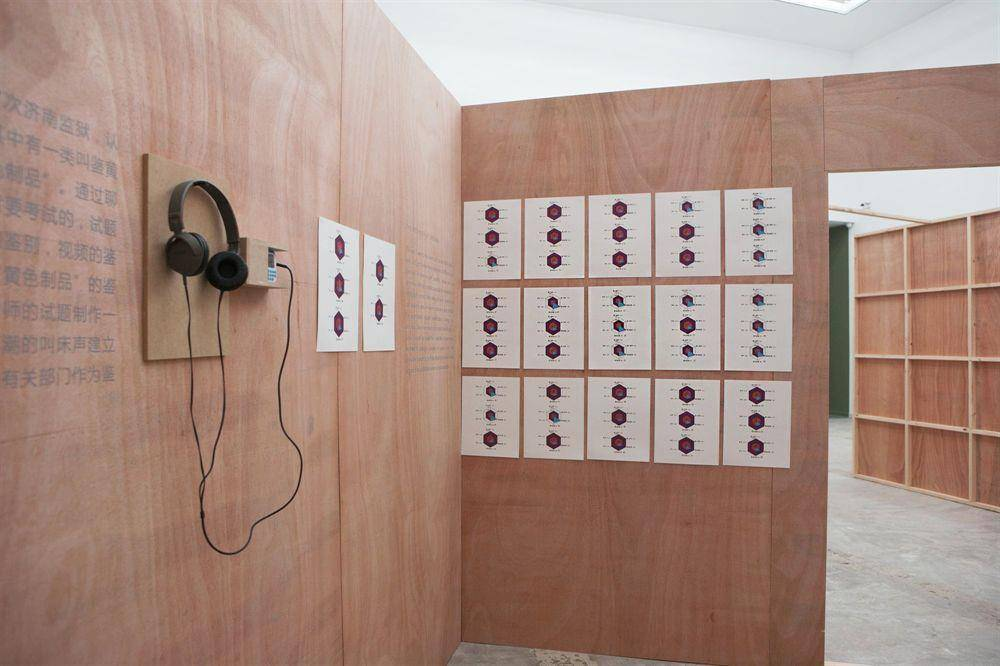

# 《不明真相》的张玥

​张玥，1985年出生于山东济南。2003年5月，因一件小意外,张玥被判处有期徒刑7年，在济南监狱服刑。由于服刑期间改造表现良好，于2007年4月释放。2015 年获得“墙报艺术家”一等奖。

“我不打牌，不和其他囚犯聊天，不收集女明星图片，只是一个人静静的用画笔和纸记录着自己的所见所感。”

2014.10.18 - 2014.11.23，张玥在北京798杨画廊做了名为《不明真相》的个展。

下为本次展览与监狱相关的展品以及艺术家自己的说明：

监狱服刑人员行为规范 | 绘画 | 纸本 | 32x24cm (作品含57幅) | 2006

监狱服刑人员行为规范，俗称监规三十八条，是由司法部2004年5 月1日第八十八号令发布实施的，山东省济南监狱2005年7月1号印制。2005年我20岁，在监狱服刑时接到一个任务，让我把狱内服刑 人员行为规范的内容配上图片，要求是“生动”、“严肃”、“结 合狱内实际情况”，我用了一个多月画完了55张画。奖励了20分。 折合假释刑期6个月。

| 狱内违禁品 | 装置 | 综合材料 | 多种尺寸 | 2011

这件作品中展出的所有物品都是每个时期监狱犯人被搜出来的狱内违禁品， 和违规违纪行为的检查，有自制的切水果的刀片，有人收集藿香正气水当酒喝，有人因为传抄村上春树受到处罚，有人因为在监规上乱写乱画受到处罚，诸如此类，不一而足。

| 高潮档案 | 声音 , 其他 | 音频，图片 | 50段，每段几秒，50个手绘图表 | 2014

今年由于创作的关系我去了7次济南监狱，认识了很多不同系统的警察， 其中有一类叫鉴黄师，专门鉴别哪一些是“黄色制品”。通过聊天我知道成为一名鉴黄师是需要考试的，试题里面包含图像的鉴别，文字的鉴别，视频的鉴别。我发现没有关于声音的“黄色制品”的鉴别，我就一厢情愿地想为鉴黄师的试题制作一个声音的部分，也就是说为高潮的叫床声建立 一个系统。之后会申报公安局有关部门作为鉴黄师的考试试题来使用。

资料来源：杨画廊官网
