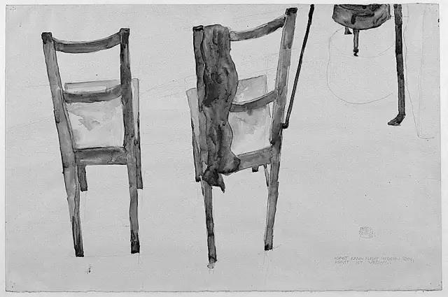
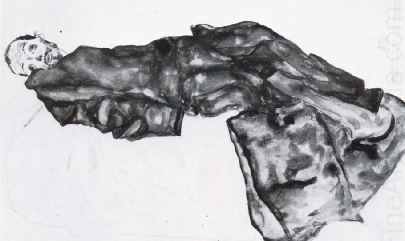
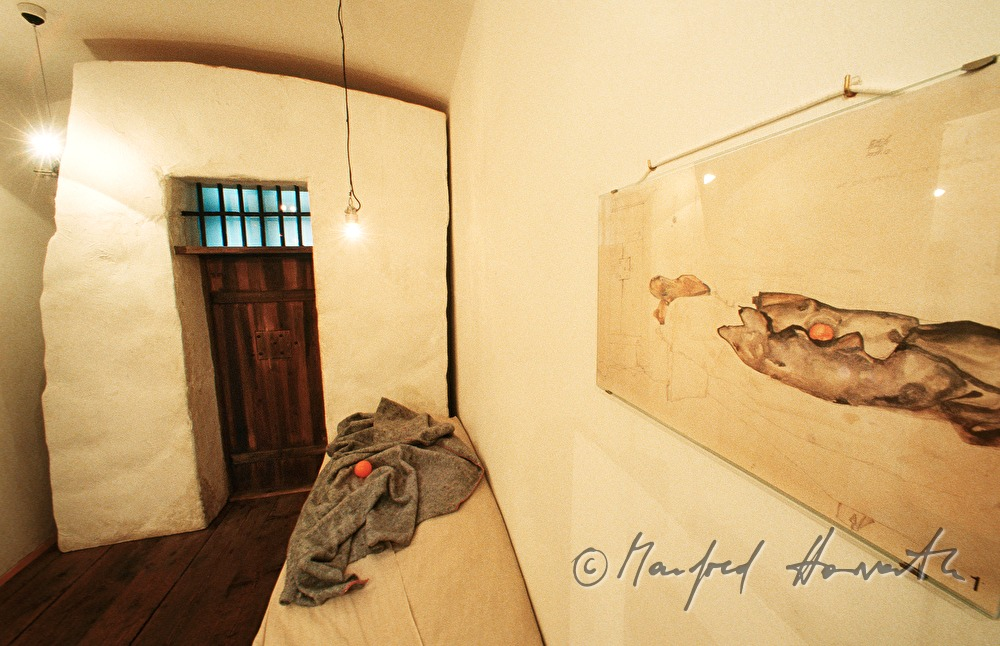
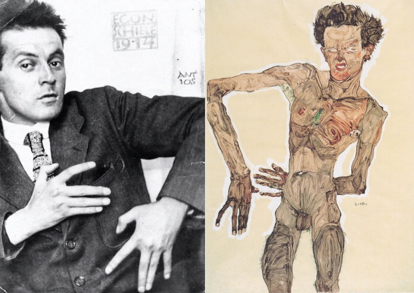

# 埃贡·席勒的画与日记

  
​作为囚徒的自画像

1912年春天，席勒（Egon Schiele），因勾引未成年少女而被逮捕。警方前往工作坊逮捕席勒的同时，也扣押了一百多张被认为是色情物品的画作。席勒在开审之前被收押。开庭审理时，席勒诱拐的罪名被判不成立，但由于在幼童可接触的公共场合展示色情图象，席勒被判有罪。在被收押21了天后，席勒被判入狱3天。在狱中席勒绘制了12幅画，还写了一些日记，描述被关在监狱牢房中的不适与不快。

1912年4月16日

终于！终于！终于！终于有了缓解痛苦的东西！纸、铅笔、画笔、绘画和写作用的颜料。在这里最大的折磨就是我不得不像畜生一样度过的那些折磨人的、野蛮的、令人困惑的、粗鲁的、穿着制服的、一成不变的、单调的灰色时间。

这种监禁的时光会很快地把那些精神上软弱的人逼疯；很快地我也终将走向疯狂，变得麻木，日复一日地这样持续下去。因此，为了不真地走向疯狂——我感到被从我的土壤中连根拔起了——我用我颤抖的手指蘸着苦涩的唾液去绘画，用石膏灰泥中的污渍在牢房中的墙上绘制风景和人头像。然后我看着它们一点一点地风干，消退并最终消失在砖墙的深处，就像是被一双隐形的有强大魔力的手擦掉了。

现在，幸运的是，我再一次有了绘画和写作用的材料；就连“危险的”削铅笔用的折叠小刀都还给了我。我可以忙碌起来了，因此我将会忍受住那些本是不可忍受的。我曾经低声下气，低三下四地请求、恳求这个机会，如果没有别的办法的话，我可能还会抽泣哭闹。啊，艺术！还有什么是为了你我不敢去做的！

  
1912年4月17日

十三，十三，十三——十三次4月13日！我从来没有迷信地并且恐惧地去想过十三这个数字，结果现在这个月的十三号变成了我的灾难。1912年4月13日，我被逮捕，并且在新伦巴赫区的法庭上被戴上了镣铐。

为什么？为什么？为什么？

我不知道。没人为我的问题给出回应。

还没有有关我被捕的声音传到维也纳。还没有人知道我已经被拘捕并且仿佛消失在了一扇活板门之中。即便这个消息被他们知道了，会有人为我强烈抗议吗？会有人想要帮我吗？G.K.和A.R.。也许吧。其他人也许会悄悄地滑向怯懦，还有T.F.，会显露出他那张虚伪狡诈的冷漠的脸和一眨不眨的双眼[1]。他会耸一耸肩然后想要从挡住他去路的人面前溜走。

地狱！这里简直就是地狱，一个卑鄙的、粗俗的、肮脏的、悲惨的、可耻的地狱，我突然被意想不到地扔了进来。

尘土、蜘蛛网、咳嗽出的唾沫、汗渍，还有我的泪水洒在了从墙上剥落的灰泥碎屑上。床铺贴墙位置的污渍是最厚的，粉刷的石灰都已经被蹭掉了。砖墙好像被抛过光一样，似乎占了血迹一样，光滑的表面散发出黯淡油腻的光亮。

我现在知道地牢是什么样子了——这儿看起来就跟地牢一样。如果仔细观察那些厚重粗糙的沉重牢门，上面那些巨大牢固的门锁绝不会被肩撞或者脚踢损坏——锁眼带有遮挡；粗制滥造的床铺或者长凳被笨拙简陋地堆放在一起，那些粗糙、凹凸不平的毯子（大概马背盖上这种东西都会被硌得难以忍受）散发出奇怪的碳酸的或者来苏尔消毒剂的臭味儿，还有人的汗臭味儿、发霉的潮湿味道、畜生皮毛的味道，当你仔细观察了所有这些，你就体验到了旧时代的那种地牢、古老堡垒或者市政大厅的恐怖墓穴——囚徒们被扔进去并在那里慢慢腐烂。

只有在床头上方的那个电铃按钮不属于地牢，它是今天的，是现代的。它提醒我，这一切不是在做梦，也不是一些幻觉。不，我不是在做梦，我醒着，体验着这一切——除非活着就只是一场梦，在这梦中有着其他的噩梦。

1912年4月18日

我现在只能生活在自己的排泄物中，呼吸我自己散发出的有毒的粘稠烟雾，不能刮脸，甚至不能好好地洗洗我的脸。就算是在蹲监狱，但我也还是个人啊！就没人想到这一点吗？

挂着狱门钥匙的看守叮当作响的走过来了，在牢房里放了水桶、扫帚和墩布，命令我擦洗地板。这合法吗？卑鄙的要求！然而我对此还是感到高兴；能够有点儿事可忙已经是上帝保佑了。我用尽我全部的力气去擦洗地板，冲刷，再擦拭干净。之后很久的时间里我的膝盖、脊椎和胳膊都在疼，我的手指红肿，指甲也磨破了。我几乎对我的劳动成果感到骄傲了，我等到看守回来，觉得他为此会表扬我。他回来了，看了看地板，往地上吐了口水，然后冲我咆哮到：“你管这个叫擦地板吗？猪跟这儿打了几个滚儿吗？马上再擦一遍，我警告你，这次好好干！”我把水桶拖过来，又跪下去，反复地擦洗。

人们怎么能以侮辱别人取乐呢（寻欢作乐！不道德的灰光之源！）这种邪恶的欲望从何而来？

这种卑劣真让人不敢相信！毕竟，我还没有被最终宣判呢！他们为什么想要这样惩罚我？

这儿还没有人知道我是清白的还是有罪——如果我真是清白的，他们凭什么这么恶劣地对待我？他们对看守所的所有犯人都是这样的吗？要是有一天能够没理由地把这些法律代表都关起来就好了，就跟我关在一起，这样这些自私轻率的法律制订者就可以亲身（显然他们根本就没有灵魂，有也是发育不良的）感受一下儿并且理解被囚禁起来意味着什么了。

  
1912年4月19日

今天我画了我牢房里的小床，在那些毯子组成的脏灰色当中有一个鲜艳的桔子，那是V带给我的[2]，这个房间里唯一的光亮。这个鲜艳的小东西带给我一种无法形容的好感觉。

  
热衷于画自画像的席勒  
1912年4月20日

给牢房前面的走廊画了素描。画上了过道角落里的垃圾还有犯人用来清洁他们牢房的用具。这让我平静下来了，我感觉自己得到了净化，而不是在受惩罚。

  
1912年4月21日

自从我可以开始工作之后，监禁的日子慢慢变得可以忍受了。我给那把简陋的椅子和水壶画了些素描，简单地上了些颜色。我还画了我的两块彩色手帕与椅子的组合。

  
1912年4月22日

原初的永恒便是上帝。人们叫他佛祖、琐罗亚斯德、欧西里斯、宙斯，或者基督，在上帝之后最似神的便是艺术——它像上帝一般不受时间的影响。艺术不可能是现代的，艺术是原初的永恒。

1912年4月23日

请俯望这里，无处不在的万能的圣父，以太阳为眼的伟大创世者，请考虑一下您是否真的容忍这些——这些可耻的令人蒙羞的折磨竟然是为我而准备的。您洞察一切的目光显露了我最隐秘的心思，您了解我，我在您面前是赤裸的、毫无保留地为您所审视的您的造物。因此当我步履踉跄，必是您的意志令我蹒跚在通向您的小径上。但为了您的意愿真要我痛苦如斯吗？为了您的意愿真的要我监禁于此？也许，只是一瞬，在您繁星环绕的大地闪耀出的银色光芒前，在您被金色融化的太阳那火光四射的巨轮前，您闭上了您仁慈的、如大海天空一般碧蓝的眼睛，因而忘却了我？可能吧。正因如此我呼唤您，借与我您的耳吧，请倾听我的声音。

  
1912年4月24日

离我不是很远的地方，一位法官——或者别的什么人——就坐在治安法官办公室里，如果我喊叫起来的话他就会听到我的声音。那个人，一定相信他自己是个特别的人物，受过教育，住在城市里，参观过教堂、博物馆、剧院、音乐会，甚至很可能还去过艺术展览；就是这么一个可以算是有教养的阶层的人，肯定读过或者至少是听说过这位不幸艺术家的生活；这个人竟然可以容许我被关在这间牢笼里！一个又一个小时，一天又一天，他竟然就任由我被关在这儿，毫不关心。这就不困扰他吗？他在想什么？这个男人到底还有没有道德良心？

也许他却有担忧，也许他漠不关心，也许他根本就把我给忘了！也许我必须在这儿待上好几个月；是的，也许我会染上什么病然后在我的清白得以沉冤昭雪之前死在这儿。

看不到任何得到帮助的可能，联系不上任何的朋友，我不能通知任何人。Ｋ正在在阿特湖，Ｒ正在加尔达湖——谁知道其他的人在哪儿？但就算他们都在维也纳，也没人能立刻的帮我从这里出去，因为我被禁止给任何人写信。

昨天：哭泣——软弱的、怯懦的痛哭；叫喊——激烈的、急促的、哀求的；呻吟着啜泣——绝望的、可怕的绝望。终于开始麻木不仁地伸展我冰凉的四肢，令人联想到死亡的那种恐惧，浑身被颤抖的汗水浸湿。可是，为了我的艺术和我爱的人们，我愿意忍受到最后。

  
奥地利席勒博物馆复原的囚室

[1]G.K.指古斯塔夫.克林姆特，A.R.指阿图尔.罗斯勒尔，T.F.指安通.“托尼”法伊斯陶尔。
[2]V指席勒的模特情人威利.诺依齐。

  
照片与自画像

埃贡·席勒（1890年—1918年）奥地利绘画巨子，维也纳分离派重要代表，是20世纪初期一位重要的表现主义画家。

1890年，席勒生于奥地利图伦。他的父亲，阿道夫·席勒是任职于奥地利国家铁路局的火车站站长。

1905年，席勒15岁时，父亲死于梅毒。

1906年，16岁的席勒在维也纳分离派领导人、装饰画家古斯塔夫·克里姆特指导下学习，在线条和构图上得益于他的优雅的装饰手法。后来他结识了科柯施卡。他的画最初受学院派和印象派影响，打下了造型基础。受克里姆特和科柯施卡之后，他的作品具有明显的装饰风格。

1908年，18岁的席勒在克洛斯特新堡举办了第一场展览。

1911年，席勒与17岁的维拉妮·维拉尼·诺依齐相识并同居，维拉妮也是席勒不少知名画作的模特。

1915年，席勒与爱迪丝订婚。

1915年，因为第一次世界大战，席勒被陆军征召。他起先于布拉格服役。在军中，席勒的长官很尊敬他的艺术才能，因此他从未被派到前线战斗，在监狱担任守卫，看管俄国的战犯。1917年，席勒回到维也纳，得以专心从事绘画工作。在此期间他产出大量且成熟的作品，并在1918年，受邀参加维也纳分离派在维也纳的第49届展览。席勒共有50件作品在主厅展出，他还以《最后的晚餐》为灵感，设计了展览的海报，并把自己的肖像放在中央，取代耶稣的位置。

1918年10月31日，天妒英才，席勒因流感病逝，年仅28岁。留下三百多幅油画，几百张素描。

  
自画像
