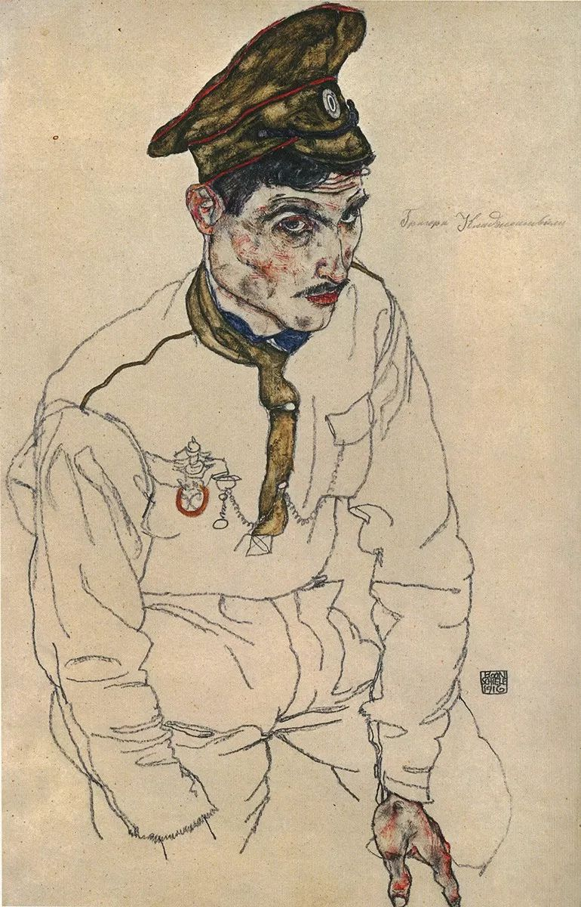
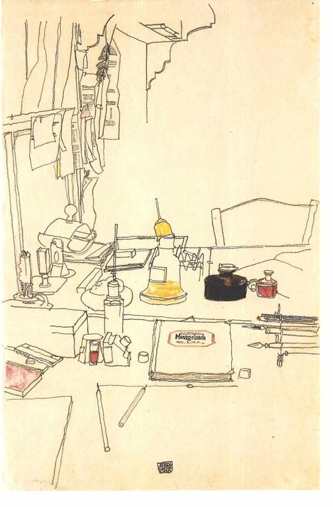
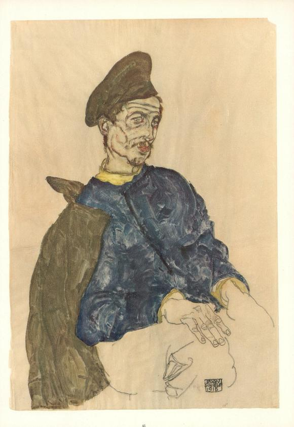
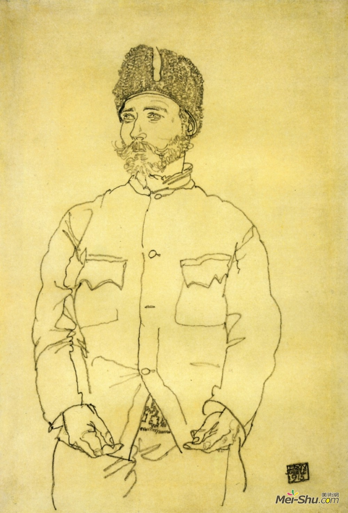
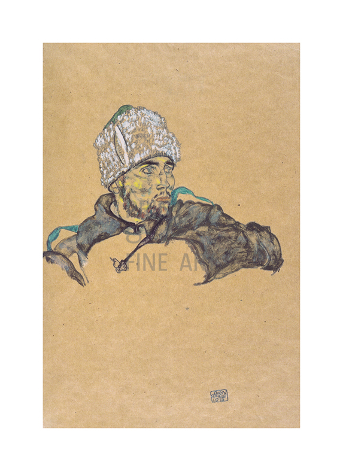

# 席勒笔下的战俘

  
​俄国战俘Grigori Kladjishuli

1914年7月第一次世界大战爆发，1915年，新婚不久的埃贡·席勒被征召入伍。起先他于布拉格服役。长官卡尔·莫瑟尊敬他的艺术才能，从未派他到前线战斗。给他安排的工作是看守和护送俄国囚犯。

  
失去右手的俄国战俘

1916年5月1日，席勒接到通知，他被派往位于穆林镇的俄国军官战俘营。他于5月3日前往那里，他的妻子爱迪丝随后于5月5日前往。第二天，她给玛丽和梅兰妮·席勒写了这样一封信：“……终于把埃贡喜欢的地方送到了...他的职责很轻，军官们很友好，彬彬有礼...从我们房间看到的乡村景色是令人愉快的....从这里可以看到厄齐尔山白雪皑皑的山峰。厄洛夫河从我们家流过……”

  
席勒笔下的穆林镇一角

席勒的工作是负责战俘营的食品储备，职务之便，他和伊迪丝可以享受到口粮以外的食物。还有一间废弃的储藏室作为他的工作室，工作之余他便挤出时间画画。

  
席勒在战俘营的工作室

  
俄国战俘

1917年1月，席勒获准返回维也纳，随后受雇于汉德·罗塞中尉经营的皇家野战军职业受薪士兵合作商店。

