# 诗歌与摄影集《大写的我》

1998年美国摄影师黛博拉·拉斯特（Deborah Luster）和朋友诗人赖特（C.D.Wright）合作了一个关于路易斯安那州囚犯的项目，黛博拉为犯人拍照，赖特写诗。《大写的我》就是这个长达五年的项目的结晶。

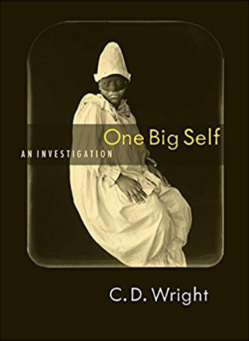

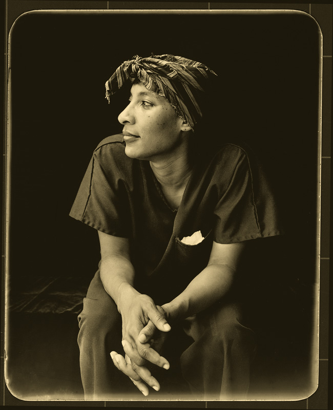

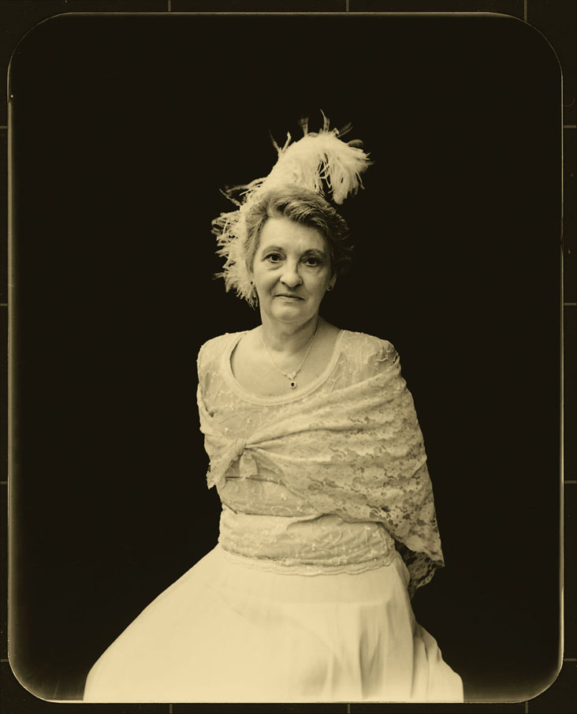

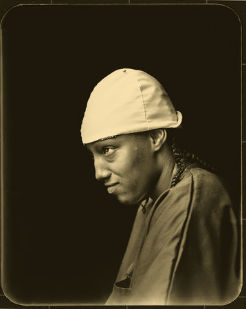

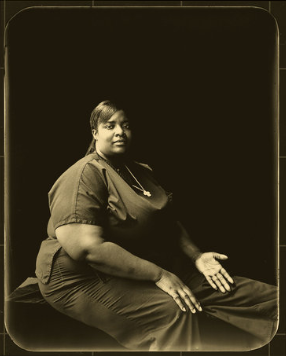

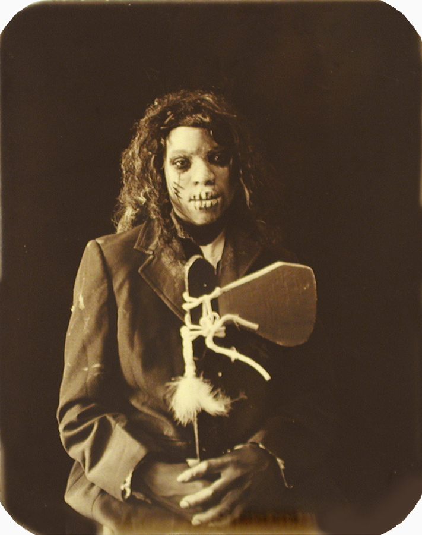

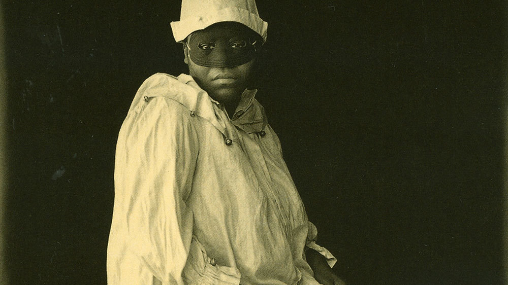

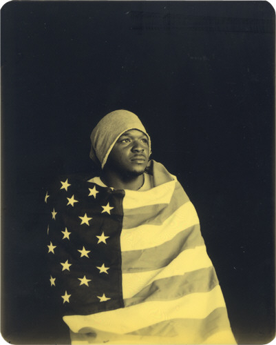

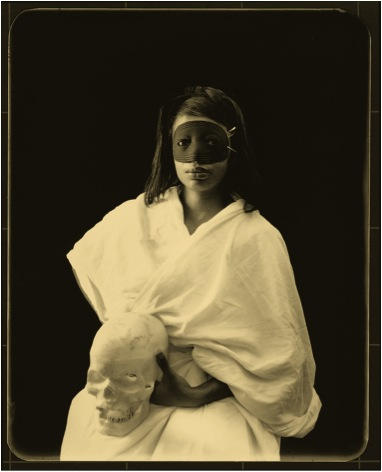

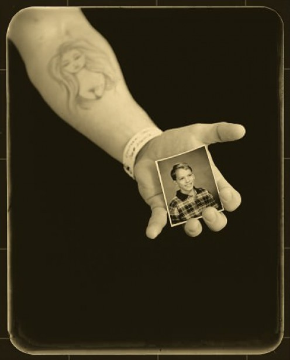

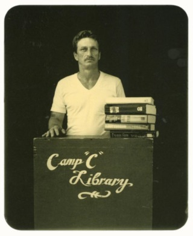

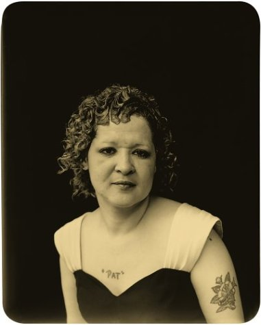

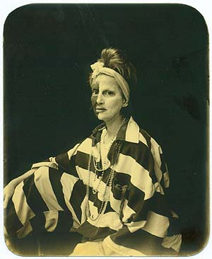

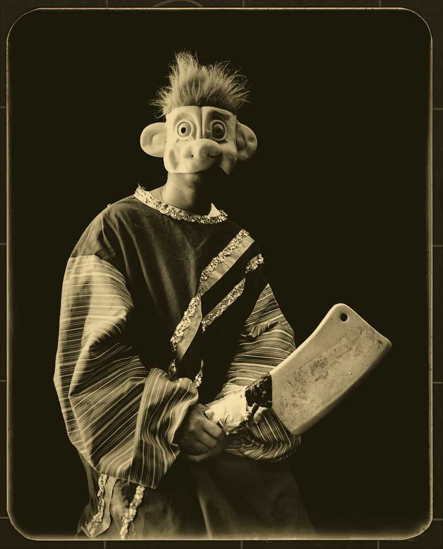

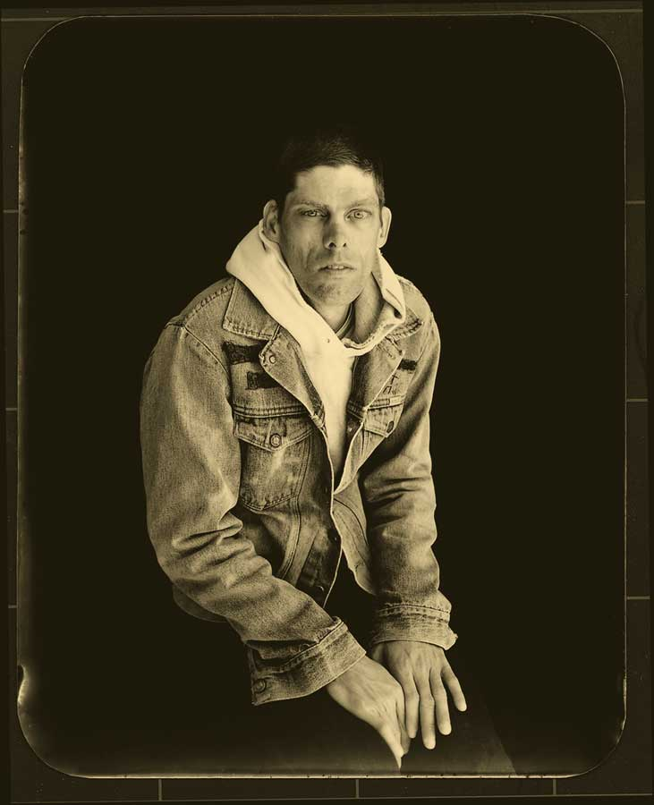

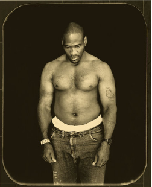

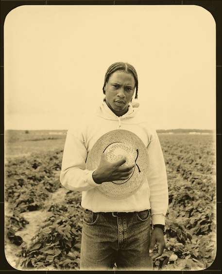

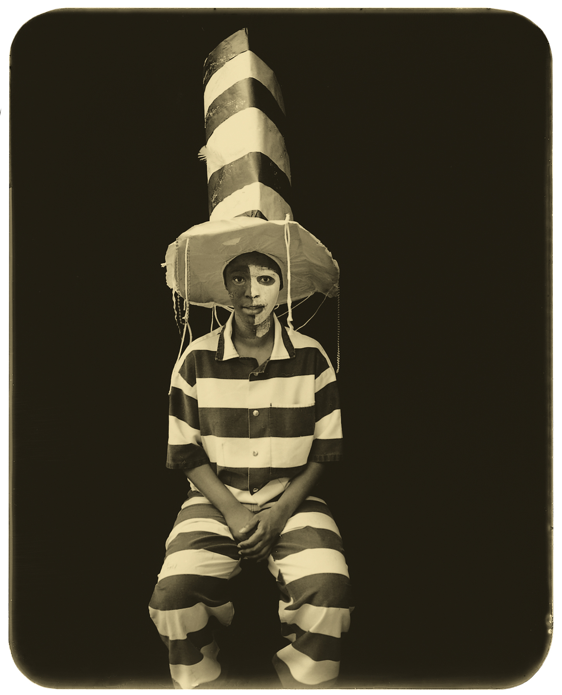

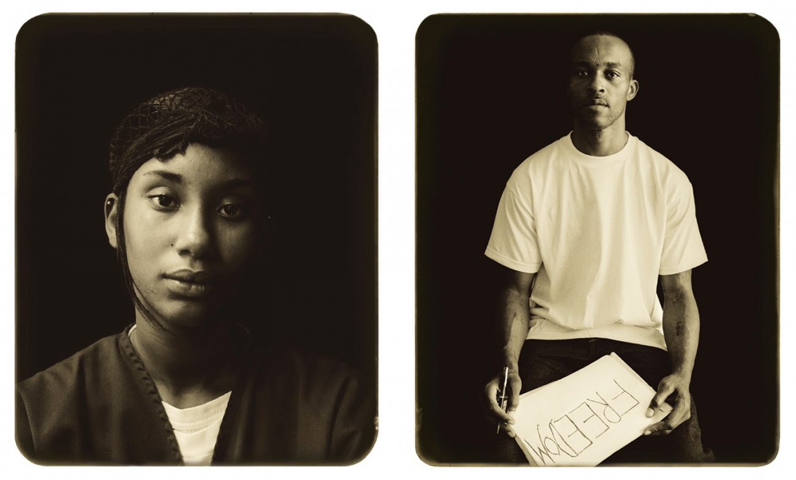

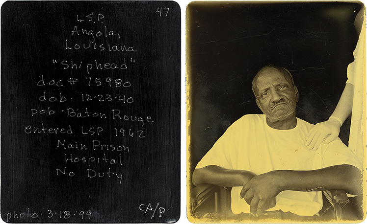

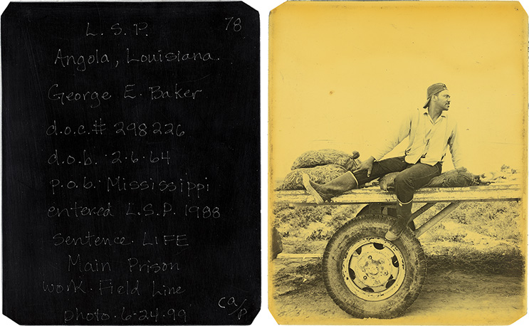

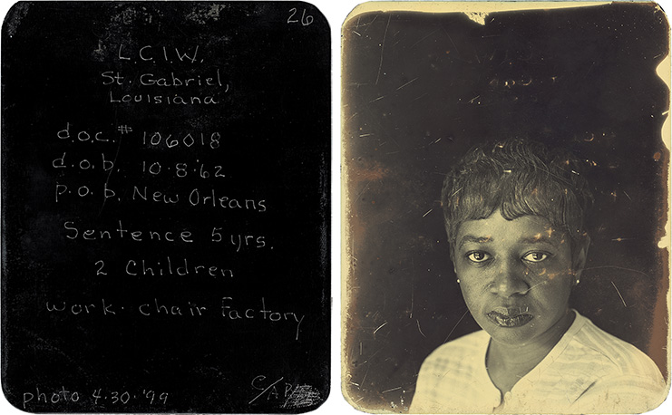

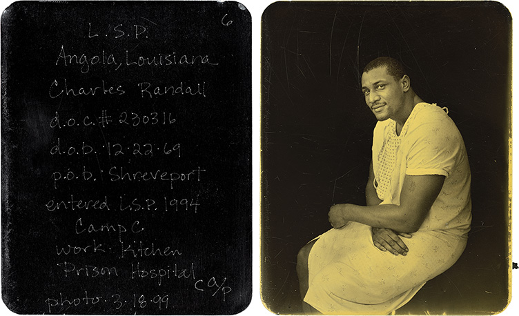

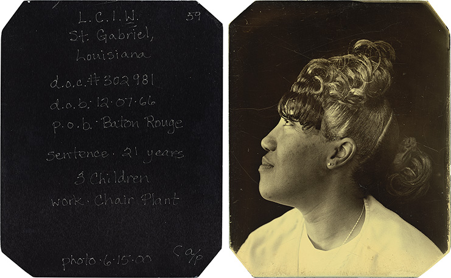

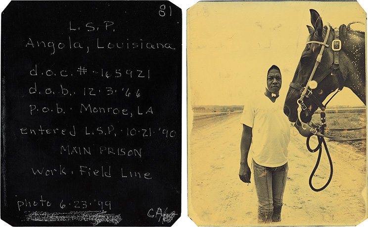

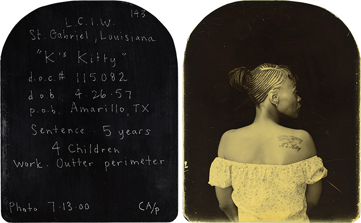

（字幕就不加了，这是其中一部分。本来还有个挺好的视频，腾讯没通过。）“我对犯人说，你处在大众视线之外，现在是向世界展示你是谁的机会，你想展示怎样的自己？一个人转身进屋，拿了个本子，在上写了：“自由”。”
“有一位女士要我替她拍照“，她说“我来这里15年了，我的刑期是99年。我有19个孩子，自打我入狱以来，他们没和我说过一句话。如果我把照片寄给他们，兴许他们会心软一点。“几个月以后，她说，'我有四个孩子来看我了，有一个宝贝儿子已经十九岁了，我进监狱的时候他只有五岁了。”

下面是一篇关于这个摄影项目的文章：

## “在我们家，相机是由女性操纵的”

黛博拉·拉斯特（Deborah Luster）生于1951年，她的父母在她小时候就离婚了，她和爷爷奶奶生活在阿肯色州。妈妈和她通过互寄照片来交流。 “比如我买一件新外套，就得拍照给她。其他的诸如我和我的猫、我和爷爷奶奶的合影等等。”

黛博拉会收到母亲各种pose的照片。“她做饭的时候都很张致，一身名牌、还要蹬着高跟鞋。她是那种在拖拉机上也穿貂皮大衣的女人，一头红发，风情万种。”

1988年的愚人节，黛博拉的母亲被人雇凶谋杀，杀手几年之后才被捕，幕后主使却一直逍遥法外。母亲去世后，黛博拉开始拍照。“我妈妈经常拍照，我的祖母也一直拍照记录我们家人。摄影成了我最想做的事......在我母亲和祖母去世后的几年里，可能是我的祖先在引导着我，是她们指引我拿起了相机——在我们家，相机是由女性操纵的，现在，轮到我了。失去亲人，我无力自拔。世道险恶，我清醒、麻木、害怕。我怎么能和杀母凶手在同一片星空下睡觉呢？或许我把相机当成了“救命稻草”，它的确救了我。”。

1998年，黛博拉与另外几位摄影师受路易斯安那州人文学院赞助到该地区拍照。

一个周日的下午，黛博拉敲响了Tensas河畔一座小监狱的大门。监狱长出来了，她问是否可以拍里面的囚犯。监狱长说可以。
“我在那里拍了一次之后就意识到，这是我一直在找的项目，是对母亲被谋杀的回应。”

## 我拍的是人，不是囚犯。

黛博拉去了圣加布里埃尔（St.Gabriel）女子监狱，特兰西瓦尼亚男性监狱和路易斯安那州安全级别最高的安哥拉监狱。她与她的长期合作伙伴C.D.赖特一起操作这个项目。

黛博拉会带上一些黑色天鹅绒和一些胶带，找一个光线充足的地方，搭上背景。她不想要任何监狱生活痕迹。“我不希望这妨碍我的拍摄对象。我拍摄的是那个人，而不是囚犯。”
黛博拉拍照的时候，赖特采访以及观察。

## 他们在我面前显得很脆弱

在安哥拉监狱，90％的犯人来到这里都得在里面终老。他们没有故意装怪，都很庄重的摆出19世纪风格的造型。

有一次，黛博拉路过一个宿舍。她听到身后有人跟她说话：“你去过圣加布里埃尔的女子监狱，是吗？”“你怎么知道？”那个男人说“我送了我女朋友一张你给我拍的照片，她回给我一张一样风格的。”“这些小小的照片在监狱之间飞来飞去，我想这就是它的意义。”

“他们在我面前显得非常脆弱，完全不是平常见到的样子。我知道他们实际上面对的是他们所爱的人、他们的丈夫、他们的妻子、他们的孩子。”

黛博拉用铝板制作了这批照片，因为监狱里不允许携带金属物体，她给犯人做了装在钱包里的大小的普通拷贝。“我想让照片和人更亲密。”每人一张，一共给了25,000张之多。

 黛博拉将照片销售收入的一部分捐赠给监狱，供犯人们购买爆米花、书籍、衣服或其他个人物品。

“我妈妈应该也会喜欢这个项目。”黛博拉说“她对人有一种洞察力，知道你是一个什么样的人。她喜欢拍家人，拍你盘子里的食物、拍你刷牙、拍你的牙。她拍所有她喜欢的东西，她喜欢这样。”

---------------------------------------------------------------------

C.D.Wright  美国诗人，著有多本诗集，2016年去世。

Mack trapped a spider  
麦克抓了一只蜘蛛  
Kept in a pepper jar  
把她装在胡椒罐里  
He named her Iris  
还给她起名叫艾丽丝  
Caught roaches to feed her  
抓蟑螂给她吃  
He loved Iris  
他喜欢艾丽丝  
When Iris died  
艾丽丝死后  
He wrote her a letter.  
他给她写了一封信。  
