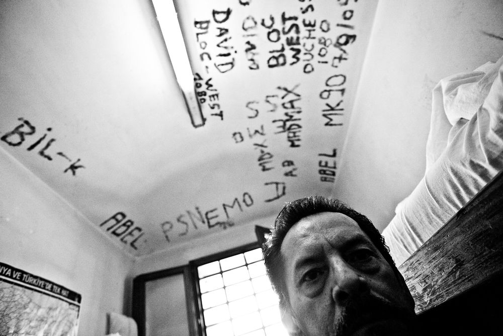
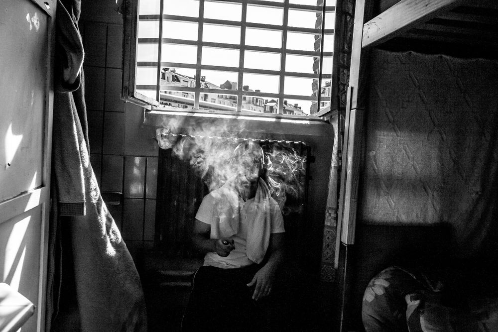
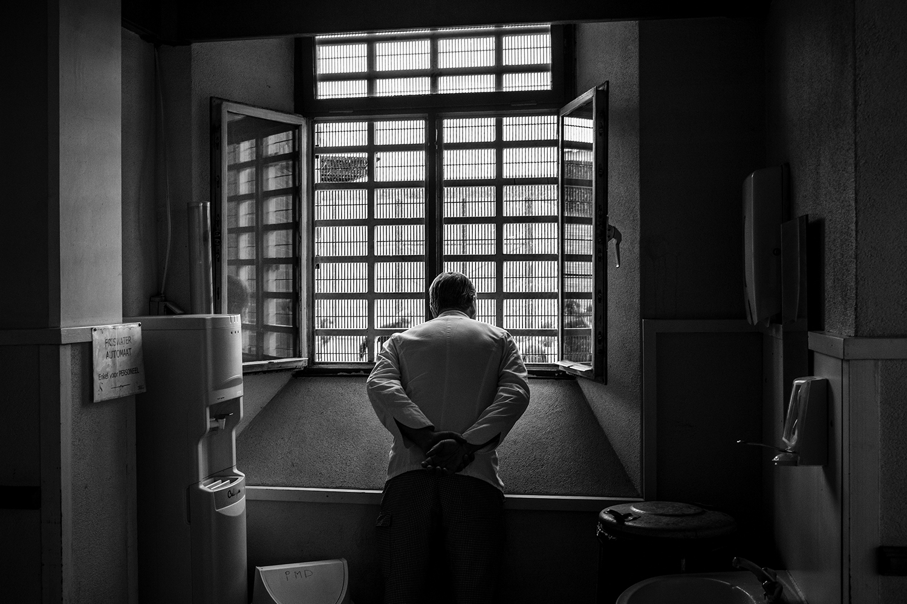
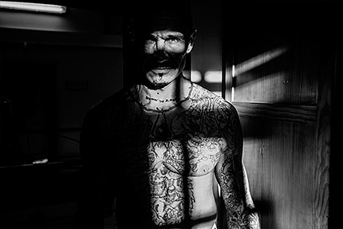
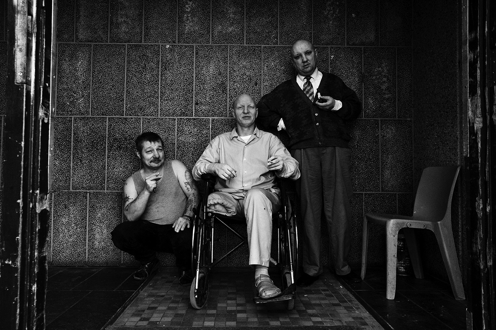
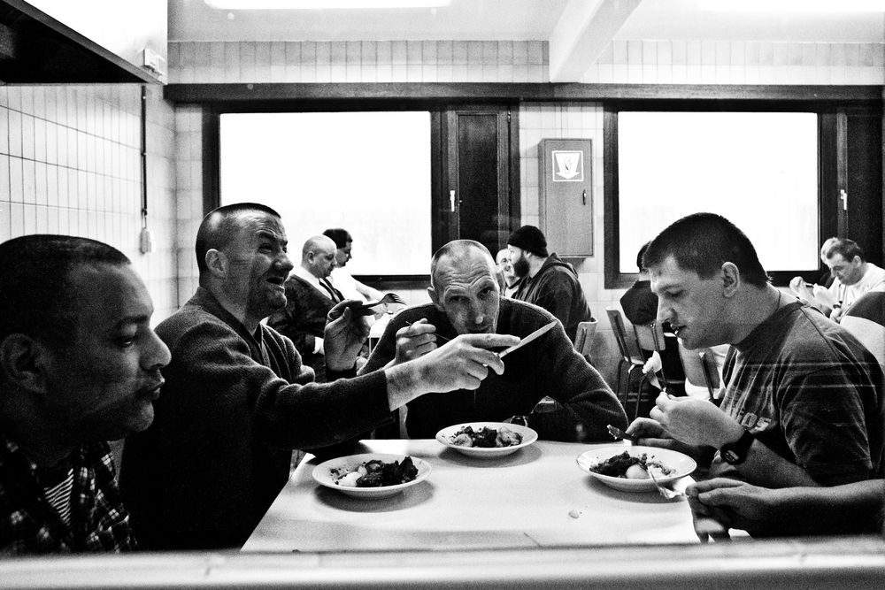
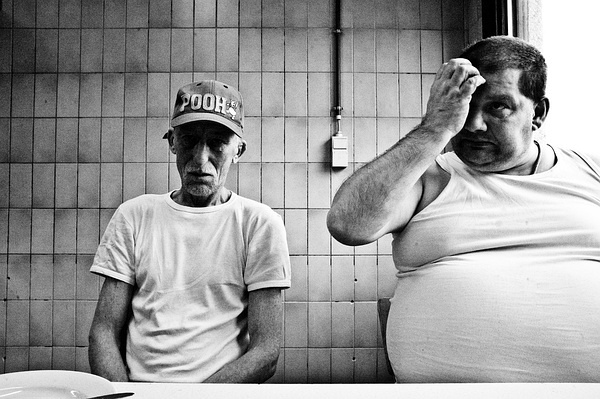
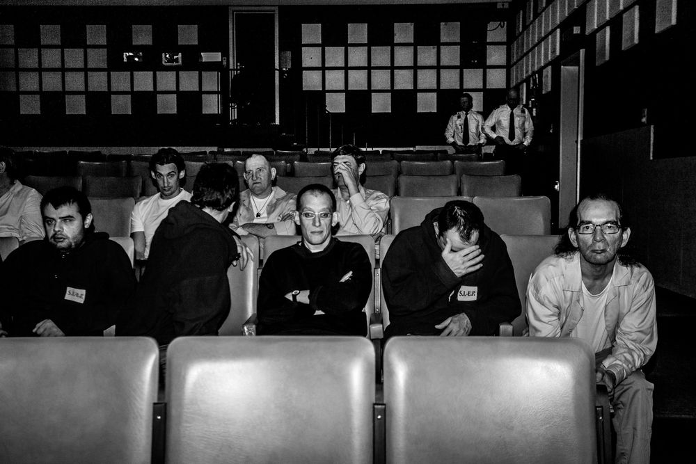
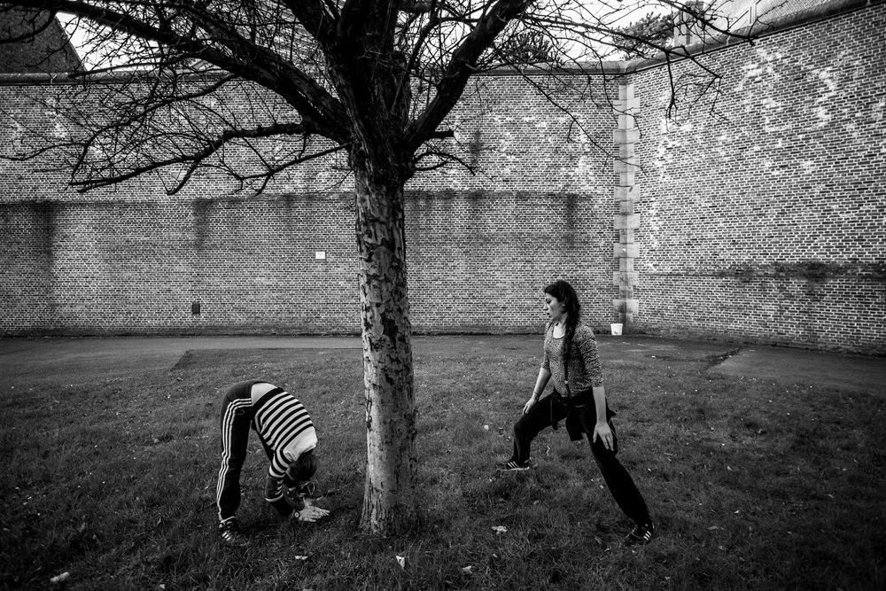

# 比利时摄影师Sébastien Van Malleghem作品

​Sébastien Van Malleghem是一位比利时自由职业摄影师，2012年开始对比利时的12所监狱进行了为期三年的拍摄。

手艺人到哪都能给自己改善生活

  
三名有精神问题的犯人

排队打饭

  
一位生病的老犯人

  
会见室

  
办公大厅

  
影院

女子监狱

锻炼是她们排解苦闷的最好办法

挂布帘是为了隔开敞开式的厕所

Sébastien Van Malleghem是一位自由职业摄影师，1986年出生在比利时。

作为纪实摄影师，Sébastien长期关注当代欧洲的公正问题。进入监狱拍摄之前，他一直跟踪拍摄比利时警察的日常工作，拍他们的工作以及他们与公民的互动。“拍那些照片的时候，我就在想那些被警察逮捕的人会发生什么事。所以我更进了一步，决定拍摄比利时的监狱。我想知道在21世纪的欧洲，监狱是如何对待人的。”

于是他用了8个月时间争取到进入监狱拍摄的机会。在接下来的三年里，他拍摄了比利时境内的十二所监狱。
