# 一个叫多内托的犯人决定当摄影师

​作为一个成长于布鲁克林区的‘人文主义者’，我对生活中的欢乐和逆境有着浓厚的兴趣。我拍摄的照片，都投射着自己的影子。”  
——Donato Di Camillo

美国人Donato Di Camillo的摄影故事

开始于他服刑的监狱。

现年50岁的多内托，成长于纽约布鲁克林区，父母是典型的初代意大利移民，以码头工人一职谋生，带着他生活在当地的“小意大利区”。在鱼龙混杂的环境中，多内托打小便混迹街头，“身经百战”。

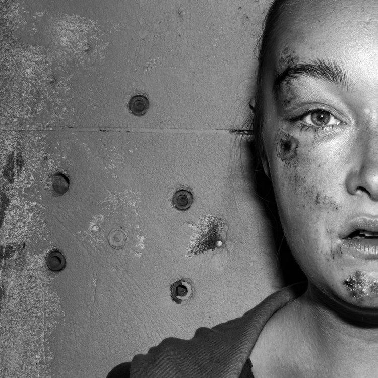

相比于现在的孩子会憧憬未来成为工程师和物理学家等所有美好的职业，小时候的他只是希望能跟社区中所谓的小混混群体打成一片，然后梦想着开自己的奔驰车出去肆意潇洒，任意妄为。对他来说，这是一门“生存学问”：
“作为一个孩子，我见证了很多痛苦的事情。九岁的时候，我曾亲眼看到我的朋友被一辆路过的汽车碾死。我生活在布鲁克林区，在1978年和1980年代，我必须快速学会如何在街道立足，你可以叫它‘街道本能’。”

虽然一直大错没有，小麻烦不断，但是长期“沉迷”于惹是生非的多内托，仍是走上了不法之路。12岁那年，当别的孩子还在玩游戏时，他却因犯偷窃罪被捕。

第一次牢狱之灾，并没有让他“长记性”。2006年，因为与Colombo犯罪家族有扯不清的关系，多内托再度被捕入狱。
起先他将面临20年监禁的高刑期，之后改判36个月监禁，缓期两年执行，于2011年获释。

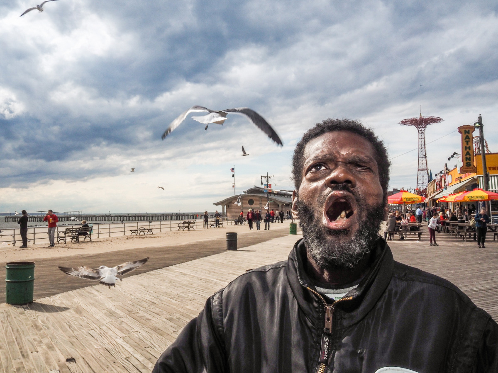

在这场长期监禁之前，多内托从未想过，有朝一日，自己会成为一名摄影师，并将之视为生命中最重要的一部分。

回忆起从前的时光，他说，自己顶多偶尔拿着家里的一台旧宝丽来相机，等到姐妹们洗澡的时候，打开卫生间的门假装拍照吓唬她们。

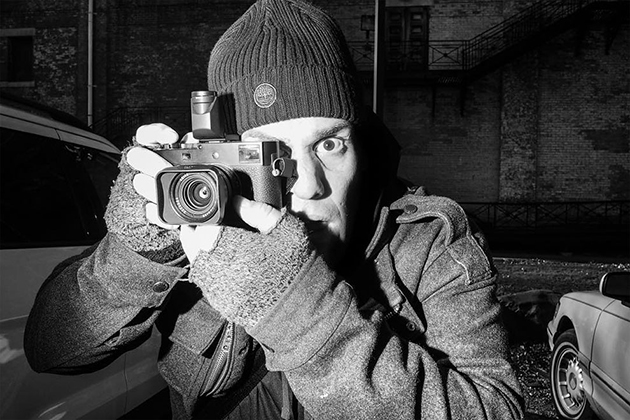

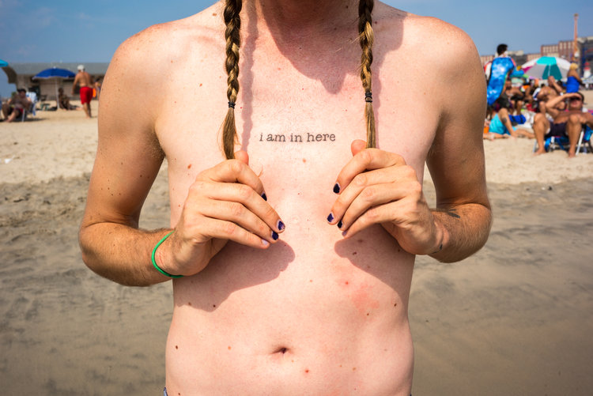

在监狱的那段时间，多内托流连于图书馆，翻遍那里几本仅有的摄影杂志。

除了痴迷于画面的美感和照片背后的故事，他也会自学伦勃朗布光法等摄影技术，并通过各种方式观摩、学习一些著名摄影师的作品。

此外，多内托还研究了心理学和人类行为学。

虽然并未接受专业的摄影指导，但是这段时间的“自我深造”，不仅提高了多内托的审美，也为他后来的摄影风格和题材选择等方面打下了较为扎实的基础。

而他的人生，也因此发生了重大的转折。他有时间去深入了解自己的内心世界，开始去思考“我是谁”这个问题：
“原来我并非如从前那样‘喜与人为敌’，其实自己一直以来就非常关心身边的人，以及在他们身上发生的故事。”

出狱后的一段时间里，他的活动范围依然被限制着，离家不能超过120英尺，所以那时候，他的拍摄目标，大多是昆虫、植物和静物：  
“有时候我会觉得自己是在一个错误的时间拿起了相机，但有时候我又会觉得，这可能是发生在我身上最好的事情。”

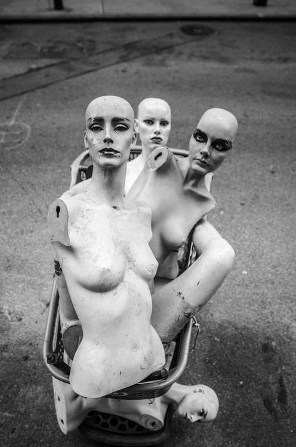

在之后刚彻底恢复自由身的那段时间，多内托非常兴奋。他觉得在大街上自由往来是最美好不过的事儿。他睁大眼睛以另一种方式观看这个世界，感受到了更加丰富的人生。

而在他的镜头中出现最多的被摄者，是各种“社会边缘人”，那些容易被忽视、受压迫、没有人关心的面孔。

  
出狱几年，多内托逐渐形成了自己的拍摄风格：硬！

翻看他历年来的摄影作品，尤其是街头人像，看起来着实硬派。他与被摄者的距离相当之近，甚至会使用闪光灯直打。

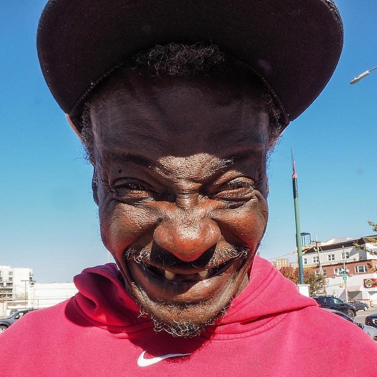

对于多内托而言，机械性的拍摄根本毫无意义。他的镜头下，呈现的都是单纯的个体，有着各种故事的生命。

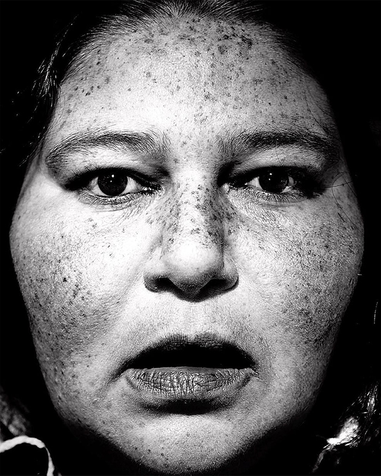

当多内托第一次拿起相机，他就知道自己会为之沉迷。

他希望，自己的照片所讲述的每一个地方、每一个人，都充满真诚和尊重。

『 Donato Di Camillo 作品欣赏 』

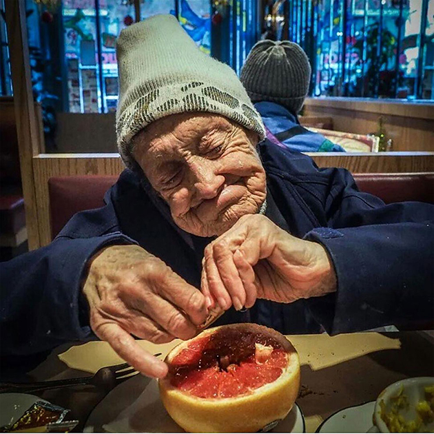

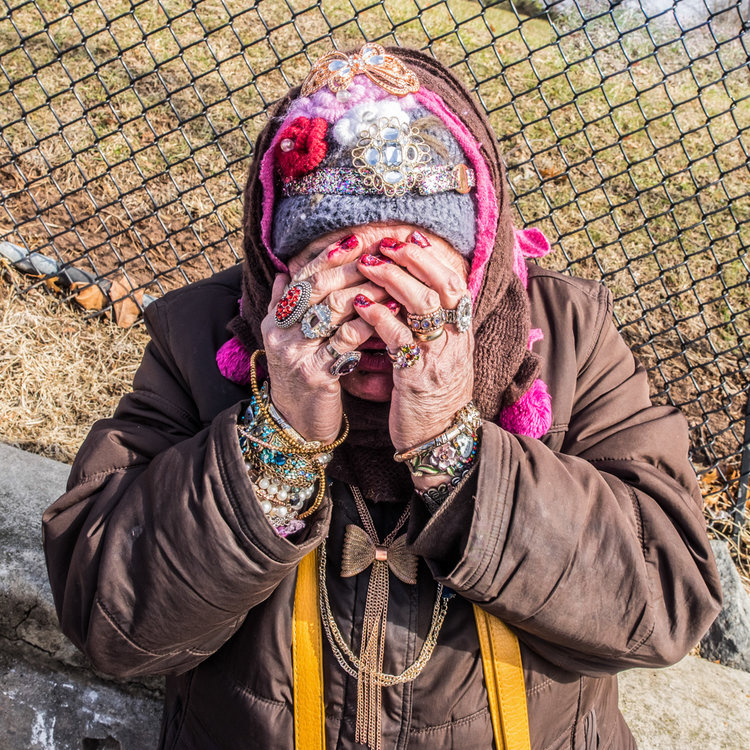

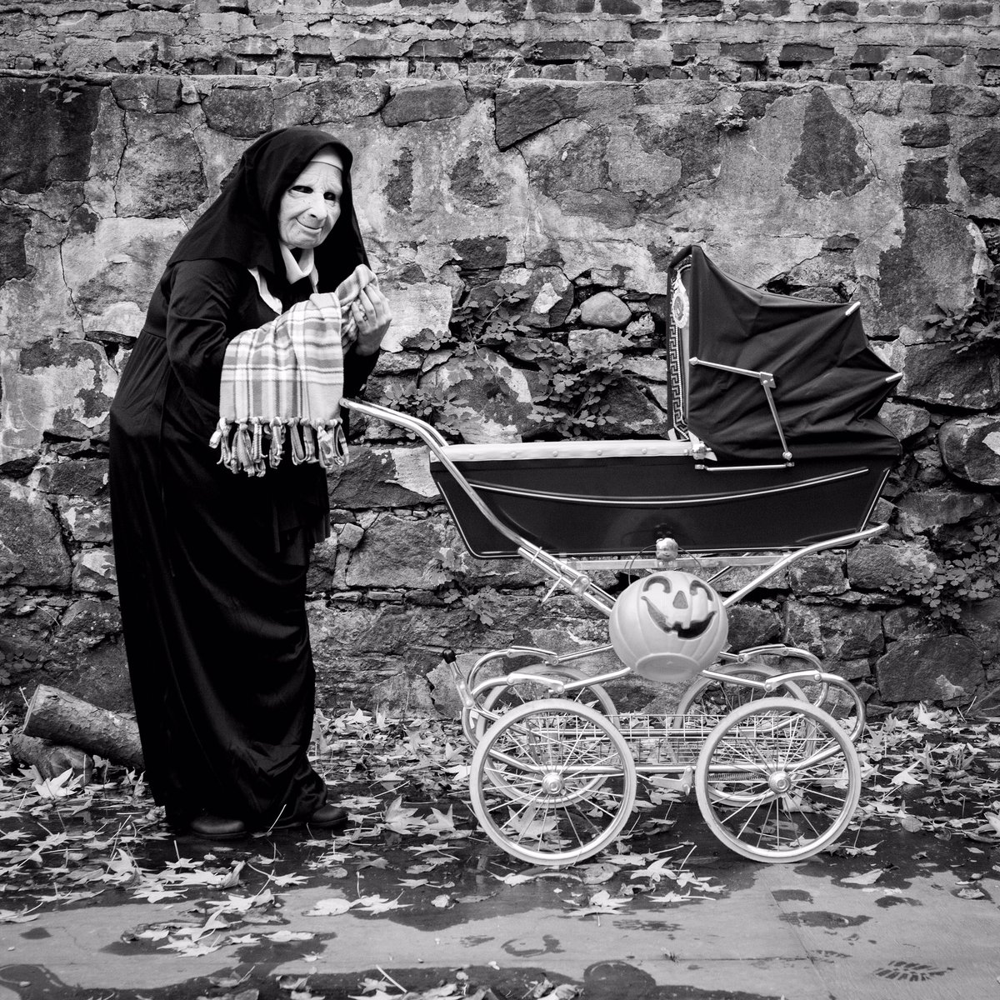

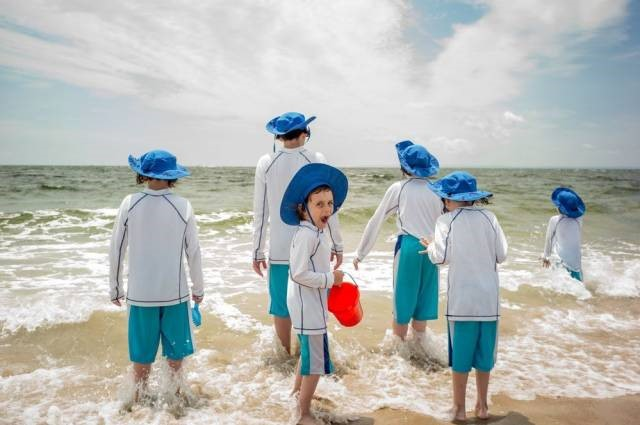

多内托的另一个系列：康尼岛海滩

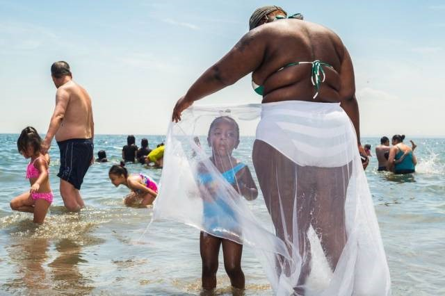  
▲ “海滩就是这样一个具备无限创作题材的地方，在任何时间都可以拍到大量的照片。”

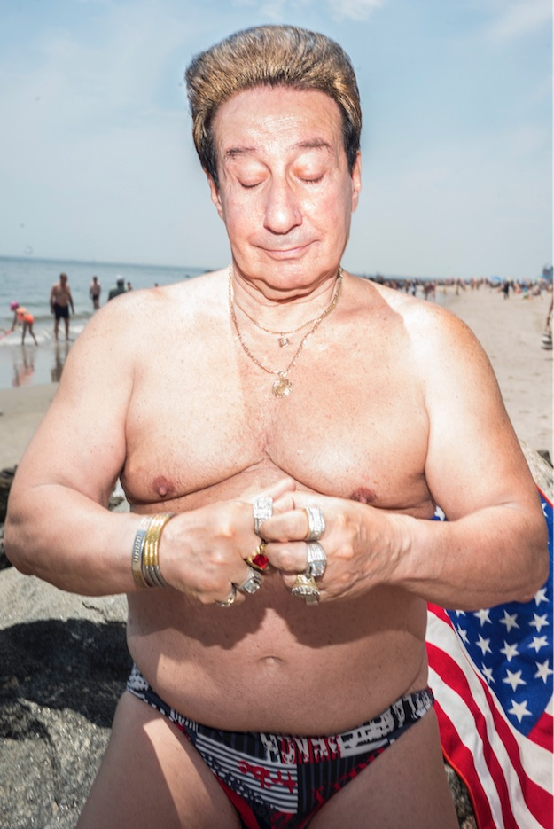

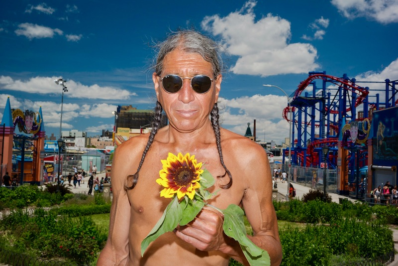

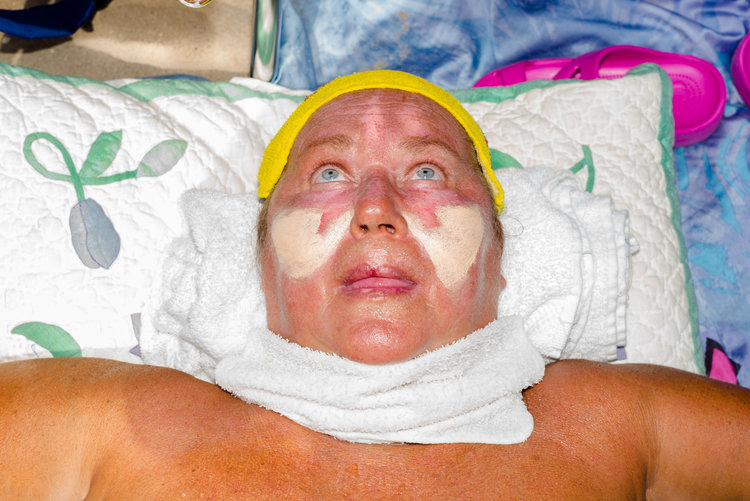

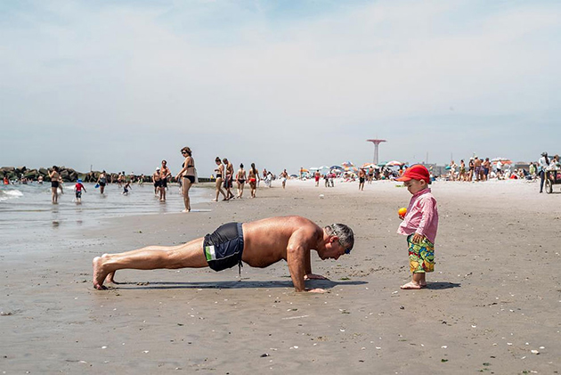

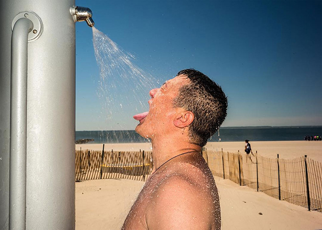

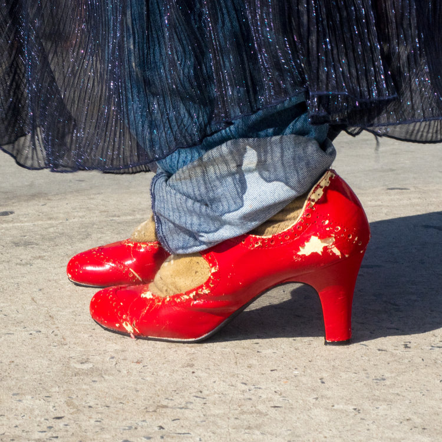
