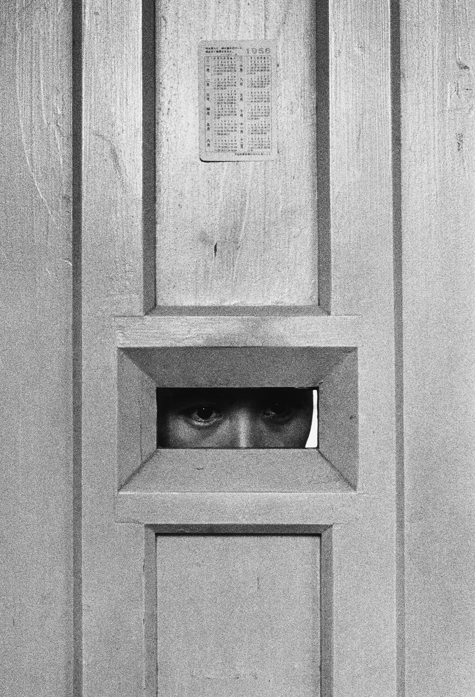
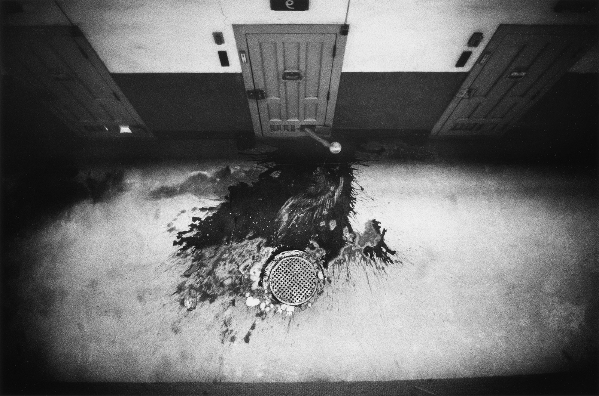
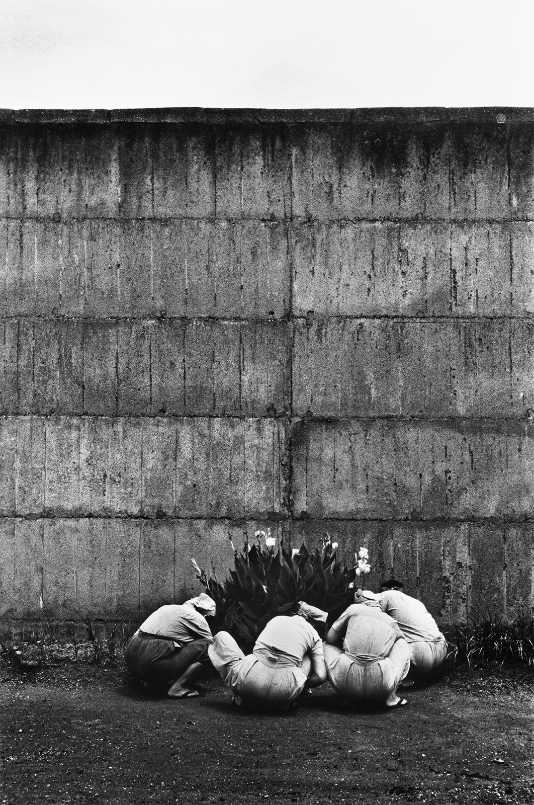
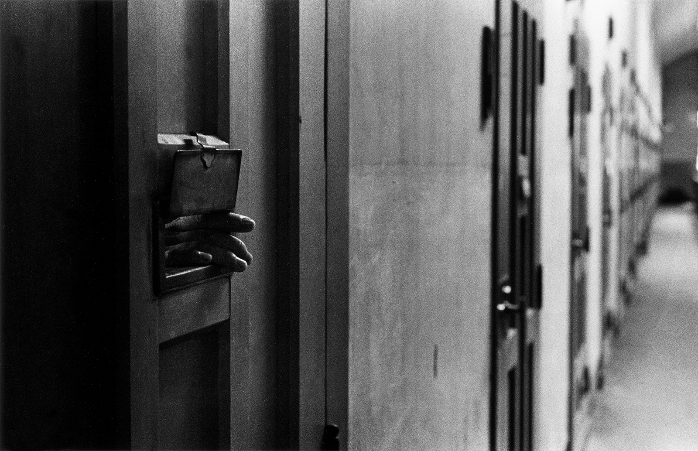
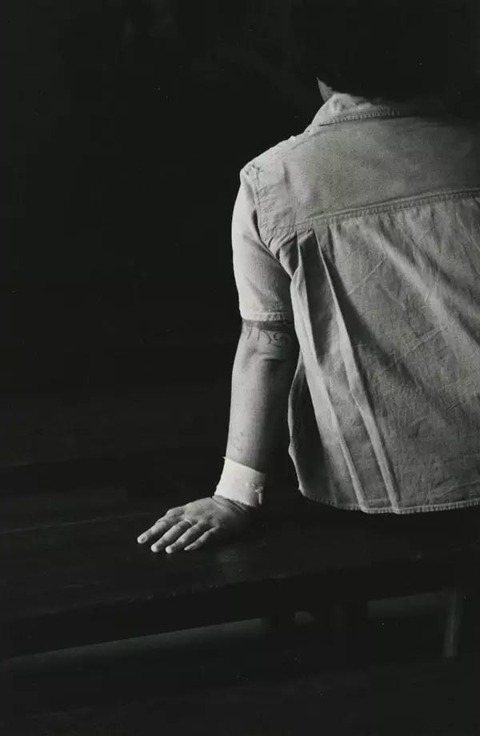
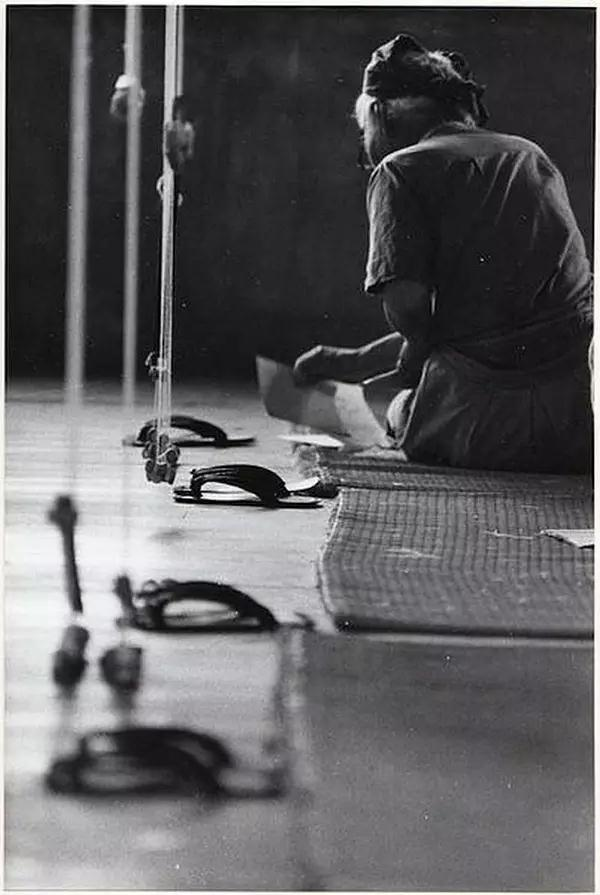
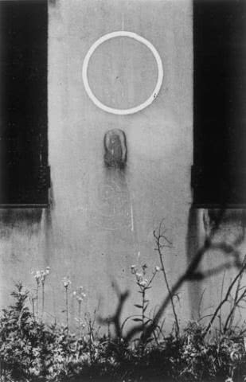
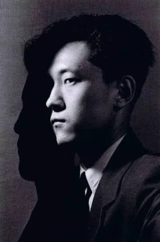

# 奈良原一高：监狱是一座流放的王国

​奈良原一高（1931.11.3－2020.1.19）日本当代摄影师。1959年与东松照明、细江英公、川田喜久治、佐藤明、丹野章等爱好者组成摄影团队“VIVO”，对日本战后摄影史产生过深远影响。1996年获得日本政府的紫绶勋章。

  
1958年，奈良原一高个展《王国》展出，凭借该系列作品，他获得了当年日本写真家批评协会的新人奖，《王国》以和歌山女子监狱和北海道男子修道院为主题。

和歌山女子监狱，就像是“围墙”里面的封闭世界，而北海道天主教修道院（西多会特拉普派，强调缄口苦修），是在自由意识支配下选择信奉和修习神学的人生活的地方，称得上是极端的两个世界，而二者又有几乎与世隔绝的共同点。

作品的名称“王国”，据奈良原介绍来自于加缪的小说《流放与王国》。

奈良原一高：1931年生于福冈县大牟田市。1954年毕业于中央大学法学部。受奈良佛像的影响，进入早稻田大学研究生院学习艺术史。1956年在东京银座的松岛画廊举办首场个人摄影展《人之土地》，收录了军舰岛在1950年代中期生产生活的照片。1959年完成硕士学位课程。同年与东松照明、细江英公、川田喜久治、佐藤明、丹野章等爱好者组成摄影团队“VIVO”，对日本战后摄影史产生了深远影响。这个团体于1961年解散。之后，他在欧洲等地旅行，1962年至1965年主要居住在巴黎。1965年回到东京都。1970年至1974年在纽约市生活。1974年回国，主要在东京活动。1999年成为九州产业大学研究生院教授。

2002年至2003年在巴黎举办首场个人回顾展。2005年因蛛网膜下腔出血在东京都疗养。2020年1月19日因心力衰竭逝世。
