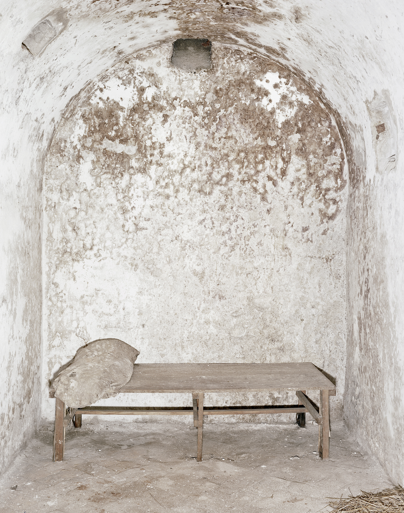
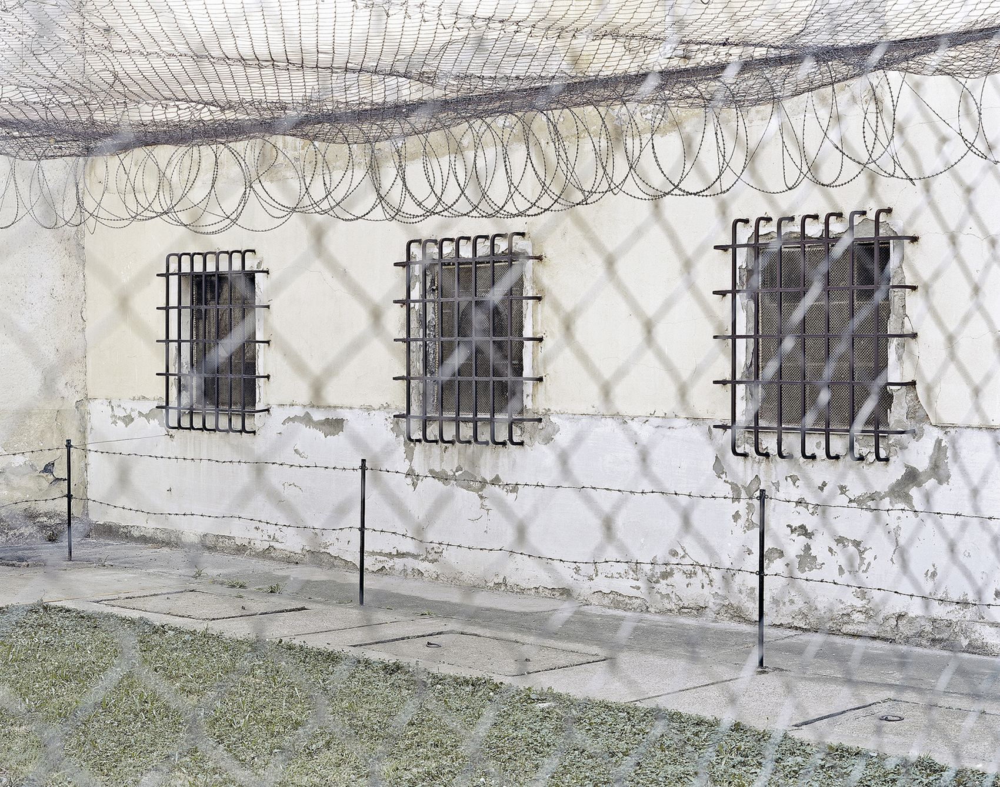
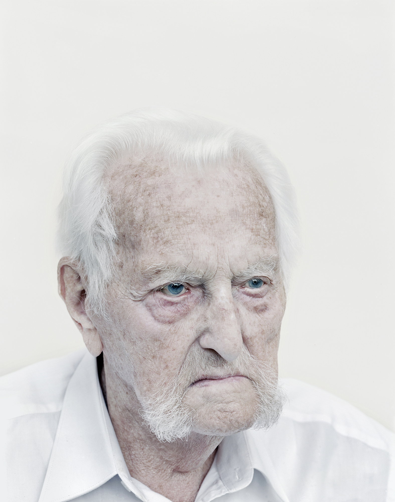
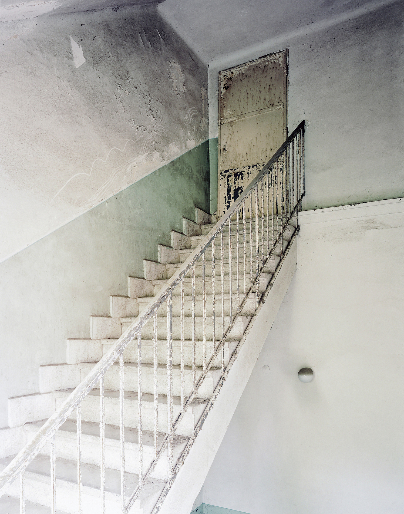
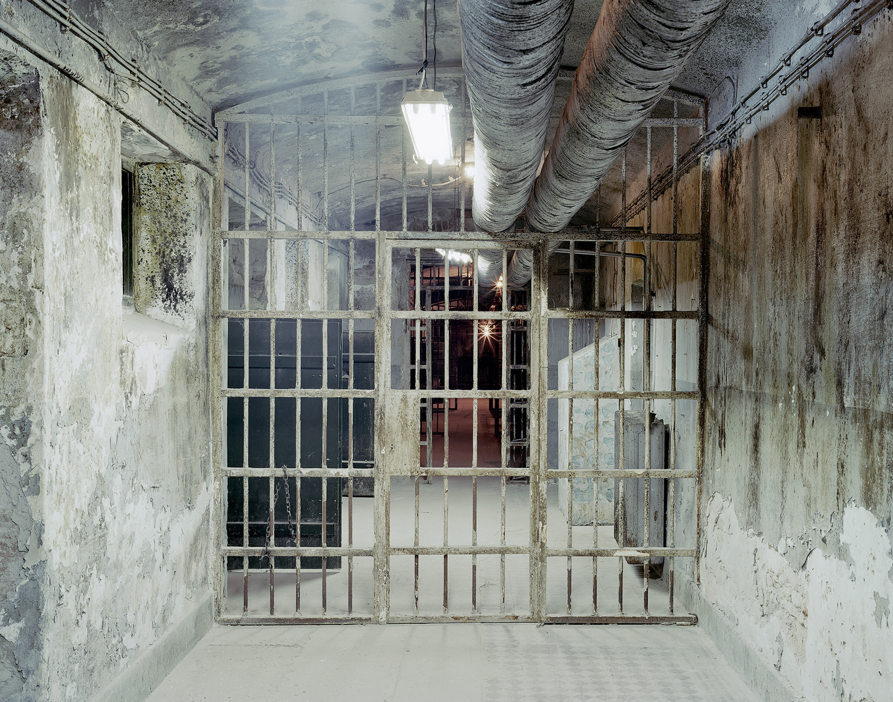
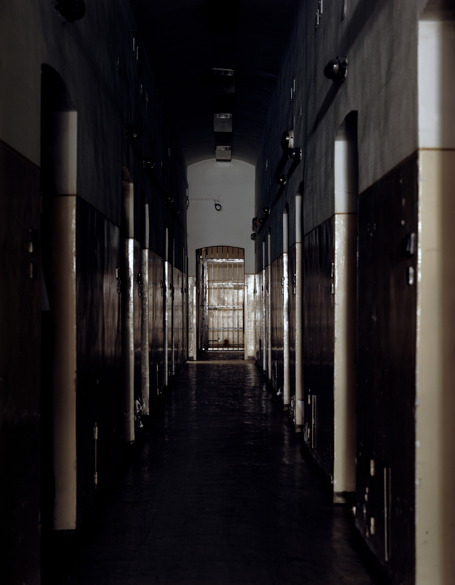
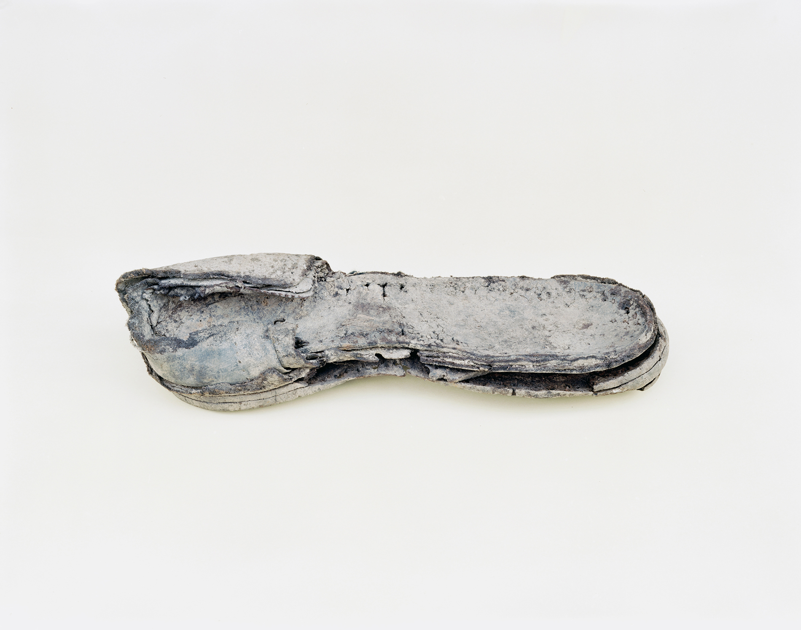
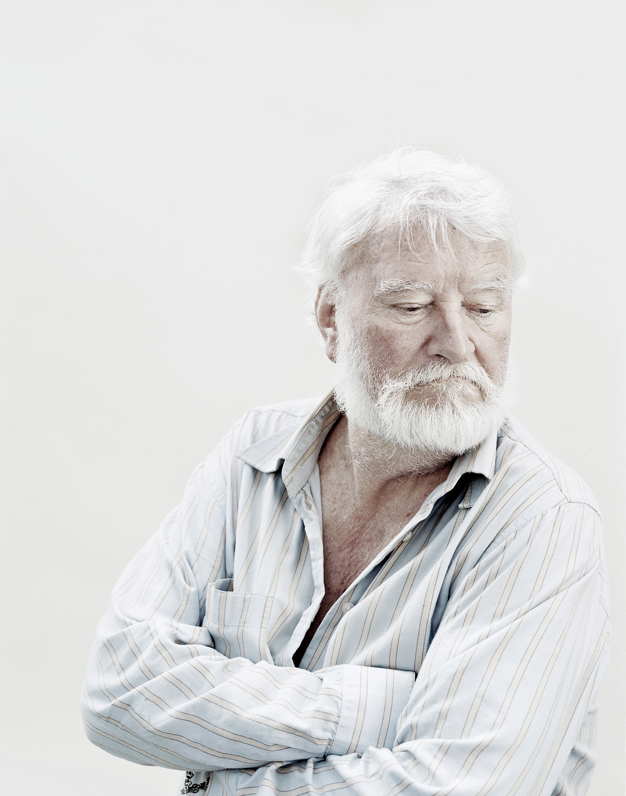
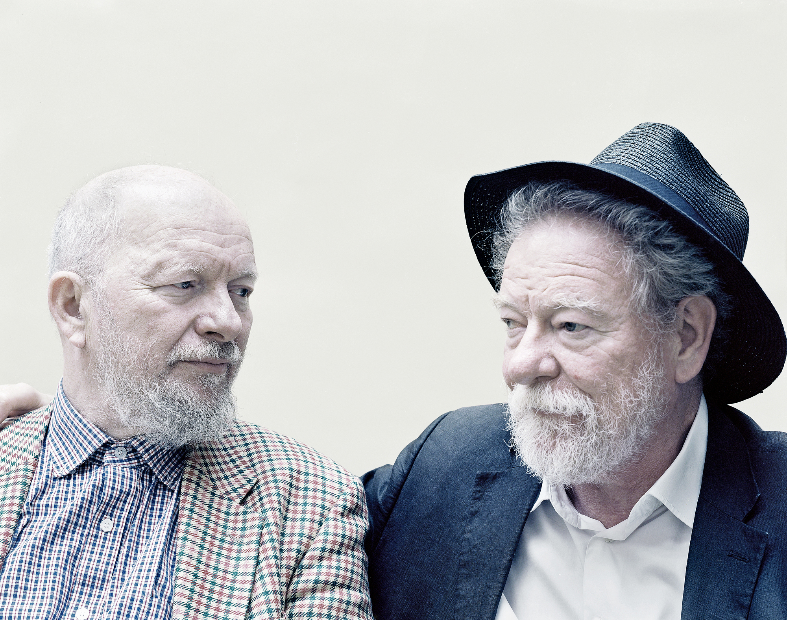

# 记录匈牙利政治老囚徒

​丹尼尔·科瓦洛夫斯基（Daniel kovalovszky）是一位匈牙利摄影师，长期从事概念性摄影项目。作品在东欧和英国的多个美术馆和博物馆中展出过。

丹尼尔2016—2019年的拍摄计划为“地狱情景”（An Infernal Play），记录在DC统治下“最黑暗”监狱和劳改营中度过了漫长岁月的老年幸存者。他们曾被关进当时司法系统最黑暗的地方长达十数年，多年来，背负着沉重的历史负担，小心翼翼的生活着，一生都没有时间去处理这些痛苦，也从没有得到些许道德或经济补偿。丹尼尔同时对他们进行了采访，这些经历极大地改变了他对匈牙利20世纪历史的看法。他希望这些作品可以告诉后人一些什么。

  
绞架

1945年，匈牙利GCD领导人马蒂亚斯·拉科西（Mátyás Rákosi）以苏联为榜样，建立了斯大林式DC政权，成立国家保护安全局（AVH），1945年至1963年大量启用秘密警察，匈牙利民众的人权遭受严重侵犯。结果是数十万政治罪犯被送往强制劳动营，被监禁，数百人被构陷并处决，被指控的罪名包括间谍罪，叛国罪等等。直到1963年大赦，幸存的人才被平反和释放。

“2016年，我开始考察人类自由和民主的脆弱性，同时参观了匈牙利DCDZZ的重要历史场景。（这些地方本身也不断消失或改变其功能。）无意间翻阅了一些ZZ犯的回忆录后，一个非常恐惧和未知的世界在我面前打开，使我意识到我对这个历史时代的了解是多么肤浅。当年的影像资料自然是缺失的，2017年，我开始进行视觉收集，拍摄政治老囚徒的肖像，并打捞记忆，记录他们的个人故事，钩沉那段晦涩的年代被遮蔽的部分事情。”

“这项工作最大的困难在于时间的紧迫，因为幸存者日渐衰老，这个世界正在一步步向我们退隐。”

  

  
浴室

  
劳改营

