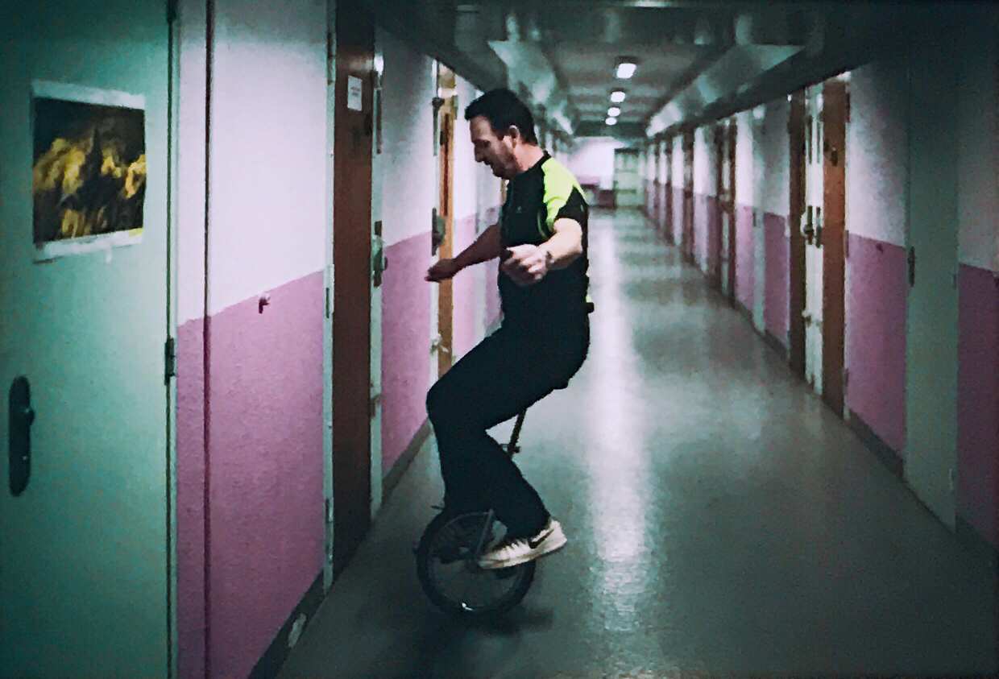
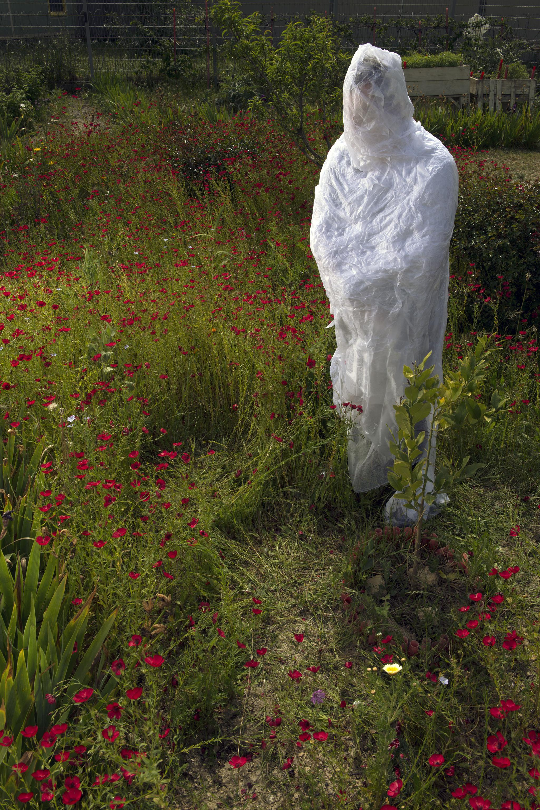
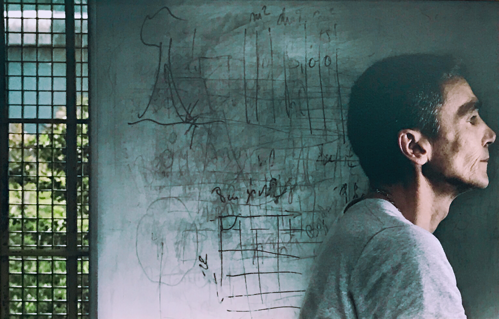
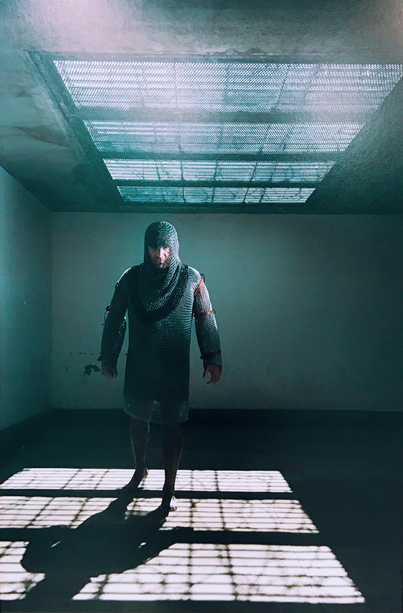
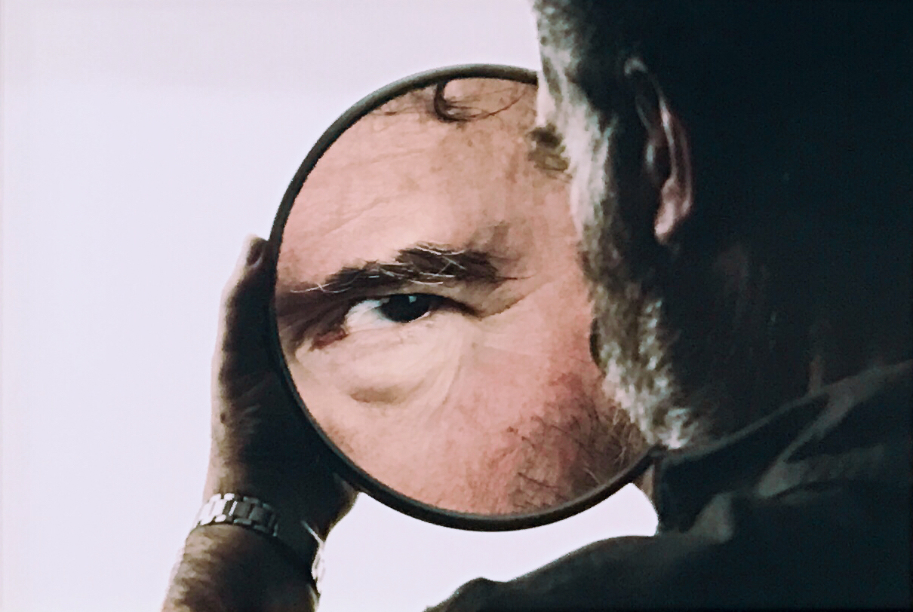
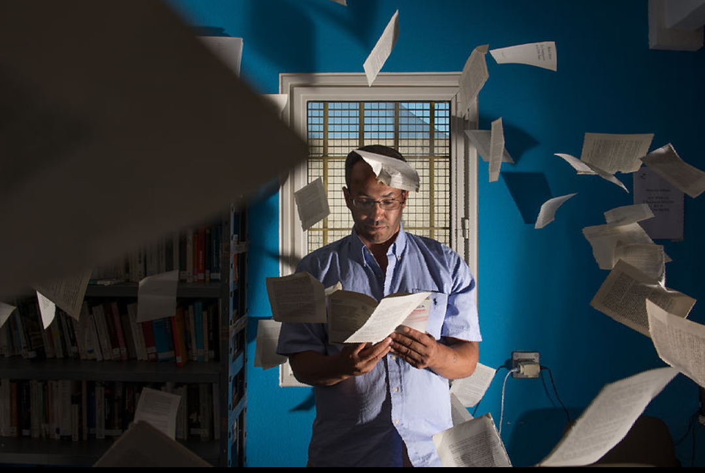
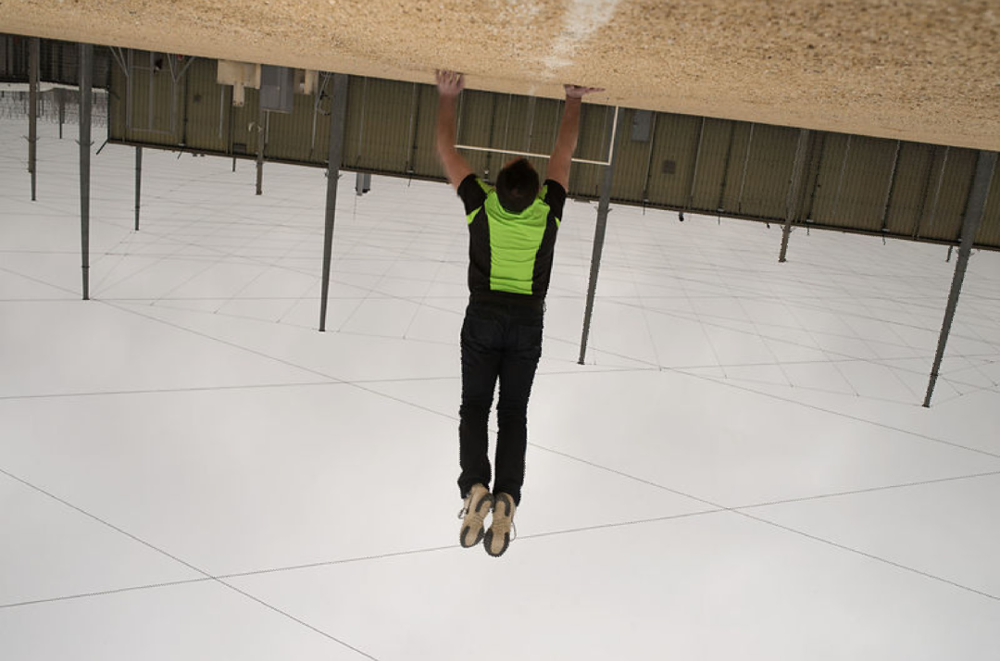

# 克里斯托夫•卢瓦左作品

2015年，法国阿尔勒监狱决定给服刑人员开设一个摄影研习班。曾给监狱多次策划艺术项目的让−米歇尔·格雷米耶邀请到长期在不同社会领域活动的克里斯托夫·卢瓦左（Christophe Loiseau）。卢瓦左通过问询服刑人员他们如何看待自己以及希望他人如何看待自己，卢瓦左创作了这些“故事肖像”，没有使用任何特殊效果却实现了一种拨动人心的美学冲击力。每一幅肖像都是通过一对一的谈话，而后众人就拍摄场景商议讨论最终集体拍摄的成果。

  
在这幅肖像中，被摄者变成“蝶蛹”，表达消失和重生。

阿尔勒中央监狱是法国戒备最森严的七所监狱之一，需要经过十几道门。里面关押着135名重刑犯。在不停的响起电子门禁声的道路最后，是一条被阿尔勒摄影节团队重新漆成水手蓝的通道。这个通道由犯人们向狱方借来，用于参与卢瓦左的摄影工作坊。2018年7月2日至9月23日，那里陈列了20余幅阿尔勒国际摄影节的参展肖像故事作品，由卢瓦左在过去的两年当中与40余名犯人合作诞生。

  
这次展览被命名为“图像权”，同时在阿尔勒摄影节位于城内的展区和拘禁场所内展示，引起监狱内外普遍的讨论和关注。

“每一个经历过这些肖像照片拍摄的人，都重新审视了自己。我们发现自己人格中的某些我们原本隐藏的、以为要对外界保护起来的方面。只有一部分人以前意识到过这些。”米歇尔补充道，“这个工作坊中，有一个方面是优先于其他的，就是让我们自我展露和自我发现，在这两个词所有能被理解的意义上。”

米歇尔选择了监狱中的最高戒备区作为拍摄照片的场所——这里被称为“监狱中的监狱”。他的面部被一本阿尔贝·加缪的《西西弗斯的神话》所覆盖，他说是为了着重突出“荒谬的世界和对这种荒谬性的指认，把我们所相信的一切都重新置于疑问之中。”

甲诺（Jeannot）也选择了最高戒备区（QHS）作为自己的肖像的拍摄点，他穿了一件铠甲。“我把自己保护在这样一件铠甲当中，因为这里不是我的生活；我的生活，它在外面。”甲诺解释道，“而这里是禁闭中的禁闭地带。”

尽管最高戒备区平时令人恐惧和胆战，在这次工作坊中却被多位参加者选为实现自己的肖像照的地点。“这里原则上不是我们能用来拍照的地方。但是犯人们要求进入最高戒备区。这意味着他们要穿过二十几道门。”卢瓦左接着解释，“我有一些助手——4名犯人，帮我提着需要的东西。还有一支特殊的团队一直伴随我们。看管者理解了原本限制最大的区域变成了一个可供虚构、想象的地带。我手上有一些犯人微笑着的照片，因为在这一时刻他们掌握了主动权。”这就是《图像权》的由来，这次长达两年的拍摄也是卢瓦左第一次进入监狱的经历。

以下是澎湃新闻在厦门与摄影师克里斯托夫·卢瓦左的访谈。

澎湃新闻：《图像权》这个项目是从什么时候开始准备的？

卢瓦左：我从2015年开始着手这个项目，当时的想法只是在一个摄影工作坊中为囚犯拍摄肖像。囚犯们没有自己的照片，没有属于他们自己的肖像。本来这个项目是为了制作这一类的图像。当我开始工作的时候，我向监狱管理者提出两项要求：允许我在整个监狱的任何地点拍摄，并准许我为拍摄对象带一样物件作为道具。这两项要求都被接受了，前提是我也接受了非常严格的协议。

澎湃新闻：这个工作坊是由狱方发起的？他们为什么想组织这样的工作坊？

卢瓦左：其实监狱中会组织各类活动，戏剧、舞蹈、表演工作坊都有。应该给犯人提供成为“新人”的可能。法律也规定了要为服刑者组织文化活动。监狱中还有图书馆，里面有很多书。在法国这样的情况比较普遍，只是有些监狱文化活动多，有些少。的确，让这些活动发生在监狱里比发生在其他地方要困难。

澎湃新闻：犯人们对你的工作坊计划是如何反应的，他们理解你想怎么做吗？

卢瓦左：他们很快便同意了参与这个项目。在整个事件中有一种游戏性，而他们想要参与这次“冒险”。他们当初只是觉得我不可能做到：他们认为我不可能成功拍摄到监狱中的某些场景；他们还认为我不可能把某些东西带进这个地方。他们没想到这个项目会具有如此大的影响，这些照片被展示在阿尔勒国际摄影节，随后还被带到中国。在这样的“成功”中有一种自豪。他们也感觉到这些照片把他们想要向我们传达的东西诠释了出来。
 
澎湃新闻：阿尔勒中心监狱里一共有多少名囚犯？你选择参与者，还是他们自己申请参与？

卢瓦左：一共有135名犯人，其中的41位参与了这个项目。我拍摄了27张肖像，参与者和他们的家人都得到了照片。犯人们都有参与的自由。

澎湃新闻：有14名参与者最终没有获得肖像？

卢瓦左：有些人被转移到了别的监狱。有些人放弃了这个项目。有9张肖像在法国未被允许展出；有一条法律是，当他的行为比较激烈，出于保护囚犯家人的权益，照片可以不予展示。我从未想过一定要知道它们为何被扣下，因为我没有选择。这个项目自始至终都进行得非常困难，能在中国展出已经是个奇迹。

澎湃新闻：在整个《图像权》项目的实施过程中，令你印象最深的是什么？

卢瓦左：是图像的力量。这是一个只有十几张照片的小展览，我为它能产生的影响感到惊讶。

澎湃新闻：你同时也为剧团拍摄舞台剧照和肖像照，你觉得这和自己的肖像项目之间有没有区别？

卢瓦左：对我而言，两者没有很大的区别。我在非常社会化的领域里拍摄照片，但我工作的方式是不变的。只有实现这些肖像的环境有所不同。在我的工作过程中，我总是试图将虚构和现实结合起来。因此一切都取决于我把什么带入了这种现实。我经常把拍摄这些照片的现实环境和剧院相比照。我使用灯光、布景，但我也让拍摄对象即兴发挥。

澎湃新闻：你还在其他自己的项目中表达对社会问题的关注吗？

卢瓦左：我还关注年轻人群体，我想要探索他们和他们在社交软件（如Instagram、微信）上发布的图像的关系。我还关注患有精神疾病的人群。还有一个项目已经启动了，关于堆肥和堆肥的人。

  
克里斯托夫·卢瓦左1968年出生于法国沙勒维尔−梅济耶尔。生活在里尔，在法国及欧洲其它国家工作。他与国立高等偶戏学校保持着长期合作，合作中，他结识了众多艺术家，对其常年实践的肖像创作上产生了很大影响。近20年来，克里斯托夫·卢瓦左受各大剧院、机构和地方政府所托完成了多个摄影项目，并为戏剧公司做过视频摄影工作。
