# 废弃的美国霍姆斯堡监狱

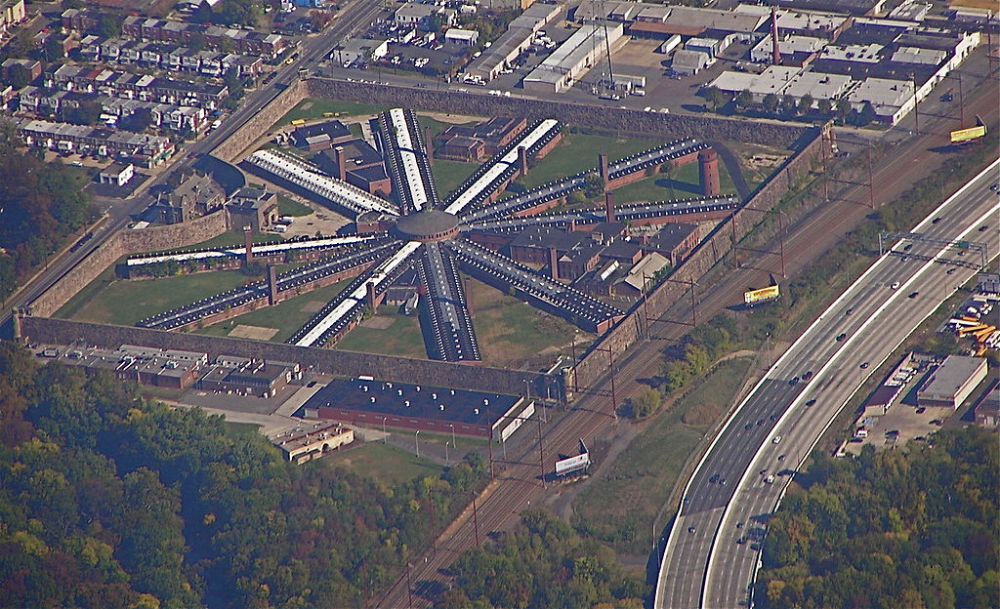
​
霍姆斯堡监狱（Holmesburg Prison）位于宾西法尼亚州费城霍姆斯堡区的Torresdale Ave 8215号，1896年开始运营，百年之后，1995年关闭退役。是美国历史上最臭名昭著的监狱之一。

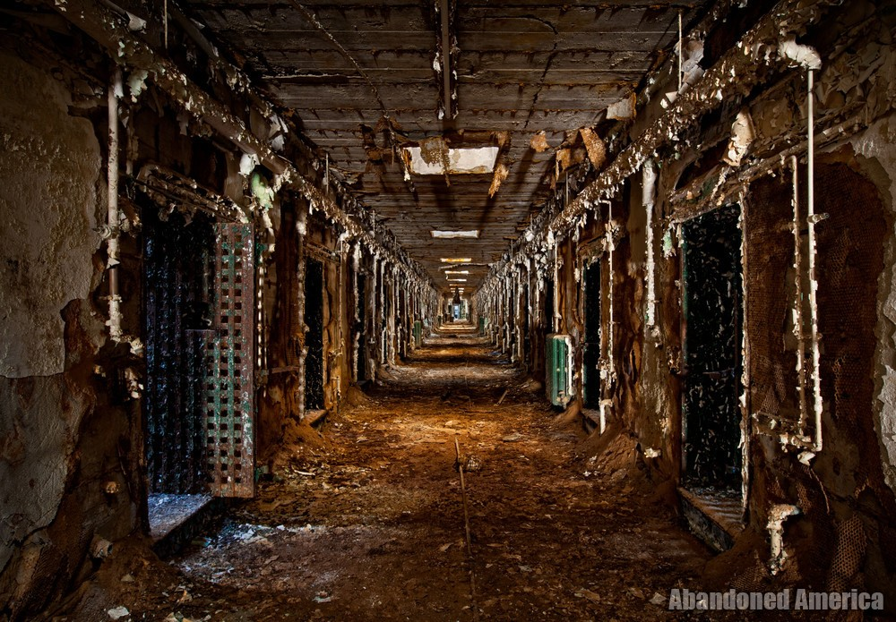

美国摄影师马修·克里斯托弗多次探访该监狱，记录了自然状态下迅速锈蚀的霍姆斯堡监狱。

霍姆斯堡监狱最黑暗的时期是由阿尔伯特·M·克里格曼博士（Dr. Albert M. Kligman）对囚犯进行的各种医学实验的二十多年，该实验使犯人们暴露于多种化妆品、皮肤起泡化学药品、疱疹、葡萄球菌、放射性同位素、精神药物和致癌化合物如二恶英等。强生医药、陶氏化学和美国陆军等33个不同的赞助商资助了该项目。团队以支付报酬为名诱使犯人参加实验，但没有告知相应的风险。

据报道，在1951年至1974年期间，多达90%的犯人参与了这些实验。由于公众强烈抗议并指控该试验违反《纽伦堡法典》，上诉至国会听证会而告终。相关记录被销毁，诉讼被驳回，但促成了有关在医学研究中使用囚犯的严格规定。
艾伦·霍恩布鲁姆（Allen Hornblum）1998年出版的《皮肤的英亩：霍姆斯堡监狱的人体实验》（Acres of Skin: Human Experiments at Holmesburg Prison）记录了针对霍姆斯堡监狱囚犯的临床非治疗性医学实验。书名来自于克里格曼博士讲述他首次进入霍姆斯堡监狱的观感，“目力所见只是一英亩的皮肤，如同农民第一次看到一片肥沃的土地。”

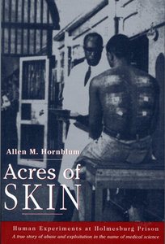

霍姆斯堡监狱发生的另一可怕的事件是1938年犯人的绝食，约一半犯人由于对食物的投诉而拒绝进食。25名带头的囚犯被带到一栋名为Klondike的建筑物内，这是一个狭窄的牢房，狱方关闭了窗户和通风格栅，打开房间的散热器和蒸汽管，与8月的热浪一起，将建筑物中的温度升高至近100度。致使四名之前遭狱警殴打的犯人死亡。由于公众的强烈抗议，宾州州长对该事件进行了调查。14名监狱工作人员被指控，但只有两人被处以轻刑。Klondike于70年代被拆毁。

1968年霍姆斯堡监狱发布了一份报告，该报告由费城警察局长办公室和费城地方检察官进行了为期两年的广泛调查，披露了数百起囚犯间的强奸案。

70年代初期霍姆斯堡监狱还发生了几次大骚乱。1970年7月4日美国国庆节爆发的暴力冲突造成100多人受伤，据《公报》报道，囚犯“手持切肉刀，剔骨刀，叉子和桌腿”，摧毁了食堂并攻击其他囚犯和警卫。市长里佐（Rizzo）将之归咎于非裔美国人，随之在监狱内进行了种族隔离。

1973年5月31日，监狱长帕特里克·柯伦（Patrick Curran）和副监狱长罗伯特·弗罗德（Robert Fromhold）因穆斯林集会场所发生的争端被囚徒刺死。

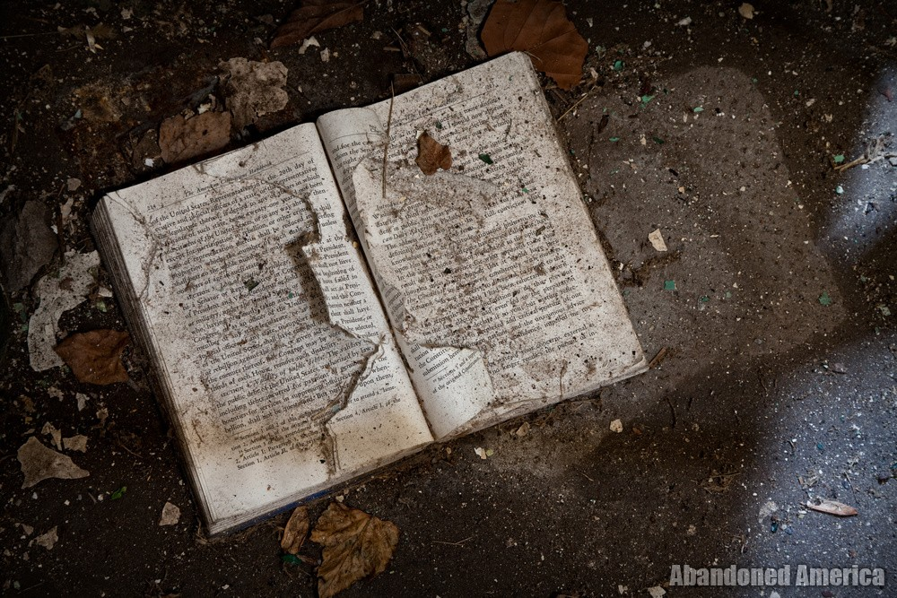

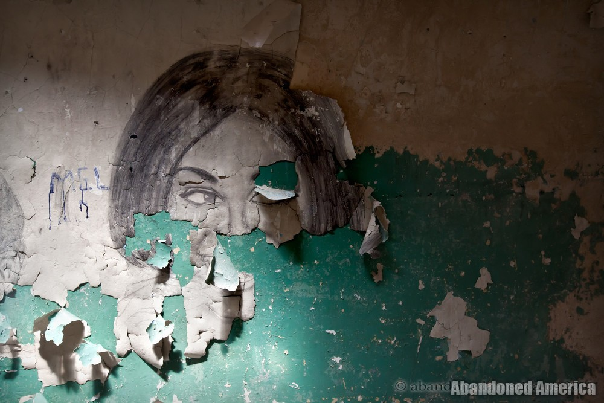

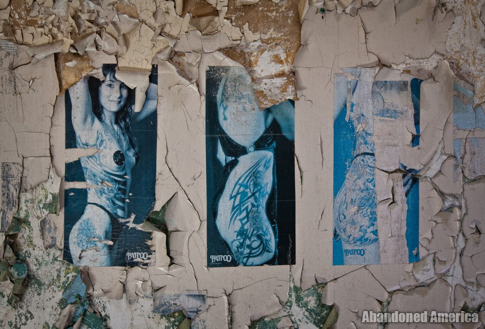

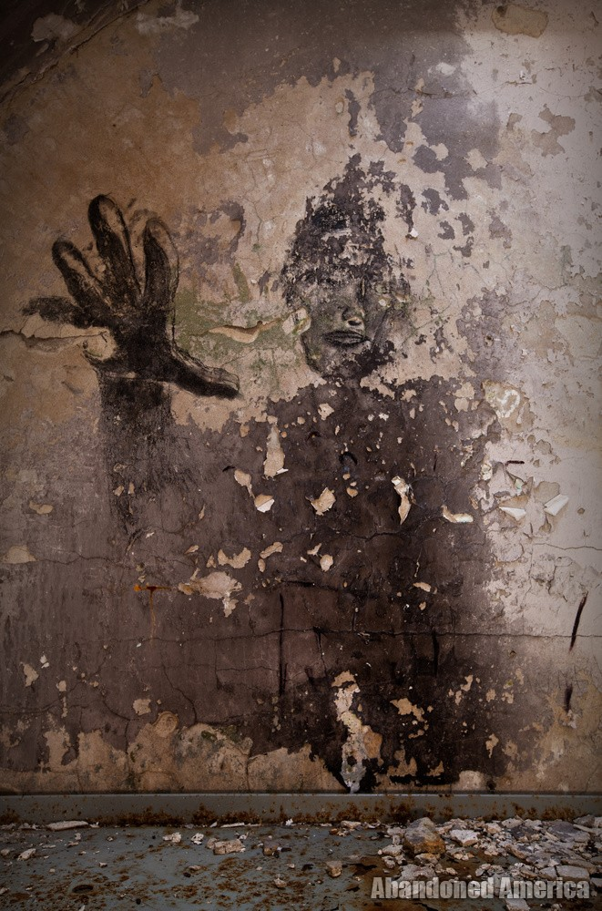

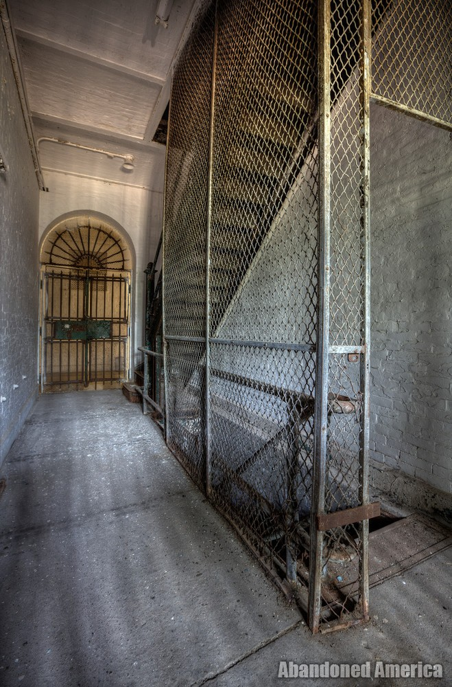

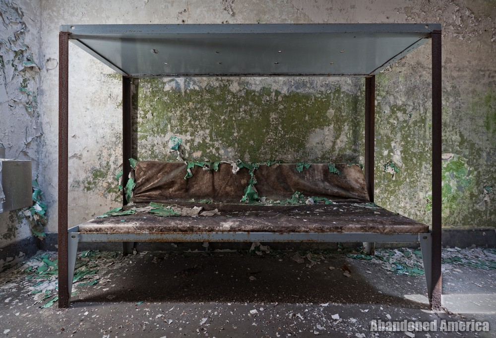

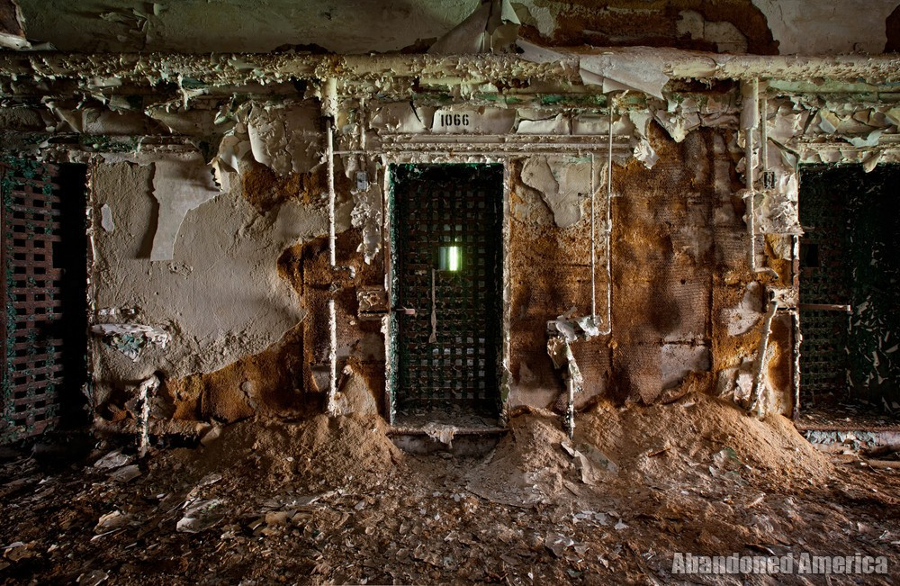

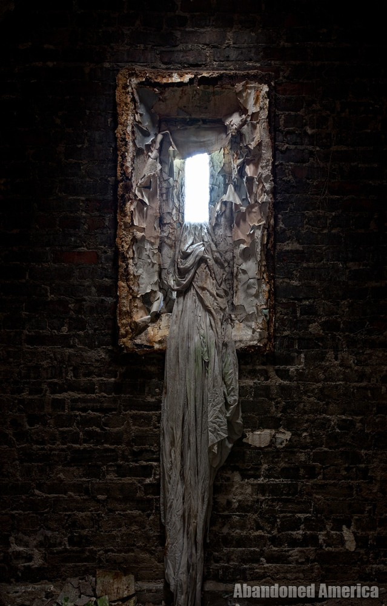

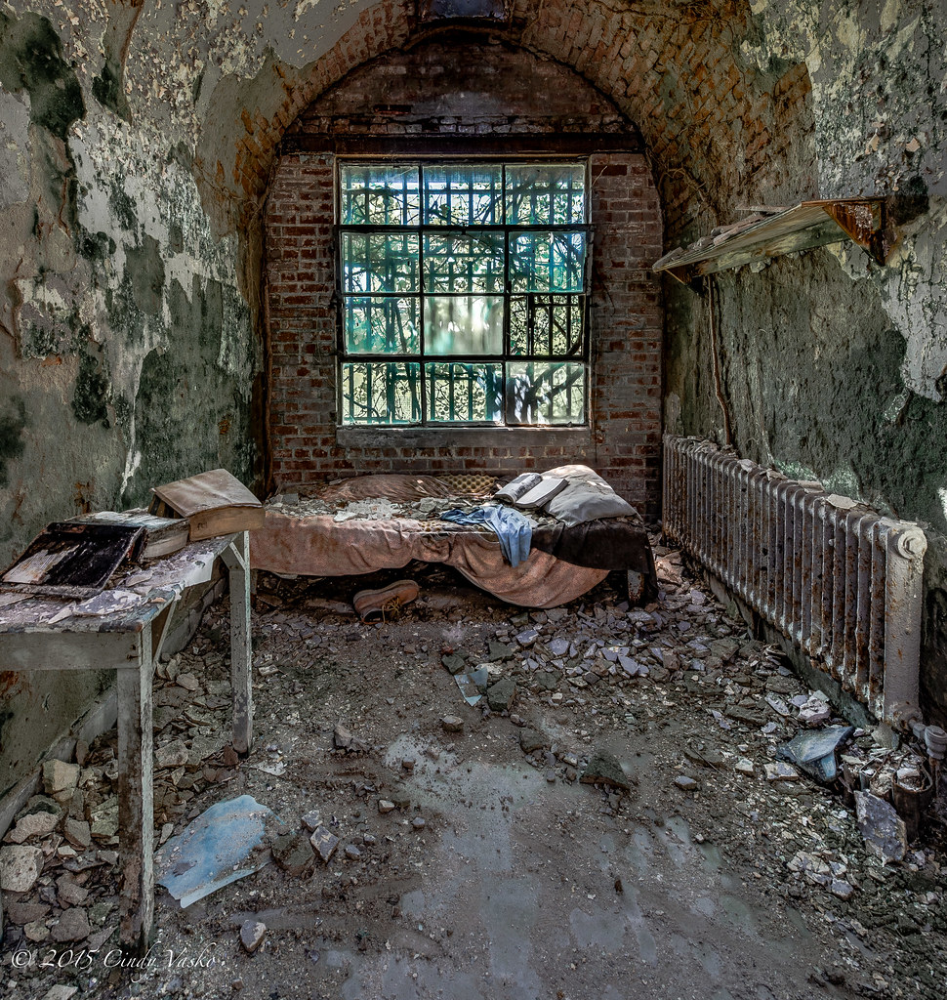

资料来源：www.abandonedamerica.com, 维基百科
