# 名人入案照

​1870年，法国人贝迪永（Bertillon）提出了“入案照”（Mug Shot）这个概念：在标准灯光下，拍摄犯罪嫌疑人正面以及侧面的照片，并记录嫌疑人的外貌特征（如眼睛、头发的颜色、身高体重等等）。随着1893年芝加哥世博会的召开，贝迪永的这套系统开始走向了全世界，并成为了警方的必备程序。

  

1894年，法国军官阿尔弗雷德·德雷弗斯（Alfred Dreyfus）以叛国罪被捕，后发现另有其人，但军方拒不改判。1898年案情遭揭发后，引起轩然大波。左拉在报纸上公开发表致总统的公开信《我控诉！》，后总统下达特赦令。即著名的德雷福斯案。

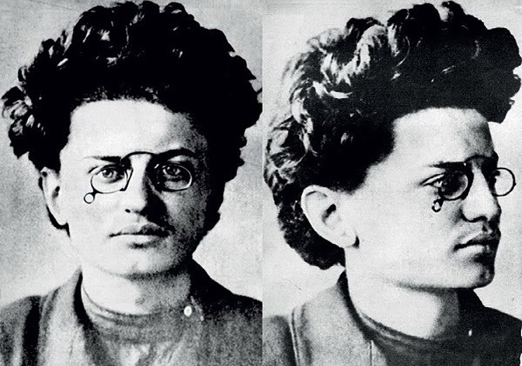  
1898年，列夫·达维多维奇·托洛茨基（Лев Дави́дович Тро́цкий），被沙皇的警方逮捕并遭到驱逐，此后在革命过程中他多次被捕入狱又多次侥幸脱逃。他是国际共产主义运动史上最重要的人物之一，也是斯大林最害怕的人。

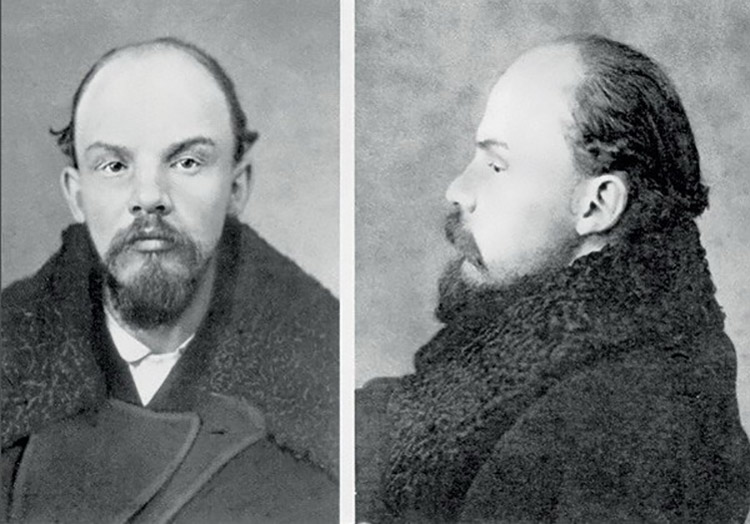  
1895年，弗拉德米尔·伊里奇·奥拉诺夫（Vladimir Ilitch Oulianov）被沙皇的警方逮捕并驱逐到了西伯利亚边境。——随后，他把名字改为了列宁。

  
1900年，约瑟夫·斯大林在圣彼得堡警方的登记卡。这张照片中，全身照同时也出现在了入案卡上。在他的一生中，他曾八次被捕、四次越狱。

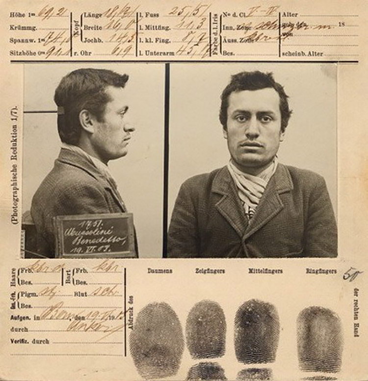  
1903年，年轻的意大利独裁者墨索里尼（Benito Mussolini）因为在瑞士伯尔尼从事政治活动而被驱逐出境。在这张照片中，我们可以看到指纹、外貌特征同样出现在入案卡片中。

  
1908年，著名骗子查尔斯·庞兹（Charles Ponzi），因为伪造签名在蒙特利尔被捕。早年庞兹已经案底累累，先是因商业诈骗，被加拿大法院判监三年；1911年回到美国，又因贩卖人口，而在亚特兰大坐牢，出狱后，他设计了臭名昭著的庞氏骗局。

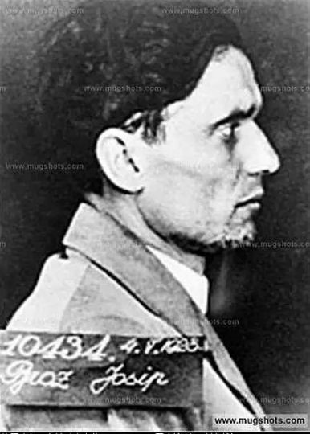  
1915年，铁托（Josip Broz Tito），一战时被俄军俘虏。他最终成为苏联庇护下的南斯拉夫最高统帅。

  
1926年，雌雄大盗“邦妮和克莱德”中的克莱德（Clyde Champion Barrow）在16岁时曾因偷车被捕。出狱后，克莱德遇见了邦妮，成为风极一时的“雌雄大盗”。

  
阿尔卡彭，1929年，黑手党党魁。

  
1938年，Frank Sinatra在新泽西州因为调戏一名已婚妇女而被捕，后来这项罪名又被更改为通奸，但是最后没有成立。

  
1946年，黑人运动领袖马尔科姆·艾克斯（Malcom X）曾因非法持枪入狱。

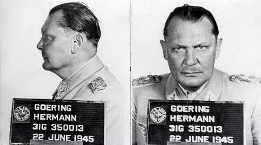  
1946年，希特勒的得力战将、纳粹的二号人物赫尔曼．戈林(Hermann Goering  1893-1946）被美军俘获，以战争罪被判处死刑。

  
1953年，卡斯特罗（Fidel Alejandro Castro Ruz）因起义失败被关押，在法庭上，他发表了自我辩护词《历史将宣判我无罪》。3年后，他成为古巴国家元首。

  
玛丽莲·梦露，1954年因超低速和无照驾驶的收监照。

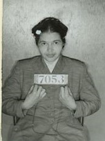  
1955年，美国人罗莎·帕克斯（Rosa Parks）因在公交车上拒绝为一名白人让座而被捕。这也是马丁·路德·金一系列黑人民权运动的导火索。

  
马丁·路德·金，1956年的收监照。

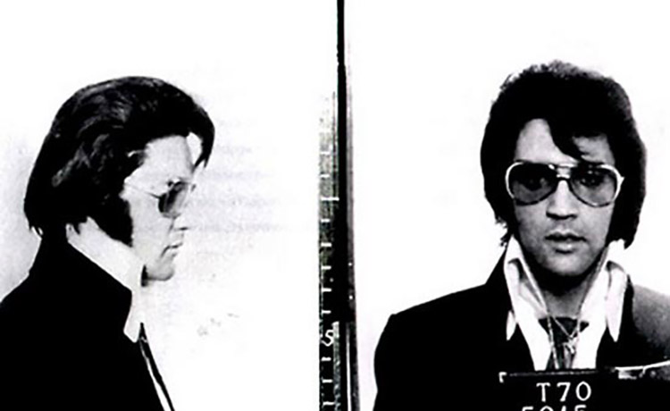  
猫王(Elvis Presley)实际上没有被逮捕过，这张“狱照”是他1957年为了宣传专辑Jailhouse Rock而拍的一组照片中的一张。

  
1961年，当时的年轻偶像、日后的影帝阿尔·帕西诺（Al Pacino）因非法藏匿武器被捕。

  
1963年，还不是一位摇滚歌手的吉姆·莫里森（Jim Morrison）因为酒后袭警而被捕。

  
1970年 Jim Morrison再次入狱这次的原因是暴露私处、醉酒以及有伤风化。

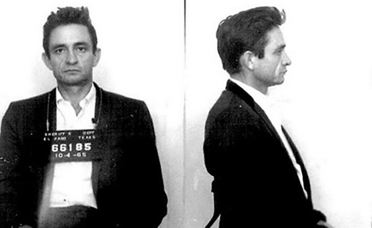  
1965年，美国传奇乡村歌手约翰尼·卡什(Johnny Cash)因为非法携带安非他命而遭逮捕。卡什只在警局被羁押一晚，而他后来去几十次进入监狱——为犯人开演唱会。永远的黑衣人

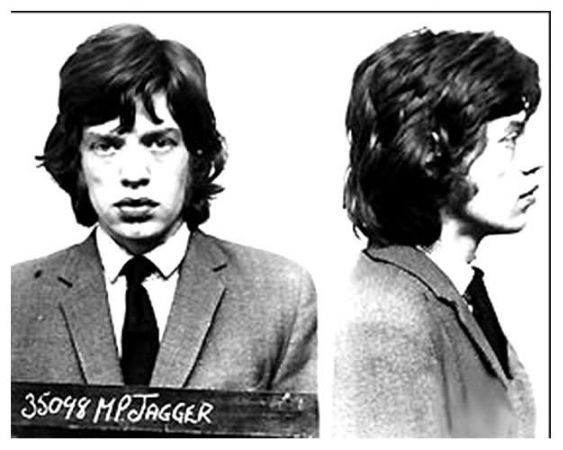  
米克贾格尔，1967年，非法持有毒品。

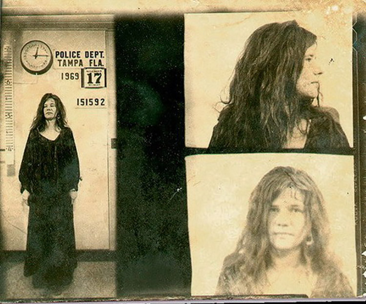  
1969年，美国歌手詹尼斯·乔普林（Janis Joplin）在坦帕的一场演唱会过后，被警方以扰乱公共秩序为由逮捕。

  
Jimi Hendrix，1969年在多伦多机场因为非法持有麻醉剂被捕，但他声称这是他的歌迷放进他的包里的。在这前一年，他因为一起暴力伤害罪用了同样的借口，他说他那样做是因为他的饮料被人下了药。

  
1970年，电影明星简·方达（Jane Fonda）因为携带不明药片+袭警被捕。后来，警方发现那只是维生素片。

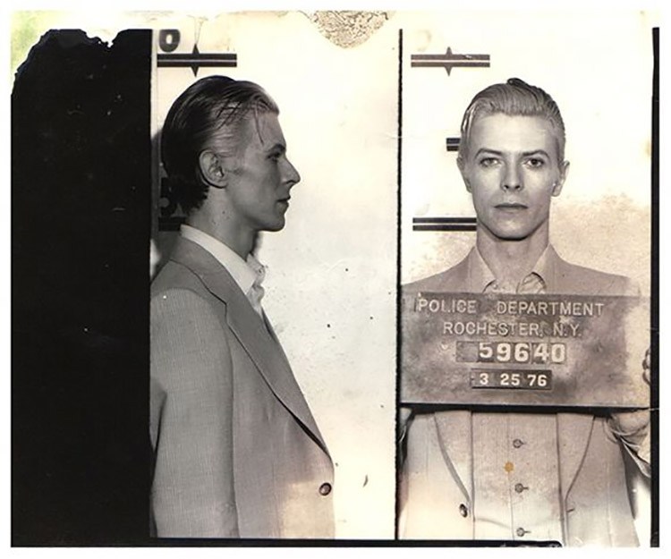  
David Bowie，1976年在纽约罗切斯特的一场巡演后，这位摇滚著名演员因为飞叶子庆功而被抓。

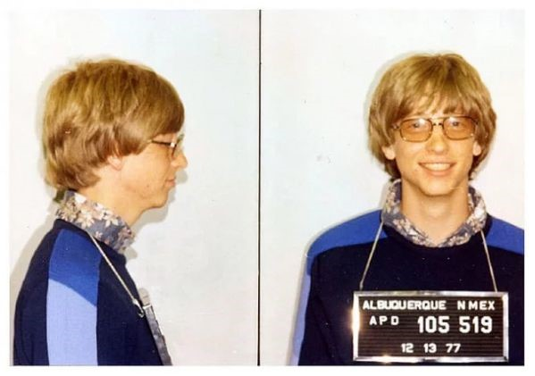  
比尔·盖茨老师1977年因无照驾驶和撞坏公路设施被捕过。

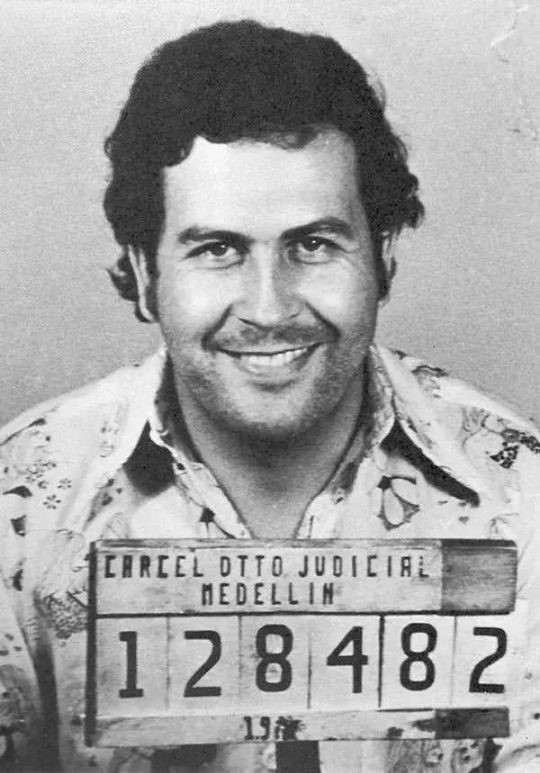  
1977年，嚣张的毒枭巴勃罗·埃斯科巴(Pablo Escobar)刚入行时的一次被捕经历，他曾被《财富》杂志评选为全球7大富豪之一。

  
1978年10月12日早上，性手枪乐队的贝司手Sid Vicious声称他（服用了毒品）早上醒来后发现女友南希死在他们在纽约的旅馆浴室地上。南希的死因是腹部的一处刺伤，失血过多。之后的一个月因为这起凶杀，sid被捕。同年12月，他又因为攻击Patti Smith的哥哥Todd而被捕。1979年2月，Sid在上法庭前死于服用过量药物。

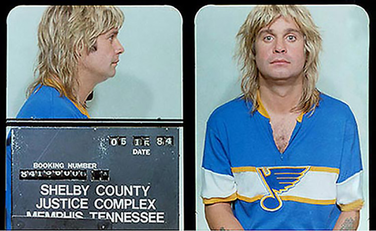  
1984年，黑色安息日乐队主唱Ozzy Osbourne因为在公共场合宿醉被捕，警察发现他在田纳西的一条街道烂醉。

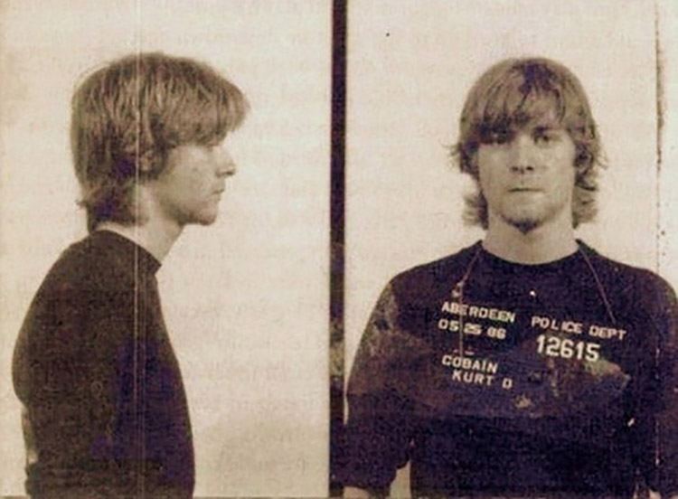  
kurt cobain， 涅槃乐队灵魂人物，1986年在神秘药物作用下，擅入民宅，遭到逮捕。

  
詹姆斯·布朗，灵魂乐教父，1988年，被控非法持有药物和枪支。

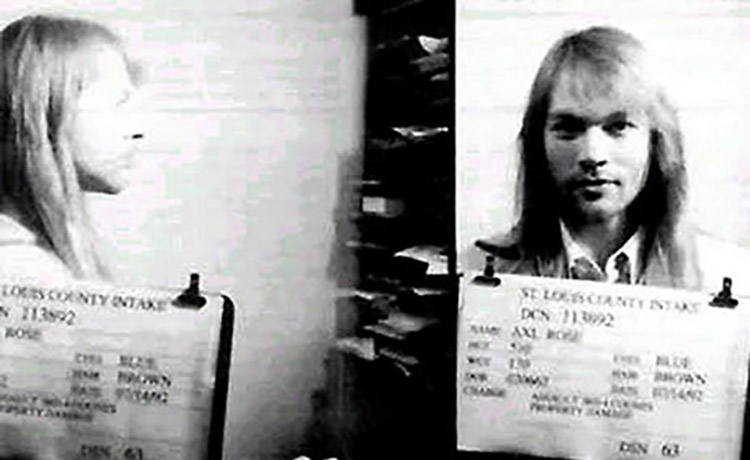  
枪炮玫瑰乐队主唱Axl Rose，1992年7月因为四起伤害事件和损害别人财产事件被捕。在这一年之前，他被指控在St.Louis煽动一场暴动，导致60人受伤200万美元的损失。2006年他又因为在瑞典咬了一个保安的大腿而被捕。

  
基努·李维斯，1993年因超速和酒驾被收押。基努的发型几十年来都这么飘逸。

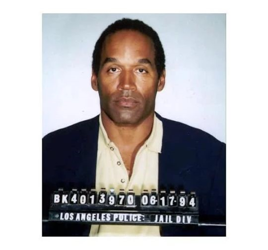  
辛普森，1994年，涉嫌谋杀被捕。

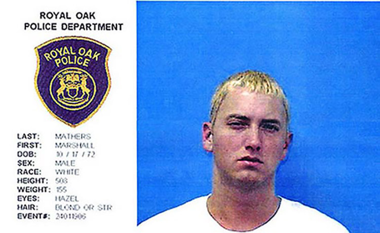  
Marshall Mathers，更熟为人知的名字是Eminem，2000年3月，因为与道路管理员Douglas Dail——William Dail的哥哥长期不和发生争吵，并掏出出一只没上栓的手枪。第2天，他又因为看见当时的老婆Kim亲吻John Guerrera，所以又打了John Guerrera。由于这两项伤害事件，他被判处2年缓期徒刑。

  
2001年，Marilyn Manson在密歇根的一次演出中因为用胯部摩擦一名保安的脑袋和脖子而被捕，当时他身上只有一条皮带和长筒袜。他被指控犯有4级伤害罪，他为此罪名支付了4000美元的罚款。
